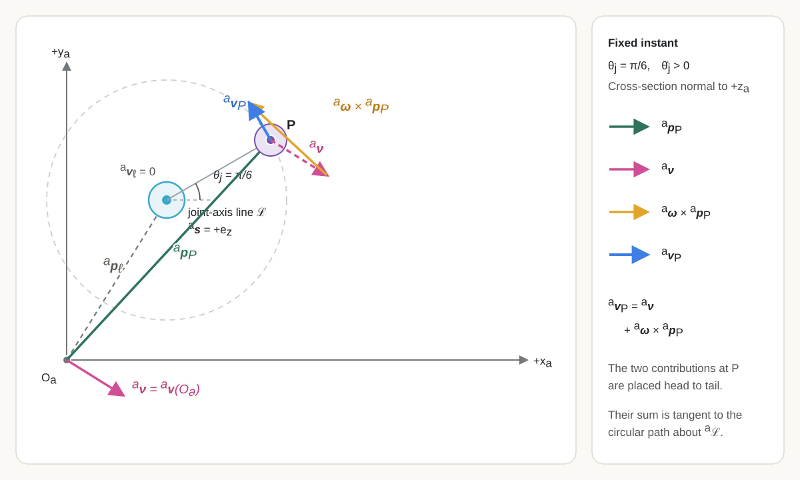
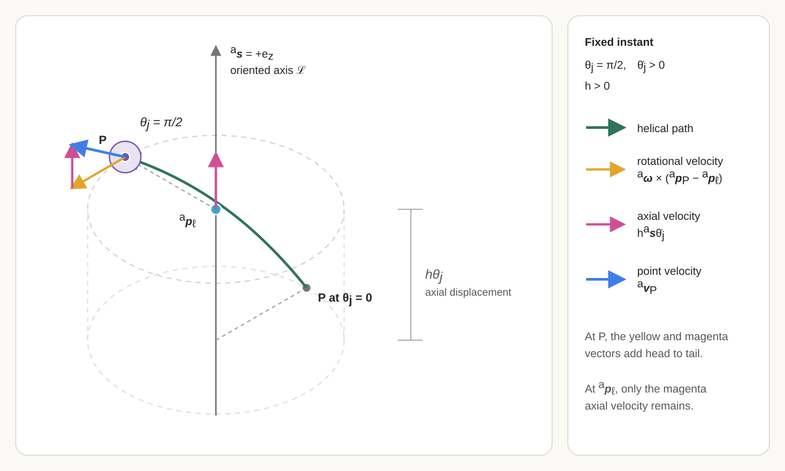
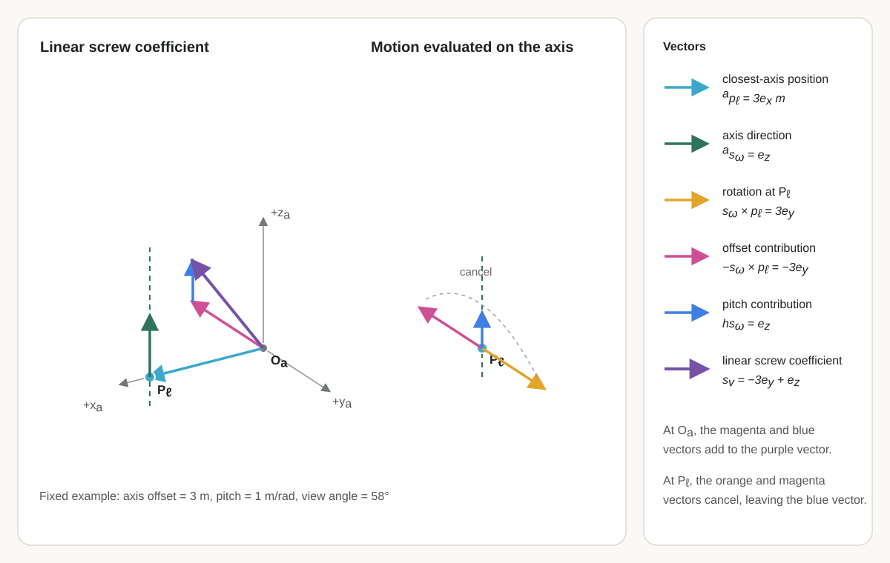

# Screw Motion, the $SE(3)$ Exponential, and Spatial Pose Integration {#sec-screw-motion-se3-exponential-spatial-integration}

## Prerequisites and assumptions {.unnumbered}

The reader should understand vectors, matrices, rank, null spaces, and constraints from @sec-linear-algebra-foundations; coordinate frames and cross products from @sec-geometry-coordinate-frames; and spatial poses, angular velocity, twists, the adjoint, and the project's linear-first twist order from @sec-spatial-rigid-body-motion.

Physical space is modelled as three-dimensional Euclidean space. Frames are right-handed and orthonormal. Position and length are measured in metres, time in seconds, and angles in radians. Unless stated otherwise, every screw-axis coordinate column is referred to one declared fixed frame: that frame supplies both the coordinate axes and the reference origin of the associated spatial-twist velocity field.

## Robot configurations, poses, and joint coordinates {#sec-robot-configurations-joint-coordinates}

This chapter develops the spatial geometry needed to represent the motion permitted by one robot joint. It begins by reviewing configuration and pose for rigid links connected by joints, then introduces joint coordinates, screw-axis representations, finite rigid displacements through the $SE(3)$ exponential and logarithm, and constant-twist pose integration.

The chapter treats ideal rigid links and one-degree-of-freedom revolute or prismatic joints. Finite-pitch helical motion is introduced to explain the general screw model, but it is not included as a supported robot-joint type. Composing several joints into a serial-chain forward map and differentiating that map to obtain robot Jacobians belong to @sec-general-robot-kinematics-jacobians. This chapter does not model joint compliance, backlash, closed kinematic loops, collision, forces, actuator dynamics, or feedback control.

### Configuration and pose for links and joints {.unnumbered}

An open serial robot consists of rigid links connected in sequence by joints. Each one-degree-of-freedom joint restricts the relative motion of two neighbouring links to one independent rotation or translation. Predicting the robot's geometry therefore requires more than locating one free rigid body: it requires determining the simultaneous placement of every link while satisfying every joint constraint.

A **material point** is an ideal labelled point fixed in one physical part of the robot. Its label identifies the same point as the robot moves; its coordinate column may change.

A **link** is a collection of material points modelled as moving together as one rigid object. The distance between every pair of its material points remains fixed. A link need not look like a straight bar: a base, chassis, bracket, shell, or several components bolted together may be one link when their relative motion and deformation are neglected.

For example, a simple arm has the sequence

$$
\text{base link}
\;-\;
\text{shoulder joint}
\;-\;
\text{upper-arm link}
\;-\;
\text{elbow joint}
\;-\;
\text{forearm link}.
$$

The **upper-arm link** is the rigid assembly that moves as one object. The **forearm link** is another rigid assembly. The **elbow joint** allows the forearm link to rotate relative to the upper-arm link.

Let $I$ be the finite set of link indices. For every $i\in I$, let $L_i$ denote link $i$ and let $\mathcal B_i$ be the set of labelled material points modelled as belonging to $L_i$. The robot's complete material-point set is

$$
\boxed{
\mathcal B
=
\bigsqcup_{i\in I}\mathcal B_i
},
$$

where $\bigsqcup$ denotes a **disjoint union**: every point retains its link identity. A joint is not another material-point set; it constrains the allowable relative placement of two links. Physical joint components are assigned to those links, represented as additional links when their relative motion matters, or omitted from the ideal model.

A **configuration** is one complete geometric arrangement of the modelled robot at an instant. Reusing the placement-map definition from @sec-spatial-configuration-dof, a configuration $\chi$ assigns a world position to every material point in $\mathcal B$:

$$
\chi:\mathcal B\rightarrow\mathbb R^3,
\qquad
P\longmapsto\chi(P).
$$

Each value $\chi(P)\in\mathbb R^3$ is the position of material point $P$ relative to the fixed world, expressed in world coordinates and measured in metres. The configuration is the complete assignment $\chi$, not one material point and not only the end effector. Rigid-link preservation means that, for every link index $i\in I$ and every pair $P,Q\in\mathcal B_i$,

$$
\left\|\chi(P)-\chi(Q)\right\|_2
=
d_i(P,Q),
$$

where $d_i(P,Q)\in\mathbb R_{\geq0}$ is the fixed reference distance between the two labelled material points, measured in metres. Joint constraints impose additional relationships between points or attached frames belonging to different links. The **configuration space** $\mathcal C$ is therefore

$$
\boxed{
\mathcal C
\mathrel{:=}
\left\{
\chi:\mathcal B\rightarrow\mathbb R^3
\;\middle|\;
\begin{gathered}
\left\|\chi(P)-\chi(Q)\right\|_2=d_i(P,Q)
\quad
\text{for every }i\in I\text{ and every }P,Q\in\mathcal B_i,\\
\chi\text{ satisfies every declared joint constraint}
\end{gathered}
\right\}.
}
$$

The vertical bar means “such that.” The set begins with every complete placement map $\chi:\mathcal B\rightarrow\mathbb R^3$ and retains only the maps that preserve every rigid link and obey every declared joint constraint.

The relationship among a configuration map, a pose, and a transformation matrix is clearest for one rigid link. Choose one link with material-point set $\mathcal B_b\subseteq\mathcal B$, and attach frame $\{b\}$ rigidly to it. Before placing the link in the world, assign every material point its constant body-frame coordinate:

$$
\boxed{
c_b:\mathcal B_b\rightarrow\mathbb R^3,
\qquad
P\longmapsto c_b(P)\mathrel{:=}{}^{b}\mathbf p_P
}.
$$

The **body-coordinate assignment** $c_b$ is fixed model data: it describes the link's reference geometry in frame $\{b\}$. It is not a configuration because its output is a body-frame coordinate column rather than the point's current world position, and it does not change when the link moves.

The **pose of frame $\{b\}$ relative to frame $\{w\}$** is the physical position and orientation of the attached body frame relative to the fixed world frame. One representation of this pose is the ordered pair

$$
\boxed{
\left(\mathbf R_{wb},{}^{w}\mathbf p_b\right)
\in
SO(3)\times\mathbb R^3
},
$$

where the dimensionless rotation matrix $\mathbf R_{wb}\in SO(3)$ represents the orientation of $\{b\}$ relative to $\{w\}$ and maps body-frame vector coordinates to world-frame vector coordinates, and ${}^{w}\mathbf p_b\in\mathbb R^3$ is the position of the body-frame origin relative to the world-frame origin, expressed in world coordinates and measured in metres.

The same pose is represented by the homogeneous transformation matrix

$$
\boxed{
\mathbf T_{wb}
\mathrel{:=}
\begin{bmatrix}
\mathbf R_{wb} & {}^{w}\mathbf p_b\\
\mathbf 0_3^{\mathsf T} & 1
\end{bmatrix}
\in SE(3)
}.
$$

Here, $\mathbf 0_3:=[0\;0\;0]^{\mathsf T}\in\mathbb R^3$ is the three-component zero column. Thus it is acceptable to say that the pose is represented by $(\mathbf R_{wb},{}^{w}\mathbf p_b)$ or, equivalently, by $\mathbf T_{wb}$. The physical pose and either coordinate representation should still be distinguished. To distinguish the matrix $\mathbf T_{wb}$ from the coordinate mapping that it induces, define

$$
\boxed{
A_{\mathbf T_{wb}}:\mathbb R^3\rightarrow\mathbb R^3,
\qquad
{}^{b}\mathbf p
\longmapsto
A_{\mathbf T_{wb}}\!\left({}^{b}\mathbf p\right)
\mathrel{:=}
\mathbf R_{wb}{}^{b}\mathbf p
+
{}^{w}\mathbf p_b
}.
$$

Both the input ${}^{b}\mathbf p$ and output $A_{\mathbf T_{wb}}({}^{b}\mathbf p)$ are point-coordinate columns in metres. For a point, define its homogeneous-coordinate column by ${}^{b}\overline{\mathbf p}:=[({}^{b}\mathbf p)^{\mathsf T},1]^{\mathsf T}\in\mathbb R^4$, with the final entry dimensionless. The same action is then written as ${}^{w}\overline{\mathbf p}=\mathbf T_{wb}{}^{b}\overline{\mathbf p}$. Thus the $4\times4$ matrix $\mathbf T_{wb}$ acts directly on homogeneous point-coordinate columns, whereas $A_{\mathbf T_{wb}}$ names its induced affine action on ordinary three-component point coordinates.

The current configuration of this rigid link is the composition of the fixed body-coordinate assignment with the pose-induced coordinate map:

$$
\boxed{
\chi_{\mathbf T_{wb}}
\mathrel{:=}
A_{\mathbf T_{wb}}\circ c_b
:
\mathcal B_b\rightarrow\mathbb R^3
}.
$$

This relationship is often written in the compact robotics shorthand requested here:

$$
\boxed{
P
\;\overset{c_b}{\longmapsto}\;
{}^{b}\mathbf p_P
\;\overset{\mathbf T_{wb}}{\longmapsto}\;
{}^{w}\mathbf p_P
}.
$$

The label $\mathbf T_{wb}$ over the second arrow is shorthand for applying the transformation represented by that matrix; it does not declare that a $4\times4$ matrix is literally a function from $\mathbb R^3$ to $\mathbb R^3$. The type-explicit ordinary-coordinate chain is

$$
\boxed{
P
\;\overset{c_b}{\longmapsto}\;
{}^{b}\mathbf p_P
\;\overset{A_{\mathbf T_{wb}}}{\longmapsto}\;
{}^{w}\mathbf p_P
=
\chi_{\mathbf T_{wb}}(P)
}.
$$

The configuration map $\chi_{\mathbf T_{wb}}$ and the pose-induced map $A_{\mathbf T_{wb}}$ therefore have different domains. The first accepts a labelled material point $P\in\mathcal B_b$; the second accepts a point-coordinate column in $\mathbb R^3$. The map $A_{\mathbf T_{wb}}$ is affine because it includes translation; it is not the transformation law for a free vector, whose components would be transformed by $\mathbf R_{wb}$ alone. The two maps encode the same rigid placement only after the fixed assignment $c_b$ connects a material point to its body-frame coordinates.

Let $\mathcal C_b$ be the configuration space of this one free, orientation-preserving rigid link. Assume that $\mathcal B_b$ contains at least three non-collinear labelled material points, so their placement determines the link's rigid pose.[^three-point-rigid-pose]

[^three-point-rigid-pose]: In three dimensions, **one point** determines only a location; the link can still rotate freely about that point. **Two distinct points** determine a line; the link can still rotate about that line. **Three non-collinear points** form a triangle; the triangle fixes two independent directions and therefore a third direction through their cross product, so no rotational freedom remains.

For this rigid-link model, fixed frames $\{w\}$ and $\{b\}$, and fixed body-coordinate assignment $c_b$, each $\mathbf T_{wb}\in SE(3)$ produces exactly one configuration through $A_{\mathbf T_{wb}}\circ c_b$, and each configuration in $\mathcal C_b$ determines exactly one pose of $\{b\}$ relative to $\{w\}$. Define the correspondence map $\Phi_b$ by

$$
\begin{aligned}
\Phi_b:SE(3)&\longrightarrow\mathcal C_b,\\
\mathbf T_{wb}&\longmapsto
\Phi_b(\mathbf T_{wb})
\mathrel{:=}
\chi_{\mathbf T_{wb}}
=
A_{\mathbf T_{wb}}\circ c_b.
\end{aligned}
$$

The map $\Phi_b$ is one-to-one and onto: different pose matrices give different configuration maps, and every admissible configuration map is obtained from one pose matrix. Thus $\Phi_b$ is the one-to-one correspondence; it is neither a physical configuration nor a pose matrix. The correspondence is summarised by

$$
\boxed{
\text{rigid-body configuration }\chi
\quad\longleftrightarrow\quad
\text{body pose represented by }\mathbf T_{wb}
}.
$$

This correspondence is not an equality of mathematical types: $\chi$ is a placement map on material points, the pose is a physical relation between frames, $\mathbf T_{wb}$ is a matrix representation of that pose, and $A_{\mathbf T_{wb}}$ is the coordinate map induced by the matrix.

### From free-body coordinates to joint coordinates {.unnumbered}

A **fixed-base robot** has one base link whose pose relative to the world frame is constant, so no coordinates are needed to describe motion of the base. An **open serial chain** connects links one after another without forming a closed kinematic loop.

A **closed kinematic loop** occurs when a sequence of links and joints eventually connects back to an earlier link. Consequently, there are two or more joint paths between some links. For example, a four-bar mechanism forms a loop:

$$
\text{base}
\rightarrow L_1
\rightarrow L_2
\rightarrow L_3
\rightarrow \text{base}.
$$

This differs from an open serial chain:

$$
\text{base}
\rightarrow L_1
\rightarrow L_2
\rightarrow \text{end effector}.
$$

In the ideal model used here, each joint has one degree of freedom: it permits one independent relative motion between its two neighbouring links while preventing the other relative motions.

Let $N\in\mathbb N$ be the number of physical joints and let $j\in\{1,\ldots,N\}$ be a joint index.

For joint $j$, define the **zero arrangement** and oriented **joint axis** by

$$
\boxed{
\begin{aligned}
\text{zero arrangement}_j
&:=
\text{relative placement of the two links at coordinate zero},\\
\text{oriented joint axis}_j
&:=
(\mathcal L_j,\mathbf s_j),
\qquad
\|\mathbf s_j\|_2=1,
\qquad
\mathbf s_j\parallel\mathcal L_j,
\end{aligned}
}
$$

where $\mathcal L_j$ is the geometric axis line and the dimensionless unit vector $\mathbf s_j$ chooses its positive direction. In a declared frame $\{a\}$, the axis line has the coordinate representation

$$
{}^{a}\mathcal L
=
\left\{
{}^{a}\mathbf p_\ell+\lambda\,{}^{a}\mathbf s
\;\middle|\;
\lambda\in\mathbb R
\right\}.
$$

Here ${}^{a}\mathbf p_\ell\in\mathbb R^3$ is the coordinate column of any point on the line, expressed in frame $\{a\}$ and measured in metres; ${}^{a}\mathbf s\in\mathbb R^3$ is its dimensionless unit positive direction; and $\lambda$ is signed distance along the line, measured in metres. The supported one-degree-of-freedom joint models are

$$
\boxed{
\begin{aligned}
\text{revolute joint:}\quad
&\theta_j\in\mathbb R\ \text{radians},
&&\text{relative rotation by }\theta_j\text{ about }\mathcal L_j,\\
\text{prismatic joint:}\quad
&d_j\in\mathbb R\ \text{metres},
&&\text{relative translation }d_j\mathbf s_j.
\end{aligned}
}
$$

Positive revolute motion follows the right-hand rule about $\mathbf s_j$; positive prismatic motion is along $\mathbf s_j$. For a prismatic joint, the location of $\mathcal L_j$ does not affect the translation.

Let $\mathcal Q$ be the **generalised-coordinate domain**: the set of all valid generalised-coordinate columns for the model, including any declared joint limits. Let $n\in\mathbb N$ be the number of scalar generalised coordinates. A **generalised-coordinate column** is

$$
\boxed{
\mathbf q
=
\begin{bmatrix}
q_1&\cdots&q_n
\end{bmatrix}^{\mathsf T}
\in\mathcal Q
}.
$$

Here $i\in\{1,\ldots,n\}$ is a coordinate index, each $q_i$ is a **generalised coordinate**, and the entries of $\mathbf q$ are independent scalar parameters chosen so that $\mathbf q$ locally specifies one complete system configuration. The coordinate-to-configuration relationship is

$$
\boxed{
\mathbf q\in\mathcal Q
\longmapsto
\chi(\mathbf q)\in\mathcal C
}.
$$

Here $\mathcal C$ is the configuration space defined above. The meaning, units, and valid values of every $q_i$ must be declared for the model.

For the fixed-base open chain considered here, $N$, the number of physical joints, equals $n$, the number of generalised coordinates, because every physical joint has one independent coordinate. Thus $n=N$. The coordinate associated with joint $j$ is

$$
q_j
\mathrel{:=}
\begin{cases}
\theta_j, & \text{if joint $j$ is revolute},\\
d_j, & \text{if joint $j$ is prismatic}.
\end{cases}
$$

A robot containing both joint types has a coordinate column whose entries have different physical units, so $\mathbf q$ is not a geometric vector with one common unit and an unscaled Euclidean norm $\|\mathbf q\|_2$ has no direct physical meaning.

Given the fixed base, link geometry, joint types, axis directions, and zero conventions, $\mathbf q$ determines a complete robot configuration $\chi(\mathbf q)\in\mathcal C$. The coordinate description need not be globally unique: for example, revolute coordinates that differ by a full turn can represent the same physical arrangement when no joint limit distinguishes them. A floating-base robot would additionally require coordinates for the base pose; that model is outside the present fixed-base scope.[^floating-base-robot]

[^floating-base-robot]: A **floating-base robot** has no base link fixed relative to the world. Its base pose can change with three translational and three rotational degrees of freedom, represented by an element of $SE(3)$, in addition to any internal joint coordinates. *Floating* is a modelling term; the robot need not literally float.

Next choose a **space frame** $\{s\}$ whose pose relative to the world frame $\{w\}$ is constant. In general, the space frame may be:

- the world frame itself, so $\{s\}=\{w\}$;
- a frame rigidly attached to the fixed base link; or
- any other frame whose pose relative to $\{w\}$ is constant.

Also choose a frame $\{e\}$ rigidly attached to the selected end-effector link. The **pose of $\{e\}$ relative to $\{s\}$** is the position and orientation of that one frame, represented by $\mathbf T_{se}\in SE(3)$ as defined in @sec-se3-spatial-pose. The transformation direction is from end-effector point coordinates to space-frame point coordinates.

The chapter therefore uses the following modelling chain:

$$
\boxed{
\underbrace{\mathbf q\in\mathcal Q}_{\text{joint-coordinate description}}
\;\longmapsto\;
\underbrace{\chi(\mathbf q)\in\mathcal C}_{\text{complete robot configuration}}
\;\longmapsto\;
\underbrace{\mathbf T_{se}(\mathbf q)\in SE(3)}_{\text{pose of the selected frame}}
}.
$$

The composition of these two arrows is the **forward-kinematics map** for frame $\{e\}$:

$$
\boxed{
\mathbf F_e:\mathcal Q\rightarrow SE(3),
\qquad
\mathbf q\longmapsto
\mathbf F_e(\mathbf q)
\mathrel{:=}
\mathbf T_{se}(\mathbf q)
}.
$$

The map $\mathbf F_e$ and its value $\mathbf T_{se}(\mathbf q)$ are different mathematical objects. The map is the rule defined for allowable joint coordinates; the matrix is the pose produced when that rule is evaluated at one selected $\mathbf q$. Robotics texts often use the shorthand $\mathbf T(\mathbf q)$ for both the forward-kinematics formula and its evaluated value, so the intended meaning must be read from context.

The one-to-one rigid-body correspondence applies separately to each link. For an articulated robot, the complete configuration contains the compatible placement of every link, whereas $\mathbf T_{se}(\mathbf q)$ represents the pose of only the selected end-effector frame. The remaining links may have different placements, and distinct joint-coordinate columns may produce the same end-effector pose.

This chapter expresses each joint's geometry in declared coordinates, composes those joint motions to construct $\mathbf F_e$, and later differentiates the forward kinematics to obtain a Jacobian. A rigid-body Jacobian maps joint rates to a declared body or spatial representation of the selected frame's twist; a task Jacobian instead maps joint rates to the rate of a declared task output, such as end-effector position alone.

## Screw axes and one-degree-of-freedom joint motion {#sec-screw-axis-joint-motion}

### The physical problem: one joint, one allowed motion

A door hinge and a straight linear slide each have one degree of freedom, so one scalar joint coordinate is sufficient to describe the allowed relative configuration. Their motions are nevertheless different. The hinge permits rotation about a fixed line, whereas the slide permits translation along a fixed direction. A useful joint model must describe both cases, locate the permitted motion in physical space, and produce the instantaneous twist caused by a joint rate.

Imagine turning an ideal threaded screw. As the screw rotates about its centreline, it also advances along that same line. If $\theta$ is the signed rotation in radians and $\Delta\ell$ is the signed advance in metres, the thread geometry imposes

$$
\boxed{
\Delta\ell=h\theta
},
$$

where $h$ is the signed **pitch**, measured in metres per radian. This coupled rotation and translation is a **screw motion**. Its **screw axis** specifies the centreline, its positive direction, and the pitch $h$. A door hinge is the pure-rotation case $h=0$: it rotates without advancing. A straight linear slide is the pure-translation case: it moves along the axis direction with zero rotation. These are the revolute and prismatic joint models used by most robot manipulators.

The physical motion must be distinguished from its representation. A joint axis is a geometric feature of the mechanism. Its coordinate column changes when the reference frame changes, even though the physical joint does not. The current joint angle or displacement is also separate from the axis: the axis states which motion is allowed, while the joint coordinate states how far the joint has moved.

### An oriented line in a declared frame

Let $\{a\}$ be a fixed reference frame with origin $O_a$. The origin is a reference point chosen by the modeller; it need not be a material point on the moving link. The modeller may place $O_a$:

- at the world origin;
- on the fixed base link;
- on the joint axis for convenience; or
- anywhere else fixed relative to the world.

Let ${}^{a}\mathbf p_{\ell}\in\mathbb R^3$ be the coordinate column of any point on a joint-axis line, expressed along the axes of $\{a\}$ and measured in metres. Let ${}^{a}\mathbf s\in\mathbb R^3$ be a dimensionless unit column pointing in the chosen positive direction of that axis, so

$$
\left\|{}^{a}\mathbf s\right\|_2=1.
$$

The coordinate representation of the oriented line is the set

$$
\boxed{
{}^{a}\mathcal L
=
\left\{
{}^{a}\mathbf p_{\ell}
+
\lambda\,{}^{a}\mathbf s
\;\middle|\;
\lambda\in\mathbb R
\right\}
},
$$

where the scalar $\lambda$ is measured in metres. The point ${}^{a}\mathbf p_{\ell}$ is not unique: adding any distance along the line gives another valid point. The unit direction fixes an orientation for the line, so replacing ${}^{a}\mathbf s$ by $-{}^{a}\mathbf s$ reverses the positive joint direction.

This line description contains only geometry. It does not contain a joint position, a joint rate, or a finite rigid displacement.

### Revolute motion about the line

For the revolute joint introduced above, the permitted motion is pure rotation about its joint-axis line. Let $t\in\mathbb R$ denote time in seconds, let $j$ denote the joint index, let $\theta_j(t)\in\mathbb R$ be joint $j$'s angle in radians, and let $\dot\theta_j(t)$ be its angular rate in $\mathrm{rad\,s^{-1}}$. The positive direction ${}^{a}\mathbf s$ and the right-hand rule determine the sign of $\theta_j$.

The joint's angular velocity relative to the fixed frame, expressed along the axes of $\{a\}$, is

$$
{}^{a}\boldsymbol\omega
=
{}^{a}\mathbf s\,\dot\theta_j.
$$

The spatial-twist definition in @sec-se3-spatial-twist showed that a twist referred to a fixed frame defines the rigid-motion velocity field

$$
{}^{a}\mathbf v_P
=
{}^{a}\boldsymbol\nu
+
{}^{a}\boldsymbol\omega
\times
{}^{a}\mathbf p_P,
$$

where ${}^{a}\mathbf p_P\in\mathbb R^3$ is the current position of a body-fixed point $P$ in metres, ${}^{a}\mathbf v_P\in\mathbb R^3$ is its velocity in $\mathrm{m\,s^{-1}}$, and ${}^{a}\boldsymbol\nu\in\mathbb R^3$ is the linear part of the spatial twist referred to $O_a$, also in $\mathrm{m\,s^{-1}}$. The quantity ${}^{a}\boldsymbol\nu$ is the velocity field evaluated at $O_a$; it is not generally the velocity of a link-frame origin.

For pure rotation, every point on the joint axis is instantaneously stationary. Evaluate the velocity field at the chosen axis point ${}^{a}\mathbf p_{\ell}$ and set that velocity to zero:

$$
\mathbf 0_3
=
{}^{a}\boldsymbol\nu
+
\left({}^{a}\mathbf s\,\dot\theta_j\right)
\times
{}^{a}\mathbf p_{\ell}.
$$

Solving for the linear part gives

$$
{}^{a}\boldsymbol\nu
=
-\left({}^{a}\mathbf s\times{}^{a}\mathbf p_{\ell}\right)\dot\theta_j.
$$

Figure @fig-revolute-spatial-velocity-field fixes one instant with ${}^{a}\mathbf s=[0\;0\;1]^{\mathsf T}$, $\theta_j=\pi/6$ measured from the illustrated $+x_a$ ray, and $\dot\theta_j>0$. The cross-section is perpendicular to the joint axis. The copy of ${}^{a}\boldsymbol\nu$ that begins at $P$ and the rotational contribution ${}^{a}\boldsymbol\omega\times{}^{a}\mathbf p_P$ are placed head to tail; their sum is ${}^{a}\mathbf v_P$, which is tangent to the circular path about the axis. The same velocity field evaluates to ${}^{a}\boldsymbol\nu$ at $O_a$ and to $\mathbf 0_3$ at the selected axis point ${}^{a}\mathbf p_{\ell}$.

{#fig-revolute-spatial-velocity-field width=100% fig-pos="H"}

Define the joint-induced spatial twist, referred to frame $\{a\}$, by ${}^{a}\boldsymbol\xi:=[({}^{a}\boldsymbol\nu)^{\mathsf T}\;({}^{a}\boldsymbol\omega)^{\mathsf T}]^{\mathsf T}\in\mathbb R^6$. The **normalised revolute screw-axis coordinate column** ${}^{a}\mathbf S_R\in\mathbb R^6$ is the column that maps the revolute joint rate to this spatial twist:

$$
{}^{a}\boldsymbol\xi
=
{}^{a}\mathbf S_R\dot\theta_j.
$$

Here *normalised* means that the axis-direction column satisfies $\|{}^{a}\mathbf s\|_2=1$; it does not mean that the complete six-component column has unit Euclidean norm. Using the project's linear-first twist convention and combining the two derived components gives

$$
{}^{a}\boldsymbol\xi
=
\begin{bmatrix}
{}^{a}\boldsymbol\nu\\
{}^{a}\boldsymbol\omega
\end{bmatrix}
=
\underbrace{
\begin{bmatrix}
-{}^{a}\mathbf s\times{}^{a}\mathbf p_\ell\\
{}^{a}\mathbf s
\end{bmatrix}
}_{\displaystyle {}^{a}\mathbf S_R}
\dot\theta_j.
$$
This separates the geometry of the allowed motion from the amount of motion: ${}^{a}\mathbf S_R$ encodes the oriented axis line and the pure-rotation rule in frame $\{a\}$, $\theta_j$ records the signed accumulated rotation about that axis, and $\dot\theta_j$ records how quickly that amount changes. Thus the same ${}^{a}\mathbf S_R$ can describe different joint angles and rates, while the resulting twist changes with $\dot\theta_j$.

Therefore the explicit coordinate column referred to frame $\{a\}$ is

$$
\boxed{
{}^{a}\mathbf S_R
\mathrel{:=}
\begin{bmatrix}
-{}^{a}\mathbf s\times{}^{a}\mathbf p_{\ell}\\
{}^{a}\mathbf s
\end{bmatrix}
\in\mathbb R^6
}.
$$

The column ${}^{a}\mathbf S_R$ describes the complete instantaneous rigid motion produced by one unit of revolute joint rate. Its blocks mean:

- The bottom block ${}^{a}\mathbf s$ is the positive rotation-axis direction.
- The top block $-{}^{a}\mathbf s\times{}^{a}\mathbf p_\ell$ is the velocity-field value at $O_a$ per unit joint rate. It accounts for the axis not necessarily passing through $O_a$.

The subscript $R$ labels the revolute case.

The first three entries of ${}^{a}\mathbf S_R$ have units of metres per radian, conventionally written as metres because radians are dimensionless, and the final three entries are dimensionless. Multiplication by $\dot\theta_j$ produces linear velocity in $\mathrm{m\,s^{-1}}$ and angular velocity in $\mathrm{rad\,s^{-1}}$.

### Helical motion and screw pitch {#sec-helical-motion-screw-pitch}

A **helical joint** permits rotation about an axis and translation along that same axis in a fixed proportion. Its **pitch** $h\in\mathbb R$ is the signed axial distance travelled per positive radian of rotation, measured in $\mathrm{m\,rad^{-1}}$. The axial speed is therefore $h\dot\theta_j$, and its direction is ${}^{a}\mathbf s$.

For a helical motion, a point on the axis is no longer stationary. Its velocity is $h{}^{a}\mathbf s\dot\theta_j$. Evaluate the spatial velocity field at ${}^{a}\mathbf p_{\ell}$:

$$
h{}^{a}\mathbf s\dot\theta_j
=
{}^{a}\boldsymbol\nu
+
\left({}^{a}\mathbf s\dot\theta_j\right)
\times
{}^{a}\mathbf p_{\ell}.
$$

Rearranging separates the geometry from the angular rate:

$$
{}^{a}\boldsymbol\nu
=
\left(
-{}^{a}\mathbf s\times{}^{a}\mathbf p_{\ell}
+
h{}^{a}\mathbf s
\right)
\dot\theta_j.
$$

To obtain the velocity of an arbitrary body-fixed point $P$, substitute this linear part and ${}^{a}\boldsymbol\omega={}^{a}\mathbf s\dot\theta_j$ into the spatial velocity field:

$$
\begin{aligned}
{}^{a}\mathbf v_P
&=
{}^{a}\boldsymbol\nu
+
{}^{a}\boldsymbol\omega\times{}^{a}\mathbf p_P\\
&=
\left(
-{}^{a}\mathbf s\times{}^{a}\mathbf p_{\ell}
+h{}^{a}\mathbf s
\right)\dot\theta_j
+
\left({}^{a}\mathbf s\dot\theta_j\right)
\times{}^{a}\mathbf p_P\\
&=
{}^{a}\boldsymbol\omega
\times
\left({}^{a}\mathbf p_P-{}^{a}\mathbf p_{\ell}\right)
+
h{}^{a}\mathbf s\dot\theta_j.
\end{aligned}
$$

The first term is the rotational velocity about the axis line and is tangent to the circular cross-section through $P$. The second term is the axial velocity parallel to ${}^{a}\mathbf s$. When $P$ is on the axis, ${}^{a}\mathbf p_P-{}^{a}\mathbf p_{\ell}=\mathbf 0_3$, so the rotational term vanishes and the equation reduces to ${}^{a}\mathbf v_{\ell}=h{}^{a}\mathbf s\dot\theta_j$.

Figure @fig-helical-motion-fixed-angle fixes one instant with $\theta_j=\pi/2$, $\dot\theta_j>0$, and positive pitch $h>0$. The body-fixed point $P$ has rotated through one quarter-turn and advanced by $h\theta_j$ along the oriented axis. Its rotational velocity about the line and its axial velocity are placed head to tail to produce the tangent velocity ${}^{a}\mathbf v_P$. A body-fixed point currently on the axis has no circular velocity contribution, but it retains the axial velocity $h{}^{a}\mathbf s\dot\theta_j$ and is therefore not stationary.

{#fig-helical-motion-fixed-angle width=100% fig-pos="H"}

Hence the normalised helical screw-axis coordinates are

$$
\boxed{
{}^{a}\mathbf S_H
\mathrel{:=}
\begin{bmatrix}
-{}^{a}\mathbf s\times{}^{a}\mathbf p_{\ell}+h{}^{a}\mathbf s\\
{}^{a}\mathbf s
\end{bmatrix}
\in\mathbb R^6,
\qquad
{}^{a}\boldsymbol\xi
=
{}^{a}\mathbf S_H\dot\theta_j
}.
$$

The subscript $H$ labels the helical case. Setting $h=0$ recovers the revolute screw axis. A positive pitch translates in the ${}^{a}\mathbf s$ direction during positive rotation; a negative pitch translates in the opposite direction.

The choice of point on the line does not change the screw-axis coordinates. If ${}^{a}\mathbf p_{\ell}'={}^{a}\mathbf p_{\ell}+\lambda{}^{a}\mathbf s$ for any $\lambda\in\mathbb R$ measured in metres, then

$$
\begin{aligned}
-{}^{a}\mathbf s\times{}^{a}\mathbf p_{\ell}'
+h{}^{a}\mathbf s
&=
-{}^{a}\mathbf s\times
\left({}^{a}\mathbf p_{\ell}+\lambda{}^{a}\mathbf s\right)
+h{}^{a}\mathbf s\\
&=
-{}^{a}\mathbf s\times{}^{a}\mathbf p_{\ell}
-\lambda
\underbrace{{}^{a}\mathbf s\times{}^{a}\mathbf s}_{\mathbf 0_3}
+h{}^{a}\mathbf s\\
&=
-{}^{a}\mathbf s\times{}^{a}\mathbf p_{\ell}
+h{}^{a}\mathbf s.
\end{aligned}
$$

The coordinate column therefore depends on the oriented line, pitch, and reference frame, but not on which point is selected along that line.

### Prismatic motion along a direction

For the prismatic joint introduced above, the permitted motion is pure translation along a fixed direction. Let $d_j(t)\in\mathbb R$ be the joint displacement in metres and let $\dot d_j(t)$ be its rate in $\mathrm{m\,s^{-1}}$. There is no angular velocity, and every point of the moving link has the same instantaneous velocity:

$$
{}^{a}\boldsymbol\omega
=
\mathbf 0_3,
\qquad
{}^{a}\mathbf v_P
=
{}^{a}\mathbf s\dot d_j.
$$

The normalised prismatic screw-axis coordinates and resulting twist are therefore

$$
\boxed{
{}^{a}\mathbf S_P
\mathrel{:=}
\begin{bmatrix}
{}^{a}\mathbf s\\
\mathbf 0_3
\end{bmatrix}
\in\mathbb R^6,
\qquad
{}^{a}\boldsymbol\xi
=
{}^{a}\mathbf S_P\dot d_j
}.
$$

The subscript $P$ labels the prismatic case. The first three entries of ${}^{a}\mathbf S_P$ are dimensionless direction components, and multiplication by $\dot d_j$ produces linear velocity in $\mathrm{m\,s^{-1}}$. The angular entries remain zero. Unlike a revolute or helical motion, a pure translation has no unique finite axis location; its direction is sufficient.

Pure translation is sometimes described as screw motion with infinite pitch. That phrase is a geometric limiting interpretation, not a numerical instruction. A software model should use the finite prismatic form ${}^{a}\mathbf S_P$ and should not store $h=\infty$.

### The normalisation rule and the declared component order

Write any normalised screw-axis coordinate column in the project's linear-first order as

$$
{}^{a}\mathbf S
=
\begin{bmatrix}
{}^{a}\mathbf s_v\\
{}^{a}\mathbf s_\omega
\end{bmatrix}
\in\mathbb R^6.
$$

The subscripts $v$ and $\omega$ identify the coefficients that generate the linear and angular parts of the twist after multiplication by the appropriate scalar joint rate.

The linear coefficient ${}^{a}\mathbf s_v$ must not be read as the velocity of a moving link-frame origin. Multiplication by the scalar screw rate gives ${}^{a}\boldsymbol\nu={}^a\mathbf s_v\dot\sigma$, which is the rigid-motion velocity field evaluated at the reference origin $O_a$. If a link-frame origin $O_b$ is instead at ${}^{a}\mathbf p_b$, its velocity is obtained by evaluating the complete field at that point:

$$
{}^{a}\mathbf v_{O_b}
=
\left(
{}^{a}\mathbf s_v
+{}^{a}\mathbf s_\omega\times{}^{a}\mathbf p_b
\right)
\dot\sigma.
$$

Only when $O_b$ is currently located at $O_a$ does ${}^{a}\mathbf v_{O_b}={}^a\mathbf s_v\dot\sigma$. For rotational or helical motion, ${}^{a}\mathbf s_v$ is therefore the velocity-field coefficient at $O_a$ per radian; for prismatic motion, it is the unit translation direction.

The two valid normalisation cases are

$$
\boxed{
\begin{aligned}
\left\|{}^{a}\mathbf s_\omega\right\|_2&=1,
&
{}^{a}\mathbf s_v
&=
-{}^{a}\mathbf s_\omega\times{}^{a}\mathbf p_{\ell}
+h{}^{a}\mathbf s_\omega
&&\text{for revolute or helical motion},\\
{}^{a}\mathbf s_\omega&=\mathbf 0_3,
&
\left\|{}^{a}\mathbf s_v\right\|_2&=1
&&\text{for prismatic motion}.
\end{aligned}
}
$$

These are separate normalisation rules because the coordinate column has mixed physical units. Taking one ordinary Euclidean norm of all six entries would add squared lengths to squared dimensionless quantities and would not define a physical magnitude.

*Modern Robotics* writes twists and screw axes in angular-first order, $[\boldsymbol\omega^\mathsf T\;\boldsymbol\nu^\mathsf T]^\mathsf T$. This project uses the linear-first order established in @sec-se3-body-twist and @sec-se3-spatial-twist, $[\boldsymbol\nu^\mathsf T\;\boldsymbol\omega^\mathsf T]^\mathsf T$. The formulas above have already been reordered; copying an angular-first six-vector directly into this convention would describe the wrong motion.

If the same physical screw is represented in another fixed frame $\{b\}$, its coordinate column changes through the adjoint already defined in @sec-se3-adjoint-twist. Let $\mathbf T_{ab}\in SE(3)$ transform point coordinates from $\{b\}$ to $\{a\}$, and write

$$
\boxed{
\mathbf T_{ab}
=
\begin{bmatrix}
\mathbf R_{ab} & {}^{a}\mathbf p_b\\
\mathbf 0_3^{\mathsf T} & 1
\end{bmatrix}
}.
$$

Here $\mathbf R_{ab}$ maps vector-coordinate columns from the axes of $\{b\}$ to the axes of $\{a\}$, and ${}^{a}\mathbf p_b$ is the position of $O_b$ relative to $O_a$, expressed in $\{a\}$ and measured in metres. For the project's linear-first ordering, the adjoint matrix is

$$
\boxed{
\operatorname{Ad}_{\mathbf T_{ab}}
=
\begin{bmatrix}
\mathbf R_{ab}
&
[{}^{a}\mathbf p_b]_{\times}\mathbf R_{ab}\\
\mathbf 0_{3\times3}
&
\mathbf R_{ab}
\end{bmatrix}
}.
$$

The skew-symmetric matrix $[{}^{a}\mathbf p_b]_{\times}$ represents the cross product: $[{}^{a}\mathbf p_b]_{\times}\mathbf x={}^a\mathbf p_b\times\mathbf x$ for any $\mathbf x\in\mathbb R^3$.

To see why screw-axis coordinate columns follow this transformation rule, let $\dot q_j$ be the scalar rate of the same one-degree-of-freedom joint. In frame $\{b\}$, its twist is

$$
{}^{b}\boldsymbol\xi
=
{}^{b}\mathbf S\,\dot q_j.
$$

Twists transform through the adjoint:

$$
{}^{a}\boldsymbol\xi
=
\operatorname{Ad}_{\mathbf T_{ab}}{}^{b}\boldsymbol\xi.
$$

Substitution gives

$$
{}^{a}\boldsymbol\xi
=
\operatorname{Ad}_{\mathbf T_{ab}}
{}^{b}\mathbf S\,\dot q_j.
$$

The screw-axis coordinate column in frame $\{a\}$ must also satisfy

$$
{}^{a}\boldsymbol\xi
=
{}^{a}\mathbf S\,\dot q_j.
$$

Because these equations describe the same twist for every joint rate, the columns multiplying $\dot q_j$ must be equal:

$$
\boxed{
{}^{a}\mathbf S
=
\operatorname{Ad}_{\mathbf T_{ab}}{}^{b}\mathbf S
}.
$$

The physical joint axis has not moved in this equation. Only the reference axes and origin used to represent it have changed.

### Worked checks

Consider a pure revolute joint whose axis points along positive $z_a$ and passes through

$$
{}^{a}\mathbf p_{\ell}
=
\begin{bmatrix}
1\\2\\0
\end{bmatrix}
\mathrm m,
\qquad
{}^{a}\mathbf s
=
\begin{bmatrix}
0\\0\\1
\end{bmatrix}.
$$

The linear coefficient is

$$
-{}^{a}\mathbf s\times{}^{a}\mathbf p_{\ell}
=
-
\begin{bmatrix}
0\\0\\1
\end{bmatrix}
\times
\begin{bmatrix}
1\\2\\0
\end{bmatrix}
=
\begin{bmatrix}
2\\-1\\0
\end{bmatrix}
\mathrm m,
$$

so the linear-first screw-axis coordinates are

$$
{}^{a}\mathbf S_R
=
\begin{bmatrix}
2&-1&0&0&0&1
\end{bmatrix}^{\mathsf T}.
$$

At $\dot\theta_j=3\,\mathrm{rad\,s^{-1}}$, the twist parts are

$$
{}^{a}\boldsymbol\nu
=
\begin{bmatrix}
6\\-3\\0
\end{bmatrix}
\mathrm{m\,s^{-1}},
\qquad
{}^{a}\boldsymbol\omega
=
\begin{bmatrix}
0\\0\\3
\end{bmatrix}
\mathrm{rad\,s^{-1}}.
$$

Let ${}^{a}\mathbf v_{\ell}\in\mathbb R^3$ denote the velocity field evaluated at the selected axis point, expressed in frame $\{a\}$ and measured in $\mathrm{m\,s^{-1}}$. Its value verifies the required zero velocity:

$$
\begin{aligned}
{}^{a}\mathbf v_{\ell}
&=
{}^{a}\boldsymbol\nu
+{}^{a}\boldsymbol\omega\times{}^{a}\mathbf p_{\ell}\\
&=
\begin{bmatrix}6\\-3\\0\end{bmatrix}
+
\begin{bmatrix}0\\0\\3\end{bmatrix}
\times
\begin{bmatrix}1\\2\\0\end{bmatrix}\\
&=
\begin{bmatrix}6\\-3\\0\end{bmatrix}
+
\begin{bmatrix}-6\\3\\0\end{bmatrix}
=
\mathbf 0_3\,\mathrm{m\,s^{-1}}.
\end{aligned}
$$

As a contrasting prismatic example, take the unit direction

$$
{}^{a}\mathbf s
=
\frac{1}{3}
\begin{bmatrix}
1\\2\\2
\end{bmatrix}.
$$

Its norm is one because $\sqrt{1^2+2^2+2^2}/3=1$. At $\dot d_j=0.3\,\mathrm{m\,s^{-1}}$, every moving-link point has velocity

$$
{}^{a}\mathbf v_P
=
{}^{a}\mathbf s\dot d_j
=
\begin{bmatrix}
0.1\\0.2\\0.2
\end{bmatrix}
\mathrm{m\,s^{-1}},
$$

and the angular velocity is zero.

### Contrasting the geometric and motion quantities

The terms introduced above describe related but different objects:

| Quantity | What it describes | What it depends on |
| --- | --- | --- |
| Oriented axis line $\mathcal L$ | A physical line and its positive direction | Joint geometry; its coordinate representation depends on the frame |
| Screw pitch $h$ | Signed axial travel per radian of rotation | Joint geometry, not the current joint rate |
| Normalised screw-axis coordinates ${}^{a}\mathbf S$ | A six-entry coordinate representation of the permitted instantaneous motion per unit joint rate | Axis, pitch, component order, and reference frame |
| Twist ${}^{a}\boldsymbol\xi$ | The actual instantaneous rigid-motion velocity field at one instant | Screw-axis coordinates and the current joint rate |
| Joint coordinate $\theta_j$ or $d_j$ | The current amount of rotation or translation from a declared zero configuration | The current joint configuration and zero convention |

A finite relative pose is a further object. It will be obtained from a screw axis and a finite joint-coordinate change through the $SE(3)$ exponential in @sec-se3-screw-exponential. A screw-axis column alone is neither the current pose nor a finite transformation.

### Quick test A: screw axes and joint motion {.unnumbered}

1. **Recall:** What three geometric ingredients describe a finite-pitch screw axis before it is converted to a six-entry coordinate column?
2. **Contrast:** Distinguish an oriented axis line, normalised screw-axis coordinates, a twist, and a joint coordinate.
3. **Derivation:** A pure revolute axis has unit direction ${}^{a}\mathbf s$ and passes through ${}^{a}\mathbf p_{\ell}$. Starting from the spatial velocity field, derive the linear coefficient $-{}^{a}\mathbf s\times{}^{a}\mathbf p_{\ell}$.
4. **Application:** Find the linear-first screw-axis coordinates of a pure revolute joint about positive $z_a$ through $[1\;2\;0]^\mathsf T\,\mathrm m$.
5. **Application:** A prismatic joint translates along negative $y_a$ with $\dot d_j=0.4\,\mathrm{m\,s^{-1}}$. Write its normalised screw-axis coordinates and the resulting twist.
6. **Pitch:** A helical joint has $h=0.01\,\mathrm{m\,rad^{-1}}$ and $\dot\theta_j=5\,\mathrm{rad\,s^{-1}}$. What is its signed axial speed?
7. **Proof:** Show that replacing ${}^{a}\mathbf p_{\ell}$ by another point on the same line leaves the revolute or helical screw-axis coordinates unchanged.
8. **Limitation:** Why should software use the prismatic screw form instead of storing an infinite pitch? Why should it not normalise a general six-entry screw column with one ordinary Euclidean norm?

#### Answers and hints {.unnumbered}

1. Any point on the axis, a unit direction along the axis, and the signed pitch.
2. The line is physical joint geometry; ${}^{a}\mathbf S$ is its frame-dependent six-entry motion coordinate; ${}^{a}\boldsymbol\xi$ is the instantaneous motion after multiplication by the current joint rate; and $\theta_j$ or $d_j$ records the joint's current displacement from a declared zero.
3. For pure rotation, a point on the axis is stationary. Substitute ${}^{a}\boldsymbol\omega={}^{a}\mathbf s\dot\theta_j$ and ${}^{a}\mathbf p_P={}^{a}\mathbf p_{\ell}$ into ${}^{a}\mathbf v_P={}^{a}\boldsymbol\nu+{}^{a}\boldsymbol\omega\times{}^{a}\mathbf p_P$, set the result to zero, and collect the coefficient of $\dot\theta_j$.
4. The result is $[2\;-1\;0\;0\;0\;1]^\mathsf T$ in the project's linear-first order.
5. The unit direction is $[0\;-1\;0]^\mathsf T$, so ${}^{a}\mathbf S_P=[0\;-1\;0\;0\;0\;0]^\mathsf T$ and ${}^{a}\boldsymbol\xi=[0\;-0.4\;0\;0\;0\;0]^\mathsf T$, with linear entries in $\mathrm{m\,s^{-1}}$ and angular entries in $\mathrm{rad\,s^{-1}}$.
6. The signed axial speed is $h\dot\theta_j=0.05\,\mathrm{m\,s^{-1}}$ in the positive axis direction.
7. Write ${}^{a}\mathbf p_{\ell}'={}^{a}\mathbf p_{\ell}+\lambda{}^{a}\mathbf s$ and use ${}^{a}\mathbf s\times{}^{a}\mathbf s=\mathbf 0_3$.
8. Infinity is not needed to represent pure translation and can create non-finite arithmetic. The six entries have mixed physical units, so their squared values cannot be added into one physically meaningful norm. Normalise the angular part for revolute or helical motion and the linear part for prismatic motion.

## Rigid motion from the $SE(3)$ exponential {#sec-se3-screw-exponential}

### From a constant twist to a finite pose

The screw-axis coordinate column from @sec-screw-axis-joint-motion describes an instantaneous motion per unit joint rate. It does not yet answer the finite question: after the joint moves through a signed angle or displacement, what rigid transformation has occurred?

Let frame $\{a\}$ be the fixed frame in which the screw is represented, and write a normalised screw-axis coordinate column in the project's linear-first order as

$$
{}^{a}\mathbf S
=
\begin{bmatrix}
{}^{a}\mathbf s_v\\
{}^{a}\mathbf s_\omega
\end{bmatrix}
\in\mathbb R^6.
$$

The columns ${}^{a}\mathbf s_v,{}^{a}\mathbf s_\omega\in\mathbb R^3$ are the linear and angular coefficients defined in the previous section. Apply the same hat operator used for twists to define the **matrix representation of the screw axis**:

$$
\boxed{
\widehat{{}^{a}\mathbf S}
\mathrel{:=}
\begin{bmatrix}
[{}^{a}\mathbf s_\omega]_\times&{}^{a}\mathbf s_v\\
\mathbf 0_3^{\mathsf T}&0
\end{bmatrix}
\in\mathfrak{se}(3)
}.
$$ {#eq-se3-screw-hat}

Here $[{}^{a}\mathbf s_\omega]_\times\in\mathbb R^{3\times3}$ is the skew-symmetric matrix satisfying $[{}^{a}\mathbf s_\omega]_\times\mathbf x={}^a\mathbf s_\omega\times\mathbf x$ for every $\mathbf x\in\mathbb R^3$. The hat operator changes the representation from a six-entry column to a structured $4\times4$ matrix; it does not change the represented screw motion.

Let $\sigma\in\mathbb R$ denote the signed amount of motion along the normalised screw. For a revolute or finite-pitch helical screw, $\sigma=\theta$ is an angle in radians. For a prismatic screw, $\sigma=d$ is a displacement in metres. The product ${}^{a}\mathbf S\sigma\in\mathbb R^6$ is called the **exponential-coordinate column** of the finite rigid displacement. The screw axis ${}^{a}\mathbf S$ specifies *which* one-parameter motion is followed, whereas $\sigma$ specifies *how far* it is followed.

For any square matrix $\mathbf A\in\mathbb R^{m\times m}$, its **matrix exponential** is defined by the convergent power series

$$
\exp(\mathbf A)
\mathrel{:=}
\mathbf I_m
+\mathbf A
+\frac{\mathbf A^2}{2!}
+\frac{\mathbf A^3}{3!}
+\cdots.
$$

This is a matrix operation, not an entry-by-entry scalar exponential. Applying it to the hatted exponential coordinates produces the finite rigid transformation

$$
\boxed{
\mathbf T_\Delta(\sigma)
\mathrel{:=}
\exp\!\left(
\widehat{{}^{a}\mathbf S}\,\sigma
\right)
\in SE(3)
}.
$$ {#eq-se3-screw-exponential}

The notation $\mathbf T_\Delta(\sigma)$ follows the active-displacement convention established in @sec-se3-spatial-pose: input and output point coordinates are expressed in frame $\{a\}$, and the matrix moves the represented point or rigid body.

Let $P$ denote a material point before the displacement and let $P'$ denote the same material point after the displacement. Their homogeneous position-coordinate columns, both expressed in frame $\{a\}$, satisfy

$$
{}^{a}\overline{\mathbf p}_{P'}
=
\mathbf T_\Delta(\sigma)\,
{}^{a}\overline{\mathbf p}_{P}.
$$

Writing the active-displacement matrix in block form gives

$$
\mathbf T_\Delta(\sigma)
=
\begin{bmatrix}
\mathbf R_\Delta(\sigma)&{}^{a}\mathbf p_\Delta(\sigma)\\
\mathbf 0_3^{\mathsf T}&1
\end{bmatrix},
$$

where $\mathbf R_\Delta(\sigma)\in SO(3)$ is the dimensionless rotation block and ${}^{a}\mathbf p_\Delta(\sigma)\in\mathbb R^3$ is the translation column expressed in frame $\{a\}$ and measured in metres. The important distinctions are:

- $P$ and $P'$ are different physical positions of the same material point.
- Both coordinate columns are expressed in the same frame $\{a\}$.
- $\mathbf T_\Delta(\sigma)$ rotates and translates the point through the screw displacement.
- Applying the same transformation to every material point moves the complete rigid body.

Because every term in @eq-se3-screw-exponential contains the same generator $\widehat{{}^{a}\mathbf S}$, two successive displacements along this same screw combine by adding their signed amounts:

$$
\mathbf T_\Delta(\sigma_1)
\mathbf T_\Delta(\sigma_2)
=
\mathbf T_\Delta(\sigma_1+\sigma_2),
\qquad
\sigma_1,\sigma_2\in\mathbb R.
$$

In particular, $\mathbf T_\Delta(0)=\mathbf I_4$ and $\mathbf T_\Delta(-\sigma)=\mathbf T_\Delta(\sigma)^{-1}$. The exponential therefore converts one fixed instantaneous motion direction into a one-parameter family of finite rigid displacements.

### Closed forms for rotational and translational screws

The exponential above solves the forward problem: a chosen screw axis and signed amount produce a finite transformation. The **Chasles--Mozzi theorem** supplies the converse:

$$
\boxed{
\text{for every }\mathbf T_\Delta\in SE(3),
\text{ there exist }{}^{a}\mathbf S\text{ and }\sigma
\text{ such that }
\mathbf T_\Delta
=
\exp\!\left(
\widehat{{}^{a}\mathbf S}\,\sigma
\right)
}.
$$

This is an existence statement about a given initial-to-final transformation. Write that transformation as

$$
\mathbf T_\Delta
=
\begin{bmatrix}
\mathbf R_\Delta&{}^{a}\mathbf p_\Delta\\
\mathbf 0_3^{\mathsf T}&1
\end{bmatrix}
\in SE(3).
$$

The theorem separates its possible forms into three cases:

- If $\mathbf R_\Delta\ne\mathbf I_3$, there exist a dimensionless unit direction ${}^{a}\mathbf s_\omega\in\mathbb R^3$, a principal angle $\theta\in(0,\pi]$ in radians, an axis point ${}^{a}\mathbf p_\ell\in\mathbb R^3$ in metres, and a pitch $h\in\mathbb R$ in $\mathrm{m\,rad^{-1}}$ such that

  $$
  \mathbf R_\Delta
  =
  \exp\!\left(
  [{}^{a}\mathbf s_\omega]_\times\theta
  \right),
  \qquad
  {}^{a}\mathbf p_\Delta
  =
  (\mathbf I_3-\mathbf R_\Delta){}^{a}\mathbf p_\ell
  +h\theta{}^{a}\mathbf s_\omega.
  $$

  Thus the same endpoint transformation is produced by rotating through $\theta$ about the oriented line $\{{}^{a}\mathbf p_\ell+\lambda{}^{a}\mathbf s_\omega\mid\lambda\in\mathbb R\}$, where $\lambda$ is measured in metres, and translating through $h\theta$ along that line. The case $h=0$ is pure rotation.

- If $\mathbf R_\Delta=\mathbf I_3$ and ${}^{a}\mathbf p_\Delta\ne\mathbf 0_3$, define

  $$
  d
  \mathrel{:=}
  \|{}^{a}\mathbf p_\Delta\|_2,
  \qquad
  {}^{a}\mathbf s_v
  \mathrel{:=}
  \frac{{}^{a}\mathbf p_\Delta}{d},
  \qquad
  {}^{a}\mathbf s_\omega
  \mathrel{:=}
  \mathbf 0_3.
  $$

  The transformation is pure translation through the distance $d>0$ along the oriented direction ${}^{a}\mathbf s_v$ and satisfies $\mathbf T_\Delta=\exp(\widehat{{}^{a}\mathbf S}\,d)$ for ${}^{a}\mathbf S=[({}^{a}\mathbf s_v)^{\mathsf T}\;\mathbf 0_3^{\mathsf T}]^{\mathsf T}$.

- If $\mathbf T_\Delta=\mathbf I_4$, choose $\sigma=0$. Then $\exp(\widehat{{}^{a}\mathbf S}\,0)=\mathbf I_4$ for every admissible normalised screw axis, so the axis is not unique.

These cases cover every element of $SE(3)$. They construct a screw path with the specified initial and final poses; they do not assert that the body's actual past trajectory followed that path. The complete theorem and proof are given in [the Chasles--Mozzi appendix](#sec-appendix-chasles-mozzi).

For the development below, the theorem is the completeness bridge: it guarantees that the rotational or helical closed form for a non-identity rotation and the prismatic closed form for a pure translation are together sufficient to represent every finite spatial rigid displacement, rather than being only selected examples.

The power-series definition is general, but the structure of a normalised screw gives simpler formulas with a direct geometric interpretation. Consider first a revolute or finite-pitch helical screw. Define

$$
\boldsymbol\Omega
\mathrel{:=}
[{}^{a}\mathbf s_\omega]_\times
\in\mathbb R^{3\times3}.
$$

where $\|{}^{a}\mathbf s_\omega\|_2=1$. The already-defined column ${}^{a}\mathbf s_v\in\mathbb R^3$ is the linear screw coefficient, measured in metres per radian; it is not an instantaneous velocity until it is multiplied by an angular rate. The finite displacement parameter is the signed angle $\theta\in\mathbb R$ in radians.

The hatted matrix representing this screw is

$$
\boxed{
\widehat{{}^{a}\mathbf S}
=
\begin{bmatrix}
\boldsymbol\Omega&{}^{a}\mathbf s_v\\
\mathbf 0_3^{\mathsf T}&0
\end{bmatrix}
}.
$$

The powers of the hatted screw have a repeated block structure. For every integer $k\geq1$, direct block multiplication gives

$$
\left(
\widehat{{}^{a}\mathbf S}
\right)^k
=
\begin{bmatrix}
\boldsymbol\Omega^k&
\boldsymbol\Omega^{k-1}{}^{a}\mathbf s_v\\
\mathbf 0_3^{\mathsf T}&0
\end{bmatrix}.
$$

Substituting these powers into the exponential series separates its rotation and translation blocks:

$$
\exp\!\left(
\widehat{{}^{a}\mathbf S}\,\theta
\right)
=
\begin{bmatrix}
\displaystyle
\mathbf I_3+
\sum_{k=1}^{\infty}
\frac{\boldsymbol\Omega^k\theta^k}{k!}
&
\displaystyle
\sum_{k=1}^{\infty}
\frac{\boldsymbol\Omega^{k-1}\theta^k}{k!}
{}^{a}\mathbf s_v\\
\mathbf 0_3^{\mathsf T}&1
\end{bmatrix}.
$$

The upper-left series is $\exp(\boldsymbol\Omega\theta)$. Because ${}^{a}\mathbf s_\omega$ is a unit column, $\boldsymbol\Omega^3=-\boldsymbol\Omega$. Grouping the odd and even powers therefore gives Rodrigues' formula

$$
\mathbf R(\theta)
\mathrel{:=}
\exp(\boldsymbol\Omega\theta)
=
\mathbf I_3
+\sin\theta\,\boldsymbol\Omega
+(1-\cos\theta)\boldsymbol\Omega^2
\in SO(3).
$$ {#eq-se3-screw-rotation-block}

The upper-right series contains one lower power of $\boldsymbol\Omega$. Define

$$
\begin{aligned}
\mathbf G(\theta)
&\mathrel{:=}
\mathbf I_3\theta
+\frac{\boldsymbol\Omega\theta^2}{2!}
+\frac{\boldsymbol\Omega^2\theta^3}{3!}
+\cdots\\
&=
\mathbf I_3\theta
+(1-\cos\theta)\boldsymbol\Omega
+(\theta-\sin\theta)\boldsymbol\Omega^2.
\end{aligned}
$$

The second equality follows because the coefficient of $\boldsymbol\Omega$ is $\theta^2/2!-\theta^4/4!+\cdots=1-\cos\theta$, while the coefficient of $\boldsymbol\Omega^2$ is $\theta^3/3!-\theta^5/5!+\cdots=\theta-\sin\theta$. Combining the two blocks yields the closed form

$$
\boxed{
\exp\!\left(
\widehat{{}^{a}\mathbf S}\,\theta
\right)
=
\begin{bmatrix}
\mathbf R(\theta)&\mathbf G(\theta){}^{a}\mathbf s_v\\
\mathbf 0_3^{\mathsf T}&1
\end{bmatrix}
}.
$$ {#eq-se3-rotational-screw-exponential}

Radians are dimensionless in the algebra, but retaining the unit label prevents physical mistakes: ${}^{a}\mathbf s_v$ has units of $\mathrm{m\,rad^{-1}}$, so $\mathbf G(\theta){}^{a}\mathbf s_v$ is a position column measured in metres.

The translation block becomes more transparent when the screw is written using its physical axis and pitch. Let ${}^{a}\mathbf p_\ell\in\mathbb R^3$ be the position column of any point $P_\ell$ on the oriented axis, expressed in frame $\{a\}$ and measured in metres, and let $h\in\mathbb R$ be the pitch in $\mathrm{m\,rad^{-1}}$. The helical screw-axis derivation in @sec-helical-motion-screw-pitch already established that the linear block of the normalised screw is

$$
{}^{a}\mathbf s_v
=
-{}^{a}\mathbf s_\omega\times{}^{a}\mathbf p_\ell
+h{}^{a}\mathbf s_\omega.
$$

Because $\boldsymbol\Omega=[{}^{a}\mathbf s_\omega]_\times$, the same result can be written in the matrix form needed by the exponential calculation:

$$
\boxed{
{}^{a}\mathbf s_v
=
-\boldsymbol\Omega{}^{a}\mathbf p_\ell
+h{}^{a}\mathbf s_\omega
}.
$$

The term $-\boldsymbol\Omega{}^{a}\mathbf p_\ell=-{}^{a}\mathbf s_\omega\times{}^{a}\mathbf p_\ell$ accounts for the axis being offset from $O_a$; it is the rotational velocity-field value at $O_a$ per unit angle. The term $h{}^{a}\mathbf s_\omega$ adds the translation along the axis per unit angle. Choosing another point ${}^{a}\mathbf p_\ell+\lambda{}^{a}\mathbf s_\omega$ on the same axis does not change ${}^{a}\mathbf s_v$ because $\boldsymbol\Omega{}^{a}\mathbf s_\omega=\mathbf 0_3$.

Rodrigues' formula implies

$$
\mathbf G(\theta)\boldsymbol\Omega
=
\mathbf R(\theta)-\mathbf I_3.
$$

Also, $\boldsymbol\Omega{}^{a}\mathbf s_\omega=\mathbf 0_3$, so $\mathbf G(\theta){}^{a}\mathbf s_\omega=\theta{}^{a}\mathbf s_\omega$. Substitution into the translation block of @eq-se3-rotational-screw-exponential gives

$$
\begin{aligned}
\mathbf G(\theta){}^{a}\mathbf s_v
&=
-\mathbf G(\theta)\boldsymbol\Omega{}^{a}\mathbf p_\ell
+h\mathbf G(\theta){}^{a}\mathbf s_\omega\\
&=
\left(\mathbf I_3-\mathbf R(\theta)\right){}^{a}\mathbf p_\ell
+h\theta{}^{a}\mathbf s_\omega.
\end{aligned}
$$

Therefore a finite-pitch screw has the geometric closed form

$$
\boxed{
\mathbf T_{\Delta,H}(\theta)
=
\begin{bmatrix}
\mathbf R(\theta)&
\left(\mathbf I_3-\mathbf R(\theta)\right){}^{a}\mathbf p_\ell
+h\theta{}^{a}\mathbf s_\omega\\
\mathbf 0_3^{\mathsf T}&1
\end{bmatrix}
}.
$$ {#eq-se3-helical-screw-geometric-exponential}

To interpret the transformation geometrically, let a point initially have position coordinates ${}^{a}\mathbf x\in\mathbb R^3$, expressed in frame $\{a\}$ and measured in metres. Applying $\mathbf T_{\Delta,H}(\theta)$ gives its final position

$$
{}^{a}\mathbf x'
=
\mathbf R(\theta){}^{a}\mathbf x
+
(\mathbf I_3-\mathbf R(\theta)){}^{a}\mathbf p_\ell
+h\theta{}^{a}\mathbf s_\omega.
$$

Collecting the terms containing ${}^{a}\mathbf p_\ell$ rewrites the same point transformation as

$$
\boxed{
{}^{a}\mathbf x'
=
\mathbf R(\theta)
\left(
{}^{a}\mathbf x-{}^{a}\mathbf p_\ell
\right)
+{}^{a}\mathbf p_\ell
+h\theta{}^{a}\mathbf s_\omega
}.
$$

This form exposes the four geometric operations:

1. Subtracting ${}^{a}\mathbf p_\ell$ forms the displacement ${}^{a}\mathbf x-{}^{a}\mathbf p_\ell$ from the selected axis point $P_\ell$ to the moving point.
2. Multiplication by $\mathbf R(\theta)$ rotates that relative displacement through $\theta$ about the direction ${}^{a}\mathbf s_\omega$.
3. Adding ${}^{a}\mathbf p_\ell$ places the rotated point back around the line through $P_\ell$, rather than around the frame origin $O_a$.
4. Adding $h\theta{}^{a}\mathbf s_\omega$ translates the result along the axis. Because $h$ is signed axial distance per radian, $h\theta$ is the signed axial distance for the finite rotation $\theta$.

The translation column therefore contains two geometrically different contributions:

$$
{}^{a}\mathbf p_\Delta(\theta)
=
\underbrace{
(\mathbf I_3-\mathbf R(\theta)){}^{a}\mathbf p_\ell
}_{\text{correction for an axis offset from }O_a}
+
\underbrace{
h\theta{}^{a}\mathbf s_\omega
}_{\text{translation along the axis}}.
$$

To check the axis itself, consider a point on the line with position ${}^{a}\mathbf x={}^a\mathbf p_\ell+\lambda{}^{a}\mathbf s_\omega$, where $\lambda$ is signed distance along the axis in metres. Because $\mathbf R(\theta){}^{a}\mathbf s_\omega={}^a\mathbf s_\omega$, substitution into the rearranged point transformation gives

$$
{}^{a}\mathbf x'
=
{}^{a}\mathbf p_\ell
+(\lambda+h\theta){}^{a}\mathbf s_\omega.
$$

Thus an axis point remains on the axis and advances by $h\theta$, while an off-axis point rotates around the axis and advances along it. Setting $h=0$ removes the axial advance and gives pure revolute motion about the offset line.

For example, consider a positive $z_a$ revolute axis through ${}^{a}\mathbf p_\ell=[1\;0\;0]^{\mathsf T}\,\mathrm m$ and a rotation $\theta=\pi/2\,\mathrm{rad}$. Its unit direction and linear screw coefficient are

$$
{}^{a}\mathbf s_\omega
=
\begin{bmatrix}0\\0\\1\end{bmatrix},
\qquad
{}^{a}\mathbf s_v
=
-{}^{a}\mathbf s_\omega\times{}^{a}\mathbf p_\ell
=
\begin{bmatrix}0\\-1\\0\end{bmatrix}
\mathrm{m\,rad^{-1}}.
$$

The rotation and translation blocks are

$$
\mathbf R\!\left(\frac{\pi}{2}\right)
=
\begin{bmatrix}
0&-1&0\\
1&0&0\\
0&0&1
\end{bmatrix},
\qquad
\left(\mathbf I_3-\mathbf R\!\left(\frac{\pi}{2}\right)\right)
{}^{a}\mathbf p_\ell
=
\begin{bmatrix}1\\-1\\0\end{bmatrix}
\mathrm m.
$$

Hence the finite displacement is

$$
\mathbf T_{\Delta,R}\!\left(\frac{\pi}{2}\right)
=
\begin{bmatrix}
0&-1&0&1\\
1&0&0&-1\\
0&0&1&0\\
0&0&0&1
\end{bmatrix}.
$$

Applying this transformation to the axis point returns the same point because $\mathbf R{}^{a}\mathbf p_\ell+(\mathbf I_3-\mathbf R){}^{a}\mathbf p_\ell={}^a\mathbf p_\ell$. This confirms that the finite motion rotates about the declared offset line rather than about $O_a$.

Now consider a normalised prismatic screw ${}^{a}\mathbf S_P=[({}^{a}\mathbf s)^{\mathsf T}\;\mathbf 0_3^{\mathsf T}]^{\mathsf T}$ with $\|{}^{a}\mathbf s\|_2=1$ and signed displacement $d\in\mathbb R$ in metres. Its hatted matrix satisfies

$$
\widehat{{}^{a}\mathbf S_P}
=
\begin{bmatrix}
\mathbf 0_{3\times3}&{}^{a}\mathbf s\\
\mathbf 0_3^{\mathsf T}&0
\end{bmatrix},
\qquad
\left(\widehat{{}^{a}\mathbf S_P}\right)^2
=
\mathbf 0_{4\times4}.
$$

All exponential-series terms of order two and higher therefore vanish, giving

$$
\boxed{
\mathbf T_{\Delta,P}(d)
=
\exp\!\left(
\widehat{{}^{a}\mathbf S_P}\,d
\right)
= \mathbf I_4 + \widehat{{}^{a}\mathbf S_P}\,d
=
\begin{bmatrix}
\mathbf I_3&{}^{a}\mathbf s d\\
\mathbf 0_3^{\mathsf T}&1
\end{bmatrix}
}.
$$ {#eq-se3-prismatic-screw-exponential}

This transformation has no rotation and translates every point by the signed vector ${}^{a}\mathbf s d$. The rotational and prismatic formulas are different branches of the same exponential map, but software should evaluate each with formulas appropriate to its normalisation and numerical domain.

### Recovering screw coordinates with the $SE(3)$ logarithm

The exponential solves the forward problem: given a screw axis and a signed displacement, construct a rigid transformation. The inverse problem starts from a relative transformation and asks for a constant screw displacement that would produce it. This inverse is the **matrix logarithm** on $SE(3)$.

Before deriving the logarithm, recall from @sec-screw-axis-joint-motion the physical meaning of the two three-entry blocks that it must recover. For a rotational or finite-pitch helical motion, the normalised screw-axis coordinate column referred to frame $\{a\}$ is

$$
{}^{a}\mathbf S
=
\begin{bmatrix}
{}^{a}\mathbf s_v\\
{}^{a}\mathbf s_\omega
\end{bmatrix}.
$$

Begin with the physical screw geometry. Let ${}^{a}\mathbf s_\omega\in\mathbb R^3$ be the dimensionless unit column pointing in the positive direction of the rotation axis, let ${}^{a}\mathbf p_\ell\in\mathbb R^3$ be the position of any point $P_\ell$ on that axis in metres, and let $h\in\mathbb R$ be the signed axial travel per radian in metres per radian. At one instant, consider a moving material point $P$ at position ${}^{a}\mathbf x\in\mathbb R^3$. Its displacement from the selected axis point is ${}^{a}\mathbf x-{}^{a}\mathbf p_\ell$.

If the screw rotates at rate $\dot\theta$, its angular velocity is ${}^{a}\boldsymbol\omega={}^{a}\mathbf s_\omega\dot\theta$. Rotation gives $P$ the tangential velocity ${}^{a}\mathbf s_\omega\times({}^{a}\mathbf x-{}^{a}\mathbf p_\ell)\dot\theta$, while the pitch gives it the axial velocity $h{}^{a}\mathbf s_\omega\dot\theta$. Adding these two physical contributions gives

$$
{}^{a}\mathbf v_P
=
\left[
{}^{a}\mathbf s_\omega\times
\left(
{}^{a}\mathbf x-{}^{a}\mathbf p_\ell
\right)
+h{}^{a}\mathbf s_\omega
\right]
\dot\theta.
$$

Expanding the cross product separates the part that depends on the point position ${}^{a}\mathbf x$ from the part that does not:

$$
{}^{a}\mathbf v_P
=
\left[
\underbrace{
-{}^{a}\mathbf s_\omega\times{}^{a}\mathbf p_\ell
+h{}^{a}\mathbf s_\omega
}_{\displaystyle {}^{a}\mathbf s_v}
+{}^{a}\mathbf s_\omega\times{}^{a}\mathbf x
\right]
\dot\theta.
$$

This equation defines the linear screw coefficient

$$
\boxed{
{}^{a}\mathbf s_v
\mathrel{:=}
-{}^{a}\mathbf s_\omega\times{}^{a}\mathbf p_\ell
+h{}^{a}\mathbf s_\omega
}.
$$

The coefficient ${}^{a}\mathbf s_v$ is therefore not introduced as an independent translation direction. It packages two effects that do not depend on which moving point $P$ is being evaluated: rotation about an axis that is not passing the frame origin, represented by $-{}^{a}\mathbf s_\omega\times{}^{a}\mathbf p_\ell$, and translation along the axis, represented by $h{}^{a}\mathbf s_\omega$. With this definition, the velocity of any moving material point is

$$
\boxed{
{}^{a}\mathbf v_P
=
\left(
{}^{a}\mathbf s_v
+{}^{a}\mathbf s_\omega\times{}^{a}\mathbf x
\right)
\dot\theta
}.
$$

The normalised screw-axis column describes motion per unit angular rate. Multiplying it by the current rate produces the actual twist

$$
\boxed{
{}^{a}\boldsymbol\xi
=
{}^{a}\mathbf S\dot\theta
=
\begin{bmatrix}
{}^{a}\mathbf s_v\dot\theta\\
{}^{a}\mathbf s_\omega\dot\theta
\end{bmatrix}
=
\begin{bmatrix}
{}^{a}\boldsymbol\nu\\
{}^{a}\boldsymbol\omega
\end{bmatrix}
},
$$

where ${}^{a}\boldsymbol\nu={}^a\mathbf s_v\dot\theta$ is the linear velocity-field value at $O_a$ and ${}^{a}\boldsymbol\omega={}^a\mathbf s_\omega\dot\theta$ is the angular velocity. Neither ${}^{a}\mathbf S$ nor ${}^{a}\boldsymbol\xi$ contains the position of one selected material point; each represents the complete rigid-motion field. The point position enters only when that field is evaluated. In matrix form,

$$
\boxed{
\widehat{{}^{a}\boldsymbol\xi}
\begin{bmatrix}
{}^{a}\mathbf x\\
1
\end{bmatrix}
=
\begin{bmatrix}
{}^{a}\boldsymbol\omega\times{}^{a}\mathbf x
+{}^{a}\boldsymbol\nu\\
0
\end{bmatrix}
=
\begin{bmatrix}
{}^{a}\mathbf v_P\\
0
\end{bmatrix}
}.
$$

Thus the twist represents the common rigid-motion field, its hatted matrix acts as the corresponding operator, and ${}^{a}\mathbf x$ selects the material point at which the field is evaluated. Different points have different linear velocities because the term ${}^{a}\boldsymbol\omega\times{}^{a}\mathbf x$ depends on position, but they share the same twist because they belong to the same rigid motion.

The origin $O_a$ of frame $\{a\}$ has position column ${}^{a}\mathbf x=\mathbf 0_3$. Mathematically evaluating the velocity field there gives ${}^{a}\mathbf s_v\dot\theta$, which is why ${}^{a}\mathbf s_v$ is called the velocity-field coefficient at $O_a$ per unit angular rate. This does not imply that a moving material point or a link-frame origin is located at $O_a$. If a moving link-frame origin instead has position ${}^{a}\mathbf p_b$, its velocity is $({}^{a}\mathbf s_v+{}^{a}\mathbf s_\omega\times{}^{a}\mathbf p_b)\dot\theta$.

Pure prismatic motion is a separate normalisation. It has no angular component, so ${}^{a}\mathbf s_\omega=\mathbf 0_3$; its normalised linear block is the dimensionless unit translation direction, and multiplying that block by the prismatic rate $\dot d$ gives the velocity of every moving point.

Assume that the given transformation has already been validated as an element of $SE(3)$ and write

$$
\mathbf T
=
\begin{bmatrix}
\mathbf R&\mathbf p\\
\mathbf 0_3^{\mathsf T}&1
\end{bmatrix}
\in SE(3),
$$

where $\mathbf R\in SO(3)$ and $\mathbf p\in\mathbb R^3$ is measured in metres. A matrix logarithm seeks a screw axis ${}^{a}\mathbf S$ and signed displacement $\sigma$ satisfying

$$
\boxed{
\mathbf T
=
\exp\!\left(
\widehat{{}^{a}\mathbf S}\,\sigma
\right),
\qquad
\log(\mathbf T)
=
\widehat{{}^{a}\mathbf S}\,\sigma
\in\mathfrak{se}(3)
}.
$$ {#eq-se3-rigid-motion-logarithm}

The matrix $\log(\mathbf T)$ and the column ${}^{a}\mathbf S\sigma$ contain the same exponential coordinates in hatted and six-entry representations. The operation $\log(\mathbf T)$ is a matrix logarithm; taking a scalar logarithm of each entry of $\mathbf T$ would not recover a rigid motion.

The recovery has three geometric cases. First, if $\mathbf R=\mathbf I_3$ and $\mathbf p=\mathbf 0_3$, then $\mathbf T=\mathbf I_4$. The principal logarithm is the zero matrix:

$$
\log(\mathbf I_4)
=
\mathbf 0_{4\times4}.
$$

There is no unique normalised screw axis for zero displacement because following any screw through zero distance leaves the identity unchanged.

Second, suppose that $\mathbf R=\mathbf I_3$ but $\mathbf p\ne\mathbf 0_3$. The principal motion is pure translation. Define

$$
d
\mathrel{:=}
\|\mathbf p\|_2
>0,
\qquad
{}^{a}\mathbf s
\mathrel{:=}
\frac{\mathbf p}{d},
\qquad
{}^{a}\mathbf S_P
=
\begin{bmatrix}
{}^{a}\mathbf s\\
\mathbf 0_3
\end{bmatrix}.
$$

Then $\|{}^{a}\mathbf s\|_2=1$, $\mathbf p={}^a\mathbf s d$, and the prismatic result @eq-se3-prismatic-screw-exponential gives

$$
\log(\mathbf T)
=
\widehat{{}^{a}\mathbf S_P}\,d
=
\begin{bmatrix}
\mathbf 0_{3\times3}&\mathbf p\\
\mathbf 0_3^{\mathsf T}&0
\end{bmatrix}.
$$

Third, suppose that $\mathbf R\ne\mathbf I_3$. Euler's rotation theorem from @sec-so3-euler-rotation-theorem guarantees that there exist a principal angle $\theta\in(0,\pi]$ and a dimensionless unit axis ${}^{a}\mathbf s_\omega\in\mathbb R^3$ such that

$$
\mathbf R
=
\exp\!\left(
[{}^{a}\mathbf s_\omega]_\times\theta
\right).
$$

Physically, the rotation block $\mathbf R$ therefore recovers the angular part of the screw description: ${}^{a}\mathbf s_\omega$ is the oriented axis direction and $\theta$ is the selected finite rotation about it. The translation block $\mathbf p$ must then be used to recover ${}^{a}\mathbf s_v$, the linear velocity-field coefficient at $O_a$ per radian. It should not be interpreted directly as ${}^{a}\mathbf s_v\theta$, because rotation about an axis offset from $O_a$ also contributes to the finite translation column.

After choosing one such principal axis--angle pair, define the corresponding branch-selected **$SO(3)$ logarithm** by

$$
\boxed{
\log_{SO(3)}(\mathbf R)
\mathrel{:=}
[{}^{a}\mathbf s_\omega]_\times\theta
\in\mathfrak{so}(3),
\qquad
\exp\!\left(
\log_{SO(3)}(\mathbf R)
\right)
=
\mathbf R
}.
$$

For $0<\theta<\pi$, the principal-angle convention determines the oriented axis. At $\theta=\pi$, the two axis choices ${}^{a}\mathbf s_\omega$ and $-{}^{a}\mathbf s_\omega$ produce different logarithm matrices whose exponentials are the same rotation, so an additional branch convention is required. The identity case was handled separately above. Thus the logarithm used here is defined by a selected axis--angle branch.

Let $\boldsymbol\Omega=[{}^{a}\mathbf s_\omega]_\times$. The translation equation from @eq-se3-rotational-screw-exponential is $\mathbf p=\mathbf G(\theta){}^{a}\mathbf s_v$. The matrix $\mathbf G(\theta)$ accounts for how the linear velocity-field coefficient accumulates while the body rotates through $\theta$. Recovering the coefficient ${}^{a}\mathbf s_v$ from the observed finite translation $\mathbf p$ therefore requires the inverse of $\mathbf G(\theta)$.

To derive that inverse, define the dimensionless scalars $c_1\mathrel{:=}1-\cos\theta$ and $c_2\mathrel{:=}\theta-\sin\theta$, so

$$
\mathbf G(\theta)
=
\theta\mathbf I_3
+c_1\boldsymbol\Omega
+c_2\boldsymbol\Omega^2.
$$

Every power of $\boldsymbol\Omega$ reduces to a linear combination of $\mathbf I_3$, $\boldsymbol\Omega$, and $\boldsymbol\Omega^2$ because $\boldsymbol\Omega^3=-\boldsymbol\Omega$. Therefore seek the inverse in the form

$$
\mathbf H
=
a\mathbf I_3
+b\boldsymbol\Omega
+c\boldsymbol\Omega^2,
\qquad
\mathbf H\in\mathbb R^{3\times3},
\qquad
a,b,c\in\mathbb R.
$$

Multiplying $\mathbf H$ by $\mathbf G(\theta)$ and reducing $\boldsymbol\Omega^3$ and $\boldsymbol\Omega^4=-\boldsymbol\Omega^2$ gives

$$
\mathbf H\mathbf G(\theta)
=
a\theta\mathbf I_3
+\left[c_1(a-c)+b\sin\theta\right]\boldsymbol\Omega
+\left[ac_2+bc_1+c\sin\theta\right]\boldsymbol\Omega^2.
$$

For $\mathbf H$ to be the inverse, the coefficient of $\mathbf I_3$ must be one and the other two coefficients must be zero. Hence

$$
a\theta=1,
\qquad
c_1(a-c)+b\sin\theta=0,
\qquad
ac_2+bc_1+c\sin\theta=0.
$$

For the principal rotational branch $\theta\in(0,\pi]$, solving these three scalar equations and using the half-angle identities gives^[The first equation gives $a=1/\theta$. Because $c_1=1-\cos\theta>0$, the second gives $c=a+b\sin\theta/c_1$. Substitution into the third, together with $a\theta=1$, gives $1+b(c_1+\sin^2\theta/c_1)=0$. The identity $c_1^2+\sin^2\theta=2c_1$ then gives $b=-1/2$. Finally, $\sin\theta/(1-\cos\theta)=\cot(\theta/2)$ gives $c=1/\theta-\tfrac12\cot(\theta/2)$.]

$$
a=\frac{1}{\theta},
\qquad
b=-\frac{1}{2},
\qquad
c=
\frac{1}{\theta}
-\frac{1}{2}\cot\frac{\theta}{2}.
$$

Thus ${}^{a}\mathbf s_v=\mathbf G(\theta)^{-1}\mathbf p$, with

$$
\boxed{
{}^{a}\mathbf s_v
=
\mathbf G(\theta)^{-1}\mathbf p,
\qquad
\mathbf G(\theta)^{-1}
=
\frac{1}{\theta}\mathbf I_3
-\frac{1}{2}\boldsymbol\Omega
+\left(
\frac{1}{\theta}
-\frac{1}{2}\cot\frac{\theta}{2}
\right)
\boldsymbol\Omega^2
}.
$$ {#eq-se3-g-inverse}

The recovered normalised screw-axis coordinate column is therefore

$$
\boxed{
{}^{a}\mathbf S
=
\begin{bmatrix}
{}^{a}\mathbf s_v\\
{}^{a}\mathbf s_\omega
\end{bmatrix}
}.
$$

Using the linear-first hat definition, its matrix representation is

$$
\boxed{
\widehat{{}^{a}\mathbf S}
=
\begin{bmatrix}
\boldsymbol\Omega&{}^{a}\mathbf s_v\\
\mathbf 0_3^{\mathsf T}&0
\end{bmatrix}
\in\mathfrak{se}(3)
}.
$$

The hat map is linear, so $\widehat{{}^{a}\mathbf S\theta}=\widehat{{}^{a}\mathbf S}\,\theta$. Consequently, the branch-selected matrix logarithm is

$$
\boxed{
\log(\mathbf T)
=
\widehat{{}^{a}\mathbf S}\,\theta
=
\begin{bmatrix}
\boldsymbol\Omega\theta&{}^{a}\mathbf s_v\theta\\
\mathbf 0_3^{\mathsf T}&0
\end{bmatrix}
}.
$$

The physical displacement has already been described completely by $\mathbf T$. Its translation column $\mathbf p$ is the **net result after the whole finite screw displacement**. To derive how this translation accumulates, let $\varphi\in[0,\theta]$ denote an intermediate signed rotation angle and define the partial screw displacement

$$
\mathbf T(\varphi)
=
\exp\!\left(
\widehat{{}^{a}\mathbf S}\varphi
\right)
=
\begin{bmatrix}
\mathbf R(\varphi)&\mathbf p(\varphi)\\
\mathbf 0_3^{\mathsf T}&1
\end{bmatrix},
\qquad
\mathbf T(0)=\mathbf I_4,
\qquad
\mathbf p(0)=\mathbf 0_3.
$$

The matrix $\mathbf R(\varphi)\in SO(3)$ and column $\mathbf p(\varphi)\in\mathbb R^3$ are the rotation and translation blocks accumulated up to angle $\varphi$. Because the generator $\widehat{{}^{a}\mathbf S}$ is constant, differentiating the matrix exponential gives

$$
\frac{\mathrm d\mathbf T}{\mathrm d\varphi}
=
\mathbf T(\varphi)\widehat{{}^{a}\mathbf S}.
$$

Substituting the block forms and multiplying them gives

$$
\begin{aligned}
\frac{\mathrm d\mathbf T}{\mathrm d\varphi}
&=
\begin{bmatrix}
\mathbf R(\varphi)&\mathbf p(\varphi)\\
\mathbf 0_3^{\mathsf T}&1
\end{bmatrix}
\begin{bmatrix}
\boldsymbol\Omega&{}^{a}\mathbf s_v\\
\mathbf 0_3^{\mathsf T}&0
\end{bmatrix}\\
&=
\begin{bmatrix}
\mathbf R(\varphi)\boldsymbol\Omega
&
\mathbf R(\varphi){}^{a}\mathbf s_v\\
\mathbf 0_3^{\mathsf T}&0
\end{bmatrix}.
\end{aligned}
$$

The upper-right block on the left is $\mathrm d\mathbf p/\mathrm d\varphi$. Equating the upper-right blocks and using $\mathbf R(\varphi)=\exp(\boldsymbol\Omega\varphi)$ therefore gives

$$
\boxed{
\frac{\mathrm d\mathbf p}{\mathrm d\varphi}
=
\mathbf R(\varphi){}^{a}\mathbf s_v
=
\exp(\boldsymbol\Omega\varphi){}^{a}\mathbf s_v
}.
$$

Thus the rotational part continually changes the direction in which the linear screw contribution accumulates. Integrating this differential equation from the initial condition $\mathbf p(0)=\mathbf 0_3$ to the final angle $\theta$ gives

$$
\mathbf p
=
\int_0^\theta
\exp(\boldsymbol\Omega\varphi)
{}^{a}\mathbf s_v
\,\mathrm d\varphi.
$$

The matrix $\boldsymbol\Omega$ and the column ${}^{a}\mathbf s_v$ are constant with respect to $\varphi$. Rodrigues' formula for the unit axis ${}^{a}\mathbf s_\omega$ gives

$$
\exp(\boldsymbol\Omega\varphi)
=
\mathbf I_3
+\sin\varphi\,\boldsymbol\Omega
+(1-\cos\varphi)\boldsymbol\Omega^2.
$$

The constant matrices can therefore be taken outside their scalar integrals:

$$
\begin{aligned}
\int_0^\theta
\exp(\boldsymbol\Omega\varphi)
\,\mathrm d\varphi
&=
\left(\int_0^\theta 1\,\mathrm d\varphi\right)\mathbf I_3
+\left(\int_0^\theta\sin\varphi\,\mathrm d\varphi\right)\boldsymbol\Omega
+\left(\int_0^\theta(1-\cos\varphi)\,\mathrm d\varphi\right)\boldsymbol\Omega^2\\
&=
\theta\mathbf I_3
+\left[-\cos\varphi\right]_0^\theta\boldsymbol\Omega
+\left[\varphi-\sin\varphi\right]_0^\theta\boldsymbol\Omega^2\\
&=
\theta\mathbf I_3
+(1-\cos\theta)\boldsymbol\Omega
+(\theta-\sin\theta)\boldsymbol\Omega^2\\
&=
\mathbf G(\theta).
\end{aligned}
$$

Because ${}^{a}\mathbf s_v$ is also constant with respect to $\varphi$, it can be placed outside the integral. Hence

$$
\boxed{
\mathbf p
=
\left(
\int_0^\theta
\exp(\boldsymbol\Omega\varphi)
\,\mathrm d\varphi
\right)
{}^{a}\mathbf s_v
=
\mathbf G(\theta){}^{a}\mathbf s_v
}.
$$

Consequently, $\mathbf G(\theta)^{-1}$ does not move the body and does not describe another transformation. It only solves this accumulated-displacement equation backwards: after $\mathbf R$, $\mathbf p$, $\theta$, and ${}^{a}\mathbf s_\omega$ have been obtained from the final pose, $\mathbf G(\theta)^{-1}\mathbf p$ recovers the constant linear screw coefficient ${}^{a}\mathbf s_v$ that generated that finite translation column. For example, a pure rotation about an axis that does not pass through $O_a$ has zero pitch but generally has $\mathbf p\ne\mathbf 0_3$, because the represented body or frame revolves around the offset axis. The inverse separates this offset-axis effect from the recovered screw description; it does not undo the physical displacement.

When the recovered motion has finite pitch, its axis geometry can also be reconstructed. Define

$$
h
\mathrel{:=}
({}^{a}\mathbf s_\omega)^{\mathsf T}{}^{a}\mathbf s_v
\in\mathbb R
$$

in metres per radian. To see why this scalar is the pitch, recall the geometric decomposition

$$
{}^{a}\mathbf s_v
=
\underbrace{
-{}^{a}\mathbf s_\omega\times{}^{a}\mathbf p_\ell
}_{\text{offset-axis contribution}}
+
\underbrace{
h{}^{a}\mathbf s_\omega
}_{\text{motion along the axis per radian}}.
$$

The construction in @fig-linear-screw-coefficient-decomposition uses ${}^{a}\mathbf s_\omega=\mathbf e_z$, ${}^{a}\mathbf p_\ell=3\mathbf e_x\,\mathrm m$, $h=1\,\mathrm{m\,rad^{-1}}$, and a $58^\circ$ oblique view to show the vector sum and its cancellation at the axis point.

{#fig-linear-screw-coefficient-decomposition width=100% fig-pos="H"}

The first term is perpendicular to the axis: it accounts for rotation about a line that is offset from $O_a$ and contributes no motion along that line. The second term is parallel to the axis and has signed magnitude $h$ because ${}^{a}\mathbf s_\omega$ is a unit column. Therefore projecting ${}^{a}\mathbf s_v$ onto the axis removes the perpendicular offset contribution and retains only the signed axial displacement per radian:

$$
\begin{aligned}
({}^{a}\mathbf s_\omega)^{\mathsf T}{}^{a}\mathbf s_v
&=
-({}^{a}\mathbf s_\omega)^{\mathsf T}
\left(
{}^{a}\mathbf s_\omega\times{}^{a}\mathbf p_\ell
\right)
+h({}^{a}\mathbf s_\omega)^{\mathsf T}{}^{a}\mathbf s_\omega\\
&=0+h(1)\\
&=h.
\end{aligned}
$$

Equivalently, a point on the screw axis has no tangential velocity caused by rotation about that same axis; per positive radian it advances only by $h{}^{a}\mathbf s_\omega$. Thus $h>0$ means translation in the chosen positive axis direction, $h<0$ means translation in the opposite direction, and $h=0$ gives pure revolute motion.

A convenient unique point on the axis is the point $P_\ell$ closest to $O_a$. Its position column is perpendicular to the unit axis direction, so

$$
({}^{a}\mathbf s_\omega)^{\mathsf T}{}^{a}\mathbf p_\ell=0,
\qquad
({}^{a}\mathbf s_\omega)^{\mathsf T}{}^{a}\mathbf s_\omega=1.
$$

To recover this point from the screw coordinates, cross the screw relation with ${}^{a}\mathbf s_\omega$ on the left:

$$
\begin{aligned}
{}^{a}\mathbf s_\omega\times{}^{a}\mathbf s_v
&=
-{}^{a}\mathbf s_\omega\times
\left(
{}^{a}\mathbf s_\omega\times{}^{a}\mathbf p_\ell
\right)
+h{}^{a}\mathbf s_\omega\times{}^{a}\mathbf s_\omega\\
&=
-{}^{a}\mathbf s_\omega\times
\left(
{}^{a}\mathbf s_\omega\times{}^{a}\mathbf p_\ell
\right),
\end{aligned}
$$

because a column crossed with itself is zero. The vector triple-product identity

$$
\mathbf a\times(\mathbf b\times\mathbf c)
=
\mathbf b(\mathbf a^{\mathsf T}\mathbf c)
-\mathbf c(\mathbf a^{\mathsf T}\mathbf b)
$$

gives

$$
{}^{a}\mathbf s_\omega\times
\left(
{}^{a}\mathbf s_\omega\times{}^{a}\mathbf p_\ell
\right)
=
{}^{a}\mathbf s_\omega
\left(
({}^{a}\mathbf s_\omega)^{\mathsf T}{}^{a}\mathbf p_\ell
\right)
-{}^{a}\mathbf p_\ell
\left(
({}^{a}\mathbf s_\omega)^{\mathsf T}{}^{a}\mathbf s_\omega
\right)
=
-{}^{a}\mathbf p_\ell.
$$

Substituting this result into the crossed screw relation yields

$$
{}^{a}\mathbf s_\omega\times{}^{a}\mathbf s_v
=
-\left(-{}^{a}\mathbf p_\ell\right)
=
{}^{a}\mathbf p_\ell.
$$

Hence the closest axis point is

$$
\boxed{
{}^{a}\mathbf p_\ell
=
{}^{a}\mathbf s_\omega\times{}^{a}\mathbf s_v
},
$$

measured in metres. Other points on the axis are obtained by adding $\lambda{}^{a}\mathbf s_\omega$ for any $\lambda\in\mathbb R$ measured in metres.

The logarithm requires a branch convention because finite rotations repeat after integer multiples of $2\pi$. The principal convention above chooses $\theta\in[0,\pi]$, uses zero for the identity, and uses pure translation when $\mathbf R=\mathbf I_3$ but $\mathbf p\ne\mathbf 0_3$. Even with that convention, the rotation axis needs special handling at $\theta=\pi$, and direct evaluation of $\mathbf G(\theta)^{-1}$ suffers cancellation for very small nonzero $\theta$. @sec-se3-numerical-branches owns the stable small-angle, near-$\pi$, validation, and deterministic branch policies; the equations here establish the mathematical result those algorithms must preserve.

### Quick test B: the $SE(3)$ exponential and logarithm {.unnumbered}

1. **Contrast:** Distinguish a normalised screw-axis coordinate column ${}^{a}\mathbf S$, an exponential-coordinate column ${}^{a}\mathbf S\sigma$, its hatted matrix, and the finite displacement $\mathbf T_\Delta(\sigma)$.
2. **Derivation:** For a rotational screw, show by block multiplication that the upper-right block of $(\widehat{{}^{a}\mathbf S})^k$ is $\boldsymbol\Omega^{k-1}{}^{a}\mathbf s_v$ for every integer $k\geq1$.
3. **Geometry:** Starting from ${}^{a}\mathbf s_v=-\boldsymbol\Omega{}^{a}\mathbf p_\ell+h{}^{a}\mathbf s$, derive the finite translation $(\mathbf I_3-\mathbf R){}^{a}\mathbf p_\ell+h\theta{}^{a}\mathbf s$.
4. **Application:** A revolute axis points along positive $z_a$ and passes through $[1\;0\;0]^{\mathsf T}\,\mathrm m$. Calculate the transformation for a positive rotation of $\pi/2\,\mathrm{rad}$ and verify that the selected axis point is fixed.
5. **Prismatic case:** Why does the exponential series for a prismatic screw stop after its first-order term? What finite translation results from ${}^{a}\mathbf s=[0\;-1\;0]^{\mathsf T}$ and $d=0.4\,\mathrm m$?
6. **Inverse problem:** State the three principal logarithm cases for a transformation $\mathbf T=[\mathbf R\;\mathbf p;\mathbf 0_3^{\mathsf T}\;1]$.
7. **Limitation:** Why are special numerical branches needed near zero rotation and at a rotation of $\pi$?

#### Answers and hints {.unnumbered}

1. ${}^{a}\mathbf S$ is the frame-dependent instantaneous motion per unit scalar rate; ${}^{a}\mathbf S\sigma$ adds the finite amount of motion; the hat operator writes those six coordinates as a structured element of $\mathfrak{se}(3)$; and the matrix exponential maps that element to a finite transformation in $SE(3)$.
2. The statement is true for $k=1$. Multiplying $[\boldsymbol\Omega^k\;\boldsymbol\Omega^{k-1}{}^{a}\mathbf s_v;\mathbf 0_3^{\mathsf T}\;0]$ by $[\boldsymbol\Omega\;{}^{a}\mathbf s_v;\mathbf 0_3^{\mathsf T}\;0]$ produces $[\boldsymbol\Omega^{k+1}\;\boldsymbol\Omega^k{}^{a}\mathbf s_v;\mathbf 0_3^{\mathsf T}\;0]$, which proves the pattern by induction.
3. Use $\mathbf G\boldsymbol\Omega=\mathbf R-\mathbf I_3$ and $\mathbf G{}^{a}\mathbf s=\theta{}^{a}\mathbf s$, then distribute $\mathbf G$ over the two terms in ${}^{a}\mathbf s_v$.
4. This is a pure revolute motion, so $h=0$. The unit axis direction and selected axis point are

   $$
   {}^{a}\mathbf s_\omega
   =
   \begin{bmatrix}
   0\\0\\1
   \end{bmatrix},
   \qquad
   {}^{a}\mathbf p_\ell
   =
   \begin{bmatrix}
   1\\0\\0
   \end{bmatrix}
   \mathrm m.
   $$

   The linear screw coefficient is

   $$
   {}^{a}\mathbf s_v
   =
   -{}^{a}\mathbf s_\omega\times{}^{a}\mathbf p_\ell
   =
   -
   \begin{bmatrix}
   0\\0\\1
   \end{bmatrix}
   \times
   \begin{bmatrix}
   1\\0\\0
   \end{bmatrix}
   =
   \begin{bmatrix}
   0\\-1\\0
   \end{bmatrix}
   \mathrm{m\,rad^{-1}}.
   $$

   A positive rotation of $\theta=\pi/2$ about $z_a$ has rotation matrix

   $$
   \mathbf R(\pi/2)
   =
   \begin{bmatrix}
   0&-1&0\\
   1&0&0\\
   0&0&1
   \end{bmatrix}.
   $$

   Because $h=0$, the translation block for an axis through ${}^{a}\mathbf p_\ell$ is

   $$
   \begin{aligned}
   {}^{a}\mathbf p_\Delta
   &=
   (\mathbf I_3-\mathbf R){}^{a}\mathbf p_\ell\\
   &=
   \begin{bmatrix}
   1\\0\\0
   \end{bmatrix}
   -
   \begin{bmatrix}
   0\\1\\0
   \end{bmatrix}\\
   &=
   \begin{bmatrix}
   1\\-1\\0
   \end{bmatrix}
   \mathrm m.
   \end{aligned}
   $$

   Therefore the finite transformation is

   $$
   \boxed{
   \mathbf T_{\Delta,R}(\pi/2)
   =
   \begin{bmatrix}
   0&-1&0&1\\
   1&0&0&-1\\
   0&0&1&0\\
   0&0&0&1
   \end{bmatrix}
   }.
   $$

   To verify the selected axis point, apply the transformation to its homogeneous position column:

   $$
   \mathbf T_{\Delta,R}(\pi/2)
   \begin{bmatrix}
   1\\0\\0\\1
   \end{bmatrix}
   =
   \begin{bmatrix}
   1\\0\\0\\1
   \end{bmatrix}.
   $$

   The point therefore remains at $[1\;0\;0]^{\mathsf T}\,\mathrm m$, as every point on the axis must for a pure revolute motion.
5. The normalised prismatic screw has unit translation direction ${}^{a}\mathbf s=[0\;-1\;0]^{\mathsf T}$ and zero angular block:

   $$
   {}^{a}\mathbf S_P
   =
   \begin{bmatrix}
   0\\-1\\0\\0\\0\\0
   \end{bmatrix},
   \qquad
   \widehat{{}^{a}\mathbf S_P}
   =
   \begin{bmatrix}
   0&0&0&0\\
   0&0&0&-1\\
   0&0&0&0\\
   0&0&0&0
   \end{bmatrix}.
   $$

   Block multiplication gives

   $$
   \left(
   \widehat{{}^{a}\mathbf S_P}
   \right)^2
   =
   \mathbf 0_{4\times4}.
   $$

   Every higher power also vanishes. Consequently, the matrix-exponential series

   $$
   \exp\!\left(
   \widehat{{}^{a}\mathbf S_P}d
   \right)
   =
   \mathbf I_4
   +\widehat{{}^{a}\mathbf S_P}d
   +\frac{(\widehat{{}^{a}\mathbf S_P}d)^2}{2!}
   +\cdots
   $$

   stops after its first-order term. For $d=0.4\,\mathrm m$,

   $$
   \boxed{
   \mathbf T_{\Delta,P}(0.4)
   =
   \mathbf I_4
   +\widehat{{}^{a}\mathbf S_P}(0.4)
   =
   \begin{bmatrix}
   1&0&0&0\\
   0&1&0&-0.4\\
   0&0&1&0\\
   0&0&0&1
   \end{bmatrix}
   }.
   $$

   Thus there is no rotation, and every material point is translated by

   $$
   {}^{a}\mathbf s d
   =
   \begin{bmatrix}
   0\\-0.4\\0
   \end{bmatrix}
   \mathrm m,
   $$

   which is $0.4\,\mathrm m$ in the negative $y_a$ direction.
6. Examine $\mathbf R$ and $\mathbf p$ and select one of three cases.

   **Identity:** If $\mathbf R=\mathbf I_3$ and $\mathbf p=\mathbf 0_3$, then $\mathbf T=\mathbf I_4$ and $\log(\mathbf T)=\mathbf 0_{4\times4}$. The displacement is zero, so no unique normalised screw axis exists: every screw axis produces the identity when multiplied by zero motion.

   **Pure translation:** If $\mathbf R=\mathbf I_3$ but $\mathbf p\ne\mathbf 0_3$, define

   $$
   d
   =
   \|\mathbf p\|_2,
   \qquad
   {}^{a}\mathbf s
   =
   \frac{\mathbf p}{d}.
   $$

   Here $d>0$ is the translation distance and ${}^{a}\mathbf s$ is its unit direction. The normalised prismatic screw is ${}^{a}\mathbf S_P=[{}^{a}\mathbf s^{\mathsf T}\;\mathbf 0_3^{\mathsf T}]^{\mathsf T}$, and

   $$
   \log(\mathbf T)
   =
   \widehat{{}^{a}\mathbf S_P}\,d
   =
   \begin{bmatrix}
   \mathbf 0_{3\times3}&\mathbf p\\
   \mathbf 0_3^{\mathsf T}&0
   \end{bmatrix}.
   $$

   **Rotation present:** If $\mathbf R\ne\mathbf I_3$, use the declared principal branch to recover $\theta\in(0,\pi]$ and a unit oriented axis ${}^{a}\mathbf s_\omega$ such that $\mathbf R=\exp([{}^{a}\mathbf s_\omega]_\times\theta)$. Then recover the linear screw coefficient from the translation column:

   $$
   {}^{a}\mathbf s_v
   =
   \mathbf G(\theta)^{-1}\mathbf p.
   $$

   With $\boldsymbol\Omega=[{}^{a}\mathbf s_\omega]_\times$ and ${}^{a}\mathbf S=[{}^{a}\mathbf s_v^{\mathsf T}\;{}^{a}\mathbf s_\omega^{\mathsf T}]^{\mathsf T}$, the logarithm is

   $$
   \log(\mathbf T)
   =
   \widehat{{}^{a}\mathbf S}\,\theta
   =
   \begin{bmatrix}
   \boldsymbol\Omega\theta&{}^{a}\mathbf s_v\theta\\
   \mathbf 0_3^{\mathsf T}&0
   \end{bmatrix}.
   $$

   This case represents pure rotation when the recovered pitch is zero and helical motion when it is nonzero.
7. Near zero, subtracting nearly equal trigonometric quantities causes loss of floating-point precision. At $\theta=\pi$, formulas that divide by $\sin\theta$ cannot recover the rotation axis. Both cases need algebraically equivalent branch-specific formulas.

### From constrained motion to finite exponential coordinates {#sec-screw-motion-synthesis}

A rigid link's physical configuration specifies the world position of every labelled material point on that link. A pose matrix represents the same configuration through the position and orientation of a frame rigidly attached to the link. A one-degree-of-freedom joint restricts the relative configurations of two links to a one-parameter family: the scalar parameter is a rotation angle $\theta$ for a revolute or helical joint and a translation distance $d$ for a prismatic joint.

Conceptually, the physical motion comes first. Differentiating the motion of every material point produces a rigid velocity field. That field has one common angular coefficient and one common linear coefficient, so it can be represented compactly by a twist. Conversely, once the twist is known, the velocity of any selected point can be recovered by evaluating the field at that point.

The joint's physical geometry determines how that scalar motion moves the complete rigid link. For a rotational or finite-pitch helical motion, an oriented axis direction ${}^{a}\mathbf s_\omega$, an axis point ${}^{a}\mathbf p_\ell$, and a pitch $h$ produce the normalised screw-axis coordinate column

$$
\boxed{
{}^{a}\mathbf S_H
=
\begin{bmatrix}
-{}^{a}\mathbf s_\omega\times{}^{a}\mathbf p_\ell
+h{}^{a}\mathbf s_\omega\\
{}^{a}\mathbf s_\omega
\end{bmatrix}
}.
$$

Setting $h=0$ gives a pure revolute screw. A prismatic joint with unit translation direction ${}^{a}\mathbf s$ instead has

$$
\boxed{
{}^{a}\mathbf S_P
=
\begin{bmatrix}
{}^{a}\mathbf s\\
\mathbf 0_3
\end{bmatrix}
}.
$$

The screw-axis column describes the permitted rigid motion per unit scalar rate; it does not describe the velocity of only one point. Let $\sigma$ denote the appropriate joint-motion parameter, so $\sigma=\theta$ for rotational or helical motion and $\sigma=d$ for prismatic motion. Multiplication by the current rate gives the actual twist

$$
\boxed{
{}^{a}\boldsymbol\xi
=
{}^{a}\mathbf S\dot\sigma
=
\begin{bmatrix}
{}^{a}\boldsymbol\nu\\
{}^{a}\boldsymbol\omega
\end{bmatrix}
}.
$$

The twist represents one instantaneous rigid-motion velocity field. For a material point $P$ currently at ${}^{a}\mathbf x$, its velocity is obtained by evaluating that field at the point:

$$
\boxed{
{}^{a}\mathbf v_P
=
{}^{a}\boldsymbol\nu
+{}^{a}\boldsymbol\omega\times{}^{a}\mathbf x,
\qquad
\begin{bmatrix}
{}^{a}\mathbf v_P\\
0
\end{bmatrix}
=
\widehat{{}^{a}\boldsymbol\xi}
\begin{bmatrix}
{}^{a}\mathbf x\\
1
\end{bmatrix}
}.
$$

Different material points have different linear velocities because their position columns ${}^{a}\mathbf x$ differ, but all points on the same rigid link share the same twist. This is why the point position belongs in the evaluation equation rather than in ${}^{a}\mathbf S$ or ${}^{a}\boldsymbol\xi$.

A twist is instantaneous and is not itself a pose. To obtain a finite displacement, its motion must be accumulated. When the normalised screw generator ${}^{a}\mathbf S$ remains constant over a signed motion amount $\sigma$, the $SE(3)$ exponential performs that accumulation:

$$
\boxed{
\mathbf T_\Delta(\sigma)
=
\exp\!\left(
\widehat{{}^{a}\mathbf S}\,\sigma
\right)
\in SE(3)
}.
$$

If the actual twist ${}^{a}\boldsymbol\xi$ is constant for a time interval $\Delta t$ and $\sigma=\dot\sigma\Delta t$, then $\widehat{{}^{a}\mathbf S}\sigma=\widehat{{}^{a}\boldsymbol\xi}\Delta t$, so the same update can be written as

$$
\boxed{
\mathbf T_\Delta(\dot\sigma\Delta t)
=
\exp\!\left(
\widehat{{}^{a}\boldsymbol\xi}\,\Delta t
\right)
}.
$$

This is the precise sense in which a constant twist produces a finite transformation: the exponential integrates the instantaneous motion over the interval. A time-varying twist cannot generally be replaced by one ordinary exponential without an integration rule.

The resulting matrix is a finite rigid-displacement operator. The same transformation acts on every material point, although different points generally have different displacement vectors when rotation is present:

$$
\boxed{
{}^{a}\overline{\mathbf x}'
=
\mathbf T_\Delta(\sigma)
{}^{a}\overline{\mathbf x}
},
\qquad
{}^{a}\overline{\mathbf x}
=
\begin{bmatrix}
{}^{a}\mathbf x\\
1
\end{bmatrix}.
$$

If a moving frame initially coincides with $\{a\}$, $\mathbf T_\Delta(\sigma)$ is also its pose relative to $\{a\}$ after the displacement. If the moving frame already has a non-identity pose, the displacement must be composed with that pose on the correct side; the space-versus-body distinction in @sec-se3-constant-twist-integration determines that multiplication order.

The logarithm follows the reverse representational direction. A logarithm branch is a declared rule for choosing one logarithm when the same transformation has several valid logarithms. Given a validated finite transformation and a selected branch, the logarithm recovers exponential coordinates for one constant screw path:

$$
\boxed{
\log\!\left(
\mathbf T_\Delta
\right)
=
\widehat{{}^{a}\boldsymbol\eta}
=
\widehat{{}^{a}\mathbf S}\,\sigma
}.
$$

Here the finite exponential-coordinate column ${}^{a}\boldsymbol\eta\in\mathbb R^6$ is

$$
\boxed{
{}^{a}\boldsymbol\eta
\mathrel{:=}
{}^{a}\mathbf S\sigma
=
\begin{bmatrix}
{}^{a}\boldsymbol\rho\\
{}^{a}\boldsymbol\phi
\end{bmatrix}
}
$$

The upper block ${}^{a}\boldsymbol\rho\in\mathbb R^3$ is the finite linear exponential-coordinate block, measured in metres. The lower block ${}^{a}\boldsymbol\phi\in\mathbb R^3$ is the finite rotation-vector block, measured in radians. Both blocks are expressed in frame $\{a\}$. The logarithm does not prove that the body followed the recovered screw path in the past; it identifies one constant screw displacement with the same initial and final poses.

## Constant-twist pose integration  {#sec-se3-constant-twist-integration}

The preceding section constructed a finite relative displacement

$$
\mathbf T_\Delta(\sigma)
=
\exp\!\left(\widehat{\mathbf S}\sigma\right),
$$

whose exponential path begins at $\mathbf I_4$ when $\sigma=0$. A moving link, however, usually has an existing pose $\mathbf T_{sb}(t_0)\neq\mathbf I_4$. We must therefore determine how the displacement increment composes with that existing pose. The multiplication side is determined by the frame in which the twist is represented.

Let $t_0,t_1\in\mathbb R$ be times in seconds with $t_1\geq t_0$, and define $\Delta t\mathrel{:=}t_1-t_0$. Let $\{s\}$ be a fixed space frame and let $\{b\}$ be a frame rigidly attached to the moving link. Its differentiable pose trajectory is

$$
\mathbf T_{sb}(t)
=
\begin{bmatrix}
\mathbf R_{sb}(t)&{}^{s}\mathbf p_b(t)\\
\mathbf 0_3^{\mathsf T}&1
\end{bmatrix}
\in SE(3),
$$

where $\mathbf R_{sb}(t)\in SO(3)$ is the orientation of $\{b\}$ relative to $\{s\}$ and ${}^{s}\mathbf p_b(t)\in\mathbb R^3$ is the position of $O_b$ relative to $O_s$, expressed in $\{s\}$ and measured in metres. The matrix $\mathbf T_{sb}$ transforms point coordinates from $\{b\}$ to $\{s\}$. The increment labels ${}^{s}\mathbf T_\Delta$ and ${}^{b}\mathbf T_\Delta$ introduced below state whether an active displacement is represented using space- or body-referred screw coordinates; unlike the two-frame subscript $sb$, a single leading label is not a source-to-destination frame mapping.

Recall the project’s linear-first body- and space-twist definitions from @sec-se3-body-twist and @sec-se3-spatial-twist:

$$
\boxed{
\widehat{\boldsymbol\xi}_b
\mathrel{:=}
\mathbf T_{sb}^{-1}\dot{\mathbf T}_{sb},
\qquad
\widehat{\boldsymbol\xi}_s
\mathrel{:=}
\dot{\mathbf T}_{sb}\mathbf T_{sb}^{-1}
}.
$$

Here $\boldsymbol\xi_b=[\boldsymbol\nu_b^{\mathsf T}\;\boldsymbol\omega_b^{\mathsf T}]^{\mathsf T}\in\mathbb R^6$ is the body twist and $\boldsymbol\xi_s=[\boldsymbol\nu_s^{\mathsf T}\;\boldsymbol\omega_s^{\mathsf T}]^{\mathsf T}\in\mathbb R^6$ is the space twist. Their linear entries are measured in $\mathrm{m\,s^{-1}}$ and their angular entries in $\mathrm{rad\,s^{-1}}$. The subscript states the representation: the body-twist components use the moving body axes and body origin, whereas the space-twist components use the fixed space axes and space origin. It does not state which observer measured the motion.

Rearranging the two definitions gives two equivalent pose-rate equations:

$$
\boxed{
\dot{\mathbf T}_{sb}
=
\mathbf T_{sb}\widehat{\boldsymbol\xi}_b
=
\widehat{\boldsymbol\xi}_s\mathbf T_{sb}
}.
$$ {#eq-constant-twist-pose-rate-two-forms}

These equations describe the same physical motion. They differ only in the coordinates and reference origin used for its instantaneous velocity field.

### Space-twist pose updates

Suppose first that the space twist is constant throughout $[t_0,t_1]$:

$$
\boldsymbol\xi_s(t)
=
\boldsymbol\xi_s,
\qquad
t\in[t_0,t_1].
$$

Here *constant* means that the six numerical components referred to the fixed frame $\{s\}$ do not change with time. It does not mean that the pose is constant or that every material point has constant linear velocity. For example, a constant rotational twist produces circular point paths whose velocity directions change.

The space-twist form of @eq-constant-twist-pose-rate-two-forms is the matrix differential equation

$$
\dot{\mathbf T}_{sb}(t)
=
\widehat{\boldsymbol\xi}_s\mathbf T_{sb}(t).
$$ {#eq-space-twist-pose-ode}

Its block form exposes the physical meaning of the space-twist components. Write its angular and linear blocks as $[\boldsymbol\omega_s]_\times$ and $\boldsymbol\nu_s$, respectively. Then

$$
\begin{aligned}
\dot{\mathbf T}_{sb}
&=
\begin{bmatrix}
[\boldsymbol\omega_s]_\times&\boldsymbol\nu_s\\
\mathbf 0_3^{\mathsf T}&0
\end{bmatrix}
\begin{bmatrix}
\mathbf R_{sb}&{}^{s}\mathbf p_b\\
\mathbf 0_3^{\mathsf T}&1
\end{bmatrix}\\
&=
\begin{bmatrix}
[\boldsymbol\omega_s]_\times\mathbf R_{sb}
&
\boldsymbol\nu_s
+\boldsymbol\omega_s\times{}^{s}\mathbf p_b\\
\mathbf 0_3^{\mathsf T}&0
\end{bmatrix}.
\end{aligned}
$$

Equating blocks gives

$$
\boxed{
\dot{\mathbf R}_{sb}
=
[\boldsymbol\omega_s]_\times\mathbf R_{sb},
\qquad
{}^{s}\dot{\mathbf p}_b
=
\boldsymbol\nu_s
+\boldsymbol\omega_s\times{}^{s}\mathbf p_b
}.
$$ {#eq-space-twist-block-rates}

Thus $\boldsymbol\omega_s$ is the angular velocity expressed along the fixed space axes. The column $\boldsymbol\nu_s$ is the velocity field evaluated at $O_s$, not generally the velocity of $O_b$; evaluating the same field at the current body-origin position ${}^{s}\mathbf p_b$ adds the rotational term $\boldsymbol\omega_s\times{}^{s}\mathbf p_b$.

To solve @eq-space-twist-pose-ode, consider the candidate trajectory

$$
\mathbf T_{sb}(t)
=
\exp\!\left(
\widehat{\boldsymbol\xi}_s(t-t_0)
\right)
\mathbf T_{sb}(t_0).
$$

Because $\widehat{\boldsymbol\xi}_s$ is constant, differentiation gives

$$
\begin{aligned}
\frac{\mathrm d}{\mathrm dt}
\left[
\exp\!\left(
\widehat{\boldsymbol\xi}_s(t-t_0)
\right)
\mathbf T_{sb}(t_0)
\right]
&=
\widehat{\boldsymbol\xi}_s
\exp\!\left(
\widehat{\boldsymbol\xi}_s(t-t_0)
\right)
\mathbf T_{sb}(t_0)\\
&=
\widehat{\boldsymbol\xi}_s\mathbf T_{sb}(t).
\end{aligned}
$$

At $t=t_0$, the exponential is $\mathbf I_4$, so the candidate also satisfies the initial pose. The solution is unique. To see this directly, let $\mathbf D(t)$ be the difference between any two solutions with the same initial pose. Then $\dot{\mathbf D}=\widehat{\boldsymbol\xi}_s\mathbf D$ and $\mathbf D(t_0)=\mathbf 0_{4\times4}$. Because $\widehat{\boldsymbol\xi}_s$ is constant, the product rule gives

$$
\begin{aligned}
\frac{\mathrm d}{\mathrm dt}
\left[
\exp\!\left(-\widehat{\boldsymbol\xi}_s(t-t_0)\right)
\mathbf D(t)
\right]
&=
-\widehat{\boldsymbol\xi}_s
\exp\!\left(-\widehat{\boldsymbol\xi}_s(t-t_0)\right)
\mathbf D(t)
+
\exp\!\left(-\widehat{\boldsymbol\xi}_s(t-t_0)\right)
\dot{\mathbf D}(t)\\
&=
\exp\!\left(-\widehat{\boldsymbol\xi}_s(t-t_0)\right)
\left(
-\widehat{\boldsymbol\xi}_s\mathbf D(t)
+\dot{\mathbf D}(t)
\right)\\
&=
\mathbf 0_{4\times4}.
\end{aligned}
$$

The second equality uses the fact that a matrix commutes with its own exponential, and the last equality uses $\dot{\mathbf D}=\widehat{\boldsymbol\xi}_s\mathbf D$. Therefore the product remains equal to its initial value $\mathbf 0_{4\times4}$; because the exponential is invertible, $\mathbf D(t)=\mathbf 0_{4\times4}$ for the complete interval. The candidate is therefore the required solution. Evaluating it at $t_1$ gives the exact constant-space-twist update

$$
\boxed{
\mathbf T_{sb}(t_1)
=
\underbrace{
\exp\!\left(
\widehat{\boldsymbol\xi}_s\Delta t
\right)
}_{\displaystyle {}^{s}\mathbf T_\Delta}
\mathbf T_{sb}(t_0)
}.
$$ {#eq-constant-space-twist-update}

The increment ${}^{s}\mathbf T_\Delta\in SE(3)$ is expressed relative to the fixed space frame and therefore multiplies the current pose on the left. If $\boldsymbol\xi_s={}^s\mathbf S\dot\sigma$ for a constant normalised screw ${}^{s}\mathbf S$ and constant scalar rate $\dot\sigma$, then $\Delta\sigma=\dot\sigma\Delta t$ and

$$
\exp\!\left(
\widehat{\boldsymbol\xi}_s\Delta t
\right)
=
\exp\!\left(
\widehat{{}^{s}\mathbf S}\,\Delta\sigma
\right).
$$

Writing the actual twist and the normalised screw in linear-first components makes this equality explicit:

$$
\boldsymbol\xi_s
=
\begin{bmatrix}
\boldsymbol\nu_s\\
\boldsymbol\omega_s
\end{bmatrix}
=
\begin{bmatrix}
{}^{s}\mathbf s_v\dot\sigma\\
{}^{s}\mathbf s_\omega\dot\sigma
\end{bmatrix},
\qquad
{}^{s}\mathbf S
=
\begin{bmatrix}
{}^{s}\mathbf s_v\\
{}^{s}\mathbf s_\omega
\end{bmatrix}.
$$

Therefore, using $\Delta\sigma=\dot\sigma\Delta t$ and the linearity of the hat and cross-product maps,

$$
\begin{aligned}
\widehat{\boldsymbol\xi}_s\Delta t
&=
\begin{bmatrix}
[\boldsymbol\omega_s]_\times\Delta t
&
\boldsymbol\nu_s\Delta t\\
\mathbf 0_3^{\mathsf T}&0
\end{bmatrix}\\
&=
\begin{bmatrix}
[{}^{s}\mathbf s_\omega]_\times\Delta\sigma
&
{}^{s}\mathbf s_v\Delta\sigma\\
\mathbf 0_3^{\mathsf T}&0
\end{bmatrix}
=
\widehat{{}^{s}\mathbf S}\,\Delta\sigma.
\end{aligned}
$$

For a rotational or helical screw, $\Delta\sigma$ is an angular displacement in radians, ${}^{s}\mathbf s_\omega$ is dimensionless, and ${}^{s}\mathbf s_v$ is measured in metres per radian. For a prismatic screw, $\Delta\sigma$ is a displacement in metres, ${}^{s}\mathbf s_v$ is a dimensionless unit direction, and ${}^{s}\mathbf s_\omega=\mathbf 0_3$.

This equality connects time integration of an actual twist to the finite screw displacement developed in @sec-se3-screw-exponential.

### Body-twist pose updates

Now suppose that the body twist is constant throughout the same interval:

$$
\boldsymbol\xi_b(t)
=
\boldsymbol\xi_b,
\qquad
t\in[t_0,t_1].
$$

Here *constant* means that the six numerical components expressed along the moving axes of $\{b\}$ do not change. The body-twist form of @eq-constant-twist-pose-rate-two-forms is

$$
\dot{\mathbf T}_{sb}(t)
=
\mathbf T_{sb}(t)\widehat{\boldsymbol\xi}_b.
$$ {#eq-body-twist-pose-ode}

Write the angular and linear blocks of $\widehat{\boldsymbol\xi}_b$ as $[\boldsymbol\omega_b]_\times$ and $\boldsymbol\nu_b$, respectively. Block multiplication gives

$$
\begin{aligned}
\dot{\mathbf T}_{sb}
&=
\begin{bmatrix}
\mathbf R_{sb}&{}^{s}\mathbf p_b\\
\mathbf 0_3^{\mathsf T}&1
\end{bmatrix}
\begin{bmatrix}
[\boldsymbol\omega_b]_\times&\boldsymbol\nu_b\\
\mathbf 0_3^{\mathsf T}&0
\end{bmatrix}\\
&=
\begin{bmatrix}
\mathbf R_{sb}[\boldsymbol\omega_b]_\times
&
\mathbf R_{sb}\boldsymbol\nu_b\\
\mathbf 0_3^{\mathsf T}&0
\end{bmatrix}.
\end{aligned}
$$

Therefore

$$
\boxed{
\dot{\mathbf R}_{sb}
=
\mathbf R_{sb}[\boldsymbol\omega_b]_\times,
\qquad
{}^{s}\dot{\mathbf p}_b
=
\mathbf R_{sb}\boldsymbol\nu_b
}.
$$ {#eq-body-twist-block-rates}

The column $\boldsymbol\omega_b$ is the angular velocity expressed along the current body axes. The column $\boldsymbol\nu_b$ is the world-relative velocity of the body origin $O_b$, also expressed along the current body axes; multiplication by $\mathbf R_{sb}$ converts it to the space-coordinate velocity ${}^{s}\dot{\mathbf p}_b$.

The candidate solution of @eq-body-twist-pose-ode is

$$
\mathbf T_{sb}(t)
=
\mathbf T_{sb}(t_0)
\exp\!\left(
\widehat{\boldsymbol\xi}_b(t-t_0)
\right).
$$

Differentiating verifies the multiplication side:

$$
\begin{aligned}
\frac{\mathrm d}{\mathrm dt}
\left[
\mathbf T_{sb}(t_0)
\exp\!\left(
\widehat{\boldsymbol\xi}_b(t-t_0)
\right)
\right]
&=
\mathbf T_{sb}(t_0)
\exp\!\left(
\widehat{\boldsymbol\xi}_b(t-t_0)
\right)
\widehat{\boldsymbol\xi}_b\\
&=
\mathbf T_{sb}(t)\widehat{\boldsymbol\xi}_b.
\end{aligned}
$$

The candidate equals $\mathbf T_{sb}(t_0)$ at $t=t_0$. Uniqueness follows by applying the same difference argument to $\mathbf D(t)\exp(-\widehat{\boldsymbol\xi}_b(t-t_0))$, whose derivative is zero. The exact constant-body-twist update is therefore

$$
\boxed{
\mathbf T_{sb}(t_1)
=
\mathbf T_{sb}(t_0)
\underbrace{
\exp\!\left(
\widehat{\boldsymbol\xi}_b\Delta t
\right)
}_{\displaystyle {}^{b}\mathbf T_\Delta}
}.
$$ {#eq-constant-body-twist-update}

The increment ${}^{b}\mathbf T_\Delta\in SE(3)$ is expressed relative to the moving body frame and therefore multiplies the current pose on the right. If $\boldsymbol\xi_b={}^b\mathbf S\dot\sigma$ with constant rate, then the same update can be written with $\exp(\widehat{{}^{b}\mathbf S}\,\Delta\sigma)$.

### Multiplication side and physical interpretation

The side of multiplication is a consequence of transformation composition. Let $P$ be a material point rigidly attached to the moving link, and let ${}^{b}\overline{\mathbf x}_P$ be its constant homogeneous position column in the body frame. At $t_0$ its space-frame position is

$$
{}^{s}\overline{\mathbf x}_P(t_0)
=
\mathbf T_{sb}(t_0){}^{b}\overline{\mathbf x}_P.
$$

A space-referred increment acts on the current space-frame position, so

$$
{}^{s}\overline{\mathbf x}_P(t_1)
=
{}^{s}\mathbf T_\Delta
{}^{s}\overline{\mathbf x}_P(t_0)
=
{}^{s}\mathbf T_\Delta
\mathbf T_{sb}(t_0)
{}^{b}\overline{\mathbf x}_P.
$$

Because this equation must hold for every body-fixed point, the updated pose is ${}^{s}\mathbf T_\Delta\mathbf T_{sb}(t_0)$: the space increment appears on the left. A body-referred increment is first interpreted along the body axes and then mapped into space by the current pose:

$$
{}^{s}\overline{\mathbf x}_P(t_1)
=
\mathbf T_{sb}(t_0)
{}^{b}\mathbf T_\Delta
{}^{b}\overline{\mathbf x}_P.
$$

It therefore appears on the right. The two rules are

$$
\boxed{
\begin{aligned}
\text{space-referred increment:}\quad
&\mathbf T_{sb}(t_1)
=
{}^{s}\mathbf T_\Delta\mathbf T_{sb}(t_0),\\[0.4em]
\text{body-referred increment:}\quad
&\mathbf T_{sb}(t_1)
=
\mathbf T_{sb}(t_0){}^{b}\mathbf T_\Delta.
\end{aligned}
}
$$ {#eq-space-body-update-sides}

These are not two competing updates for the same numerical six-vector. The space and body twists representing the same physical motion are related by the adjoint from @sec-se3-adjoint-twist:

$$
\boxed{
\boldsymbol\xi_s(t)
=
\operatorname{Ad}_{\mathbf T_{sb}(t)}\boldsymbol\xi_b(t),
\qquad
\widehat{\boldsymbol\xi}_s(t)
=
\mathbf T_{sb}(t)
\widehat{\boldsymbol\xi}_b(t)
\mathbf T_{sb}(t)^{-1}
}.
$$

For a constant-twist trajectory, it is sufficient to convert the generators at the initial pose:

$$
\widehat{\boldsymbol\xi}_s
=
\mathbf T_{sb}(t_0)
\widehat{\boldsymbol\xi}_b
\mathbf T_{sb}(t_0)^{-1}.
$$

The matrix exponential preserves this similarity transformation. Indeed, for every integer $k\geq0$,

$$
\left(
\mathbf T_{sb}(t_0)
\widehat{\boldsymbol\xi}_b
\mathbf T_{sb}(t_0)^{-1}
\right)^k
=
\mathbf T_{sb}(t_0)
\widehat{\boldsymbol\xi}_b^{,k}
\mathbf T_{sb}(t_0)^{-1},
$$

because every adjacent pair $\mathbf T_{sb}(t_0)^{-1}\mathbf T_{sb}(t_0)$ cancels. Substitution into the exponential series gives

$$
\exp\!\left(
\widehat{\boldsymbol\xi}_s\Delta t
\right)
=
\mathbf T_{sb}(t_0)
\exp\!\left(
\widehat{\boldsymbol\xi}_b\Delta t
\right)
\mathbf T_{sb}(t_0)^{-1}.
$$

Therefore

$$
\begin{aligned}
\exp\!\left(
\widehat{\boldsymbol\xi}_s\Delta t
\right)
\mathbf T_{sb}(t_0)
&=
\mathbf T_{sb}(t_0)
\exp\!\left(
\widehat{\boldsymbol\xi}_b\Delta t
\right)
\mathbf T_{sb}(t_0)^{-1}
\mathbf T_{sb}(t_0)\\
&=
\mathbf T_{sb}(t_0)
\exp\!\left(
\widehat{\boldsymbol\xi}_b\Delta t
\right).
\end{aligned}
$$

Thus the left and right updates produce exactly the same final pose when their twist coordinates have been converted consistently.

The conversion also remains valid throughout the trajectory. Substituting $\mathbf T_{sb}(t)=\mathbf T_{sb}(t_0)\exp(\widehat{\boldsymbol\xi}_b(t-t_0))$ gives

$$
\begin{aligned}
\mathbf T_{sb}(t)
\widehat{\boldsymbol\xi}_b
\mathbf T_{sb}(t)^{-1}
&=
\mathbf T_{sb}(t_0)
\exp\!\left(
\widehat{\boldsymbol\xi}_b(t-t_0)
\right)
\widehat{\boldsymbol\xi}_b
\exp\!\left(
-\widehat{\boldsymbol\xi}_b(t-t_0)
\right)
\mathbf T_{sb}(t_0)^{-1}\\
&=
\mathbf T_{sb}(t_0)
\widehat{\boldsymbol\xi}_b
\mathbf T_{sb}(t_0)^{-1}\\
&=
\widehat{\boldsymbol\xi}_s.
\end{aligned}
$$

The middle equality holds because a matrix commutes with every power of itself and therefore with its own exponential. Hence a body-constant generator and its consistently converted space generator are both constant along this one-parameter motion.

For a concrete contrast, consider two separate translation experiments with the same initial pose. The body origin initially coincides with the space origin, and the body is rotated by $\pi/2$ about positive $z_s$:

$$
\mathbf R_{sb}(t_0)
=
\mathbf R_z\!\left(\frac{\pi}{2}\right)
=
\begin{bmatrix}
0&-1&0\\
1&0&0\\
0&0&1
\end{bmatrix},
\qquad
{}^{s}\mathbf p_b(t_0)
=
\mathbf 0_3.
$$

The complete initial pose is therefore

$$
\boxed{
\mathbf T_{sb}(t_0)
=
\begin{bmatrix}
0&-1&0&0\\
1&0&0&0\\
0&0&1&0\\
0&0&0&1
\end{bmatrix}
}.
$$

The first three entries of the fourth column in this and the following homogeneous transformations are positions measured in metres. Let the interval be $\Delta t=1\,\mathrm s$ and the translational speed be $1\,\mathrm{m\,s^{-1}}$, so the travelled distance is $d=1\,\mathrm m$.

First choose a **space-referred input**: translate by $d$ along positive $x_s$. Its increment is

$$
{}^{s}\mathbf T_\Delta
\mathrel{:=}
\begin{bmatrix}
1&0&0&d\\
0&1&0&0\\
0&0&1&0\\
0&0&0&1
\end{bmatrix}.
$$

The space increment multiplies the initial pose on the left. The resulting pose is

$$
\boxed{
\begin{aligned}
\mathbf T_{sb}(t_1)
&=
{}^{s}\mathbf T_\Delta\mathbf T_{sb}(t_0)\\
&=
\begin{bmatrix}
0&-1&0&d\\
1&0&0&0\\
0&0&1&0\\
0&0&0&1
\end{bmatrix}.
\end{aligned}
}
$$

Thus the derived final position of the body origin is ${}^{s}\mathbf p_b(t_1)=[d\;0\;0]^{\mathsf T}=[1\;0\;0]^{\mathsf T}\,\mathrm m$.

Now restart from the same initial pose and choose a **body-referred input**: translate by $d$ along positive $x_b$. Its body-coordinate increment contains the same numerical entries,

$$
{}^{b}\mathbf T_\Delta
\mathrel{:=}
\begin{bmatrix}
1&0&0&d\\
0&1&0&0\\
0&0&1&0\\
0&0&0&1
\end{bmatrix},
$$

but the column $[d\;0\;0]^{\mathsf T}$ is now referred to the body axes. The body increment multiplies on the right, giving

$$
\boxed{
\begin{aligned}
\mathbf T_{sb}(t_1)
&=
\mathbf T_{sb}(t_0){}^{b}\mathbf T_\Delta\\
&=
\begin{bmatrix}
0&-1&0&0\\
1&0&0&d\\
0&0&1&0\\
0&0&0&1
\end{bmatrix}.
\end{aligned}
}
$$

Indeed, $\mathbf R_z(\pi/2)[d\;0\;0]^{\mathsf T}=[0\;d\;0]^{\mathsf T}$, so positive $x_b$ initially points along positive $y_s$. The derived final position is therefore ${}^{s}\mathbf p_b(t_1)=[0\;d\;0]^{\mathsf T}=[0\;1\;0]^{\mathsf T}\,\mathrm m$.

The two chosen increment matrices have identical numerical entries, but those entries are referred to different axes; they are not coordinate-converted descriptions of the same physical translation. In general, space- and body-referred increments describe the same physical motion only when

$$
{}^{s}\mathbf T_\Delta
=
\mathbf T_{sb}(t_0)
{}^{b}\mathbf T_\Delta
\mathbf T_{sb}(t_0)^{-1}.
$$

The closed forms above are exact only while the selected twist is constant. For a time-varying twist sampled over intervals $[t_k,t_{k+1}]$ of duration $\Delta t_k$, a piecewise-constant exponential update is

$$
\boxed{
\begin{aligned}
\mathbf T_{k+1}
&=
\exp\!\left(
\widehat{\boldsymbol\xi}_{s,k}\Delta t_k
\right)
\mathbf T_k,
&\quad&\text{space form},\\
\mathbf T_{k+1}
&=
\mathbf T_k
\exp\!\left(
\widehat{\boldsymbol\xi}_{b,k}\Delta t_k
\right),
&&\text{body form}.
\end{aligned}
}
$$ {#eq-piecewise-constant-twist-updates}

The factors must remain in chronological order. If twist matrices at different times do not commute, the exact solution is not generally $\exp(\int\widehat{\boldsymbol\xi}(t)\,\mathrm dt)$ with an ordinary matrix integral. A time-ordered integration method is required. Likewise, the additive Forward Euler update $\mathbf T_{k+1}=\mathbf T_k+\dot{\mathbf T}_k\Delta t_k$ does not generally remain in $SE(3)$ because matrix addition is not the group operation. Exponential updates remain in $SE(3)$ in exact arithmetic; @sec-se3-numerical-branches develops the small-angle formulas, floating-point checks, and branch policies needed in software.

### Quick test C: constant-twist pose integration {.unnumbered}

1. **Recall:** Write the body- and space-twist definitions in terms of $\mathbf T_{sb}$ and $\dot{\mathbf T}_{sb}$. Which side does each hatted twist multiply when reconstructing the pose rate?
2. **Derivation:** Differentiate the constant-space-twist solution and show that it satisfies both the differential equation and initial pose.
3. **Interpretation:** Why is $\boldsymbol\nu_s$ generally not the velocity of the body origin? What does $\boldsymbol\nu_b$ represent?
4. **Application:** A body initially has orientation $\mathbf R_z(\pi/2)$. Contrast a one-metre translation along $x_s$ with a one-metre translation along $x_b$.
5. **Equivalence:** State the adjoint relation required for a left space update and a right body update to describe the same physical motion.
6. **Limitation:** Why can a time-varying twist not generally be integrated by exponentiating the ordinary integral of its twist matrices?

#### Answers and hints {.unnumbered}

1. $\widehat{\boldsymbol\xi}_b=\mathbf T_{sb}^{-1}\dot{\mathbf T}_{sb}$ and $\dot{\mathbf T}_{sb}=\mathbf T_{sb}\widehat{\boldsymbol\xi}_b$, so the body twist multiplies on the right. Also, $\widehat{\boldsymbol\xi}_s=\dot{\mathbf T}_{sb}\mathbf T_{sb}^{-1}$ and $\dot{\mathbf T}_{sb}=\widehat{\boldsymbol\xi}_s\mathbf T_{sb}$, so the space twist multiplies on the left.
2. For $\mathbf T(t)=\exp(\widehat{\boldsymbol\xi}_s(t-t_0))\mathbf T(t_0)$, differentiation gives $\dot{\mathbf T}=\widehat{\boldsymbol\xi}_s\mathbf T$. At $t=t_0$, the exponential is $\mathbf I_4$, so $\mathbf T(t_0)$ is recovered.
3. The space-twist linear component $\boldsymbol\nu_s$ is the velocity field evaluated at $O_s$. The body origin is at ${}^{s}\mathbf p_b$, so its velocity is $\boldsymbol\nu_s+\boldsymbol\omega_s\times{}^{s}\mathbf p_b$. The body-twist linear component $\boldsymbol\nu_b$ is that body-origin velocity expressed along the body axes.
4. Translation along $x_s$ ends at $[1\;0\;0]^{\mathsf T}\,\mathrm m$. Because $x_b$ initially points along $y_s$, translation along $x_b$ ends at $[0\;1\;0]^{\mathsf T}\,\mathrm m$.
5. Let $\mathbf T_0\mathrel{:=}\mathbf T_{sb}(t_0)$. The two constant twist columns must represent the same physical velocity field in different coordinates, so

   $$
   \boldsymbol\xi_s
   =
   \operatorname{Ad}_{\mathbf T_0}\boldsymbol\xi_b,
   \qquad
   \widehat{\boldsymbol\xi}_s
   =
   \mathbf T_0\widehat{\boldsymbol\xi}_b\mathbf T_0^{-1}.
   $$

   The matrix relation implies

   $$
   \begin{aligned}
   \exp\!\left(\widehat{\boldsymbol\xi}_s\Delta t\right)
   &=
   \mathbf T_0
   \exp\!\left(\widehat{\boldsymbol\xi}_b\Delta t\right)
   \mathbf T_0^{-1},\\
   \exp\!\left(\widehat{\boldsymbol\xi}_s\Delta t\right)\mathbf T_0
   &=
   \mathbf T_0
   \exp\!\left(\widehat{\boldsymbol\xi}_b\Delta t\right).
   \end{aligned}
   $$

   The second line is exactly the equality between the left space update and the right body update, so both produce the same final pose. The columns $\boldsymbol\xi_s$ and $\boldsymbol\xi_b$ generally do not contain the same numerical components.
6. Twist matrices at different times may not commute, so changing their chronological multiplication order changes the motion. The ordinary integral discards that ordering; an ordered product or time-ordered integration method is required.

## Numerical branches and validation {#sec-se3-numerical-branches}

The exponential and logarithm formulas above describe exact real-number mathematics, but they do not by themselves prescribe one complete numerical algorithm. A numerical implementation must additionally account for non-unique logarithms, floating-point cancellation, rotations near their branch boundary, and arrays that do not represent elements of $SE(3)$. The implementation must preserve the exact geometric map while declaring which logarithm it returns, which stable formula it evaluates in each numerical region, and which invalid inputs it rejects.

This section uses the same active-displacement convention and linear-first component order as the preceding sections. Every exponential coordinate, transformation, translation, and screw axis must carry its expression frame even when a generic symbol is used to keep an equation readable. Numerical thresholds select formulas or declare interface resolution; they are not new physical laws.

### What logarithm branches mean {#sec-se3-logarithm-branch-meaning}

The exponential maps exponential coordinates to a rigid transformation. The inverse problem is not one-to-one because finite rotations repeat. For example, let $\mathbf e_z=[0\;0\;1]^{\mathsf T}$ be the positive $z$-axis unit column and let $k\in\mathbb Z$ be any integer. Rotating through an additional whole number of turns produces the same orientation:

$$
\exp\!\left(
[\mathbf e_z]_\times(\theta+2k\pi)
\right)
=
\exp\!\left(
[\mathbf e_z]_\times\theta
\right).
$$

Consequently, one rotation matrix can have many matrix logarithms. The same non-uniqueness enters an $SE(3)$ logarithm through its rotation block. For a transformation $\mathbf T\in SE(3)$, define the set of all its real rigid-motion logarithms by

$$
\boxed{
\operatorname{Log}(\mathbf T)
\mathrel{:=}
\left\{
\mathbf X\in\mathfrak{se}(3)
\;\middle|\;
\exp(\mathbf X)=\mathbf T
\right\}
}.
$$ {#eq-se3-logarithm-set}

Here $\mathfrak{se}(3)$ is the set of hatted rigid-motion generators defined earlier, and $\operatorname{Log}(\mathbf T)$ is a set rather than one matrix. Every $\mathbf X\in\operatorname{Log}(\mathbf T)$ is **a logarithm** of $\mathbf T$. Different members may contain different rotation amounts and corresponding linear blocks while exponentiating to the same final transformation. They describe different exponential-coordinate representations $\mathbf{S} \sigma$ of a screw path with the same endpoint; they do not reveal which path the body followed historically.

A **logarithm branch** is a declared rule that chooses one member of this set. Let $\mathcal D_{\mathrm{sel}}\subseteq SE(3)$ be the domain of one declared selection rule. Write that single-valued rule as

$$
\boxed{
\log_{\mathrm{sel}}:\mathcal D_{\mathrm{sel}}\longrightarrow\mathfrak{se}(3),
\qquad
\log_{\mathrm{sel}}(\mathbf T)
\in
\operatorname{Log}(\mathbf T)
}.
$$ {#eq-se3-logarithm-branch-definition}

*Single-valued* means that the rule returns exactly one selected logarithm for each accepted input. The textual subscript $\mathrm{sel}$ labels the selection convention; it is not another mathematical variable or physical motion.

The **principal-branch convention** used in this chapter selects a rotation vector ${}^{a}\boldsymbol\phi\in\mathbb R^3$ whose magnitude

$$
\theta
\mathrel{:=}
\left\|{}^{a}\boldsymbol\phi\right\|_2
$$

belongs to the interval $[0,\pi]$. The word *principal* means “the standard representative selected by the declared convention”; it does not mean that this representative is the body's unique or historically correct motion. For $0<\theta<\pi$, the rotation matrix determines the oriented rotation vector uniquely within this interval. At the identity, the selected finite rotation vector is $\mathbf 0_3$, although a normalised axis is undefined. At $\theta=\pi$, the two vectors $\pi{}^a\mathbf s_\omega$ and $-\pi{}^a\mathbf s_\omega$ represent the same rotation, so an additional canonical axis-sign rule is required.

Once this principal rotation vector has been selected for

$$
\mathbf T
=
\begin{bmatrix}
\mathbf R&{}^{a}\mathbf p\\
\mathbf 0_3^{\mathsf T}&1
\end{bmatrix},
$$

write the **principal-branch rigid-motion logarithm** as

$$
\log_{\mathrm p}(\mathbf T)
\mathrel{:=}
\begin{bmatrix}
[{}^{a}\boldsymbol\phi]_\times&{}^{a}\boldsymbol\rho\\
\mathbf 0_3^{\mathsf T}&0
\end{bmatrix},
\qquad
\left\|{}^{a}\boldsymbol\phi\right\|_2\in[0,\pi],
$$ {#eq-se3-principal-branch-meaning}

Here ${}^{a}\boldsymbol\rho\in\mathbb R^3$ is the **finite linear exponential-coordinate block** paired with the selected rotation-vector block ${}^{a}\boldsymbol\phi$. It is expressed in frame $\{a\}$ and measured in metres. Its defining role is that the complete logarithm must exponentiate back to the given transformation:

$$
\boxed{
\exp\!\left(
\log_{\mathrm p}(\mathbf T)
\right)
=
\mathbf T
}.
$$

The block ${}^{a}\boldsymbol\rho$ must not be confused with the translation column ${}^{a}\mathbf p$. The column ${}^{a}\mathbf p$ is the net translation contained in the final transformation, whereas ${}^{a}\boldsymbol\rho$ is the constant linear block inside the exponential generator. They are equal for pure translation but are generally different when rotation is present. The next subsection introduces the required rotation-dependent matrix and then derives the equation that recovers ${}^{a}\boldsymbol\rho$ from ${}^{a}\mathbf p$.

The identity and $\pi$ cases are resolved by the conventions stated above. The shorter phrase *principal logarithm* below refers to this declared robotics convention.

Imagine increasing a rotation angle smoothly through $\pi$. Just before $\pi$, the principal rotation vector can point along one axis direction with magnitude slightly less than $\pi$. Just after $\pi$, keeping its magnitude inside $[0,\pi]$ requires the selected vector to point in the opposite direction. The physical orientation continues smoothly, but its selected coordinate vector jumps. The rotations at which this switch becomes necessary form the **branch boundary**. For the principal rotation-vector convention, the branch boundary consists of rotations through exactly $\pi$. To see this change algebraically, let $\varepsilon>0$ be small and consider

$$
\mathbf R_-
=
\mathbf R_z(\pi-\varepsilon),
\qquad
\mathbf R_+
=
\mathbf R_z(\pi+\varepsilon)
=
\mathbf R_z(-\pi+\varepsilon).
$$

The two matrices become arbitrarily close as $\varepsilon\to0$, but their selected principal rotation vectors are

$$
\boldsymbol\phi_-
=
(\pi-\varepsilon)\mathbf e_z,
\qquad
\boldsymbol\phi_+
=
(-\pi+\varepsilon)\mathbf e_z.
$$

The selected coordinates therefore jump by almost $2\pi\mathbf e_z$ even though the represented orientation changes smoothly. A canonical sign rule chooses one answer at exactly $\pi$, but it cannot make the limits from both sides agree. This discontinuity belongs to the coordinate selection, not to the physical orientation or transformation, and no globally continuous single-valued logarithm can remove it.

The word *branch* is also used in numerical algorithms for a different kind of selection. The distinction is:

- A **mathematical logarithm branch** chooses one exact logarithm from several exact logarithms of the same transformation. Changing this branch can change the returned exponential coordinates while preserving the transformation obtained after exponentiation.
- A **numerical formula branch** chooses among algebraically equivalent ways to evaluate the already selected result, such as a Taylor series near zero or a trigonometric formula away from zero. Changing a formula branch should affect only numerical accuracy, not the represented motion.

A branch policy is **deterministic** when the same validated input, declared configuration, implementation, and floating-point environment always produce the same selected coordinates, status, and failure behaviour. Determinism therefore requires an explicit order of cases, inclusive or exclusive threshold comparisons, tie-breaking rules, and a canonical axis sign at $\theta=\pi$. It does not imply that the selected logarithm is physically unique or continuous across a branch boundary, nor does it by itself promise bit-for-bit agreement between different mathematical libraries or hardware platforms. The remainder of this section defines both the principal logarithm selection and the stable numerical formula branches needed to compute it.

### Small angular displacements

The normalised screw representation separates motion geometry from motion amount, but dividing by the amount is undesirable when that amount is very small. Recall from @sec-screw-motion-synthesis that the finite **exponential-coordinate column** referred to frame $\{a\}$ combines them without division:

$$
\boxed{
{}^{a}\boldsymbol\eta
=
\begin{bmatrix}
{}^{a}\boldsymbol\rho\\
{}^{a}\boldsymbol\phi
\end{bmatrix}
=
{}^{a}\mathbf S\sigma
\in\mathbb R^6
}.
$$ {#eq-se3-finite-exponential-coordinate-blocks}

The column ${}^{a}\boldsymbol\rho\in\mathbb R^3$ is the finite linear exponential-coordinate block measured in metres, and ${}^{a}\boldsymbol\phi\in\mathbb R^3$ is the finite rotation-vector block measured in radians. Radians are dimensionless in the algebra, but the label distinguishes angular displacement from translation. For a rotational or helical screw,

$$
{}^{a}\boldsymbol\rho
=
{}^{a}\mathbf s_v\theta,
\qquad
{}^{a}\boldsymbol\phi
=
{}^{a}\mathbf s_\omega\theta.
$$

For a prismatic screw, ${}^{a}\boldsymbol\rho={}^a\mathbf s_v\,d$ and ${}^{a}\boldsymbol\phi=\mathbf 0_3$. For a constant actual twist integrated over $\Delta t$ seconds, the same blocks are ${}^{a}\boldsymbol\rho={}^a\boldsymbol\nu\Delta t$ and ${}^{a}\boldsymbol\phi={}^a\boldsymbol\omega\Delta t$. Thus one numerical representation covers rotational, helical, prismatic, and constant-twist increments without first asking for a normalised axis.

Define

$$
\theta
\mathrel{:=}
\left\|{}^{a}\boldsymbol\phi\right\|_2
\geq0,
\qquad
\boldsymbol\Phi
\mathrel{:=}
[{}^{a}\boldsymbol\phi]_\times
\in\mathbb R^{3\times3}.
$$

This $\theta$ is the nonnegative magnitude of the rotation-vector block. If an original signed motion amount was negative, its sign is carried by the direction of ${}^{a}\boldsymbol\phi$. When $\theta>0$, the unit axis is ${}^{a}\mathbf s_\omega={}^a\boldsymbol\phi/\theta$ and $\boldsymbol\Phi=\boldsymbol\Omega\theta$, where $\boldsymbol\Omega=[{}^{a}\mathbf s_\omega]_\times$. The hatted finite coordinate column is

$$
\widehat{{}^{a}\boldsymbol\eta}
=
\begin{bmatrix}
\boldsymbol\Phi&{}^{a}\boldsymbol\rho\\
\mathbf 0_3^{\mathsf T}&0
\end{bmatrix}.
$$

Start from the normalised rotational or helical screw result derived in the preceding section. For $\theta>0$, the finite-to-normalised relations above and the linearity of the cross-product map give

$$
{}^{a}\mathbf s_v
=
\frac{{}^{a}\boldsymbol\rho}{\theta},
\qquad
{}^{a}\mathbf s_\omega
=
\frac{{}^{a}\boldsymbol\phi}{\theta},
\qquad
\boldsymbol\Omega
=
\frac{\boldsymbol\Phi}{\theta}.
$$

The previous closed form was

$$
\exp\!\left(
\widehat{{}^{a}\mathbf S}\,\theta
\right)
=
\begin{bmatrix}
\mathbf R(\theta)&
\mathbf G(\theta){}^{a}\mathbf s_v\\
\mathbf 0_3^{\mathsf T}&1
\end{bmatrix},
$$

with the Rodrigues rotation block and translation matrix

$$
\begin{aligned}
\mathbf R(\theta)
&=
\mathbf I_3
+\sin\theta\,\boldsymbol\Omega
+(1-\cos\theta)\boldsymbol\Omega^2,\\
\mathbf G(\theta)
&=
\theta\mathbf I_3
+(1-\cos\theta)\boldsymbol\Omega
+(\theta-\sin\theta)\boldsymbol\Omega^2.
\end{aligned}
$$

The hat map is linear, so $\widehat{{}^{a}\boldsymbol\eta}=\widehat{{}^{a}\mathbf S}\,\theta$. Hence the previous exponential is exactly the exponential of the finite column used here. Substitute $\boldsymbol\Omega=\boldsymbol\Phi/\theta$ into its rotation block:

$$
\begin{aligned}
\mathbf R({}^{a}\boldsymbol\phi)
&=
\mathbf I_3
+\sin\theta\frac{\boldsymbol\Phi}{\theta}
+(1-\cos\theta)
\frac{\boldsymbol\Phi^2}{\theta^2}\\
&=
\mathbf I_3
+\frac{\sin\theta}{\theta}\boldsymbol\Phi
+\frac{1-\cos\theta}{\theta^2}\boldsymbol\Phi^2.
\end{aligned}
$$

This is Rodrigues' formula written with the finite rotation-vector matrix $\boldsymbol\Phi$. Now substitute both $\boldsymbol\Omega=\boldsymbol\Phi/\theta$ and ${}^{a}\mathbf s_v={}^a\boldsymbol\rho/\theta$ into the previous translation block:

$$
\begin{aligned}
{}^{a}\mathbf p
&=
\mathbf G(\theta){}^{a}\mathbf s_v\\
&=
\left[
\theta\mathbf I_3
+(1-\cos\theta)\frac{\boldsymbol\Phi}{\theta}
+(\theta-\sin\theta)\frac{\boldsymbol\Phi^2}{\theta^2}
\right]
\frac{{}^{a}\boldsymbol\rho}{\theta}\\
&=
\left[
\mathbf I_3
+\frac{1-\cos\theta}{\theta^2}\boldsymbol\Phi
+\frac{\theta-\sin\theta}{\theta^3}\boldsymbol\Phi^2
\right]
{}^{a}\boldsymbol\rho.
\end{aligned}
$$

The derived rotation and translation formulas contain three dimensionless scalar ratios. Give these ratios names and extend them continuously to $\theta=0$:

$$
\begin{aligned}
A(\theta)
&\mathrel{:=}
\begin{cases}
\dfrac{\sin\theta}{\theta},&\theta>0,\\[0.4em]
1,&\theta=0,
\end{cases}\\[0.6em]
B(\theta)
&\mathrel{:=}
\begin{cases}
\dfrac{1-\cos\theta}{\theta^2},&\theta>0,\\[0.4em]
\dfrac12,&\theta=0,
\end{cases}\\[0.6em]
C(\theta)
&\mathrel{:=}
\begin{cases}
\dfrac{\theta-\sin\theta}{\theta^3},&\theta>0,\\[0.4em]
\dfrac16,&\theta=0.
\end{cases}
\end{aligned}
$$ {#eq-se3-stable-coefficient-definitions}

The dimensionless matrix multiplying ${}^{a}\boldsymbol\rho$ is called the **left Jacobian of $SO(3)$** and is denoted by $\mathbf J({}^{a}\boldsymbol\phi)$. The results derived from the previous screw exponential can now be written compactly as

$$
\boxed{
\begin{aligned}
\mathbf R({}^{a}\boldsymbol\phi)
&=
\mathbf I_3
+A(\theta)\boldsymbol\Phi
+B(\theta)\boldsymbol\Phi^2,\\
\mathbf J({}^{a}\boldsymbol\phi)
&\mathrel{:=}
\mathbf I_3
+B(\theta)\boldsymbol\Phi
+C(\theta)\boldsymbol\Phi^2.
\end{aligned}
}
$$ {#eq-se3-stable-rotation-left-jacobian}

Therefore the complete exponential is

$$
\boxed{
\exp\!\left(
\widehat{{}^{a}\boldsymbol\eta}
\right)
=
\begin{bmatrix}
\mathbf R({}^{a}\boldsymbol\phi)
&
\mathbf J({}^{a}\boldsymbol\phi){}^{a}\boldsymbol\rho\\
\mathbf 0_3^{\mathsf T}&1
\end{bmatrix}
}.
$$ {#eq-se3-stable-exponential-coordinate-form}

Here $\mathbf J({}^{a}\boldsymbol\phi)\in\mathbb R^{3\times3}$ is dimensionless. The matrix $\mathbf J({}^{a}\boldsymbol\phi)$ maps the finite linear exponential-coordinate block ${}^{a}\boldsymbol\rho$, measured in metres, to the final translation column ${}^{a}\mathbf p$, also measured in metres. It is not a robot manipulator Jacobian and does not map joint rates to an end-effector velocity.

The same matrix also has a direct path interpretation. Introduce a dimensionless path parameter $\tau\in[0,1]$. It records the fraction of the finite exponential motion that has been completed; it is not elapsed time. Define the intermediate transformation

$$
\mathbf T(\tau)
\mathrel{:=}
\exp\!\left(
\tau\widehat{{}^{a}\boldsymbol\eta}
\right)
=
\begin{bmatrix}
\mathbf R(\tau{}^a\boldsymbol\phi)&{}^{a}\mathbf p(\tau)\\
\mathbf 0_3^{\mathsf T}&1
\end{bmatrix}.
$$

At $\tau=0$, $\mathbf T(0)=\mathbf I_4$ and ${}^{a}\mathbf p(0)=\mathbf 0_3$. At $\tau=1$, the path reaches the complete transformation. Because the generator $\widehat{{}^{a}\boldsymbol\eta}$ is constant along this path, differentiating the matrix exponential gives

$$
\frac{\mathrm d\mathbf T}{\mathrm d\tau}
=
\mathbf T(\tau)
\widehat{{}^{a}\boldsymbol\eta}.
$$

Using

$$
\widehat{{}^{a}\boldsymbol\eta}
=
\begin{bmatrix}
\boldsymbol\Phi&{}^{a}\boldsymbol\rho\\
\mathbf 0_3^{\mathsf T}&0
\end{bmatrix},
$$

block multiplication gives

$$
\frac{\mathrm d\mathbf T}{\mathrm d\tau}
=
\begin{bmatrix}
\mathbf R(\tau{}^a\boldsymbol\phi)\boldsymbol\Phi
&
\mathbf R(\tau{}^a\boldsymbol\phi){}^{a}\boldsymbol\rho\\
\mathbf 0_3^{\mathsf T}&0
\end{bmatrix}.
$$

The upper-right block therefore satisfies

$$
\boxed{
\frac{\mathrm d{}^{a}\mathbf p}{\mathrm d\tau}
=
\mathbf R(\tau{}^a\boldsymbol\phi)
{}^{a}\boldsymbol\rho
}.
$$

This equation explains the accumulation. During each small increase $\mathrm d\tau$, the current rotation changes the direction in which the constant linear exponential-coordinate block ${}^{a}\boldsymbol\rho$ contributes to the translation. Integrating from the initial transformation to the final transformation gives

$$
\begin{aligned}
{}^{a}\mathbf p(1)
&=
\int_0^1
\mathbf R(\tau{}^a\boldsymbol\phi)
{}^{a}\boldsymbol\rho
\,\mathrm d\tau\\
&=
\left[
\int_0^1
\exp(\tau\boldsymbol\Phi)
\,\mathrm d\tau
\right]
{}^{a}\boldsymbol\rho.
\end{aligned}
$$

The matrix multiplying ${}^{a}\boldsymbol\rho$ is therefore

$$
\boxed{
\mathbf J({}^{a}\boldsymbol\phi)
=
\int_0^1
\exp(\tau\boldsymbol\Phi)
\,\mathrm d\tau
}.
$$ {#eq-so3-left-jacobian-integral}

The relationship in @eq-so3-left-jacobian-integral gives the geometric meaning of $\mathbf J({}^{a}\boldsymbol\phi)$. For each path value $\tau\in[0,1]$, the matrix $\exp(\tau\boldsymbol\Phi)=\mathbf R(\tau{}^a\boldsymbol\phi)$ rotates the linear block ${}^{a}\boldsymbol\rho$ into the direction in which ${}^{a}\boldsymbol\rho$ contributes at that stage of the exponential path. The matrix $\mathbf J({}^{a}\boldsymbol\phi)$ accumulates these intermediate rotation matrices over the complete path, so the final translation is

$$
\boxed{
{}^{a}\mathbf p(1)
=
\mathbf J({}^{a}\boldsymbol\phi)
{}^{a}\boldsymbol\rho
}.
$$

Thus $\mathbf J({}^{a}\boldsymbol\phi)$ depends only on the finite rotation-vector block ${}^{a}\boldsymbol\phi$ and describes how that rotation changes the accumulated contribution from ${}^{a}\boldsymbol\rho$. Because the integration interval has length one, each entry of $\mathbf J({}^{a}\boldsymbol\phi)$ is the average of the corresponding entry of the intermediate rotation matrix:

$$
J_{ij}({}^{a}\boldsymbol\phi)
=
\int_0^1
R_{ij}(\tau{}^a\boldsymbol\phi)
\,\mathrm d\tau,
\qquad
i,j\in\{1,2,3\}.
$$

The matrix $\mathbf J({}^{a}\boldsymbol\phi)$ is generally not itself a rotation matrix because averaging matrix entries does not generally preserve the rotation conditions $\mathbf J^{\mathsf T}\mathbf J=\mathbf I_3$ and $\det(\mathbf J)=1$. The matrix $\mathbf J({}^{a}\boldsymbol\phi)$ maps the metre-valued column ${}^{a}\boldsymbol\rho$ to the metre-valued column ${}^{a}\mathbf p(1)$, but $\mathbf J({}^{a}\boldsymbol\phi)$ does not represent the body's orientation.

To recover its closed form, apply Rodrigues' formula to the intermediate rotation:

$$
\exp(\tau\boldsymbol\Phi)
=
\mathbf I_3
+\frac{\sin(\tau\theta)}{\theta}\boldsymbol\Phi
+\frac{1-\cos(\tau\theta)}{\theta^2}\boldsymbol\Phi^2.
$$

The two scalar integrals are

$$
\begin{aligned}
\int_0^1
\frac{\sin(\tau\theta)}{\theta}
\,\mathrm d\tau
&=
\frac{1-\cos\theta}{\theta^2}
=B(\theta),\\
\int_0^1
\frac{1-\cos(\tau\theta)}{\theta^2}
\,\mathrm d\tau
&=
\frac{\theta-\sin\theta}{\theta^3}
=C(\theta).
\end{aligned}
$$

Therefore

$$
\int_0^1
\exp(\tau\boldsymbol\Phi)
\,\mathrm d\tau
=
\mathbf I_3
+B(\theta)\boldsymbol\Phi
+C(\theta)\boldsymbol\Phi^2,
$$

which recovers the second line of @eq-se3-stable-rotation-left-jacobian from the exponential path. The integral is dimensionless because both $\tau$ and every rotation matrix are dimensionless. It acts on ${}^{a}\boldsymbol\rho$, measured in metres, to produce the final translation ${}^{a}\mathbf p(1)$, also measured in metres.

The trigonometric calculation above assumes $\theta>0$. At $\theta=0$, $\boldsymbol\Phi=\mathbf 0_{3\times3}$ and $\exp(\tau\boldsymbol\Phi)=\mathbf I_3$ for every $\tau$, so the integral gives $\mathbf J(\mathbf 0_3)=\mathbf I_3$. This agrees with the continuous coefficient values $B(0)=1/2$ and $C(0)=1/6$ because both terms containing $\boldsymbol\Phi$ vanish. The finite $\mathbf J\boldsymbol\rho$ form is therefore well defined at zero without forming ${}^{a}\mathbf s_v={}^a\boldsymbol\rho/\theta$.

Directly evaluating $1-\cos\theta$ or $\theta-\sin\theta$ for a very small $\theta$ subtracts numbers that are nearly equal. The exact result is small, so the subtraction can retain few or no significant digits. Taylor expansion supplies stable alternatives:

$$
\begin{aligned}
A(\theta)
&=
1-\frac{\theta^2}{6}
+\frac{\theta^4}{120}
-\frac{\theta^6}{5040}
+O(\theta^8),\\
B(\theta)
&=
\frac12-\frac{\theta^2}{24}
+\frac{\theta^4}{720}
-\frac{\theta^6}{40320}
+O(\theta^8),\\
C(\theta)
&=
\frac16-\frac{\theta^2}{120}
+\frac{\theta^4}{5040}
-\frac{\theta^6}{362880}
+O(\theta^8).
\end{aligned}
$$ {#eq-se3-small-angle-coefficient-series}

An implementation evaluates these polynomials below a declared dimensionless series threshold $\theta_{\mathrm{series}}>0$ and the trigonometric ratios above it. The threshold changes only the evaluation method, not the represented motion. Both paths should agree within a declared floating-point tolerance around the switching boundary.

At $\theta=0$, $\boldsymbol\Phi=\mathbf 0_{3\times3}$, $\mathbf R=\mathbf I_3$, and $\mathbf J=\mathbf I_3$, so @eq-se3-stable-exponential-coordinate-form reduces continuously to

$$
\exp\!\left(
\begin{bmatrix}
\mathbf 0_{3\times3}&{}^{a}\boldsymbol\rho\\
\mathbf 0_3^{\mathsf T}&0
\end{bmatrix}
\right)
=
\begin{bmatrix}
\mathbf I_3&{}^{a}\boldsymbol\rho\\
\mathbf 0_3^{\mathsf T}&1
\end{bmatrix},
$$

which is the pure-translation exponential. Thus the small-angle formulation does not need to invent an arbitrary rotation axis at zero.

The logarithm needs the inverse mapping from a translation column ${}^{a}\mathbf p$ to ${}^{a}\boldsymbol\rho$. Hence, we need to check the inverse $\mathbf{J}^{-1}$ exists.

At $\theta=0$, the preceding result $\mathbf J(\mathbf 0_3)=\mathbf I_3$ already proves that this inverse exists. Now consider $0<\theta\leq\pi$, for which the unit rotation-axis column ${}^{a}\mathbf s_\omega={}^a\boldsymbol\phi/\theta$ is defined. Because $\boldsymbol\Phi=\theta[{}^{a}\mathbf s_\omega]_\times$, the axis direction satisfies

$$
\boldsymbol\Phi{}^{a}\mathbf s_\omega
=
\theta
\left(
{}^{a}\mathbf s_\omega\times{}^{a}\mathbf s_\omega
\right)
=
\mathbf 0_3.
$$

Substitution into $\mathbf J=\mathbf I_3+B(\theta)\boldsymbol\Phi+C(\theta)\boldsymbol\Phi^2$ gives $\mathbf J{}^{a}\mathbf s_\omega={}^a\mathbf s_\omega$. Thus $\mathbf J$ acts as multiplication by $1$ along the rotation axis.

It remains to examine columns perpendicular to the axis. Define the two-dimensional plane

$$
\mathcal V_\perp
\mathrel{:=}
\left\{
\mathbf x\in\mathbb R^3
\;\middle|\;
({}^{a}\mathbf s_\omega)^{\mathsf T}\mathbf x=0
\right\}.
$$

Choose any unit column $\mathbf u\in\mathcal V_\perp$ and define $\mathbf v\mathrel{:=}{}^{a}\mathbf s_\omega\times\mathbf u$. The ordered columns $(\mathbf u,\mathbf v)$ form an orthonormal basis of $\mathcal V_\perp$. Recall that $\boldsymbol\Omega=[{}^{a}\mathbf s_\omega]_\times$. The definition of $\mathbf v$ gives $\boldsymbol\Omega\mathbf u=\mathbf v$. The vector triple-product identity gives

$$
\boldsymbol\Omega\mathbf v
=
{}^{a}\mathbf s_\omega
\times
\left(
{}^{a}\mathbf s_\omega\times\mathbf u
\right)
=
{}^{a}\mathbf s_\omega
\left(
({}^{a}\mathbf s_\omega)^{\mathsf T}\mathbf u
\right)
-
\mathbf u
\left(
({}^{a}\mathbf s_\omega)^{\mathsf T}{}^{a}\mathbf s_\omega
\right)
=
-\mathbf u.
$$

The first equality $\boldsymbol\Omega\mathbf u=\mathbf v$ and the second equality $\boldsymbol\Omega\mathbf v=-\mathbf u$ determine the matrix of $\boldsymbol\Omega$ in the ordered basis $(\mathbf u,\mathbf v)$:

$$
\left[
\boldsymbol\Omega|_{\mathcal V_\perp}
\right]_{(\mathbf u,\mathbf v)}
=
\begin{bmatrix}
0&-1\\
1&0
\end{bmatrix}.
$$

Here $\boldsymbol\Omega|_{\mathcal V_\perp}$ means that the input and output of $\boldsymbol\Omega$ are restricted to the plane $\mathcal V_\perp$. The displayed matrix is a $90$-degree rotation within that plane, and its square is $-\mathbf I_2$. Because $\boldsymbol\Phi=\theta\boldsymbol\Omega$, the corresponding restricted matrices satisfy

$$
\left[
\boldsymbol\Phi|_{\mathcal V_\perp}
\right]_{(\mathbf u,\mathbf v)}
=
\theta
\begin{bmatrix}
0&-1\\
1&0
\end{bmatrix},
\qquad
\left[
\boldsymbol\Phi^2|_{\mathcal V_\perp}
\right]_{(\mathbf u,\mathbf v)}
=
-\theta^2\mathbf I_2.
$$

Restricting $\mathbf J=\mathbf I_3+B(\theta)\boldsymbol\Phi+C(\theta)\boldsymbol\Phi^2$ to $\mathcal V_\perp$ therefore gives

$$
\begin{aligned}
\left[
\mathbf J|_{\mathcal V_\perp}
\right]_{(\mathbf u,\mathbf v)}
&=
\left(1-C(\theta)\theta^2\right)\mathbf I_2
+
B(\theta)\theta
\begin{bmatrix}
0&-1\\
1&0
\end{bmatrix}\\
&=
\begin{bmatrix}
\dfrac{\sin\theta}{\theta}
&
-\dfrac{1-\cos\theta}{\theta}\\[0.8em]
\dfrac{1-\cos\theta}{\theta}
&
\dfrac{\sin\theta}{\theta}
\end{bmatrix},
\end{aligned}
$$

where $1-C(\theta)\theta^2=\sin\theta/\theta$ and $B(\theta)\theta=(1-\cos\theta)/\theta$. Taking the determinant of this $2\times2$ matrix gives

$$
\begin{aligned}
\det\!\left(
\mathbf J|_{\mathcal V_\perp}
\right)
&=
\left(\frac{\sin\theta}{\theta}\right)^2
+
\left(\frac{1-\cos\theta}{\theta}\right)^2\\
&=
\frac{
\sin^2\theta+(1-\cos\theta)^2
}{\theta^2}\\
&=
\frac{
2(1-\cos\theta)
}{\theta^2}\\
&=
\frac{4\sin^2(\theta/2)}{\theta^2}.
\end{aligned}
$$

The last equality uses $1-\cos\theta=2\sin^2(\theta/2)$. The determinant has continuous value $1$ at $\theta=0$ and is positive for $0<\theta\leq\pi$. In the orthonormal basis $(\mathbf u,\mathbf v,{}^{a}\mathbf s_\omega)$, the complete matrix of $\mathbf J$ contains the displayed $2\times2$ block and the scalar axis block $[1]$. Its determinant is therefore the product of the two block determinants and is nonzero. Hence $\mathbf J$ is invertible throughout the complete principal interval $\theta\in[0,\pi]$. Its inverse is

$$
\boxed{
\mathbf J({}^{a}\boldsymbol\phi)^{-1}
=
\mathbf I_3
-\frac12\boldsymbol\Phi
+D(\theta)\boldsymbol\Phi^2
},
$$ {#eq-se3-left-jacobian-inverse}

where

$$
D(\theta)
\mathrel{:=}
\begin{cases}
\dfrac{1}{\theta^2}
-
\dfrac{1}{2\theta}
\cot\!\left(\dfrac{\theta}{2}\right),
&\theta>0,\\[0.8em]
\dfrac{1}{12},&\theta=0.
\end{cases}
$$ {#eq-se3-left-jacobian-inverse-coefficient}

This expression follows from the previously derived inverse of $\mathbf G(\theta)$. Because $\mathbf G(\theta)=\theta\mathbf J({}^{a}\boldsymbol\phi)$, $\boldsymbol\Phi=\boldsymbol\Omega\theta$, and $\mathbf J^{-1}=\theta\mathbf G^{-1}$,

$$
\begin{aligned}
\mathbf J^{-1}
&=
\mathbf I_3
-\frac{\theta}{2}\boldsymbol\Omega
+\left[
1-\frac{\theta}{2}\cot\!\left(\frac{\theta}{2}\right)
\right]
\boldsymbol\Omega^2\\
&=
\mathbf I_3
-\frac12\boldsymbol\Phi
+\left[
\frac{1}{\theta^2}
-\frac{1}{2\theta}\cot\!\left(\frac{\theta}{2}\right)
\right]
\boldsymbol\Phi^2.
\end{aligned}
$$

The two large terms in $D(\theta)$ nearly cancel at a small angle, so $D$ also requires a series-evaluation formula branch:

$$
D(\theta)
=
\frac{1}{12}
+\frac{\theta^2}{720}
+\frac{\theta^4}{30240}
+\frac{\theta^6}{1209600}
+O(\theta^8).
$$ {#eq-se3-small-angle-left-jacobian-inverse-series}

Once the rotation-vector block has been recovered from a validated transformation, the finite linear block is calculated as

$$
\boxed{
{}^{a}\boldsymbol\rho
=
\mathbf J({}^{a}\boldsymbol\phi)^{-1}
{}^{a}\mathbf p
}.
$$ {#eq-se3-logarithm-linear-exponential-block}

Computing ${}^{a}\boldsymbol\rho$ first is numerically and conceptually important. A normalised rotational screw would require ${}^{a}\mathbf s_v={}^a\boldsymbol\rho/\theta$, which is ill-conditioned as $\theta\to0$ and unnecessary when the desired output is the matrix logarithm or finite exponential-coordinate column.

### Recovering the principal logarithm, including rotations near $\pi$

Suppose a validated rotation matrix $\mathbf R\in SO(3)$ is already known. If the task is only to rotate a point, compose orientations, or store the orientation change, no logarithm is needed: use $\mathbf R$ directly. The inverse calculation is needed only when the finite rotation must be expressed as a rotation-vector column. Examples include forming the rotational block of $\log(\mathbf T)$, expressing a relative orientation error as three components, constructing intermediate rotations along a selected exponential path, or recovering the screw motion represented by a transformation.

The forward calculation developed above starts from a finite rotation-vector column and constructs a rotation matrix:

$$
\boxed{
\begin{aligned}
{}^{a}\boldsymbol\phi
&=
\theta{}^{a}\mathbf s_\omega,\\
{}^{a}\boldsymbol\phi
&\overset{[\,\cdot\,]_\times}{\longmapsto}
\boldsymbol\Phi
=
[{}^{a}\boldsymbol\phi]_\times,\\
\boldsymbol\Phi
&\overset{\exp}{\longmapsto}
\mathbf R
=
\exp(\boldsymbol\Phi).
\end{aligned}
}
$$

The rotation logarithm solves the inverse problem

$$
\boxed{
\mathbf R
\quad\longmapsto\quad
{}^{a}\boldsymbol\phi
=
\theta{}^{a}\mathbf s_\omega
},
\qquad
\theta\in[0,\pi],
$$

where $\theta$ is the selected principal angle and ${}^{a}\mathbf s_\omega$ is a unit axis direction expressed in frame $\{a\}$. Recovering ${}^{a}\boldsymbol\phi$ therefore requires both the angle $\theta$ and the axis direction ${}^{a}\mathbf s_\omega$.

Start from Rodrigues' formula for a rotation through $\theta$ about ${}^{a}\mathbf s_\omega$:

$$
\mathbf R
=
\cos\theta\,\mathbf I_3
+
(1-\cos\theta)
{}^{a}\mathbf s_\omega
({}^{a}\mathbf s_\omega)^{\mathsf T}
+
\sin\theta[{}^{a}\mathbf s_\omega]_\times.
$$

This form separates two symmetric matrices, $\mathbf I_3$ and ${}^{a}\mathbf s_\omega({}^{a}\mathbf s_\omega)^{\mathsf T}$, from the skew-symmetric matrix $[{}^{a}\mathbf s_\omega]_\times$. These properties let the trace and transpose expose different information about the unknown angle and axis.

The trace of $[{}^{a}\mathbf s_\omega]_\times$ is zero. The trace of the outer product is

$$
\operatorname{tr}\!\left(
{}^{a}\mathbf s_\omega
({}^{a}\mathbf s_\omega)^{\mathsf T}
\right)
=
({}^{a}\mathbf s_\omega)^{\mathsf T}
{}^{a}\mathbf s_\omega
=
1,
$$

because ${}^{a}\mathbf s_\omega$ is a unit column. Taking the trace of Rodrigues' formula therefore gives

$$
\operatorname{tr}(\mathbf R)
=
3\cos\theta+(1-\cos\theta)
=
1+2\cos\theta.
$$

Solving for the cosine gives

$$
\boxed{
\frac{\operatorname{tr}(\mathbf R)-1}{2}
=
\cos\theta
}.
$$

Now transpose Rodrigues' formula. Transposition leaves the two symmetric terms unchanged and changes the sign of the cross-product matrix because $[{}^{a}\mathbf s_\omega]_\times^{\mathsf T}=-[{}^{a}\mathbf s_\omega]_\times$:

$$
\mathbf R^{\mathsf T}
=
\cos\theta\,\mathbf I_3
+
(1-\cos\theta)
{}^{a}\mathbf s_\omega
({}^{a}\mathbf s_\omega)^{\mathsf T}
-
\sin\theta[{}^{a}\mathbf s_\omega]_\times.
$$

Subtracting this equation from Rodrigues' original equation cancels both symmetric terms and doubles the skew-symmetric term:

$$
\boxed{
\mathbf R-\mathbf R^{\mathsf T}
=
2\sin\theta
[{}^{a}\mathbf s_\omega]_\times
}.
$$

This subtraction matters because the inverse problem needs both $\theta$ and ${}^{a}\mathbf s_\omega$. The trace supplies $\cos\theta$. The skew difference supplies $\sin\theta$ multiplied by the axis direction. Its magnitude will provide the nonnegative principal sine, and its direction will provide the axis whenever $\sin\theta$ is not zero.

The limitation appears at the boundary angles. At $\theta=0$, the skew difference is zero, but this causes no physical ambiguity because the rotation vector is $\mathbf 0_3$ and no axis is needed. At $\theta=\pi$, the skew difference is also zero even though the rotation is not the identity. For example,

$$
\mathbf R_z(\pi)
=
\begin{bmatrix}
-1&0&0\\
0&-1&0\\
0&0&1
\end{bmatrix}
$$

is symmetric and therefore satisfies $\mathbf R_z(\pi)-\mathbf R_z(\pi)^{\mathsf T}=\mathbf 0_{3\times3}$. The identity rotation has the same zero skew difference, although the complete matrices are different. The trace distinguishes the two angles: it gives $\cos\theta=1$ for the identity and $\cos\theta=-1$ for the rotation through $\pi$. Near $\pi$, a different, symmetric part of $\mathbf R$ will be needed to recover the axis line.

#### Recovering the principal angle {.unnumbered}

The two boxed identities motivate two quantities calculated from $\mathbf R$. Define the dimensionless scalar $c_\theta\in\mathbb R$ and the dimensionless column ${}^{a}\mathbf u\in\mathbb R^3$ by

$$
c_\theta
\mathrel{:=}
\frac{\operatorname{tr}(\mathbf R)-1}{2},
\qquad
{}^{a}\mathbf u
\mathrel{:=}
\begin{bmatrix}
R_{32}-R_{23}\\
R_{13}-R_{31}\\
R_{21}-R_{12}
\end{bmatrix}
\in\mathbb R^3.
$$ {#eq-so3-logarithm-cosine-skew-data}

For an exact rotation matrix, the trace derivation above gives $c_\theta=\cos\theta$.

To see why these particular entries are selected, write the skew difference explicitly:

$$
\mathbf R-\mathbf R^{\mathsf T}
=
\begin{bmatrix}
0&R_{12}-R_{21}&R_{13}-R_{31}\\
R_{21}-R_{12}&0&R_{23}-R_{32}\\
R_{31}-R_{13}&R_{32}-R_{23}&0
\end{bmatrix}
=
[{}^{a}\mathbf u]_\times.
$$

The selected entries are exactly the first, second, and third components stored by a cross-product matrix: $u_1=R_{32}-R_{23}$, $u_2=R_{13}-R_{31}$, and $u_3=R_{21}-R_{12}$. Comparing $[{}^{a}\mathbf u]_\times=\mathbf R-\mathbf R^{\mathsf T}=2\sin\theta[{}^{a}\mathbf s_\omega]_\times$ with the boxed skew identity gives

$$
{}^{a}\mathbf u
=
2\sin\theta\,{}^{a}\mathbf s_\omega.
$$

Thus ${}^{a}\mathbf u$ is not an additional physical quantity. It is a convenient coordinate column extracted from the skew part of $\mathbf R$. Its direction is the axis direction, scaled by $2\sin\theta$.

The unit-length condition $\|{}^{a}\mathbf s_\omega\|_2=1$ gives $\|{}^{a}\mathbf u\|_2=2|\sin\theta|$. The selected principal interval $\theta\in[0,\pi]$ makes $\sin\theta$ nonnegative, so define the dimensionless scalar

$$
s_\theta
\mathrel{:=}
\frac12
\left\|{}^{a}\mathbf u\right\|_2
\geq0.
$$

For an exact rotation matrix, $s_\theta=\sin\theta$. The pair $(c_\theta,s_\theta)$ therefore contains the cosine and the nonnegative sine of the principal angle. The function $\operatorname{atan2}(y,x)$ uses the signs of both inputs to select the correct quadrant, so

$$
\boxed{
\theta
=
\operatorname{atan2}(s_\theta,c_\theta)
\in[0,\pi]
}.
$$ {#eq-so3-principal-angle-atan2}

This returns $0$ from $(s_\theta,c_\theta)=(0,1)$ and $\pi$ from $(0,-1)$. Near the identity, $\operatorname{atan2}(s_\theta,c_\theta)$ is numerically preferable to $\arccos(c_\theta)$ alone because $s_\theta$ retains a change proportional to the small angle, while $c_\theta$ differs from $1$ by a much smaller quantity proportional to the angle squared.^[The Taylor series $\sin\theta=\theta-\theta^3/6+O(\theta^5)$ and $\cos\theta=1-\theta^2/2+O(\theta^4)$ give $s_\theta\approx\theta$ but $1-c_\theta\approx\theta^2/2$. For example, at $\theta=10^{-8}$, these changes are about $10^{-8}$ and $5\times10^{-17}$, respectively. Floating-point rounding may therefore make $c_\theta$ equal to $1$ and $\arccos(c_\theta)$ equal to zero, while $s_\theta$ still preserves the nonzero angle for $\operatorname{atan2}$. In exact arithmetic, both methods recover the same principal angle.] The validation section below explains how a floating-point value of $c_\theta$ may be corrected for a tiny round-off overshoot without concealing an invalid rotation matrix.

#### Recovering the axis away from $\pi$ {.unnumbered}

When $0<\theta<\pi$ and $s_\theta$ is not too small, divide ${}^{a}\mathbf u=2s_\theta{}^a\mathbf s_\omega$ by $2s_\theta$ to obtain the unit axis. Multiplying that axis by $\theta$ gives

$$
\boxed{
{}^{a}\boldsymbol\phi
=
\frac{\theta}{2s_\theta}
{}^{a}\mathbf u
}.
$$ {#eq-so3-logarithm-rotation-vector-nominal}

For a small nonzero angle, both $\theta$ and $\sin\theta$ approach zero. The following series supplies the continuous limiting value of their ratio:

$$
\frac{\theta}{2\sin\theta}
=
\frac12
+\frac{\theta^2}{12}
+\frac{7\theta^4}{720}
+O(\theta^6).
$$ {#eq-so3-small-angle-logarithm-factor}

Using this series for a resolvable small angle preserves that nonzero rotation. It does not classify every small rotation as the identity.

#### Why rotations near $\pi$ need the symmetric part {.unnumbered}

Near $\theta=\pi$, the relation ${}^{a}\mathbf u=2\sin\theta{}^a\mathbf s_\omega$ becomes unusable because $\sin\theta$ approaches zero. The column ${}^{a}\mathbf u$ then approaches zero for every possible axis, so dividing it by $2s_\theta$ amplifies numerical error. The symmetric part of $\mathbf R$ does not have this problem. Adding Rodrigues' formula to its transpose cancels the sine term and gives

$$
\frac{\mathbf R+\mathbf R^{\mathsf T}}{2}
=
c_\theta\mathbf I_3
+(1-c_\theta)
{}^{a}\mathbf s_\omega
({}^{a}\mathbf s_\omega)^{\mathsf T}.
$$

Move the known term $c_\theta\mathbf I_3$ to the left and divide by $1-c_\theta$. This division is safe near $\pi$ because $1-c_\theta$ approaches $2$. The result is

$$
\boxed{
\mathbf Q
\mathrel{:=}
\frac{
\dfrac12(\mathbf R+\mathbf R^{\mathsf T})
-c_\theta\mathbf I_3
}{1-c_\theta}
=
{}^{a}\mathbf s_\omega
({}^{a}\mathbf s_\omega)^{\mathsf T}
}.
$$ {#eq-so3-near-pi-axis-outer-product}

The matrix $\mathbf Q$ stores the axis through its outer product, not through the signed axis column itself. Writing ${}^{a}\mathbf s_\omega=[{}^as_{\omega,1}\;{}^as_{\omega,2}\;{}^as_{\omega,3}]^{\mathsf T}$ makes its entries explicit:

$$
\mathbf Q
=
\begin{bmatrix}
({}^{a}s_{\omega,1})^2
&{}^{a}s_{\omega,1}{}^{a}s_{\omega,2}
&{}^{a}s_{\omega,1}{}^{a}s_{\omega,3}\\
{}^{a}s_{\omega,2}{}^{a}s_{\omega,1}
&({}^{a}s_{\omega,2})^2
&{}^{a}s_{\omega,2}{}^{a}s_{\omega,3}\\
{}^{a}s_{\omega,3}{}^{a}s_{\omega,1}
&{}^{a}s_{\omega,3}{}^{a}s_{\omega,2}
&({}^{a}s_{\omega,3})^2
\end{bmatrix}.
$$

Each diagonal entry is the square of one axis component. To recover the axis, select an index $k$ for which ${}^{a}s_{\omega,k}\ne0$ and first recover the magnitude of that component from $Q_{kk}=({}^{a}s_{\omega,k})^2$. Then use each off-diagonal entry in column $k$. Because $Q_{jk}={}^as_{\omega,j}{}^as_{\omega,k}$, dividing $Q_{jk}$ by the recovered component ${}^{a}s_{\omega,k}$ gives ${}^{a}s_{\omega,j}=Q_{jk}/{}^as_{\omega,k}$ for every $j\ne k$.

The denominator ${}^{a}s_{\omega,k}$ should be the largest-magnitude axis component. Choosing a component close to zero would make $Q_{jk}/{}^as_{\omega,k}$ sensitive to round-off or undefined when that component is zero. Because $Q_{kk}=({}^{a}s_{\omega,k})^2$, the largest diagonal entry of $\mathbf Q$ identifies the largest-magnitude component. Choose its index by

$$
k
\mathrel{:=}
\underset{i\in\{1,2,3\}}{\operatorname{arg\,max}}
Q_{ii},
$$

where $\operatorname{arg\,max}$ returns the index $i$ at which $Q_{ii}$ is largest. Use the lowest index to break an exact numerical tie. Because the three squared components add to one, their largest value is at least $1/3$. Hence the selected component has magnitude at least $1/\sqrt3$ and supplies a safe denominator for a valid rotation.

The positive square root selects one of the two possible signs for the $k$th component. The entries in column $k$ of $\mathbf Q$ then recover the remaining components:

$$
{}^{a}\widetilde s_{\omega,k}
\mathrel{:=}
\sqrt{\max(0,Q_{kk})},
\qquad
{}^{a}\widetilde s_{\omega,j}
\mathrel{:=}
\frac{Q_{jk}}{{}^{a}\widetilde s_{\omega,k}},
\quad j\ne k,
$$ {#eq-so3-near-pi-axis-components}

The tilde marks this as a candidate obtained from floating-point data. Normalise the assembled column to unit length to remove small accumulated round-off error. The $\max(0,\cdot)$ operation may correct only a tiny negative value attributable to round-off after validation; a materially negative diagonal is a failure.

The outer product cannot distinguish an axis from its negative because

$$
{}^{a}\mathbf s_\omega({}^{a}\mathbf s_\omega)^{\mathsf T}
=
(-{}^{a}\mathbf s_\omega)(-{}^{a}\mathbf s_\omega)^{\mathsf T}.
$$

For $\theta<\pi$, the small but nonzero skew column ${}^{a}\mathbf u$ supplies the missing sign. Choose the candidate's sign so that

$$
({}^{a}\widetilde{\mathbf s}_\omega)^{\mathsf T}
{}^{a}\mathbf u
>0,
$$

because the exact relation ${}^{a}\mathbf u=2\sin\theta{}^a\mathbf s_\omega$ makes this dot product positive. At exactly $\theta=\pi$, ${}^{a}\mathbf u=\mathbf 0_3$ and no calculation from $\mathbf R$ can distinguish ${}^{a}\mathbf s_\omega$ from $-{}^a\mathbf s_\omega$: both describe the same rotation. A deterministic implementation must choose one. One suitable rule is to make the largest-magnitude axis component positive, again resolving a tie by the lowest index. After this sign choice, the principal rotation vector is

$$
{}^{a}\boldsymbol\phi
=
\theta{}^{a}\mathbf s_\omega.
$$

The canonical sign makes repeated calls return the same column. It cannot make the selected rotation vector continuous across the entire $\theta=\pi$ boundary because the two columns $\pi{}^a\mathbf s_\omega$ and $-\pi{}^a\mathbf s_\omega$ represent the same boundary rotation.

#### Completing the spatial logarithm {.unnumbered}

Recovering ${}^{a}\boldsymbol\phi$ solves only the rotation part of the logarithm. A spatial transformation also contains the final translation ${}^{a}\mathbf p$, so return to the validated transformation

$$
\mathbf T
=
\begin{bmatrix}
\mathbf R&{}^{a}\mathbf p\\
\mathbf 0_3^{\mathsf T}&1
\end{bmatrix}
\in SE(3).
$$

The finite linear logarithm block is not generally equal to ${}^{a}\mathbf p$ because translation accumulates while the body rotates. The previously derived relation ${}^{a}\mathbf p=\mathbf J({}^{a}\boldsymbol\phi){}^a\boldsymbol\rho$ must be inverted. The complete calculation is therefore:

1. Recover the principal rotation-vector block ${}^{a}\boldsymbol\phi$ using the formula appropriate to the identity, nominal, or near-$\pi$ case.
2. Form its cross-product matrix $\boldsymbol\Phi=[{}^{a}\boldsymbol\phi]_\times$.
3. Recover the finite linear block from ${}^{a}\boldsymbol\rho=\mathbf J({}^{a}\boldsymbol\phi)^{-1}{}^a\mathbf p$.
4. Place these two blocks into the structured logarithm matrix:

   $$
   \boxed{
   \log(\mathbf T)
   =
   \widehat{{}^{a}\boldsymbol\eta}
   =
   \begin{bmatrix}
   \boldsymbol\Phi&{}^{a}\boldsymbol\rho\\
   \mathbf 0_3^{\mathsf T}&0
   \end{bmatrix}
   }.
   $$ {#eq-se3-principal-logarithm-finite-blocks}

If the rotation is the identity, then ${}^{a}\boldsymbol\phi=\mathbf 0_3$, $\mathbf J^{-1}=\mathbf I_3$, and ${}^{a}\boldsymbol\rho={}^a\mathbf p$. This covers both remaining cases: ${}^{a}\mathbf p=\mathbf 0_3$ gives the zero logarithm, while ${}^{a}\mathbf p\ne\mathbf 0_3$ gives pure translation. Only after the finite blocks are known should an interface optionally factor out a normalised screw axis:

$$
\begin{aligned}
\theta>0:\quad
&{}^{a}\mathbf S
=
\begin{bmatrix}
{}^{a}\boldsymbol\rho/\theta\\
{}^{a}\boldsymbol\phi/\theta
\end{bmatrix},
&&\sigma=\theta,\\[0.6em]
\theta=0,
\ \|{}^{a}\boldsymbol\rho\|_2>0:\quad
&{}^{a}\mathbf S
=
\begin{bmatrix}
{}^{a}\boldsymbol\rho/
\|{}^{a}\boldsymbol\rho\|_2\\
\mathbf 0_3
\end{bmatrix},
&&\sigma=\|{}^{a}\boldsymbol\rho\|_2.
\end{aligned}
$$

For the zero logarithm, no unique normalised screw axis exists.[^zero-logarithm-screw-axis] Near a pure translation, the finite logarithm ${}^{a}\boldsymbol\eta$ remains well behaved while the finite-pitch normalisation ${}^{a}\boldsymbol\rho/\theta$ can become very large. Software should therefore expose the finite logarithm as the primary result and treat normalised screw factorisation as a separate operation with its own domain.

[^zero-logarithm-screw-axis]: The zero logarithm has ${}^{a}\boldsymbol\eta=\mathbf 0_6$ and may be factored as ${}^{a}\boldsymbol\eta={}^a\mathbf S\sigma$ with $\sigma=0$. Therefore

    $$
    {}^{a}\mathbf S\,0
    =
    \mathbf 0_6
    $$

    for every admissible normalised screw axis ${}^{a}\mathbf S$. For example, let ${}^{a}\mathbf S_{R,z}$ and ${}^{a}\mathbf S_{R,x}$ denote normalised revolute screws about the $z_a$- and $x_a$-axes through $O_a$, and let ${}^{a}\mathbf S_{P,y}$ denote a normalised prismatic screw along positive $y_a$. Then

    $$
    \exp\!\left(
    \widehat{{}^{a}\mathbf S_{R,z}}\,0
    \right)
    =
    \exp\!\left(
    \widehat{{}^{a}\mathbf S_{R,x}}\,0
    \right)
    =
    \exp\!\left(
    \widehat{{}^{a}\mathbf S_{P,y}}\,0
    \right)
    =
    \mathbf I_4.
    $$

    The identity transformation therefore contains no information that selects one of these screw axes.

#### Why the implementation needs different thresholds {.unnumbered}

A **threshold** is a declared cutoff used by an implementation to choose a case. The following thresholds answer different questions and therefore must not be merged.

The series threshold $\theta_{\mathrm{series}}$ asks: *Is the angle small enough that a Taylor series is more accurate than direct trigonometric subtraction?* The near-$\pi$ threshold $\varepsilon_\pi$ asks: *Is the angle close enough to $\pi$ that the skew column is unreliable and the symmetric axis formula should be used?* Both select between formulas for the same mathematical result.

The zero threshold $\varepsilon_{\mathrm{zero}}$ asks a different question: *Does this interface intentionally treat a sufficiently small measured or modelled rotation as exactly zero?* This policy may change a nonzero input into the identity rotation, so it changes the returned model rather than merely changing the evaluation formula.

The translation-zero tolerance $\varepsilon_{p,0}$ asks whether the translation column ${}^{a}\mathbf p$ is small enough to receive a zero-translation status. It is used when an identity rotation must be classified as either a complete identity or a pure translation. Define

$$
\boxed{
\varepsilon_{p,0}
\in
[0,\infty)\,\mathrm m,
\qquad
\left\|{}^{a}\mathbf p\right\|_2
\leq
\varepsilon_{p,0}
\quad\Longrightarrow\quad
{}^{a}\mathbf p
\text{ is classified as zero translation}
}.
$$

This comparison is measured in metres and cannot use an angular tolerance. By itself, the classification does not replace ${}^{a}\mathbf p$ or ${}^{a}\boldsymbol\rho$ with $\mathbf 0_3$; an interface that also canonicalises the stored or returned translation to zero must declare that separate behaviour. An interface that preserves every representable nonzero translation should set $\varepsilon_{p,0}=0\,\mathrm m$.

| Threshold | Unit | Numerical role | Does it change the represented motion? |
|-----------|---------:|-----------------------------------|-----------------------------------|
| $\theta_{\mathrm{series}}$ | rad | Selects series or trigonometric evaluation near zero | No |
| $\varepsilon_\pi$ | rad | Selects the symmetric near-$\pi$ axis extraction | No |
| $\varepsilon_{\mathrm{zero}}$ | rad | Declares an angle indistinguishable from zero at an interface | Yes, if a nonzero angle is canonicalised to zero |
| $\varepsilon_{p,0}$ | m | Classifies a translation as zero or nonzero | No, unless the interface also canonicalises the translation column |

The first two thresholds choose stable formulas whose outputs should agree where their domains overlap. The angular zero threshold and translation-zero tolerance are interface-resolution policies and must be explicit. An interface that promises to preserve every representable nonzero rotation should use the small-angle series and reserve the zero case for an exact identity. If an interface deliberately canonicalises small rotations or translations to zero, it must document that behaviour.

These cutoffs are part of the public numerical behaviour. Every configured value must be finite and nonnegative, with $0<\theta_{\mathrm{series}}<\pi$ and $0\leq\varepsilon_\pi<\pi$. Formula-selection regions should not overlap; for example, require $\theta_{\mathrm{series}}<\pi-\varepsilon_\pi$. If overlap is allowed, the implementation must declare which case takes precedence. Reject an invalid threshold configuration before processing a transformation.

### Validation, deterministic evaluation, and evidence

#### Why validation comes first {.unnumbered}

The logarithm formulas above assume that their input belongs to $SE(3)$. An arbitrary $4\times4$ array does not satisfy that assumption, even if some of its entries resemble a transformation. For example, the matrix $\operatorname{diag}(1,1,-1)$ has orthonormal columns but represents a reflection because its determinant is $-1$. Feeding it directly to a rotation-logarithm formula could produce plausible-looking numbers that do not describe any rotation.

Validation therefore answers the question *Does this array represent the mathematical object accepted by the logarithm?* Formula selection begins only after the answer is yes. In particular, a logarithm routine must not use the trace, clamp an inverse-trigonometric input, or extract an axis before applying the representation checks from @sec-spatial-representation-checks.

Write a candidate transformation as

$$
\widetilde{\mathbf T}
=
\begin{bmatrix}
\widetilde{\mathbf R}&\widetilde{\mathbf p}\\
\widetilde{\mathbf r}^{\mathsf T}&\widetilde t_{44}
\end{bmatrix}
\in\mathbb R^{4\times4}.
$$

Here $\widetilde{\mathbf R}\in\mathbb R^{3\times3}$ is the candidate rotation block, $\widetilde{\mathbf p}\in\mathbb R^3$ is the candidate translation column, and $[\widetilde{\mathbf r}^{\mathsf T}\;\widetilde t_{44}]$ is the candidate bottom row. The tilde marks quantities that have not yet passed validation.

First check that the array has shape $4\times4$ and that every component is finite. A value containing $\operatorname{NaN}$ or infinity cannot represent a finite rigid displacement and must be rejected before norms, determinants, or trigonometric functions are evaluated.

A valid rotation has orthonormal columns, which is equivalent to $\widetilde{\mathbf R}^{\mathsf T}\widetilde{\mathbf R}=\mathbf I_3$. The Frobenius-norm residual

$$
e_{\mathrm{orth}}
\mathrel{:=}
\left\|
\widetilde{\mathbf R}^{\mathsf T}
\widetilde{\mathbf R}
-\mathbf I_3
\right\|_{\mathrm F}
$$

measures the combined failure of those column lengths and mutual dot products. It is dimensionless and must lie within a declared dimensionless tolerance.

Orthogonality alone also accepts reflections. A proper rotation must additionally satisfy $\det(\widetilde{\mathbf R})=1$, so define the separate dimensionless determinant residual

$$
e_{\det}
\mathrel{:=}
\left|
\det(\widetilde{\mathbf R})-1
\right|.
$$

This residual needs its own tolerance. The reflection $\operatorname{diag}(1,1,-1)$ has $e_{\mathrm{orth}}=0$ but $e_{\det}=2$, which shows why the determinant check cannot be omitted.

A homogeneous rigid transformation must have the exact bottom row $[0\;0\;0\;1]$. The residual

$$
e_{\mathrm{row}}
\mathrel{:=}
\left\|
\begin{bmatrix}
\widetilde{\mathbf r}\\
\widetilde t_{44}-1
\end{bmatrix}
\right\|_\infty
$$

measures the largest absolute departure from that required row and must lie within a declared dimensionless tolerance. A valid-looking rotation block cannot compensate for a malformed bottom row.

Finally, the translation column $\widetilde{\mathbf p}$ must be finite, expressed in the declared frame, measured in metres, and contained in the magnitude range supported by the interface. Do not combine this metre-valued check with the dimensionless rotation and bottom-row checks in one unscaled $4\times4$ norm.

Validation and repair remain separate operations. An interface may define a distinct, explicit projection that maps a nearby matrix to $SO(3)$, but the logarithm must not silently project an invalid matrix and return a valid-looking scientific result. A reflection, a materially non-orthogonal rotation, a malformed bottom row, or any non-finite component is rejected.

The exponential input also has a contract. The preferred finite input ${}^{a}\boldsymbol\eta=[{}^a\boldsymbol\rho^{\mathsf T}\;{}^a\boldsymbol\phi^{\mathsf T}]^{\mathsf T}$ must contain six finite components, with the first block expressed in metres and the second in radians. If an interface instead accepts a normalised screw and a separate amount, it must distinguish the two valid normalisations:

- for a rotational or helical screw, $\|{}^{a}\mathbf s_\omega\|_2=1$, ${}^{a}\mathbf s_v$ is finite in $\mathrm{m\,rad^{-1}}$, and $\sigma=\theta$ is in radians;
- for a prismatic screw, ${}^{a}\mathbf s_\omega=\mathbf 0_3$, $\|{}^{a}\mathbf s_v\|_2=1$, and $\sigma=d$ is in metres.

The six-entry screw must not be normalised with one ordinary Euclidean norm because its blocks have different units. For a constant-twist update, the linear and angular twist blocks are measured in $\mathrm{m\,s^{-1}}$ and $\mathrm{rad\,s^{-1}}$, respectively, and the time increment must be finite. The pose-integration model developed above assumes $\Delta t\geq0$; a generic signed screw displacement is a separate interface.

Finiteness of the inputs alone does not guarantee safe intermediates. A naive sum of squares can overflow while computing a norm even when every component is finite, so an implementation should use a scaled norm or a library routine with equivalent protection. Extremely large angular arguments can also lose accuracy during trigonometric range reduction. The supported magnitude range must be bounded or the implementation must detect non-finite or unreliable intermediates. Reducing a helical displacement modulo $2\pi$ is not generally valid: the rotation repeats, but the axial displacement $h\theta{}^a\mathbf s_\omega$ does not.

#### Why the order of cases matters {.unnumbered}

A deterministic procedure returns the same selected coordinates, case classification, and failure status for the same validated input and the same declared configuration. This requires more than deterministic arithmetic: the procedure must test exceptional cases before it evaluates formulas that divide by quantities which vanish in those cases.

For a validated logarithm input, use the following order:

1. Compute $c_\theta$, ${}^{a}\mathbf u$, and $s_\theta$. A tiny post-validation round-off overshoot in $c_\theta$ may be clamped to $[-1,1]$; a material overshoot is a validation failure. Then calculate $\theta=\operatorname{atan2}(s_\theta,c_\theta)$.
2. Test the identity case before attempting to normalise an axis. If the rotation is an exact or explicitly canonicalised identity, set ${}^{a}\boldsymbol\phi=\mathbf 0_3$. Because $\mathbf J(\mathbf 0_3)=\mathbf I_3$, preserve ${}^{a}\boldsymbol\rho={}^a\mathbf p$. Classify the complete transformation as the identity only if its translation also satisfies the separately declared metre-valued zero criterion.
3. Otherwise, test whether $\pi-\theta\leq\varepsilon_\pi$. If so, the skew column is unreliable; recover the axis from $\mathbf Q$ and apply the declared sign rule.
4. In the remaining range, recover ${}^{a}\boldsymbol\phi$ from ${}^{a}\mathbf u$. Use the series for $\theta/(2\sin\theta)$ when $\theta\leq\theta_{\mathrm{series}}$ and the direct trigonometric expression above that threshold.
5. Recover translation after rotation. Form $\mathbf J^{-1}$ using the series for $D(\theta)$ in the small-angle region and the half-angle expression elsewhere, then calculate ${}^{a}\boldsymbol\rho=\mathbf J^{-1}{}^a\mathbf p$.
6. Return the finite logarithm coordinates and a status that identifies the selected case. Factor a normalised screw only when the caller requests it and the required division is defined.

The near-$\pi$ test precedes division by $s_\theta$, and the identity test precedes every axis normalisation. This order prevents division by a quantity known to be unreliable. Threshold comparisons, tie-breaking indices, and axis-sign rules are part of deterministic behaviour and must be tested at values just below, exactly on, and just above their boundaries.

The exponential follows a shorter deterministic order:

1. Validate and combine the input into finite blocks ${}^{a}\boldsymbol\rho$ and ${}^{a}\boldsymbol\phi$.
2. Compute $\theta=\|{}^a\boldsymbol\phi\|_2$ safely and $\boldsymbol\Phi=[{}^a\boldsymbol\phi]_\times$.
3. Evaluate $A$, $B$, and $C$ by their series or trigonometric formula branches.
4. Construct $\mathbf R=\mathbf I_3+A\boldsymbol\Phi+B\boldsymbol\Phi^2$ and ${}^{a}\mathbf p=\mathbf J{}^a\boldsymbol\rho$, set the bottom row exactly to $[0\;0\;0\;1]$, and reject any non-finite result.

#### How to test the result independently {.unnumbered}

A test **oracle** is an independently obtained expected result or invariant. Tests must check such geometric expectations, not only compare the function with another copy of the same formulas. For example, after calculating a logarithm and exponentiating it again, compare the reconstructed transformation with the original.

For an input transformation $\mathbf T=[\mathbf R\;{}^a\mathbf p;\mathbf 0_3^{\mathsf T}\;1]$ and a reconstructed result $\mathbf T'=[\mathbf R'\;{}^a\mathbf p';\mathbf 0_3^{\mathsf T}\;1]$, define separate round-trip residuals

$$
e_{R,\mathrm{rt}}
\mathrel{:=}
\|\mathbf R'-\mathbf R\|_{\mathrm F},
\qquad
e_{p,\mathrm{rt}}
\mathrel{:=}
\|{}^{a}\mathbf p'-{}^a\mathbf p\|_2.
$$

The rotation residual $e_{R,\mathrm{rt}}$ is dimensionless and measures the matrix difference between the reconstructed and original orientations. The translation residual $e_{p,\mathrm{rt}}$ is measured in metres and measures the Euclidean distance between their translation columns. They require separate tolerances because they have different meanings and units. Useful deterministic cases and independent expectations include:

| Case                                  | Independent expectation                                                                                                 |
| ----------------------------------------------- | ----------------------------------------------------------------------------------------------------------------------- |
| Identity                              | The logarithm is the zero matrix; no normalised axis is claimed                                                         |
| Pure translation                      | ${}^{a}\boldsymbol\phi=\mathbf 0_3$ and ${}^{a}\boldsymbol\rho={}^a\mathbf p$                                           |
| Small nonzero rotation                | Series and trigonometric formula branches agree near $\theta_{\mathrm{series}}$ and the rotation is not silently erased |
| Revolute axis through an offset point | The chosen axis point is fixed by the finite displacement                                                               |
| Finite-pitch screw                    | Every axis point advances by $h\theta$ and the logarithm recovers the same finite exponential coordinates               |
| Exact $\pi$ rotations                 | Coordinate-axis and non-coordinate-axis cases follow the declared index and sign rules                                  |
| Principal round trip                  | $\exp(\log(\mathbf T))\approx\mathbf T$ with separate rotation and translation residuals                                |
| Left-Jacobian inverse                 | $\mathbf J\mathbf J^{-1}\approx\mathbf I_3$ for small, nominal, and near-$\pi$ angles                                   |
| Invalid representations               | Reflections, malformed bottom rows, non-orthogonal rotations, and non-finite values return no valid logarithm           |

The reverse expression $\log(\exp(\widehat{{}^{a}\boldsymbol\eta}))\approx\widehat{{}^{a}\boldsymbol\eta}$ needs a branch qualification. It is expected when $\|{}^a\boldsymbol\phi\|_2<\pi$ and the input already follows the selected principal convention. For angles beyond the principal interval, the reconstructed transformation may be exact while the returned logarithm legitimately uses different exponential coordinates. At $\theta=\pi$, raw axis columns should be compared only after applying the canonical sign rule, or the reconstructed rotations should be compared instead.

Tests around numerical thresholds should use fixed, explicitly listed values rather than random samples alone. If random stress cases are added, their seed and input domain must be fixed, and they supplement rather than replace analytic cases. Comparison with a trusted library is useful as an additional oracle only when the library's twist order, active or passive convention, frame meaning, and logarithm branch have first been mapped to the project convention.

### Worked spatial cases

The following cases are not additional definitions. Each one shows why one of the numerical branches above is needed and checks it against a geometric or algebraic expectation.

#### A small rotation with finite translation {.unnumbered}

This case asks whether a very small but nonzero rotation can be preserved without losing its effect on translation. The series formulas should produce a transformation close to pure translation while retaining the first-order rotational correction.

The finite exponential-coordinate formulas used in this case are

$$
\begin{aligned}
\theta
&=
\left\|{}^{a}\boldsymbol\phi\right\|_2,
&
\boldsymbol\Phi
&=
[{}^{a}\boldsymbol\phi]_\times,\\
\mathbf R
&=
\mathbf I_3
+A(\theta)\boldsymbol\Phi
+B(\theta)\boldsymbol\Phi^2,
&
\mathbf J
&=
\mathbf I_3
+B(\theta)\boldsymbol\Phi
+C(\theta)\boldsymbol\Phi^2,\\
{}^{a}\mathbf p
&=
\mathbf J{}^{a}\boldsymbol\rho.
\end{aligned}
$$

For a sufficiently small $\theta$, the series values $A(\theta)=1+O(\theta^2)$, $B(\theta)=1/2+O(\theta^2)$, and $C(\theta)=1/6+O(\theta^2)$ replace direct evaluation of the trigonometric ratios.

Let the finite exponential-coordinate blocks referred to frame $\{a\}$ be

$$
{}^{a}\boldsymbol\rho
=
\begin{bmatrix}
0.3\\-0.2\\0.1
\end{bmatrix}
\mathrm m,
\qquad
{}^{a}\boldsymbol\phi
=
\begin{bmatrix}
0\\0\\10^{-8}
\end{bmatrix}
\mathrm{rad}.
$$

Then $\theta=10^{-8}\,\mathrm{rad}$ and

$$
\boldsymbol\Phi
=
\begin{bmatrix}
0&-10^{-8}&0\\
10^{-8}&0&0\\
0&0&0
\end{bmatrix}.
$$

The small-angle series give

$$
\mathbf R
=
\mathbf I_3
+\boldsymbol\Phi
+\frac12\boldsymbol\Phi^2
+O(\theta^3),
\qquad
\mathbf J
=
\mathbf I_3
+\frac12\boldsymbol\Phi
+\frac16\boldsymbol\Phi^2
+O(\theta^3).
$$

For the translation calculation,

$$
\boldsymbol\Phi{}^{a}\boldsymbol\rho
=
\begin{bmatrix}
2\\3\\0
\end{bmatrix}
10^{-9}\,\mathrm m,
\qquad
\boldsymbol\Phi^2{}^{a}\boldsymbol\rho
=
\begin{bmatrix}
-3\\2\\0
\end{bmatrix}
10^{-17}\,\mathrm m.
$$

Hence

$$
\begin{aligned}
{}^{a}\mathbf p
&=
\mathbf J{}^{a}\boldsymbol\rho\\
&=
{}^{a}\boldsymbol\rho
+\frac12\boldsymbol\Phi{}^{a}\boldsymbol\rho
+\frac16\boldsymbol\Phi^2{}^{a}\boldsymbol\rho
+O(10^{-25}\,\mathrm m)\\
&\approx
\begin{bmatrix}
0.300000001\\
-0.1999999985\\
0.1
\end{bmatrix}
\mathrm m.
\end{aligned}
$$

The change in translation caused by the small rotation is physically tiny but still represented. Directly forming $1-\cos(10^{-8})$ can lose that information in finite precision, whereas the series evaluates the limiting coefficients directly.

#### An exact $\pi$ rotation about a non-coordinate axis {.unnumbered}

This case shows why the skew-column axis formula cannot be used at $\theta=\pi$ and how the symmetric matrix $\mathbf Q$ recovers the unsigned axis.

The principal-angle formulas used first are

$$
\begin{aligned}
c_\theta
&=
\frac{\operatorname{tr}(\mathbf R)-1}{2},
&
{}^{a}\mathbf u
&=
\begin{bmatrix}
R_{32}-R_{23}\\
R_{13}-R_{31}\\
R_{21}-R_{12}
\end{bmatrix},\\
s_\theta
&=
\frac12\left\|{}^{a}\mathbf u\right\|_2,
&
\theta
&=
\operatorname{atan2}(s_\theta,c_\theta).
\end{aligned}
$$

When $s_\theta$ vanishes at $\theta=\pi$, the axis is recovered from

$$
\mathbf Q
=
\frac{
\dfrac12(\mathbf R+\mathbf R^{\mathsf T})
-c_\theta\mathbf I_3
}{1-c_\theta}
=
{}^{a}\mathbf s_\omega
({}^{a}\mathbf s_\omega)^{\mathsf T}.
$$

The component calculation selects $k=\operatorname{arg\,max}_i Q_{ii}$, recovers ${}^{a}s_{\omega,k}=\sqrt{Q_{kk}}$, and then uses ${}^{a}s_{\omega,j}=Q_{jk}/{}^as_{\omega,k}$ for $j\ne k$, followed by the declared sign rule.

Consider the unit axis and rotation

$$
{}^{a}\mathbf s_\omega
=
\frac{1}{\sqrt2}
\begin{bmatrix}
1\\1\\0
\end{bmatrix},
\qquad
\theta=\pi.
$$

For an exact $\pi$ rotation, Rodrigues' formula reduces to $\mathbf R=2{}^a\mathbf s_\omega({}^a\mathbf s_\omega)^{\mathsf T}-\mathbf I_3$, giving

$$
\mathbf R
=
\begin{bmatrix}
0&1&0\\
1&0&0\\
0&0&-1
\end{bmatrix}.
$$

Here $c_\theta=-1$, ${}^{a}\mathbf u=\mathbf 0_3$, and $\theta=\operatorname{atan2}(0,-1)=\pi$. Away from $\pi$, the ordinary skew-based formulas recover the axis and rotation vector through

$$
{}^{a}\mathbf s_\omega
=
\frac{{}^{a}\mathbf u}{2s_\theta},
\qquad
{}^{a}\boldsymbol\phi
=
\frac{\theta}{2s_\theta}
{}^{a}\mathbf u.
$$

At $\theta=\pi$, both formulas would divide ${}^{a}\mathbf u=\mathbf 0_3$ by $s_\theta=0$ and therefore contain the undefined ratio $\mathbf 0_3/0$. The symmetric near-$\pi$ formula avoids this division and gives

$$
\mathbf Q
=
\frac{\mathbf R+\mathbf I_3}{2}
=
\begin{bmatrix}
1/2&1/2&0\\
1/2&1/2&0\\
0&0&0
\end{bmatrix}.
$$

The first two diagonal entries tie, so the declared lowest-index rule chooses $k=1$. The component rule @eq-so3-near-pi-axis-components and the positive-largest-component sign convention recover

$$
{}^{a}\mathbf s_\omega
=
\frac{1}{\sqrt2}
\begin{bmatrix}
1\\1\\0
\end{bmatrix},
\qquad
{}^{a}\boldsymbol\phi
=
\frac{\pi}{\sqrt2}
\begin{bmatrix}
1\\1\\0
\end{bmatrix}.
$$

The opposite axis would describe the same physical $\pi$ rotation, but the canonical rule ensures that repeated logarithms return the same component column.

Recovering ${}^{a}\boldsymbol\phi$ from $\mathbf R$ completes only the rotational part of the logarithm. The finite linear block ${}^{a}\boldsymbol\rho$ also depends on the transformation's translation column ${}^{a}\mathbf p$, because

$$
{}^{a}\mathbf p
=
\mathbf J({}^{a}\boldsymbol\phi){}^{a}\boldsymbol\rho,
\qquad
{}^{a}\boldsymbol\rho
=
\mathbf J({}^{a}\boldsymbol\phi)^{-1}{}^{a}\mathbf p.
$$

In this example, take the complete transformation to be a pure rotation about an axis through the frame origin $O_a$, so

$$
\mathbf T
=
\begin{bmatrix}
\mathbf R&\mathbf 0_3\\
\mathbf 0_3^{\mathsf T}&1
\end{bmatrix},
\qquad
{}^{a}\mathbf p=\mathbf 0_3.
$$

The principal-angle matrix $\mathbf J({}^{a}\boldsymbol\phi)$ is invertible at $\theta=\pi$, and therefore

$$
\boxed{
{}^{a}\boldsymbol\rho
=
\mathbf J({}^{a}\boldsymbol\phi)^{-1}\mathbf 0_3
=
\mathbf 0_3
}.
$$

If the same rotation block were paired with a nonzero translation column, the rotation vector would remain the same, but ${}^{a}\boldsymbol\rho$ would instead be obtained by applying $\mathbf J({}^{a}\boldsymbol\phi)^{-1}$ to that declared translation column.

#### A finite-pitch helical round trip {.unnumbered}

This case starts from independently declared screw geometry, constructs its transformation, and then applies the logarithm. Recovering the original finite blocks checks that the exponential and logarithm agree on a motion that combines an offset rotation axis with axial translation.

The screw-coordinate formulas used to construct the finite motion are

$$
\begin{aligned}
{}^{a}\mathbf s_v
&=
-{}^{a}\mathbf s_\omega
\times{}^{a}\mathbf p_\ell
+h{}^{a}\mathbf s_\omega,\\
{}^{a}\boldsymbol\rho
&=
{}^{a}\mathbf s_v\theta,
&
{}^{a}\boldsymbol\phi
&=
{}^{a}\mathbf s_\omega\theta.
\end{aligned}
$$

The geometric helical exponential then gives

$$
\begin{aligned}
\mathbf R
&=
\exp\!\left(
[{}^{a}\mathbf s_\omega]_\times\theta
\right),\\
{}^{a}\mathbf p
&=
(\mathbf I_3-\mathbf R){}^{a}\mathbf p_\ell
+h\theta{}^{a}\mathbf s_\omega,\\
\mathbf T
&=
\begin{bmatrix}
\mathbf R&{}^{a}\mathbf p\\
\mathbf 0_3^{\mathsf T}&1
\end{bmatrix}.
\end{aligned}
$$

For the reverse calculation, the logarithm recovers ${}^{a}\boldsymbol\phi$ from $\mathbf R$ and then uses ${}^{a}\boldsymbol\rho=\mathbf J({}^{a}\boldsymbol\phi)^{-1}{}^a\mathbf p$.

Let the oriented axis point along positive $z_a$, pass through

$$
{}^{a}\mathbf p_\ell
=
\begin{bmatrix}
1\\0\\0
\end{bmatrix}
\mathrm m,
$$

and have pitch $h=0.2\,\mathrm{m\,rad^{-1}}$. For $\theta=\pi/2\,\mathrm{rad}$,

$$
{}^{a}\mathbf s_\omega
=
\begin{bmatrix}
0\\0\\1
\end{bmatrix},
\qquad
{}^{a}\mathbf s_v
=
-{}^{a}\mathbf s_\omega\times{}^{a}\mathbf p_\ell
+h{}^{a}\mathbf s_\omega
=
\begin{bmatrix}
0\\-1\\0.2
\end{bmatrix}
\mathrm{m\,rad^{-1}}.
$$

The finite logarithm blocks are

$$
{}^{a}\boldsymbol\rho
=
{}^{a}\mathbf s_v\theta
=
\begin{bmatrix}
0\\-\pi/2\\\pi/10
\end{bmatrix}
\mathrm m,
\qquad
{}^{a}\boldsymbol\phi
=
{}^{a}\mathbf s_\omega\theta
=
\begin{bmatrix}
0\\0\\\pi/2
\end{bmatrix}
\mathrm{rad}.
$$

To calculate the rotation block, first form the cross-product matrix of the unit axis and its square:

$$
\boldsymbol\Omega
\mathrel{:=}
[{}^{a}\mathbf s_\omega]_\times
=
\begin{bmatrix}
0&-1&0\\
1&0&0\\
0&0&0
\end{bmatrix},
\qquad
\boldsymbol\Omega^2
=
\begin{bmatrix}
-1&0&0\\
0&-1&0\\
0&0&0
\end{bmatrix}.
$$

Rodrigues' formula evaluates the rotational exponential:

$$
\begin{aligned}
\mathbf R
&=
\exp(\boldsymbol\Omega\theta)\\
&=
\mathbf I_3
+\sin\theta\,\boldsymbol\Omega
+(1-\cos\theta)\boldsymbol\Omega^2\\
&=
\mathbf I_3+\boldsymbol\Omega+\boldsymbol\Omega^2\\
&=
\begin{bmatrix}
0&-1&0\\
1&0&0\\
0&0&1
\end{bmatrix}.
\end{aligned}
$$

where the third equality uses $\sin(\pi/2)=1$ and $\cos(\pi/2)=0$. Geometrically, this matrix rotates the positive $x_a$ direction onto positive $y_a$, rotates positive $y_a$ onto negative $x_a$, and leaves the axis direction $z_a$ fixed.

The translation formula from the geometric helical exponential @eq-se3-helical-screw-geometric-exponential then gives

$$
{}^{a}\mathbf p
=
(\mathbf I_3-\mathbf R){}^{a}\mathbf p_\ell
+h\theta{}^{a}\mathbf s_\omega
=
\begin{bmatrix}
1\\-1\\\pi/10
\end{bmatrix}
\mathrm m.
$$

Therefore

$$
\mathbf T
=
\begin{bmatrix}
0&-1&0&1\\
1&0&0&-1\\
0&0&1&\pi/10\\
0&0&0&1
\end{bmatrix}.
$$

The first three entries of the fourth column are measured in metres; the rotation block and bottom row are dimensionless.

Now apply the logarithm to the constructed transformation. The trace of $\mathbf R$ is $1$, and its skew-difference data column is

$$
{}^{a}\mathbf u
=
\begin{bmatrix}
R_{32}-R_{23}\\
R_{13}-R_{31}\\
R_{21}-R_{12}
\end{bmatrix}
=
\begin{bmatrix}
0\\0\\2
\end{bmatrix}.
$$

Therefore

$$
\begin{aligned}
c_\theta
&=
\frac{\operatorname{tr}(\mathbf R)-1}{2}
=0,\\
s_\theta
&=
\frac12\|{}^{a}\mathbf u\|_2
=1,\\
\theta
&=
\operatorname{atan2}(s_\theta,c_\theta)
=\frac{\pi}{2},\\
{}^{a}\mathbf s_\omega
&=
\frac{{}^{a}\mathbf u}{2s_\theta}
=
\begin{bmatrix}
0\\0\\1
\end{bmatrix},\\
{}^{a}\boldsymbol\phi
&=
\theta{}^{a}\mathbf s_\omega
=
\begin{bmatrix}
0\\0\\\pi/2
\end{bmatrix}
\mathrm{rad}.
\end{aligned}
$$

The rotation block has now recovered ${}^{a}\boldsymbol\phi$, but the translation column must still be converted into the finite linear exponential-coordinate block. For this rotation vector,

$$
\boldsymbol\Phi
=
[{}^{a}\boldsymbol\phi]_\times
=
\begin{bmatrix}
0&-\pi/2&0\\
\pi/2&0&0\\
0&0&0
\end{bmatrix}.
$$

Substituting $\theta=\pi/2$ into the left-Jacobian formula

$$
\mathbf J({}^{a}\boldsymbol\phi)
=
\mathbf I_3
+\frac{1-\cos\theta}{\theta^2}\boldsymbol\Phi
+\frac{\theta-\sin\theta}{\theta^3}\boldsymbol\Phi^2
$$

gives the following matrix. Its inverse is obtained by inverting the upper-left $2\times2$ block; its third coordinate remains unchanged because rotation about $z_a$ does not mix that coordinate with the perpendicular plane:

$$
\mathbf J({}^{a}\boldsymbol\phi)
=
\begin{bmatrix}
2/\pi&-2/\pi&0\\
2/\pi&2/\pi&0\\
0&0&1
\end{bmatrix},
\qquad
\mathbf J({}^{a}\boldsymbol\phi)^{-1}
=
\begin{bmatrix}
\pi/4&\pi/4&0\\
-\pi/4&\pi/4&0\\
0&0&1
\end{bmatrix}.
$$

Using @eq-se3-logarithm-linear-exponential-block gives

$$
\begin{aligned}
{}^{a}\boldsymbol\rho
&=
\mathbf J({}^{a}\boldsymbol\phi)^{-1}{}^{a}\mathbf p\\
&=
\begin{bmatrix}
\pi/4&\pi/4&0\\
-\pi/4&\pi/4&0\\
0&0&1
\end{bmatrix}
\begin{bmatrix}
1\\-1\\\pi/10
\end{bmatrix}
\mathrm m\\
&=
\begin{bmatrix}
0\\-\pi/2\\\pi/10
\end{bmatrix}
\mathrm m.
\end{aligned}
$$

Finally, the finite blocks factor as ${}^{a}\boldsymbol\rho={}^a\mathbf s_v\theta$ and ${}^{a}\boldsymbol\phi={}^a\mathbf s_\omega\theta$. Dividing both blocks by the recovered angle gives

$$
{}^{a}\mathbf s_v
=
\frac{{}^{a}\boldsymbol\rho}{\theta}
=
\begin{bmatrix}
0\\-1\\0.2
\end{bmatrix}
\mathrm{m\,rad^{-1}},
\qquad
{}^{a}\mathbf s_\omega
=
\frac{{}^{a}\boldsymbol\phi}{\theta}
=
\begin{bmatrix}
0\\0\\1
\end{bmatrix}.
$$

The pitch recovered from these screw coordinates is

$$
h
=
({}^{a}\mathbf s_\omega)^{\mathsf T}{}^{a}\mathbf s_v
=0.2\,\mathrm{m\,rad^{-1}},
$$

which matches the declared screw geometry. The forward calculation began with the physical axis point, axis direction, and pitch, whereas the inverse calculation used only the resulting matrix blocks $\mathbf R$ and ${}^{a}\mathbf p$. Recovering the original screw data therefore checks the logarithm against an independently expressed geometric construction rather than merely reversing the same matrix formula.

### Quick test D: numerical branches and validation {.unnumbered}

1. **Terminology:** Distinguish a logarithm, a logarithm branch, the principal-branch logarithm, a branch boundary, a numerical formula branch, and a deterministic branch policy.
2. **Representation:** What are the blocks ${}^{a}\boldsymbol\rho$ and ${}^{a}\boldsymbol\phi$ in the finite exponential-coordinate column, and what are their units?
3. **Derivation:** Starting from ${}^{a}\boldsymbol\rho={}^a\mathbf s_v\theta$ and $\boldsymbol\Phi=\boldsymbol\Omega\theta$, show that $\mathbf J({}^{a}\boldsymbol\phi){}^a\boldsymbol\rho=\mathbf G(\theta){}^a\mathbf s_v$.
4. **Numerical explanation:** Why are the direct expressions $1-\cos\theta$ and $\theta-\sin\theta$ inaccurate for a sufficiently small $\theta$? What replaces them?
5. **Branch reasoning:** Why does the skew-difference axis formula fail near $\theta=\pi$, and why does the symmetric matrix $\mathbf Q$ remain useful there?
6. **Inverse problem:** Once ${}^{a}\boldsymbol\phi$ has been recovered from a validated $\mathbf T$, how is ${}^{a}\boldsymbol\rho$ obtained? Why should a normalised screw not be formed first near a pure translation?
7. **Validation:** Why must $c_\theta$ be clamped only after $SO(3)$ validation? Give two invalid inputs that must be rejected rather than repaired by clamping.
8. **Thresholds:** Distinguish $\theta_{\mathrm{series}}$, $\varepsilon_\pi$, and $\varepsilon_{\mathrm{zero}}$.
9. **Round trips:** Why is $\exp(\log(\mathbf T))\approx\mathbf T$ a general principal-branch check, while $\log(\exp(\widehat{{}^{a}\boldsymbol\eta}))\approx\widehat{{}^{a}\boldsymbol\eta}$ requires a branch qualification?

#### Answers and hints {.unnumbered}

1. A logarithm is any $\mathbf X\in\mathfrak{se}(3)$ satisfying $\exp(\mathbf X)=\mathbf T$. A logarithm branch is a single-valued rule that selects one such $\mathbf X$. The principal-branch rule chooses a rotation-vector magnitude in $[0,\pi]$ and applies the declared identity and $\pi$ conventions. A branch boundary is where that representative must switch, producing a coordinate discontinuity even when the transformation remains continuous. A numerical formula branch chooses an algebraically equivalent evaluation method for stability rather than a different exact logarithm. A deterministic policy fixes case order, comparisons, ties, signs, outputs, and failures so repeated calls agree within the same declared implementation and floating-point environment.
2. ${}^{a}\boldsymbol\rho\in\mathbb R^3$ is the finite linear exponential-coordinate block in metres, and ${}^{a}\boldsymbol\phi\in\mathbb R^3$ is the rotation-vector block in radians. Both are expressed in frame $\{a\}$, and the complete column uses the project's linear-first order.
3. Substitute $\boldsymbol\Phi=\boldsymbol\Omega\theta$ and ${}^{a}\boldsymbol\rho={}^a\mathbf s_v\theta$ into $\mathbf J=\mathbf I_3+B\boldsymbol\Phi+C\boldsymbol\Phi^2$. The three resulting coefficients are $\theta$, $1-\cos\theta$, and $\theta-\sin\theta$, which are exactly the coefficients of $\mathbf G(\theta)$.
4. Each expression subtracts nearly equal floating-point numbers, so its small exact result can lose significant digits. Evaluate the Taylor series for $A$, $B$, $C$, and $D$ below the declared series threshold.
5. The skew difference is ${}^{a}\mathbf u=2\sin\theta\,{}^a\mathbf s_\omega$, so it approaches zero as $\theta\to\pi$. The symmetric relation divides by $1-\cos\theta$, which approaches $2$, and recovers the outer product ${}^{a}\mathbf s_\omega({}^a\mathbf s_\omega)^{\mathsf T}$ without that vanishing denominator.
6. Calculate ${}^{a}\boldsymbol\rho=\mathbf J({}^{a}\boldsymbol\phi)^{-1}{}^a\mathbf p$. Forming ${}^{a}\mathbf s_v={}^a\boldsymbol\rho/\theta$ first divides by a small angle and becomes ill-conditioned as a rotational screw approaches pure translation; the finite block itself remains well behaved.
7. Clamping is only a round-off correction for a matrix already known to be a valid rotation within tolerance. A reflection such as $\operatorname{diag}(1,1,-1)$, a materially non-orthogonal matrix, a malformed homogeneous bottom row, or a matrix containing $\operatorname{NaN}$ or infinity must be rejected.
8. $\theta_{\mathrm{series}}$ selects a stable evaluation formula near zero, and $\varepsilon_\pi$ selects a stable axis-extraction formula near $\pi$; neither should change the represented motion. $\varepsilon_{\mathrm{zero}}$ declares interface resolution and can intentionally canonicalise a nonzero angle to zero, so it changes the returned model and must be explicit.
9. The principal logarithm is selected to reconstruct its input transformation, so exponentiating it should recover $\mathbf T$. The reverse direction returns the selected principal representative: angles outside $[0,\pi]$, the sign ambiguity at $\pi$, and the undefined axis at zero can produce different exponential-coordinate columns for the same transformation.

## Motion workflow and symbol summary {#sec-motion-workflow-symbol-summary .unnumbered}

This section introduces no new representation. It collects the symbols already defined above and shows which ones are needed for three different questions: finite displacement, instantaneous velocity, and recovery of motion coordinates from a known transformation.

### The three workflows {.unnumbered}

Use the **finite-displacement workflow** when the screw geometry ${}^{a}\mathbf S$ and signed motion amount $\sigma$ are known and the required result is a transformation:

$$
\boxed{
\begin{aligned}
\left({}^{a}\mathbf S,\sigma\right)
&\longmapsto
{}^{a}\boldsymbol\eta
=
{}^{a}\mathbf S\sigma,\\
{}^{a}\boldsymbol\eta
&\longmapsto
\widehat{{}^{a}\boldsymbol\eta},\\
\widehat{{}^{a}\boldsymbol\eta}
&\overset{\exp}{\longmapsto}
\mathbf T_\Delta.
\end{aligned}
}
$$

The result $\mathbf T_\Delta$ can be applied to material points or composed with an existing pose. This is the direction used when joint geometry and joint displacement are known.

Use the **instantaneous-velocity workflow** when the screw geometry and current scalar rate $\dot\sigma$ are known:

$$
\boxed{
\begin{aligned}
\left({}^{a}\mathbf S,\dot\sigma\right)
&\longmapsto
{}^{a}\boldsymbol\xi
=
{}^{a}\mathbf S\dot\sigma
=
\begin{bmatrix}
{}^{a}\boldsymbol\nu\\
{}^{a}\boldsymbol\omega
\end{bmatrix},\\
\left({}^{a}\boldsymbol\xi,{}^{a}\mathbf x\right)
&\longmapsto
{}^{a}\mathbf v_P
=
{}^{a}\boldsymbol\nu
+{}^{a}\boldsymbol\omega\times{}^{a}\mathbf x.
\end{aligned}
}
$$

The twist ${}^{a}\boldsymbol\xi$ represents the common rigid velocity field. The point position ${}^{a}\mathbf x$ is needed only when that field is evaluated to obtain the velocity of a particular material point $P$.

Use the **inverse workflow** when $\mathbf T_\Delta$ is known but finite motion coordinates are required:

$$
\boxed{
\begin{aligned}
\mathbf T_\Delta
&\overset{\text{selected }\log}{\longmapsto}
\widehat{{}^{a}\boldsymbol\eta},\\
\widehat{{}^{a}\boldsymbol\eta}
&\overset{\text{vee}}{\longmapsto}
{}^{a}\boldsymbol\eta
=
\begin{bmatrix}
{}^{a}\boldsymbol\rho\\
{}^{a}\boldsymbol\phi
\end{bmatrix}.
\end{aligned}
}
$$

The vee operator reverses the hat operator by extracting the six-component column from its structured $4\times4$ matrix. The inverse workflow is useful when recovering a screw displacement, constructing intermediate poses along the selected screw path, or converting a relative pose error into a six-component column. If the task is only to transform points or compose known poses, $\mathbf T_\Delta$ is already sufficient and its logarithm is unnecessary.

### From ${}^{a}\boldsymbol\eta$ to $\mathbf T_\Delta$ and back {.unnumbered}

The finite-displacement and inverse workflows form a forward-and-back pair. The forward direction starts with the finite exponential-coordinate column

$$
{}^{a}\boldsymbol\eta
=
\begin{bmatrix}
{}^{a}\boldsymbol\rho\\
{}^{a}\boldsymbol\phi
\end{bmatrix},
$$

where ${}^{a}\boldsymbol\rho\in\mathbb R^3$ is measured in metres and ${}^{a}\boldsymbol\phi\in\mathbb R^3$ is measured in radians. Form its hat matrix using $\boldsymbol\Phi=[{}^{a}\boldsymbol\phi]_\times$:

$$
\widehat{{}^{a}\boldsymbol\eta}
=
\begin{bmatrix}
\boldsymbol\Phi&{}^{a}\boldsymbol\rho\\
\mathbf 0_3^{\mathsf T}&0
\end{bmatrix}.
$$

The exponential converts this finite generator into a rigid-displacement transformation:

$$
\boxed{
\begin{aligned}
\mathbf T_\Delta
&=
\exp\!\left(
\widehat{{}^{a}\boldsymbol\eta}
\right)\\
&=
\begin{bmatrix}
\mathbf R({}^{a}\boldsymbol\phi)
&
\mathbf J({}^{a}\boldsymbol\phi){}^{a}\boldsymbol\rho\\
\mathbf 0_3^{\mathsf T}&1
\end{bmatrix}.
\end{aligned}
}
$$

Thus ${}^{a}\boldsymbol\phi$ determines the rotation block $\mathbf R$, while ${}^{a}\boldsymbol\rho$ and the same rotation vector together determine the final translation column

$$
{}^{a}\mathbf p
=
\mathbf J({}^{a}\boldsymbol\phi){}^{a}\boldsymbol\rho.
$$

The inverse direction starts with a validated transformation

$$
\mathbf T_\Delta
=
\begin{bmatrix}
\mathbf R&{}^{a}\mathbf p\\
\mathbf 0_3^{\mathsf T}&1
\end{bmatrix}.
$$

First apply the selected $SO(3)$ logarithm rule to $\mathbf R$ to recover the finite rotation vector ${}^{a}\boldsymbol\phi$. Then recover the finite linear block from the translation column:

$$
\boxed{
{}^{a}\boldsymbol\rho
=
\mathbf J({}^{a}\boldsymbol\phi)^{-1}
{}^{a}\mathbf p
}.
$$

Finally assemble ${}^{a}\boldsymbol\eta=[({}^{a}\boldsymbol\rho)^{\mathsf T}\;({}^{a}\boldsymbol\phi)^{\mathsf T}]^{\mathsf T}$. Equivalently, the selected matrix logarithm and vee operator perform these steps together:

$$
\boxed{
\begin{aligned}
{}^{a}\boldsymbol\eta
&\overset{\text{hat}}{\longmapsto}
\widehat{{}^{a}\boldsymbol\eta}
\overset{\exp}{\longmapsto}
\mathbf T_\Delta,\\[0.4em]
\mathbf T_\Delta
&\overset{\text{selected }\log}{\longmapsto}
\widehat{{}^{a}\boldsymbol\eta}
\overset{\text{vee}}{\longmapsto}
{}^{a}\boldsymbol\eta.
\end{aligned}
}
$$

The column ${}^{a}\boldsymbol\eta$ contains finite displacement amounts, not rates per second, so it is not an instantaneous twist. The transformation $\mathbf T_\Delta$ represents the resulting finite displacement; applying it to points or composing it with an existing pose produces the corresponding finite motion.

For every validated transformation in the selected logarithm branch,

$$
\boxed{
\exp\!\left(
\log_{\mathrm{selected}}(\mathbf T_\Delta)
\right)
=
\mathbf T_\Delta
}.
$$

Here $\log_{\mathrm{selected}}$ denotes the declared single-valued logarithm branch, including its identity and $\pi$ conventions. The reverse coordinate round trip requires a branch qualification. Starting with an arbitrary ${}^{a}\boldsymbol\eta$, exponentiating and then applying the selected logarithm returns the selected representative of that displacement, which need not be the original column when its rotation angle lies outside the principal interval or at an ambiguous branch boundary.

### Separating geometry from motion amount {.unnumbered}

For a rotational or helical displacement with $\theta=\|{}^{a}\boldsymbol\phi\|_2>0$, the finite blocks can optionally be normalised:

$$
\boxed{
\theta
=
\left\|{}^{a}\boldsymbol\phi\right\|_2,
\qquad
{}^{a}\mathbf s_\omega
=
\frac{{}^{a}\boldsymbol\phi}{\theta},
\qquad
{}^{a}\mathbf s_v
=
\frac{{}^{a}\boldsymbol\rho}{\theta}
}.
$$

This produces ${}^{a}\boldsymbol\phi={}^a\mathbf s_\omega\theta$ and ${}^{a}\boldsymbol\rho={}^a\mathbf s_v\theta$. Perform this optional division only when the normalised screw geometry is needed. At $\theta=0$, keep the finite blocks: for pure translation, ${}^{a}\boldsymbol\phi=\mathbf 0_3$ and ${}^{a}\boldsymbol\rho={}^a\mathbf p$.

### Symbol and purpose reference {.unnumbered}

| Symbol                             | Plain meaning                                             | Main purpose                                                                                          |
| ---------------------------------- | --------------------------------------------------------- | ----------------------------------------------------------------------------------------------------- |
| $\sigma$                           | Signed motion amount                                      | States how far the screw motion proceeds                                                              |
| $\dot\sigma$                       | Motion amount per second                                  | Converts screw geometry into an instantaneous twist                                                   |
| ${}^{a}\mathbf S$                  | Normalised screw geometry expressed in $\{a\}$            | Describes the permitted motion per unit $\sigma$                                                      |
| ${}^{a}\boldsymbol\xi$             | Twist expressed in $\{a\}$                                | Describes the instantaneous rigid velocity field                                                      |
| ${}^{a}\boldsymbol\eta$            | Finite exponential-coordinate column expressed in $\{a\}$ | Supplies the finite generator used by $\exp$ or returned by $\log$                                    |
| ${}^{a}\boldsymbol\rho$            | Linear block of ${}^{a}\boldsymbol\eta$                   | Produces the final translation after multiplication by $\mathbf J$                                    |
| ${}^{a}\boldsymbol\phi$            | Rotation-vector block of ${}^{a}\boldsymbol\eta$          | Stores an axis direction multiplied by an angle; a principal logarithm selects the angle in $[0,\pi]$ |
| $\mathbf T_\Delta$                 | Finite rigid-displacement transformation                  | Moves points or composes with poses                                                                   |
| $\boldsymbol\Omega$                | $[{}^{a}\mathbf s_\omega]_\times$                         | Represents cross products with the unit rotation axis                                                 |
| $\boldsymbol\Phi$                  | $[{}^{a}\boldsymbol\phi]_\times=\boldsymbol\Omega\theta$  | Represents cross products with the finite rotation vector                                             |
| $\mathbf G(\theta)$                | Normalised-screw translation map                          | Gives ${}^{a}\mathbf p=\mathbf G(\theta){}^a\mathbf s_v$                                              |
| $\mathbf J({}^{a}\boldsymbol\phi)$ | Finite-coordinate translation map                         | Gives ${}^{a}\mathbf p=\mathbf J({}^{a}\boldsymbol\phi){}^a\boldsymbol\rho$                           |

For rotational motion, $\mathbf G$ and $\mathbf J$ describe the same accumulated translation in two parameterisations:

$$
\boxed{
\mathbf G(\theta)
=
\theta\mathbf J({}^{a}\boldsymbol\phi),
\qquad
{}^{a}\boldsymbol\rho
=
{}^{a}\mathbf s_v\theta
}.
$$

The shortest memory rule is: ${}^{a}\mathbf S$ says **how**, $\sigma$ says **how much**, and $\dot\sigma$ says **how fast**. Multiplying ${}^{a}\mathbf S$ by $\sigma$ produces the finite coordinates ${}^{a}\boldsymbol\eta$; multiplying it by $\dot\sigma$ produces the instantaneous twist ${}^{a}\boldsymbol\xi$. The exponential constructs $\mathbf T_\Delta$. A selected logarithm recovers ${}^{a}\boldsymbol\eta$ only when the inverse description is needed.

## Cumulative chapter review {.unnumbered}

### Questions {.unnumbered}

1. **Physical system and representations:** Distinguish a link, a material point, a rigid-link configuration $\chi$, an attached-frame pose $\mathbf T_{wb}$, and a generalised-coordinate column $\mathbf q$. State the correspondence between $\chi$ and $\mathbf T_{wb}$ for one rigid link and explain why $\mathbf q$ is not itself a pose.

2. **Joint model:** Define a zero arrangement and an oriented joint axis. Contrast revolute, prismatic, and finite-pitch helical motion, including the scalar coordinate and physical unit used by each model.

3. **Screw-axis derivation:** Let an oriented line expressed in frame $\{a\}$ have unit direction ${}^{a}\mathbf s_\omega$ and pass through a point with position column ${}^{a}\mathbf p_\ell$. Derive the normalised linear-first screw-axis columns for pure revolute motion, finite-pitch helical motion with pitch $h$, and pure prismatic motion.

4. **Recovering physical screw geometry:** A normalised rotational screw expressed in frame $\{a\}$ has

   $$
   {}^{a}\mathbf s_v
   =
   \begin{bmatrix}
   0\\-2\\0.05
   \end{bmatrix}
   \mathrm{m\,rad^{-1}},
   \qquad
   {}^{a}\mathbf s_\omega
   =
   \begin{bmatrix}
   0\\0\\1
   \end{bmatrix}.
   $$

   Recover its pitch and the position column of the axis point closest to $O_a$. State the oriented axis line.

5. **Velocity field:** Starting from ${}^{a}\boldsymbol\xi={}^a\mathbf S\dot\theta=[({}^{a}\boldsymbol\nu)^{\mathsf T}\;({}^{a}\boldsymbol\omega)^{\mathsf T}]^{\mathsf T}$, write the velocity of a material point currently at ${}^{a}\mathbf x$. Explain why ${}^{a}\mathbf x$ appears when the twist is evaluated but does not appear in ${}^{a}\mathbf S$ or ${}^{a}\boldsymbol\xi$.

6. **Change of reference frame:** If $\mathbf T_{ab}$ transforms point coordinates from frame $\{b\}$ to frame $\{a\}$, state the linear-first adjoint matrix and derive the rule that transforms screw-axis coordinates from $\{b\}$ to $\{a\}$.

7. **Finite-displacement workflow:** Beginning with a normalised screw axis ${}^{a}\mathbf S$ and signed motion amount $\sigma$, write the complete sequence that produces $\mathbf T_\Delta$. Then write the equivalent finite-coordinate form using ${}^{a}\boldsymbol\eta=[({}^{a}\boldsymbol\rho)^{\mathsf T}\;({}^{a}\boldsymbol\phi)^{\mathsf T}]^{\mathsf T}$ and $\mathbf J({}^{a}\boldsymbol\phi)$.

8. **Cumulative screw application:** Use the screw in Question 4 and the signed angle $\theta=\pi/2\,\mathrm{rad}$ to calculate $\mathbf T_\Delta$. Apply the result to an arbitrary axis point ${}^{a}\mathbf x=[2\;0\;\lambda]^{\mathsf T}\,\mathrm m$ and interpret its final position.

9. **Principal inverse workflow:** Given a validated transformation $\mathbf T=[\mathbf R\;{}^{a}\mathbf p;\mathbf 0_3^{\mathsf T}\;1]$, state the identity, pure-translation, and rotation-present cases of the selected principal logarithm. Explain why the identity has no unique normalised screw axis.

10. **Finite versus normalised coordinates:** Suppose the selected logarithm returns ${}^{a}\boldsymbol\eta=[({}^{a}\boldsymbol\rho)^{\mathsf T}\;({}^{a}\boldsymbol\phi)^{\mathsf T}]^{\mathsf T}$ with $\|{}^{a}\boldsymbol\phi\|_2>0$. Recover $\theta$, ${}^{a}\mathbf s_\omega$, ${}^{a}\mathbf s_v$, $h$, and the closest axis point ${}^{a}\mathbf p_\ell$. Why should this normalisation not be performed first near a pure translation?

11. **Space and body integration:** Let $\mathbf T_0=\mathbf T_{sb}(t_0)$. Write the constant-space-twist and constant-body-twist updates over $\Delta t$. State the adjoint relation required for them to represent the same physical motion and show the resulting equality of the two final poses.

12. **Time-varying limitation:** Explain why a time-varying twist generally requires chronologically ordered exponential increments. Why can neither $\exp(\int\widehat{\boldsymbol\xi}(t)\,\mathrm dt)$ nor an additive matrix Euler update be used as an unrestricted exact pose integrator?

13. **Small angular displacement:** Define ${}^{a}\boldsymbol\phi$, $\theta$, and $\boldsymbol\Phi$, then write the closed forms for $\mathbf R({}^{a}\boldsymbol\phi)$ and $\mathbf J({}^{a}\boldsymbol\phi)$. Give the first two nonzero terms of the small-angle series for $A(\theta)$, $B(\theta)$, and $C(\theta)$ and explain why these series are needed in floating-point arithmetic.

14. **Principal rotation near $\pi$:** Starting from Rodrigues' formula, state the trace and skew-difference equations used to recover the principal angle and nominal axis. Explain why the skew-based axis calculation fails at $\theta=\pi$, what symmetric matrix replaces it, and why a deterministic sign convention remains necessary.

15. **Validation and numerical policy:** List the structural checks required before treating a numerical array as an element of $SE(3)$. Contrast $\theta_{\mathrm{series}}$, $\varepsilon_\pi$, $\varepsilon_{\mathrm{zero}}$, and $\varepsilon_{p,0}$, including which thresholds merely select a formula and which may change the returned model.

16. **Chasles--Mozzi theorem:** State the theorem's rotation-present, pure-translation, and identity cases. What does the theorem prove about the endpoints of a displacement, and what does it not prove about the body's actual past trajectory?

17. **Round trips and branches:** Explain why $\exp(\log_{\mathrm{selected}}(\mathbf T))=\mathbf T$ is expected for every validated input in the selected branch, whereas $\log_{\mathrm{selected}}(\exp(\widehat{{}^{a}\boldsymbol\eta}))=\widehat{{}^{a}\boldsymbol\eta}$ requires a qualification.

### Answers and derivation hints {.unnumbered}

1. A material point is one labelled point fixed in the robot's matter, and a link is a set of material points modelled as one rigid object. A rigid-link configuration $\chi$ maps every labelled point of that link to its world position. An attached-frame pose $\mathbf T_{wb}$ maps the fixed body-frame coordinates of those material points into world coordinates. If the link contains enough non-collinear labelled points to determine its placement, the complete rigid configuration and the attached-frame pose determine one another:

   $$
   \chi
   \quad\longleftrightarrow\quad
   \mathbf T_{wb}.
   $$

   The generalised-coordinate column $\mathbf q$ is an ordered numerical description used by the robot model to select an admissible complete configuration through $\mathbf q\mapsto\chi(\mathbf q)$. Its entries may be joint angles and displacements; they are not generally the position and orientation coordinates of one body.

2. The zero arrangement is the declared relative placement of the connected links at zero joint coordinate. An oriented joint axis is a geometric line with a selected positive direction. A revolute joint rotates through a signed angle $\theta$ in radians about that line. A prismatic joint translates through a signed distance $d$ in metres parallel to its direction. A finite-pitch helical joint rotates through $\theta$ while translating $h\theta$ metres along the same line, where $h$ is measured in $\mathrm{m\,rad^{-1}}$.

3. A point on a pure revolute axis has zero velocity, so substituting ${}^{a}\boldsymbol\omega={}^a\mathbf s_\omega\dot\theta$ and ${}^{a}\mathbf x={}^a\mathbf p_\ell$ into the velocity field gives ${}^{a}\boldsymbol\nu=-{}^a\mathbf s_\omega\times{}^a\mathbf p_\ell\dot\theta$. The three normalised columns are therefore

   $$
   \boxed{
   {}^{a}\mathbf S_R
   =
   \begin{bmatrix}
   -{}^{a}\mathbf s_\omega\times{}^{a}\mathbf p_\ell\\
   {}^{a}\mathbf s_\omega
   \end{bmatrix},
   \qquad
   {}^{a}\mathbf S_H
   =
   \begin{bmatrix}
   -{}^{a}\mathbf s_\omega\times{}^{a}\mathbf p_\ell+h{}^{a}\mathbf s_\omega\\
   {}^{a}\mathbf s_\omega
   \end{bmatrix},
   \qquad
   {}^{a}\mathbf S_P
   =
   \begin{bmatrix}
   {}^{a}\mathbf s_v\\
   \mathbf 0_3
   \end{bmatrix}
   },
   $$

   where $\|{}^{a}\mathbf s_\omega\|_2=1$ for the rotational cases and $\|{}^{a}\mathbf s_v\|_2=1$ for the prismatic case.

4. As derived in @sec-se3-screw-exponential, start from ${}^{a}\mathbf s_v=-{}^{a}\mathbf s_\omega\times{}^{a}\mathbf p_\ell+h{}^{a}\mathbf s_\omega$, with $\|{}^{a}\mathbf s_\omega\|_2=1$ and $({}^{a}\mathbf s_\omega)^{\mathsf T}{}^{a}\mathbf p_\ell=0$ for the closest axis point. Taking the dot product with ${}^{a}\mathbf s_\omega$ removes the perpendicular cross-product term, while crossing on the left with ${}^{a}\mathbf s_\omega$ and using the vector triple-product identity gives

   $$
   \boxed{
   h=({}^{a}\mathbf s_\omega)^{\mathsf T}{}^{a}\mathbf s_v,
   \qquad
   {}^{a}\mathbf p_\ell={}^{a}\mathbf s_\omega\times{}^{a}\mathbf s_v
   }.
   $$

   Therefore the pitch is

   $$
   h
   =
   ({}^{a}\mathbf s_\omega)^{\mathsf T}{}^{a}\mathbf s_v
   =
   0.05\,\mathrm{m\,rad^{-1}}.
   $$

   The closest axis point is

   $$
   {}^{a}\mathbf p_\ell
   =
   {}^{a}\mathbf s_\omega\times{}^{a}\mathbf s_v
   =
   \begin{bmatrix}
   2\\0\\0
   \end{bmatrix}
   \mathrm m.
   $$

   Hence the oriented axis line is

   $$
   {}^{a}\mathcal L
   =
   \left\{
   \begin{bmatrix}
   2\\0\\0
   \end{bmatrix}
   +
   \lambda
   \begin{bmatrix}
   0\\0\\1
   \end{bmatrix}
   \;\middle|\;
   \lambda\in\mathbb R
   \right\},
   $$

   with the point coordinates and $\lambda$ measured in metres.

5. The point velocity is

   $$
   \boxed{
   {}^{a}\mathbf v_P
   =
   {}^{a}\boldsymbol\nu
   +
   {}^{a}\boldsymbol\omega\times{}^{a}\mathbf x
   }.
   $$

   The screw axis and twist store the position-independent coefficients of one complete rigid velocity field. The position ${}^{a}\mathbf x$ is supplied only when that field is evaluated at a particular material point, so different points receive different rotational contributions without requiring different twists.

6. Under the project's linear-first convention,

   $$
   \operatorname{Ad}_{\mathbf T_{ab}}
   =
   \begin{bmatrix}
   \mathbf R_{ab}&[{}^{a}\mathbf p_b]_\times\mathbf R_{ab}\\
   \mathbf 0_{3\times3}&\mathbf R_{ab}
   \end{bmatrix}.
   $$

   In frame $\{b\}$, ${}^{b}\boldsymbol\xi={}^b\mathbf S\dot q$. Transforming the twist gives ${}^{a}\boldsymbol\xi=\operatorname{Ad}_{\mathbf T_{ab}}{}^b\boldsymbol\xi$. Because the same scalar rate must also satisfy ${}^{a}\boldsymbol\xi={}^a\mathbf S\dot q$, comparison of the coefficients of $\dot q$ gives

   $$
   \boxed{
   {}^{a}\mathbf S
   =
   \operatorname{Ad}_{\mathbf T_{ab}}{}^{b}\mathbf S
   }.
   $$

7. The normalised-coordinate workflow is

   $$
   \boxed{
   ({}^{a}\mathbf S,\sigma)
   \longmapsto
   {}^{a}\boldsymbol\eta
   =
   {}^{a}\mathbf S\sigma
   \longmapsto
   \widehat{{}^{a}\boldsymbol\eta}
   \longmapsto
   \mathbf T_\Delta
   =
   \exp(\widehat{{}^{a}\boldsymbol\eta})
   }.
   $$

   With ${}^{a}\boldsymbol\eta=[({}^{a}\boldsymbol\rho)^{\mathsf T}\;({}^{a}\boldsymbol\phi)^{\mathsf T}]^{\mathsf T}$ and $\boldsymbol\Phi=[{}^{a}\boldsymbol\phi]_\times$,

   $$
   \boxed{
   \mathbf T_\Delta
   =
   \begin{bmatrix}
   \mathbf R({}^{a}\boldsymbol\phi)&
   \mathbf J({}^{a}\boldsymbol\phi){}^{a}\boldsymbol\rho\\
   \mathbf 0_3^{\mathsf T}&1
   \end{bmatrix}
   }.
   $$

8. For ${}^{a}\mathbf s_\omega=[0\;0\;1]^{\mathsf T}$, the cross-product matrix and its square are

   $$
   \boldsymbol\Omega
   =
   [{}^{a}\mathbf s_\omega]_\times
   =
   \begin{bmatrix}
   0&-1&0\\
   1&0&0\\
   0&0&0
   \end{bmatrix},
   \qquad
   \boldsymbol\Omega^2
   =
   \begin{bmatrix}
   -1&0&0\\
   0&-1&0\\
   0&0&0
   \end{bmatrix}.
   $$

   Substituting $\theta=\pi/2$ into Rodrigues' formula gives

   $$
   \begin{aligned}
   \mathbf R
   &=
   \mathbf I_3+\sin\theta\,\boldsymbol\Omega+(1-\cos\theta)\boldsymbol\Omega^2\\
   &=
   \mathbf I_3+\boldsymbol\Omega+\boldsymbol\Omega^2\\
   &=
   \begin{bmatrix}
   0&-1&0\\
   1&0&0\\
   0&0&1
   \end{bmatrix}.
   \end{aligned}
   $$

   Using the axis point and pitch from Question 4,

   $$
   {}^{a}\mathbf p_\Delta
   =
   (\mathbf I_3-\mathbf R){}^{a}\mathbf p_\ell
   +h\theta{}^{a}\mathbf s_\omega
   =
   \begin{bmatrix}
   2\\-2\\\pi/40
   \end{bmatrix}
   \mathrm m.
   $$

   Therefore

   $$
   \boxed{
   \mathbf T_\Delta
   =
   \begin{bmatrix}
   0&-1&0&2\\
   1&0&0&-2\\
   0&0&1&\pi/40\\
   0&0&0&1
   \end{bmatrix}
   }.
   $$

   An axis point satisfies

   $$
   \mathbf R
   \begin{bmatrix}
   2\\0\\\lambda
   \end{bmatrix}
   +
   {}^{a}\mathbf p_\Delta
   =
   \begin{bmatrix}
   2\\0\\\lambda+\pi/40
   \end{bmatrix}
   \mathrm m.
   $$

   Rotation leaves the point on the axis line, while the pitch advances it by $h\theta=\pi/40\,\mathrm m$ along positive $z_a$.

9. If $\mathbf R=\mathbf I_3$ and ${}^{a}\mathbf p=\mathbf 0_3$, the selected logarithm is $\mathbf 0_{4\times4}$. If $\mathbf R=\mathbf I_3$ and ${}^{a}\mathbf p\ne\mathbf 0_3$, the result is a pure translation with $d=\|{}^{a}\mathbf p\|_2$ and unit direction ${}^{a}\mathbf s={}^a\mathbf p/d$. If $\mathbf R\ne\mathbf I_3$, recover the selected principal rotation vector ${}^{a}\boldsymbol\phi$, then calculate ${}^{a}\boldsymbol\rho=\mathbf J({}^{a}\boldsymbol\phi)^{-1}{}^a\mathbf p$. At the identity, every admissible screw axis multiplied by zero motion produces the same transformation, so the displacement cannot select one unique normalised axis.

10. Recover the rotational motion amount and geometry through

   $$
   \theta
   =
   \|{}^{a}\boldsymbol\phi\|_2,
   \qquad
   {}^{a}\mathbf s_\omega
   =
   \frac{{}^{a}\boldsymbol\phi}{\theta},
   \qquad
   {}^{a}\mathbf s_v
   =
   \frac{{}^{a}\boldsymbol\rho}{\theta}.
   $$

   Then

   $$
   h
   =
   ({}^{a}\mathbf s_\omega)^{\mathsf T}{}^{a}\mathbf s_v,
   \qquad
   {}^{a}\mathbf p_\ell
   =
   {}^{a}\mathbf s_\omega\times{}^{a}\mathbf s_v.
   $$

   Dividing by a small $\theta$ magnifies numerical error as the rotation approaches zero. The finite blocks ${}^{a}\boldsymbol\rho$ and ${}^{a}\boldsymbol\phi$ remain the appropriate primary output; the identity and pure-translation cases use separate rules.

11. The two constant-twist updates are

   $$
   \boxed{
   \mathbf T(t_0+\Delta t)
   =
   \exp(\widehat{\boldsymbol\xi}_s\Delta t)\mathbf T_0
   =
   \mathbf T_0\exp(\widehat{\boldsymbol\xi}_b\Delta t)
   }.
   $$

   They describe the same physical motion when

   $$
   \boldsymbol\xi_s
   =
   \operatorname{Ad}_{\mathbf T_0}\boldsymbol\xi_b,
   \qquad
   \widehat{\boldsymbol\xi}_s
   =
   \mathbf T_0\widehat{\boldsymbol\xi}_b\mathbf T_0^{-1}.
   $$

   Similarity of the exponentials gives $\exp(\widehat{\boldsymbol\xi}_s\Delta t)=\mathbf T_0\exp(\widehat{\boldsymbol\xi}_b\Delta t)\mathbf T_0^{-1}$; right-multiplying by $\mathbf T_0$ proves the equality of the final poses.

12. Twist matrices at different times need not commute, so exchanging their chronological multiplication order changes the resulting pose. An ordinary integral followed by one exponential generally discards this ordering. An additive Euler update uses matrix addition rather than the group operation and can leave $SE(3)$. Piecewise exponential updates preserve chronological order and remain in $SE(3)$ in exact arithmetic.

13. Define

   $$
   {}^{a}\boldsymbol\phi
   =
   \theta{}^{a}\mathbf s_\omega,
   \qquad
   \theta
   =
   \|{}^{a}\boldsymbol\phi\|_2,
   \qquad
   \boldsymbol\Phi
   =
   [{}^{a}\boldsymbol\phi]_\times.
   $$

   Then

   $$
   \mathbf R
   =
   \mathbf I_3+A(\theta)\boldsymbol\Phi+B(\theta)\boldsymbol\Phi^2,
   \qquad
   \mathbf J
   =
   \mathbf I_3+B(\theta)\boldsymbol\Phi+C(\theta)\boldsymbol\Phi^2,
   $$

   where

   $$
   A(\theta)
   =
   \frac{\sin\theta}{\theta},
   \qquad
   B(\theta)
   =
   \frac{1-\cos\theta}{\theta^2},
   \qquad
   C(\theta)
   =
   \frac{\theta-\sin\theta}{\theta^3},
   $$

   and their small-angle series begin with

   $$
   \begin{aligned}
   A(\theta)
   &=
   1-\frac{\theta^2}{6}+O(\theta^4),\\
   B(\theta)
   &=
   \frac12-\frac{\theta^2}{24}+O(\theta^4),\\
   C(\theta)
   &=
   \frac16-\frac{\theta^2}{120}+O(\theta^4).
   \end{aligned}
   $$

   Direct trigonometric ratios form small results by subtracting nearly equal floating-point numbers near zero. The series evaluate the same mathematical functions without that cancellation.

14. Rodrigues' formula gives

   $$
   \frac{\operatorname{tr}(\mathbf R)-1}{2}
   =
   \cos\theta,
   \qquad
   \mathbf R-\mathbf R^{\mathsf T}
   =
   2\sin\theta[{}^{a}\mathbf s_\omega]_\times.
   $$

   The skew entries form ${}^{a}\mathbf u=2\sin\theta{}^a\mathbf s_\omega$, and the principal angle follows from $\theta=\operatorname{atan2}(\|{}^{a}\mathbf u\|_2/2,(\operatorname{tr}(\mathbf R)-1)/2)$. At $\theta=\pi$, $\sin\theta=0$, so the nonzero rotation has ${}^{a}\mathbf u=\mathbf 0_3$ and the nominal axis division fails. The symmetric relation recovers the unsigned outer product

   $$
   \mathbf Q
   =
   \frac{
   \tfrac12(\mathbf R+\mathbf R^{\mathsf T})-\cos\theta\mathbf I_3
   }{1-\cos\theta}
   =
   {}^{a}\mathbf s_\omega({}^{a}\mathbf s_\omega)^{\mathsf T}.
   $$

   Because $\mathbf Q$ is unchanged when the axis sign is reversed, a declared component and sign rule is still needed for deterministic output.

15. Validate finiteness, the $4\times4$ shape, the homogeneous bottom row, rotation orthogonality, and $\det(\mathbf R)=+1$ before applying a logarithm. The threshold $\theta_{\mathrm{series}}$ selects series evaluation near zero, and $\varepsilon_\pi$ selects the stable near-$\pi$ axis formula; these should not change the represented motion. The angular resolution $\varepsilon_{\mathrm{zero}}$ may classify and canonicalise a small rotation as zero, while $\varepsilon_{p,0}$ classifies a small translation column as zero and changes the returned model only if the interface also canonicalises that translation. All thresholds and tolerances must be finite, nonnegative, dimensionally appropriate, and ordered so formula regions have declared precedence.

16. If the rotation block is non-identity, every rigid displacement has a representation as rotation about one oriented line plus translation along that line. If the rotation is the identity and translation is nonzero, the displacement is pure translation. The identity is zero displacement and has no unique normalised screw axis. The theorem constructs a screw path connecting the same initial and final poses; endpoint data alone do not show that the body actually followed that path in the past.

17. The selected logarithm is defined to choose a matrix whose exponential reconstructs its validated input, so $\exp(\log_{\mathrm{selected}}(\mathbf T))=\mathbf T$. In the reverse direction, many exponential-coordinate columns can represent the same transformation because rotations repeat, the axis sign is ambiguous at $\pi$, and the axis is undefined at zero motion. Therefore the selected logarithm returns its canonical representative, which equals the original ${}^{a}\boldsymbol\eta$ only when that column already satisfies the selected branch conventions.

## Appendix: Chasles--Mozzi theorem and proof {#sec-appendix-chasles-mozzi .unnumbered}

### Theorem {.unnumbered}

The **Chasles--Mozzi theorem** states that every spatial rigid displacement can be represented by one rotation about an oriented line combined with one translation along that same line. Let

$$
\mathbf T_\Delta
=
\begin{bmatrix}
\mathbf R_\Delta&{}^{a}\mathbf p_\Delta\\
\mathbf 0_3^{\mathsf T}&1
\end{bmatrix}
\in SE(3)
$$

be any active rigid displacement represented in frame $\{a\}$. If $\mathbf R_\Delta\ne\mathbf I_3$, then there exist a dimensionless unit direction ${}^{a}\mathbf s\in\mathbb R^3$, a point ${}^{a}\mathbf p_\ell\in\mathbb R^3$ on the screw axis measured in metres, an angle $\theta\in\mathbb R$ in radians, and a pitch $h\in\mathbb R$ in $\mathrm{m\,rad^{-1}}$ such that

$$
\left\|{}^{a}\mathbf s\right\|_2=1,
\qquad
\mathbf R_\Delta
=
\exp\!\left(
[{}^{a}\mathbf s]_\times\theta
\right),
\qquad
{}^{a}\mathbf p_\Delta
=
\left(\mathbf I_3-\mathbf R_\Delta\right){}^{a}\mathbf p_\ell
+h\theta{}^{a}\mathbf s.
$$

Equivalently, define the normalised helical screw-axis coordinate column

$$
{}^{a}\mathbf S_H
\mathrel{:=}
\begin{bmatrix}
-{}^{a}\mathbf s\times{}^{a}\mathbf p_\ell+h{}^{a}\mathbf s\\
{}^{a}\mathbf s
\end{bmatrix}.
$$

The complete displacement then satisfies

$$
\boxed{
\mathbf T_\Delta
=
\exp\!\left(
\widehat{{}^{a}\mathbf S_H}\,\theta
\right)
}.
$$

If $\mathbf R_\Delta=\mathbf I_3$ and ${}^{a}\mathbf p_\Delta\ne\mathbf 0_3$, the displacement is pure translation. Define

$$
d
\mathrel{:=}
\left\|{}^{a}\mathbf p_\Delta\right\|_2,
\qquad
{}^{a}\mathbf s
\mathrel{:=}
\frac{{}^{a}\mathbf p_\Delta}{d},
\qquad
{}^{a}\mathbf S_P
\mathrel{:=}
\begin{bmatrix}
{}^{a}\mathbf s\\
\mathbf 0_3
\end{bmatrix}.
$$

Then

$$
\boxed{
\mathbf T_\Delta
=
\exp\!\left(
\widehat{{}^{a}\mathbf S_P}\,d
\right)
}.
$$

The identity displacement $\mathbf T_\Delta=\mathbf I_4$ is obtained with zero displacement, but its normalised screw axis is not unique. More generally, the theorem guarantees that a screw representation exists; a logarithm branch convention selects one representation from the possible angle and axis choices. The theorem describes a single screw motion that produces the same initial and final poses; it does not claim that the body's actual past trajectory followed that screw.

### Proof {.unnumbered}

The proof has two cases. When the displacement contains a nonzero rotation, first decompose its translation into components parallel and perpendicular to the rotation axis, then show that the perpendicular component is produced by choosing an appropriate offset axis line. When the displacement has no rotation, show directly that it is the exponential of a prismatic screw.

Assume first that $\mathbf R_\Delta\ne\mathbf I_3$. Euler's rotation theorem from @sec-so3-euler-rotation-theorem guarantees a dimensionless unit column ${}^{a}\mathbf s\in\mathbb R^3$ and a principal angle $\theta\in(0,\pi]$ such that

$$
\mathbf R_\Delta
=
\exp\!\left(
[{}^{a}\mathbf s]_\times\theta
\right),
\qquad
\mathbf R_\Delta{}^{a}\mathbf s
=
{}^{a}\mathbf s.
$$

Define the plane perpendicular to the rotation axis by

$$
\mathcal V
\mathrel{:=}
\left({}^{a}\mathbf s\right)^\perp
=
\left\{
\mathbf x\in\mathbb R^3
\;\middle|\;
\left({}^{a}\mathbf s\right)^{\mathsf T}\mathbf x=0
\right\}.
$$

The next step requires solving an equation of the form $(\mathbf I_3-\mathbf R_\Delta)\mathbf x=\mathbf y$ for columns $\mathbf x,\mathbf y\in\mathcal V$. We therefore need to prove that, for every $\mathbf y\in\mathcal V$, there is exactly one $\mathbf x\in\mathcal V$ satisfying this equation.

First, $\mathbf I_3-\mathbf R_\Delta$ maps $\mathcal V$ into itself. Because $\mathbf R_\Delta{}^{a}\mathbf s={}^a\mathbf s$ and $\mathbf R_\Delta^{-1}=\mathbf R_\Delta^{\mathsf T}$, the axis column also satisfies $\mathbf R_\Delta^{\mathsf T}{}^{a}\mathbf s={}^a\mathbf s$. Hence, for every $\mathbf x\in\mathcal V$,

$$
\begin{aligned}
\left({}^{a}\mathbf s\right)^{\mathsf T}
(\mathbf I_3-\mathbf R_\Delta)\mathbf x
&=
\left({}^{a}\mathbf s\right)^{\mathsf T}\mathbf x
-
\left(
\mathbf R_\Delta^{\mathsf T}{}^{a}\mathbf s
\right)^{\mathsf T}\mathbf x\\
&=
0-0
=0.
\end{aligned}
$$

Therefore $(\mathbf I_3-\mathbf R_\Delta)\mathbf x\in\mathcal V$. The restriction is consequently a well-defined map from $\mathcal V$ to $\mathcal V$. Denote this map by

$$
\boxed{
\begin{aligned}
\mathcal A:
\mathcal V&\longrightarrow\mathcal V,\\
\mathbf x&\longmapsto
(\mathbf I_3-\mathbf R_\Delta)\mathbf x.
\end{aligned}
}
$$

The map $\mathcal A$ is linear because it is multiplication by the fixed matrix $\mathbf I_3-\mathbf R_\Delta$. Thus, for all $\mathbf x_1,\mathbf x_2\in\mathcal V$ and all scalars $c_1,c_2\in\mathbb R$,

$$
\mathcal A(c_1\mathbf x_1+c_2\mathbf x_2)
=
c_1\mathcal A(\mathbf x_1)
+c_2\mathcal A(\mathbf x_2).
$$

Second, $\mathcal A$ sends no nonzero column to zero. If $\mathbf x\in\mathcal V$ and

$$
\mathcal A(\mathbf x)
=
\mathbf 0_3,
$$

then $\mathbf R_\Delta\mathbf x=\mathbf x$. However, $\mathbf R_\Delta$ rotates the plane $\mathcal V$ through the nonzero angle $\theta\in(0,\pi]$, so it fixes no nonzero column in that plane. Hence $\mathbf x=\mathbf 0_3$, and

$$
\ker(\mathcal A)
=
\{\mathbf 0_3\}.
$$

This zero kernel makes $\mathcal A$ one-to-one. To see why, suppose that $\mathcal A(\mathbf x_1)=\mathcal A(\mathbf x_2)$. Linearity gives

$$
\mathcal A(\mathbf x_1-\mathbf x_2)
=
\mathcal A(\mathbf x_1)-\mathcal A(\mathbf x_2)
=
\mathbf 0_3.
$$

Therefore $\mathbf x_1-\mathbf x_2\in\ker(\mathcal A)$. Because the kernel contains only $\mathbf 0_3$, it follows that $\mathbf x_1-\mathbf x_2=\mathbf 0_3$ and hence $\mathbf x_1=\mathbf x_2$. Equal outputs can therefore arise only from equal inputs, which is precisely the definition of a one-to-one map.

Finally, the rank--nullity theorem applies to any linear map with a finite-dimensional domain. It applies here because $\mathcal A:\mathcal V\to\mathcal V$ is linear and its domain is the two-dimensional plane $\mathcal V$. The theorem gives

$$
\dim(\mathcal V)
=
\dim\!\left(\ker(\mathcal A)\right)
+
\dim\!\left(\operatorname{image}(\mathcal A)\right).
$$

Substituting $\dim(\mathcal V)=2$ and $\dim(\ker(\mathcal A))=0$ yields

$$
\dim\!\left(\operatorname{image}(\mathcal A)\right)
=
2-0
=2.
$$

The image is therefore a two-dimensional subspace of the two-dimensional plane $\mathcal V$, so the image must be all of $\mathcal V$. This is why one-to-one also implies onto here. Consequently, for every $\mathbf y\in\mathcal V$, there is exactly one $\mathbf x\in\mathcal V$ satisfying $(\mathbf I_3-\mathbf R_\Delta)\mathbf x=\mathbf y$.

Decompose the translation column into parts parallel and perpendicular to the axis:

$$
{}^{a}\mathbf p_\Delta
=
{}^{a}\mathbf p_{\parallel}
+{}^{a}\mathbf p_{\perp},
\qquad
{}^{a}\mathbf p_{\parallel}
\mathrel{:=}
{}^{a}\mathbf s
\left({}^{a}\mathbf s\right)^{\mathsf T}
{}^{a}\mathbf p_\Delta,
\qquad
{}^{a}\mathbf p_{\perp}
\mathrel{:=}
\left(
\mathbf I_3
-{}^{a}\mathbf s
\left({}^{a}\mathbf s\right)^{\mathsf T}
\right)
{}^{a}\mathbf p_\Delta.
$$

The defining property of a screw axis supplies the equation for its points. A point on the screw axis may move along the axis, but it has no displacement perpendicular to the axis. To apply this property, first consider any spatial point with initial position ${}^{a}\mathbf x\in\mathbb R^3$. Its displacement under $\mathbf T_\Delta$ is

$$
\mathbf R_\Delta{}^{a}\mathbf x
+{}^{a}\mathbf p_\Delta
-{}^{a}\mathbf x.
$$

The component of this displacement along ${}^{a}\mathbf s$ is independent of ${}^{a}\mathbf x$. Indeed,

$$
\begin{aligned}
\left({}^{a}\mathbf s\right)^{\mathsf T}
\left(
\mathbf R_\Delta{}^{a}\mathbf x
+{}^{a}\mathbf p_\Delta
-{}^{a}\mathbf x
\right)
&=
\left(
\mathbf R_\Delta^{\mathsf T}{}^{a}\mathbf s
-{}^{a}\mathbf s
\right)^{\mathsf T}
{}^{a}\mathbf x
+
\left({}^{a}\mathbf s\right)^{\mathsf T}
{}^{a}\mathbf p_\Delta\\
&=
\left({}^{a}\mathbf s\right)^{\mathsf T}
{}^{a}\mathbf p_\Delta,
\end{aligned}
$$

because $\mathbf R_\Delta^{\mathsf T}{}^{a}\mathbf s={}^a\mathbf s$. Multiplying this common scalar component by the unit direction gives the parallel vector component

$$
{}^{a}\mathbf s
\left({}^{a}\mathbf s\right)^{\mathsf T}
\left(
\mathbf R_\Delta{}^{a}\mathbf x
+{}^{a}\mathbf p_\Delta
-{}^{a}\mathbf x
\right)
=
{}^{a}\mathbf s
\left({}^{a}\mathbf s\right)^{\mathsf T}
{}^{a}\mathbf p_\Delta
=
{}^{a}\mathbf p_\parallel.
$$

Therefore every point has the same displacement component parallel to the axis, namely ${}^{a}\mathbf p_\parallel$.

To find a screw-axis point, let $P_\ell$ be a candidate point and let ${}^{a}\mathbf p_\ell\in\mathbb R^3$ be its position column in frame $\{a\}$. For $P_\ell$ to lie on the axis, it must have no displacement perpendicular to ${}^{a}\mathbf s$, so its complete displacement must equal ${}^{a}\mathbf p_\parallel$:

$$
\mathbf R_\Delta{}^{a}\mathbf p_\ell
+{}^{a}\mathbf p_\Delta
-{}^{a}\mathbf p_\ell
=
{}^{a}\mathbf p_\parallel.
$$

Rearranging this defining condition and using ${}^{a}\mathbf p_\Delta-{}^{a}\mathbf p_\parallel={}^a\mathbf p_\perp$ gives

$$
\boxed{
\left(
\mathbf I_3-\mathbf R_\Delta
\right)
{}^{a}\mathbf p_\ell
=
{}^{a}\mathbf p_{\perp}
}.
$$

The column ${}^{a}\mathbf p_{\perp}$ belongs to $\mathcal V$. The invertibility result above therefore guarantees a unique solution ${}^{a}\mathbf p_\ell\in\mathcal V$. The corresponding point $P_\ell$ satisfies the required axis-point condition: the rigid displacement moves it only by ${}^{a}\mathbf p_\parallel$, which is parallel to ${}^{a}\mathbf s$. It remains to verify that the complete line through this point is preserved by the displacement.

The oriented line through $P_\ell$ in direction ${}^{a}\mathbf s$ is

$$
{}^{a}\mathcal L
\mathrel{:=}
\left\{
{}^{a}\mathbf p_\ell
+\lambda{}^{a}\mathbf s
\;\middle|\;
\lambda\in\mathbb R
\right\},
$$

where $\lambda$ is signed distance along the line, measured in metres. Every point on this line remains on it after the displacement because

$$
\begin{aligned}
\mathbf R_\Delta
\left(
{}^{a}\mathbf p_\ell+\lambda{}^{a}\mathbf s
\right)
+{}^{a}\mathbf p_\Delta
&=
\mathbf R_\Delta{}^{a}\mathbf p_\ell
+{}^{a}\mathbf p_\Delta
+\lambda\mathbf R_\Delta{}^{a}\mathbf s\\
&=
{}^{a}\mathbf p_\ell
+{}^{a}\mathbf p_\parallel
+\lambda{}^{a}\mathbf s\\
&=
\left(
{}^{a}\mathbf p_\ell+\lambda{}^{a}\mathbf s
\right)
+{}^{a}\mathbf p_\parallel.
\end{aligned}
$$

Hence the whole line is mapped to itself and every point on it moves only along the line. This proves that ${}^{a}\mathcal L$ is the screw axis, rather than merely declaring a line through ${}^{a}\mathbf p_\ell$ to be the axis.

The restriction ${}^{a}\mathbf p_\ell\in\mathcal V$ selects one convenient point from this line. It means

$$
\left({}^{a}\mathbf s\right)^{\mathsf T}
{}^{a}\mathbf p_\ell
=0,
$$

so the displacement vector from $O_a$ to $P_\ell$ is perpendicular to the axis direction. Consequently, $P_\ell$ is the point on the axis closest to $O_a$; the other axis points ${}^{a}\mathbf p_\ell+\lambda{}^{a}\mathbf s$ generally do not belong to $\mathcal V$. Define the pitch by

$$
h
\mathrel{:=}
\frac{
\left({}^{a}\mathbf s\right)^{\mathsf T}
{}^{a}\mathbf p_\Delta
}{\theta}.
$$

The parallel translation then satisfies

$$
{}^{a}\mathbf p_{\parallel}
=
h\theta{}^{a}\mathbf s.
$$

Adding the perpendicular and parallel components proves the required translation formula:

$$
\boxed{
{}^{a}\mathbf p_\Delta
=
\left(
\mathbf I_3-\mathbf R_\Delta
\right)
{}^{a}\mathbf p_\ell
+h\theta{}^{a}\mathbf s
}.
$$

To verify its geometric meaning, let ${}^{a}\mathbf x\in\mathbb R^3$ be the initial position of any material point, expressed in frame $\{a\}$ and measured in metres. The active displacement maps it to

$$
\begin{aligned}
{}^{a}\mathbf x'
&=
\mathbf R_\Delta{}^{a}\mathbf x
+{}^{a}\mathbf p_\Delta\\
&=
\mathbf R_\Delta
\left(
{}^{a}\mathbf x-{}^{a}\mathbf p_\ell
\right)
+{}^{a}\mathbf p_\ell
+h\theta{}^{a}\mathbf s.
\end{aligned}
$$

This equation first rotates the point about the oriented line through ${}^{a}\mathbf p_\ell$ in direction ${}^{a}\mathbf s$, then translates it by $h\theta$ along that line. It is therefore exactly a screw displacement.

It remains to prove the exponential representation. Let $\varphi\in[0,\theta]$ be an intermediate rotation angle and define

$$
\mathbf R(\varphi)
\mathrel{:=}
\exp\!\left(
[{}^{a}\mathbf s]_\times\varphi
\right),
$$

and

$$
{}^{a}\mathbf x(\varphi)
\mathrel{:=}
\mathbf R(\varphi)
\left(
{}^{a}\mathbf x(0)-{}^{a}\mathbf p_\ell
\right)
+{}^{a}\mathbf p_\ell
+h\varphi{}^{a}\mathbf s.
$$

To differentiate this path, first differentiate its rotation matrix. Define the constant generator $\mathbf A\mathrel{:=}[{}^{a}\mathbf s]_\times\in\mathbb R^{3\times3}$. Because ${}^{a}\mathbf s$ is fixed in frame $\{a\}$, $\mathbf A$ does not depend on $\varphi$. Differentiating the matrix-exponential series term by term gives

$$
\begin{aligned}
\frac{\mathrm d\mathbf R}{\mathrm d\varphi}
&=
\frac{\mathrm d}{\mathrm d\varphi}
\sum_{k=0}^{\infty}
\frac{\mathbf A^k\varphi^k}{k!}\\
&=
\sum_{k=1}^{\infty}
\frac{\mathbf A^k\varphi^{k-1}}{(k-1)!}\\
&=
\mathbf A
\sum_{j=0}^{\infty}
\frac{\mathbf A^j\varphi^j}{j!}\\
&=
\mathbf A\mathbf R(\varphi)\\
&=
[{}^{a}\mathbf s]_\times\mathbf R(\varphi).
\end{aligned}
$$

Here $k$ and $j$ are nonnegative integer summation indices, with $j=k-1$ in the third line. Geometrically, the identity states that increasing $\varphi$ rotates every already-rotated column infinitesimally about the fixed direction ${}^{a}\mathbf s$.

The columns ${}^{a}\mathbf x(0)$ and ${}^{a}\mathbf p_\ell$, the pitch $h$, and the axis direction ${}^{a}\mathbf s$ are constant with respect to $\varphi$. Applying the derivative above to the point path therefore gives

$$
\frac{\mathrm d}{\mathrm d\varphi}
{}^{a}\mathbf x(\varphi)
=
[{}^{a}\mathbf s]_\times
\mathbf R(\varphi)
\left(
{}^{a}\mathbf x(0)-{}^{a}\mathbf p_\ell
\right)
+h{}^{a}\mathbf s.
$$

The path definition can be rearranged as

$$
\mathbf R(\varphi)
\left(
{}^{a}\mathbf x(0)-{}^{a}\mathbf p_\ell
\right)
=
{}^{a}\mathbf x(\varphi)
-{}^{a}\mathbf p_\ell
-h\varphi{}^{a}\mathbf s.
$$

Substituting this expression and using $[{}^{a}\mathbf s]_\times{}^{a}\mathbf s={}^a\mathbf s\times{}^{a}\mathbf s=\mathbf 0_3$ yields

$$
\begin{aligned}
\frac{\mathrm d}{\mathrm d\varphi}
{}^{a}\mathbf x(\varphi)
&=
[{}^{a}\mathbf s]_\times
\left(
{}^{a}\mathbf x(\varphi)
-{}^{a}\mathbf p_\ell
-h\varphi{}^{a}\mathbf s
\right)
+h{}^{a}\mathbf s\\
&=
{}^{a}\mathbf s\times
\left(
{}^{a}\mathbf x(\varphi)-{}^{a}\mathbf p_\ell
\right)
+h{}^{a}\mathbf s\\
&=
[{}^{a}\mathbf s]_\times
{}^{a}\mathbf x(\varphi)
-{}^{a}\mathbf s\times{}^{a}\mathbf p_\ell
+h{}^{a}\mathbf s.
\end{aligned}
$$

The first term in the second line is the tangential displacement per radian produced by rotation about the line through $P_\ell$; the second is the displacement per radian along that line. Thus this is a derivative with respect to the path angle, measured in metres per radian, rather than a velocity with respect to time.

Using homogeneous point coordinates, this differential equation becomes

$$
\frac{\mathrm d}{\mathrm d\varphi}
{}^{a}\overline{\mathbf x}(\varphi)
=
\underbrace{
\begin{bmatrix}
[{}^{a}\mathbf s]_\times&
-{}^{a}\mathbf s\times{}^{a}\mathbf p_\ell+h{}^{a}\mathbf s\\
\mathbf 0_3^{\mathsf T}&0
\end{bmatrix}
}_{\displaystyle \widehat{{}^{a}\mathbf S_H}}
{}^{a}\overline{\mathbf x}(\varphi).
$$

The generator $\widehat{{}^{a}\mathbf S_H}$ is constant with respect to $\varphi$. Differentiating the matrix-exponential power series verifies that the solution from $\varphi=0$ to $\varphi=\theta$ is

$$
{}^{a}\overline{\mathbf x}(\theta)
=
\exp\!\left(
\widehat{{}^{a}\mathbf S_H}\,\theta
\right)
{}^{a}\overline{\mathbf x}(0).
$$

This exponential and $\mathbf T_\Delta$ act identically on every homogeneous point column, so

$$
\mathbf T_\Delta
=
\exp\!\left(
\widehat{{}^{a}\mathbf S_H}\,\theta
\right).
$$

Now suppose that $\mathbf R_\Delta=\mathbf I_3$ and ${}^{a}\mathbf p_\Delta\ne\mathbf 0_3$. With $d=\|{}^{a}\mathbf p_\Delta\|_2$ and ${}^{a}\mathbf s={}^a\mathbf p_\Delta/d$, the prismatic screw satisfies

$$
\widehat{{}^{a}\mathbf S_P}
=
\begin{bmatrix}
\mathbf 0_{3\times3}&{}^{a}\mathbf s\\
\mathbf 0_3^{\mathsf T}&0
\end{bmatrix},
\qquad
\left(
\widehat{{}^{a}\mathbf S_P}
\right)^2
=
\mathbf 0_{4\times4}.
$$

The exponential series therefore terminates after its first-order term:

$$
\begin{aligned}
\exp\!\left(
\widehat{{}^{a}\mathbf S_P}\,d
\right)
&=
\mathbf I_4
+\widehat{{}^{a}\mathbf S_P}\,d\\
&=
\begin{bmatrix}
\mathbf I_3&{}^{a}\mathbf s d\\
\mathbf 0_3^{\mathsf T}&1
\end{bmatrix}\\
&=
\begin{bmatrix}
\mathbf I_3&{}^{a}\mathbf p_\Delta\\
\mathbf 0_3^{\mathsf T}&1
\end{bmatrix}
=
\mathbf T_\Delta.
\end{aligned}
$$

Finally, if $\mathbf R_\Delta=\mathbf I_3$ and ${}^{a}\mathbf p_\Delta=\mathbf 0_3$, then $\mathbf T_\Delta=\mathbf I_4=\exp(\mathbf 0_{4\times4})$. These cases exhaust every element of $SE(3)$, completing the proof.

## References {.unnumbered}

- Kevin M. Lynch and Frank C. Park, *Modern Robotics: Mechanics, Planning, and Control*, Chapter 2 on rigid links, joints, and robot configuration; and Chapter 3, especially Section 3.3.2 on body and space twists, Section 3.3.2.2 on the screw interpretation of a twist and normalised screw axes, and Section 3.3.3 on the $SE(3)$ exponential and logarithm.
- John J. Craig, *Introduction to Robotics: Mechanics and Control*, Chapter 2 on spatial descriptions, homogeneous transformation mappings, composition order, and rotations about general axes; and Chapter 3 on one-degree-of-freedom revolute and prismatic joints.
- Peter Corke, *Robotics, Vision and Control: Fundamental Algorithms in Python*, Chapter 2, especially Sections 2.3.2.2--2.3.2.3 and 2.4.8 on the matrix exponential for pose, three-dimensional twists, and their revolute, prismatic, and finite-pitch screw cases; and Chapter 3, especially Sections 3.1.1--3.1.5 on time-varying pose, frame-dependent velocity coordinates, exponential rotation updates, and incremental rigid-body motion.
