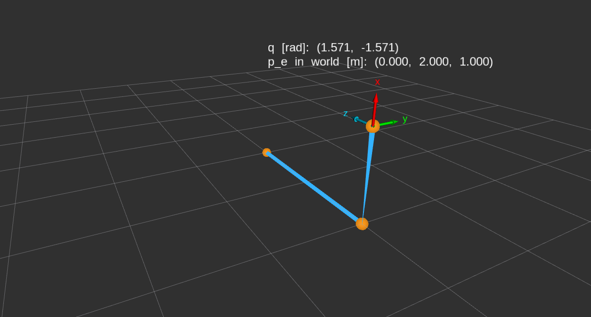
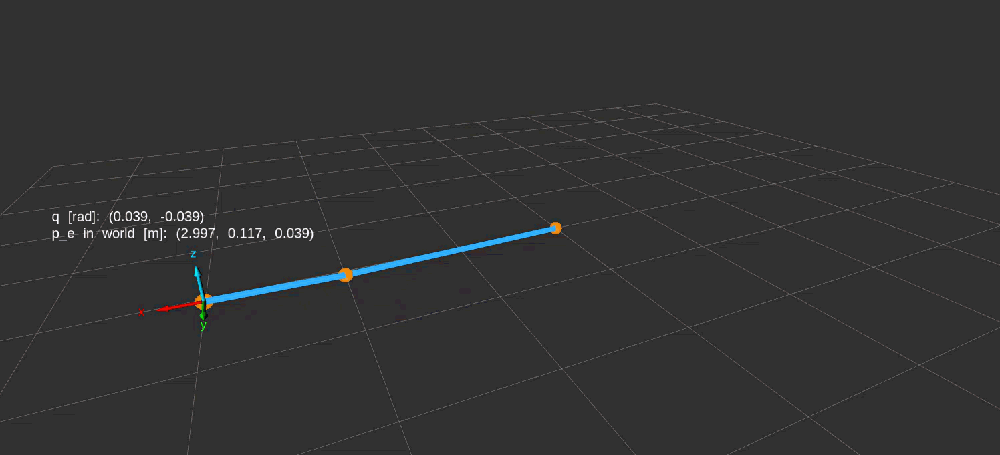

# General Robot Kinematics and Jacobians Implementation {#sec-general-kinematics-implementation}

## Prerequisites {.unnumbered}

@sec-general-forward-kinematics defines a joint-coordinate column and the allowed set for each coordinate. Recall that revolute coordinates are signed angles in radians and prismatic coordinates are signed displacements in metres. @sec-spatial-kernel-rotation3 introduces validated C++ value objects, public factories, private constructors, and exceptions; the same construction pattern is used here.

@sec-serial-product-of-exponentials establishes the space-form pose calculation from fixed joint axes at the zero arrangement and the home end-effector pose. Recall that screw columns use linear-first ordering and that transformation products act on coordinate columns rightmost first. @sec-spatial-kernel-se3-exponential implements the conversion from six exponential coordinates to a rigid displacement, and @sec-spatial-kernel-composition-inversion implements ordered transformation composition.

## Typed joint-coordinate limits {#sec-general-kinematics-impl-joint-limits}

An allowed interval describes which coordinate values a caller may supply for one joint. For joint index $j$, let $q_j\in\mathbb R$ be its coordinate, and let $\mathcal Q_j\subseteq\mathbb R$ be its allowed set, as in @sec-general-forward-kinematics. When both bounds are present, denote the lower bound by $\ell_j$ and the upper bound by $u_j$, in the same unit as $q_j$. The membership rule is

$$
q_j\in\mathcal Q_j
\quad\Longleftrightarrow\quad
\ell_j\leq q_j\leq u_j.
$$

The bounds are inclusive. Either side may be unbounded; in that case its inequality is omitted. The software accepts only finite coordinate values and requires every supplied bound to be finite. Construction checks that $\ell_j\leq u_j$ when both bounds exist. Equality describes an interval containing one value. Zero need not belong to the interval: a joint's geometric zero reference can lie outside its allowed operating range.

### Representing an optional bound

The angular and displacement intervals use separate C++ types. Each stores two values that may be absent. The complete class declarations are:

```cpp
#include <optional>

namespace rigid_body_kinematics
{

class RevoluteLimits
{
public:
  static RevoluteLimits from_bounds(
    std::optional<double> lower_bound_radians,
    std::optional<double> upper_bound_radians);

  [[nodiscard]] std::optional<double> lower_bound_radians() const noexcept;
  [[nodiscard]] std::optional<double> upper_bound_radians() const noexcept;

  [[nodiscard]] bool contains(double angle_radians) const noexcept;

private:
  RevoluteLimits(
    std::optional<double> lower_bound_radians,
    std::optional<double> upper_bound_radians);

  std::optional<double> lower_bound_radians_;
  std::optional<double> upper_bound_radians_;
};

class PrismaticLimits
{
public:
  static PrismaticLimits from_bounds(
    std::optional<double> lower_bound_metres,
    std::optional<double> upper_bound_metres);

  [[nodiscard]] std::optional<double> lower_bound_metres() const noexcept;
  [[nodiscard]] std::optional<double> upper_bound_metres() const noexcept;

  [[nodiscard]] bool contains(double displacement_metres) const noexcept;

private:
  PrismaticLimits(
    std::optional<double> lower_bound_metres,
    std::optional<double> upper_bound_metres);

  std::optional<double> lower_bound_metres_;
  std::optional<double> upper_bound_metres_;
};

}  // namespace rigid_body_kinematics
```

`std::optional<double>` owns either one `double` or no value. Here a present value stores $\ell_j$ or $u_j$; absence means that side imposes no bound. These two small declarations illustrate the storage alternatives:

```cpp
const std::optional<double> supplied_bound{0.2};
const std::optional<double> absent_bound = std::nullopt;
```

`supplied_bound` contains the number `0.2`. `absent_bound` contains no number: `std::nullopt` is the missing-value marker supplied by `<optional>`. An infinite number would be a present value and would be rejected during limits construction.

`RevoluteLimits` labels its stored numbers in radians, while `PrismaticLimits` labels them in metres. Keeping the classes distinct allows an interface to require the appropriate interval type. The scalar arguments are still ordinary `double` values, so callers must supply the declared units; the compiler cannot identify a number entered in degrees.

### Validating before construction

Both interval types use one internal check because finiteness and bound ordering have the same numerical meaning for either unit. These are complete production helper definitions; their containing source includes `<cmath>`, `<optional>`, and the serial-chain exception declaration.

```cpp
namespace rigid_body_kinematics
{
namespace
{

void validate_bounds(
  const std::optional<double> & lower_bound,
  const std::optional<double> & upper_bound)
{
  if (
    (lower_bound.has_value() && !std::isfinite(*lower_bound)) ||
    (upper_bound.has_value() && !std::isfinite(*upper_bound))) {
    throw SerialChainException(
      SerialChainError::invalid_joint_limits,
      "Present joint-limit bounds must be finite.");
  }

  if (
    lower_bound.has_value() && upper_bound.has_value() &&
    *lower_bound > *upper_bound) {
    throw SerialChainException(
      SerialChainError::invalid_joint_limits,
      "The lower joint limit must not exceed the upper joint limit.");
  }
}

bool interval_contains(
  const std::optional<double> & lower_bound,
  const std::optional<double> & upper_bound, double value) noexcept
{
  if (!std::isfinite(value)) {
    return false;
  }

  return (!lower_bound.has_value() || *lower_bound <= value) &&
         (!upper_bound.has_value() || value <= *upper_bound);
}

}  // namespace
}  // namespace rigid_body_kinematics
```

The unnamed namespace confines these helper names to the source file. Each `const std::optional<double> &` parameter borrows an existing optional for the duration of the call; the helper neither copies nor modifies it. `lower_bound` and `upper_bound` represent the optional $\ell_j$ and $u_j$. In `interval_contains`, `value` represents the supplied $q_j$.

`has_value()` tests whether an optional contains a number, and unary `*` retrieves that number. The built-in logical operators evaluate from left to right and short-circuit: `&&` skips its right operand when the left is false, while `||` skips its right operand when the left is true. Consequently, the code never dereferences an absent optional. The same rules make an absent bound automatically satisfy its side of the membership test.

`std::isfinite`, supplied by `<cmath>`, rejects both NaN and infinity. Invalid construction throws `SerialChainException` with the category `SerialChainError::invalid_joint_limits` and a message. The exception leaves the factory before it can return a limits object. An out-of-range or non-finite membership query instead returns `false`: the already constructed interval remains valid even when a supplied coordinate is unsuitable.

Membership uses the stored bounds directly. It adds no tolerance, wraps no angle, and clamps no displacement. A coordinate just outside a finite bound fails. An unbounded side permits arbitrarily large finite values as far as this interval check is concerned; it does not guarantee that a subsequent geometric calculation can represent their results.

The angular factory, constructor, and membership method connect those helpers to the stored value. These complete function definitions are an excerpt from the implementation inside the `rigid_body_kinematics` namespace; the simple accessor definitions are omitted.

```cpp
RevoluteLimits RevoluteLimits::from_bounds(
  std::optional<double> lower_bound_radians,
  std::optional<double> upper_bound_radians)
{
  validate_bounds(lower_bound_radians, upper_bound_radians);

  return RevoluteLimits(lower_bound_radians, upper_bound_radians);
}

RevoluteLimits::RevoluteLimits(
  std::optional<double> lower_bound_radians,
  std::optional<double> upper_bound_radians)
: lower_bound_radians_(lower_bound_radians),
  upper_bound_radians_(upper_bound_radians)
{
}

bool RevoluteLimits::contains(double angle_radians) const noexcept
{
  return interval_contains(
    lower_bound_radians_, upper_bound_radians_, angle_radians);
}
```

`RevoluteLimits::` identifies an out-of-class definition as belonging to that class. The factory validates its parameters before calling the private constructor. The constructor's member initializer list, introduced by `:`, initializes the two stored optionals directly from those parameters. The object owns those values after the factory returns; it does not retain references to the caller's variables. `contains` forwards the stored interval and the current angle to the common membership helper. The displacement class follows the same sequence with its metre-labelled members and argument.

### Using an interval

::: {.callout-note title="Example: A joint interval that excludes zero" appearance="simple" icon=false}

An angular operating range can permit $0.2$ through $1.0$ radians while excluding the geometric zero reference. A separate displacement range can have only a lower bound. This usage example constructs both intervals and queries their membership:

```cpp
const auto angular_limits =
  rigid_body_kinematics::RevoluteLimits::from_bounds(0.2, 1.0);

const bool lower_endpoint_allowed = angular_limits.contains(0.2);
const bool zero_allowed = angular_limits.contains(0.0);

const auto displacement_limits =
  rigid_body_kinematics::PrismaticLimits::from_bounds(-0.2, std::nullopt);

const bool extension_allowed = displacement_limits.contains(0.5);
```

`auto` deduces the type returned by each factory: `angular_limits` is a `RevoluteLimits` and `displacement_limits` is a `PrismaticLimits`. Supplying a `double` to an optional parameter constructs a present optional containing that number. `std::nullopt` constructs an absent upper bound. The three Boolean results are respectively `true`, `false`, and `true`: the angular lower endpoint is inclusive, zero is outside that angular range, and $0.5\,\mathrm m$ exceeds the displacement lower bound of $-0.2\,\mathrm m$.

:::

### Verification meaning

The focused interval tests check an angular range that excludes zero while including both endpoints, displacement intervals with either side absent, and a revolute interval with neither bound present. Separate rejection cases check a NaN angular bound, an infinite displacement bound, and reversed angular bounds. The rejection tests inspect the exception category as well as requiring construction to fail. Together these cases exercise interval semantics and construction failure without depending on a robot pose calculation.

## Revolute and prismatic joints {#sec-general-kinematics-impl-joints}

A joint definition converts axis geometry into a fixed screw column that can be reused for many coordinate queries. For joint index $j$, let ${}^{s}\mathbf s_j\in\mathbb R^3$ be the dimensionless positive unit direction of its axis, expressed in the fixed space frame $\{s\}$ at the robot's zero arrangement. For a revolute joint, let ${}^{s}\mathbf p_{\ell,j}\in\mathbb R^3$ be the position of one point on its axis line relative to the space-frame origin, expressed in $\{s\}$ and measured in metres. The subscript $\ell$ identifies the axis line. From @sec-serial-product-of-exponentials, the linear-first space screw column ${}^{s}\mathbf S_j\in\mathbb R^6$ is

$$
{}^{s}\mathbf S_j=
\begin{cases}
\begin{bmatrix}
-{}^{s}\mathbf s_j\times{}^{s}\mathbf p_{\ell,j}\\
{}^{s}\mathbf s_j
\end{bmatrix}, & \text{revolute},\\[1em]
\begin{bmatrix}
{}^{s}\mathbf s_j\\
\mathbf 0_3
\end{bmatrix}, & \text{prismatic}.
\end{cases}
$$

Here $\times$ is the three-dimensional cross product, and $\mathbf 0_3$ is the three-entry zero column. A positive revolute coordinate follows the right-hand rule about the declared direction; a positive prismatic coordinate translates along it. The revolute upper block is a linear displacement coefficient per radian of joint motion, while its lower block is the dimensionless rotation direction. The prismatic upper block is a dimensionless translation direction and its lower block is zero. Only the three-entry direction is normalized; normalizing the entire six-entry screw would change the joint's coordinate scale and mix the blocks' physical meanings.

The screw column is not a transformation and is not a current velocity. It describes the joint's unit motion relative to its geometric zero reference. Multiplication by an angle or displacement, followed by the spatial exponential, produces a finite active displacement. A prismatic joint needs no axis point because translating a rigid body along a direction does not depend on a selected line's offset.

### Storing geometry and typed limits

The two joint classes own their geometry, the matching interval type, and the screw derived from that geometry. The complete declarations below omit only header guards; their project headers supply the interval types and the linear-first six-entry column type.

```cpp
#include <Eigen/Core>
#include <variant>

#include "rigid_body_kinematics/joint_limits.hpp"
#include "rigid_body_kinematics/lie_algebra.hpp"

namespace rigid_body_kinematics
{

class RevoluteJoint
{
public:
  [[nodiscard]] static RevoluteJoint from_axis(
    const Eigen::Vector3d & space_axis_direction,
    const Eigen::Vector3d & space_axis_point_metres, RevoluteLimits limits);

  [[nodiscard]] const Eigen::Vector3d & space_axis_direction() const noexcept;
  [[nodiscard]] const Eigen::Vector3d & space_axis_point_metres()
    const noexcept;
  [[nodiscard]] const Vector6LinearFirst & space_screw_axis() const noexcept;
  [[nodiscard]] const RevoluteLimits & limits() const noexcept;

private:
  RevoluteJoint(
    Eigen::Vector3d space_axis_direction,
    Eigen::Vector3d space_axis_point_metres, RevoluteLimits limits,
    Vector6LinearFirst space_screw_axis);

  Eigen::Vector3d space_axis_direction_;
  Eigen::Vector3d space_axis_point_metres_;
  RevoluteLimits limits_;
  Vector6LinearFirst space_screw_axis_;
};

class PrismaticJoint
{
public:
  [[nodiscard]] static PrismaticJoint from_axis(
    const Eigen::Vector3d & space_axis_direction, PrismaticLimits limits);

  [[nodiscard]] const Eigen::Vector3d & space_axis_direction() const noexcept;
  [[nodiscard]] const Vector6LinearFirst & space_screw_axis() const noexcept;
  [[nodiscard]] const PrismaticLimits & limits() const noexcept;

private:
  PrismaticJoint(
    Eigen::Vector3d space_axis_direction, PrismaticLimits limits,
    Vector6LinearFirst space_screw_axis);

  Eigen::Vector3d space_axis_direction_;
  PrismaticLimits limits_;
  Vector6LinearFirst space_screw_axis_;
};

using JointDefinition = std::variant<RevoluteJoint, PrismaticJoint>;

}  // namespace rigid_body_kinematics
```

`Eigen::Vector3d` stores a fixed three-entry column of `double` values. `Vector6LinearFirst`, introduced by the spatial kernel, stores six `double` values with the linear block first. The direction parameter is allowed to be non-unit; the corresponding stored member contains the normalized direction. The revolute point member contains the supplied point in metres. Each `space_screw_axis_` member owns the derived ${}^{s}\mathbf S_j$, so evaluation need not repeat normalization or the cross product.

The factories borrow their geometry inputs through `const` references and take the validated limits by value. Requiring `RevoluteLimits` for a revolute factory prevents accidentally passing a `PrismaticLimits` object, although callers still have to supply correctly labelled scalar units when constructing the limits. The private constructors receive already checked data. As with the interval classes, there are no individual setters, but ordinary copying and assignment can copy or replace complete joint values.

The accessors return read-only references to stored members, not copies. A caller must not retain such a reference beyond the lifetime of its owning joint. Keeping the owner alive and unchanged also keeps the reference's meaning stable.

The `using` declaration gives the name `JointDefinition` to `std::variant<RevoluteJoint, PrismaticJoint>`. A variant stores one of its listed alternatives by value and records which alternative it holds. This permits one ordered collection to contain both joint types without separating the screw from the geometry and limits that give it meaning. The common container does not erase which unit its coordinate requires.

### Normalizing the positive direction

Both joint factories need the same operation: divide a finite, nonzero direction by its Euclidean length. The complete internal helper is shown below. It is defined in an unnamed namespace inside the implementation namespace; the source includes `<cmath>` and the serial-chain exception declaration.

```cpp
Eigen::Vector3d normalize_axis_direction(const Eigen::Vector3d & axis_direction)
{
  if (!axis_direction.allFinite()) {
    throw SerialChainException(
      SerialChainError::non_finite, "Joint axis direction must be finite.");
  }

  const double direction_norm = axis_direction.stableNorm();

  if (direction_norm == 0.0) {
    throw SerialChainException(
      SerialChainError::invalid_model, "Joint axis direction must be nonzero.");
  }

  if (!std::isfinite(direction_norm)) {
    throw SerialChainException(
      SerialChainError::unsupported_magnitude,
      "Joint axis direction cannot be normalized safely.");
  }

  const Eigen::Vector3d normalized_direction = axis_direction / direction_norm;

  if (!normalized_direction.allFinite()) {
    throw SerialChainException(
      SerialChainError::unsupported_magnitude,
      "Normalized joint axis direction is not finite.");
  }

  return normalized_direction;
}
```

`allFinite()` checks all vector entries. `stableNorm()` computes the Euclidean length using scaling to reduce intermediate overflow and underflow, rather than directly summing unscaled squared entries. A finite input vector can still have a length too large to represent as a `double`; the explicit finiteness check therefore remains necessary. A zero direction has no orientation and cannot be repaired by choosing an arbitrary axis.

`direction_norm` is the length of the supplied direction, and `normalized_direction` is ${}^{s}\mathbf s_j$. Division by that positive length preserves the declared sign. The final check rejects a non-finite computed direction instead of letting invalid geometry enter a joint object.

### Constructing a revolute screw

The revolute factory checks the point, normalizes the direction, and forms the cross-product block. These complete production definitions appear inside the implementation namespace; `<Eigen/Geometry>` supplies the cross-product operation and `<utility>` supplies the move utility.

```cpp
RevoluteJoint RevoluteJoint::from_axis(
  const Eigen::Vector3d & space_axis_direction,
  const Eigen::Vector3d & space_axis_point_metres, RevoluteLimits limits)
{
  if (!space_axis_point_metres.allFinite()) {
    throw SerialChainException(
      SerialChainError::non_finite, "Revolute axis point must be finite.");
  }

  const Eigen::Vector3d normalized_direction =
    normalize_axis_direction(space_axis_direction);

  const Eigen::Vector3d linear_screw_block =
    -normalized_direction.cross(space_axis_point_metres);

  if (!linear_screw_block.allFinite()) {
    throw SerialChainException(
      SerialChainError::unsupported_magnitude,
      "Revolute screw-axis calculation is not finite.");
  }

  Vector6LinearFirst space_screw_axis;
  space_screw_axis.head<3>() = linear_screw_block;
  space_screw_axis.tail<3>() = normalized_direction;

  return RevoluteJoint(
    normalized_direction, space_axis_point_metres, std::move(limits),
    space_screw_axis);
}

RevoluteJoint::RevoluteJoint(
  Eigen::Vector3d space_axis_direction, Eigen::Vector3d space_axis_point_metres,
  RevoluteLimits limits, Vector6LinearFirst space_screw_axis)
: space_axis_direction_(std::move(space_axis_direction)),
  space_axis_point_metres_(std::move(space_axis_point_metres)),
  limits_(std::move(limits)),
  space_screw_axis_(std::move(space_screw_axis))
{
}
```

`linear_screw_block` represents $-{}^{s}\mathbf s_j\times{}^{s}\mathbf p_{\ell,j}$. The leading minus sign applies to the whole cross product; swapping the cross-product operands would also change its sign. Even with finite operands, an intermediate calculation can exceed the representable range, so the factory checks the resulting block before constructing the joint.

`head<3>()` selects the first three entries and `tail<3>()` selects the last three. The angle-bracket argument fixes the block length at compile time. These expressions are writable views into `space_screw_axis`, so the assignments fill entries $0,1,2$ and $3,4,5$, respectively. Both blocks are assigned before the six-entry column is used; the default declaration alone does not initialize its numerical entries.

The constructor code stores the checked geometry and limits in the new joint through three parts:

1. **Constructor (`RevoluteJoint::RevoluteJoint`):** This special member function initializes a new joint. The factory (`RevoluteJoint::from_axis`) calls it after checking the inputs and calculating the screw.
2. **Member initializer list (the part after `:`):** This is not a separate function. It initializes the joint's stored members before the constructor body runs. For example, `space_axis_direction_(std::move(space_axis_direction))` initializes the stored direction from the direction parameter.
3. **Move utility (`std::move`):** `std::move` marks an existing object as available for move construction: creating a new object that can reuse the original object's data instead of copying it, when the type supports this. In `space_axis_direction_(std::move(space_axis_direction))`, the stored member is initialized from the direction parameter. `std::move` allows C++ to use the type's move constructor, but this fixed-size Eigen vector may still copy its three numbers. The joint keeps its own direction, axis point, limits, and screw; these remain available after the factory and constructor finish.

For example, a supplied direction $(0,0,5)^{\mathsf T}$ and axis point $(2,0,0)^{\mathsf T}\,\mathrm m$ produce the unit direction $(0,0,1)^{\mathsf T}$ and linear block $(0,-2,0)^{\mathsf T}$ in metres per radian. The stored screw is therefore $(0,-2,0,0,0,1)^{\mathsf T}$. The point is on a line parallel to the space $z$-axis but displaced from the space origin; the upper block records that offset's effect on the motion.

### Constructing a prismatic screw

A prismatic factory uses the same direction normalization but puts the result in the linear block. These are its complete factory and constructor definitions in the implementation namespace.

```cpp
PrismaticJoint PrismaticJoint::from_axis(
  const Eigen::Vector3d & space_axis_direction, PrismaticLimits limits)
{
  const Eigen::Vector3d normalized_direction =
    normalize_axis_direction(space_axis_direction);

  Vector6LinearFirst space_screw_axis;
  space_screw_axis.head<3>() = normalized_direction;
  space_screw_axis.tail<3>().setZero();

  return PrismaticJoint(
    normalized_direction, std::move(limits), space_screw_axis);
}

PrismaticJoint::PrismaticJoint(
  Eigen::Vector3d space_axis_direction, PrismaticLimits limits,
  Vector6LinearFirst space_screw_axis)
: space_axis_direction_(std::move(space_axis_direction)),
  limits_(std::move(limits)),
  space_screw_axis_(std::move(space_screw_axis))
{
}
```

`setZero()` fills the selected angular block with zeros. Thus a supplied direction $(0,-4,0)^{\mathsf T}$ produces the screw $(0,-1,0,0,0,0)^{\mathsf T}$. Multiplying that screw by a displacement of $0.4\,\mathrm m$ gives a linear exponential-coordinate block $(0,-0.4,0)^{\mathsf T}\,\mathrm m$ and zero rotation. Unlike a revolute screw, it has no axis-offset contribution.

The following representative accessor definitions complete the ownership picture. The other declared accessors use the same direct return of their corresponding stored member.

```cpp
const Vector6LinearFirst & RevoluteJoint::space_screw_axis() const noexcept
{
  return space_screw_axis_;
}

const PrismaticLimits & PrismaticJoint::limits() const noexcept
{
  return limits_;
}
```

Each returned reference refers to a member of the joint, not to a temporary created by the accessor. The caller can inspect that member but cannot modify it through the read-only reference.

### Verification meaning

The joint tests check normalization together with the derived six entries for a displaced revolute axis and a negative-direction prismatic axis. A separate geometric test selects two points on the same oriented revolute line and checks that both definitions produce the same screw; it protects the distinction between the physical axis line and the arbitrary point chosen to describe it. Rejection tests exercise a zero direction, a non-finite direction, and a non-finite axis point, including their typed error categories.

## Serial-chain model {#sec-general-kinematics-impl-serial-model}

A fixed-base open serial chain needs one geometric reference pose and an ordered sequence of joint definitions. Let $n\geq1$ be the number of independent one-degree-of-freedom joints, ordered from the fixed base toward the selected end effector. Let $\{e\}$ be that end-effector frame. As in @sec-serial-product-of-exponentials, the home pose $\mathbf M\in SE(3)$ is

$$
\mathbf M:=\mathbf T_{se}(\mathbf 0_n)
=\begin{bmatrix}
\mathbf R_{se,0}&{}^{s}\mathbf p_{e,0}\\
\mathbf 0_3^{\mathsf T}&1
\end{bmatrix}.
$$

Here $SE(3)$ is the set of rigid transformations represented by $4\times4$ homogeneous matrices, $\mathbf 0_n$ is the all-zero joint-coordinate column, and $\mathbf T_{se}$ is the pose of $\{e\}$ relative to $\{s\}$. The dimensionless $3\times3$ rotation block $\mathbf R_{se,0}$ gives the end-effector frame’s orientation relative to the space frame when all joint coordinates are zero. The three-entry column ${}^{s}\mathbf p_{e,0}$ gives the end-effector origin's position relative to the space origin, expressed in $\{s\}$ and measured in metres. The superscript $\mathsf T$ transposes the zero column into a row. The matrix maps homogeneous end-effector point coordinates to space-frame coordinates by left multiplication.

The **geometric forward-kinematics model** collects the fixed data needed to calculate the selected end effector's pose. As defined in Equation @eq-serial-geometric-model, it is the ordered pair

$$
\mathcal M
:=
\left(
\mathbf M,\;
({}^{s}\mathbf S_j)_{j=1}^{n}
\right),
$$

where:

- $\mathbf M$ is the home end-effector pose relative to the fixed space frame $\{s\}$.
- $({}^{s}\mathbf S_j)_{j=1}^{n}$ is the ordered sequence of space screw columns, from joint $1$ at the base to joint $n$ nearest the end effector, all expressed in $\{s\}$ at the same zero arrangement.
- $n$ is the number of joints.

The software's **serial-chain model** stores this geometric description together with the information needed to construct and validate it. It contains the home pose and ordered joint definitions; each joint definition retains its type, axis geometry, coordinate limits, and derived screw column. These are fixed reference data, not the current joint coordinates: the same model can be used to calculate poses for different coordinate inputs.

Every axis must describe the same zero arrangement and use the same space frame as $\mathbf M$. This agreement is a caller precondition: finite numerical entries alone cannot establish which physical frame or robot arrangement they describe. The zero arrangement defines the geometry even when zero lies outside a joint's operating interval; storing the home pose does not make a zero-coordinate query admissible.

### Owning the home pose and ordered joints

The complete class declaration is:

```cpp
#include <cstddef>
#include <vector>

#include "rigid_body_kinematics/joint_definition.hpp"
#include "rigid_body_kinematics/transform3.hpp"

namespace rigid_body_kinematics
{

class SerialChainModel
{
public:
  [[nodiscard]] static SerialChainModel from_home_and_joints(
    Transform3 home_pose, std::vector<JointDefinition> joint_definitions);

  [[nodiscard]] const Transform3 & home_pose() const noexcept;
  [[nodiscard]] const std::vector<JointDefinition> & joint_definitions()
    const noexcept;
  [[nodiscard]] std::size_t joint_count() const noexcept;

private:
  SerialChainModel(
    Transform3 home_pose, std::vector<JointDefinition> joint_definitions);

  Transform3 home_pose_;
  std::vector<JointDefinition> joint_definitions_;
};

}  // namespace rigid_body_kinematics
```

`home_pose_` owns the validated representation of $\mathbf M$. `std::vector<JointDefinition>` is a variable-length, ordered container that owns its elements. Its first element is mathematical joint $1$, and its last is joint $n$. Each element retains its joint kind, geometry, limits, and screw together; separate arrays do not have to be kept in matching order. This C++ container is not the numerical joint-coordinate column.

`joint_count()` returns `std::size_t`, the unsigned integer type used for container sizes. Its value is $n$. The other two accessors return read-only references, allowing repeated evaluation to borrow the stored model instead of copying all its joints. The model contains no current coordinate input or evaluation policy: changing the requested robot configuration does not require rebuilding the geometric reference.

### Validating construction without duplicating nested checks

The complete model implementation below is an excerpt inside the implementation namespace. Its source also includes `<utility>` and the serial-chain exception declaration.

```cpp
SerialChainModel SerialChainModel::from_home_and_joints(
  Transform3 home_pose, std::vector<JointDefinition> joint_definitions)
{
  if (joint_definitions.empty()) {
    throw SerialChainException(
      SerialChainError::invalid_model,
      "A serial-chain model must contain at least one joint.");
  }

  return SerialChainModel(std::move(home_pose), std::move(joint_definitions));
}

SerialChainModel::SerialChainModel(
  Transform3 home_pose, std::vector<JointDefinition> joint_definitions)
: home_pose_(std::move(home_pose)),
  joint_definitions_(std::move(joint_definitions))
{
}

const Transform3 & SerialChainModel::home_pose() const noexcept
{
  return home_pose_;
}

const std::vector<JointDefinition> & SerialChainModel::joint_definitions()
  const noexcept
{
  return joint_definitions_;
}

std::size_t SerialChainModel::joint_count() const noexcept
{
  return joint_definitions_.size();
}
```

`empty()` tests whether the supplied joint container has no elements. Rejecting that case enforces $n\geq1$. The factory does not repeat rotation, axis, or interval checks: those properties were established when its input values were constructed. It neither sorts the list nor recalculates the screw columns, so the caller's base-to-end-effector order is retained exactly.

The factory receives its inputs by value. Passing an existing ordinary variable copies it into the parameter; explicitly moving a suitable variable permits move construction instead. The factory then moves its parameters into the private constructor, which moves them into the stored members. For the joint vector, move construction transfers ownership of its allocated element storage. This is different from keeping a reference to the caller's vector: subsequently changing the caller's original vector cannot edit the model's stored joints.

The accessors, `joint_definitions()` and `joint_count`, borrow the model's members. Such references should be used while the model remains alive and unchanged; replacing or moving the owner can change or invalidate access to its former contents. The model itself remains an ordinary value that can be copied or replaced as a whole. Its public interface provides no operation to mutate an individual stored joint.

### Verification meaning

The model tests check that construction retains a nonidentity home pose and a joint, rejects an empty sequence with the model-error category, and preserves a mixed revolute--prismatic order. The order check matters mathematically: exchanging two stored joints can change the transformation product even if each joint is independently valid. These tests check representation and construction, not the computed pose for a nonzero coordinate query.

## Space-form forward kinematics {#sec-general-kinematics-impl-space-forward-kinematics}

Given the fixed model and a current coordinate column $\mathbf q=(q_1,\ldots,q_n)^{\mathsf T}$, forward kinematics returns $\mathbf T_{se}(\mathbf q)\in SE(3)$. Its allowed input set is $\mathcal Q=\mathcal Q_1\times\cdots\times\mathcal Q_n\subseteq\mathbb R^n$, the Cartesian product of the declared joint intervals. Entry $q_j$ is in radians for a revolute joint or metres for a prismatic joint; the whole column has no single physical unit.

Recall the space-form construction from @sec-serial-product-of-exponentials. For each joint, define its six-entry exponential-coordinate column ${}^{s}\boldsymbol\eta_j$, its active displacement $\mathbf E_j(q_j)\in SE(3)$, and the resulting pose by

$$
{}^{s}\boldsymbol\eta_j:={}^{s}\mathbf S_jq_j,
\qquad
\mathbf E_j(q_j):=\exp\!\left(\widehat{{}^{s}\boldsymbol\eta_j}\right),
\qquad
\mathbf T_{se}(\mathbf q)=\mathbf E_1(q_1)\cdots\mathbf E_n(q_n)\mathbf M.
$$

The hat operator maps the linear-first six-entry column to its $4\times4$ Lie-algebra matrix, and $\exp$ is the matrix exponential implemented by the spatial kernel.

Write ${}^{s}\boldsymbol\eta_j=[\boldsymbol\rho_j^{\mathsf T}\;\boldsymbol\phi_j^{\mathsf T}]^{\mathsf T}$, where the three-entry blocks $\boldsymbol\rho_j$ and $\boldsymbol\phi_j$ are linear exponential coordinates in metres and angular exponential coordinates in radians, respectively, expressed in $\{s\}$. Recall that

$$
\widehat{{}^{s}\boldsymbol\eta_j}
=
\begin{bmatrix}
\widehat{\boldsymbol\phi_j}&\boldsymbol\rho_j\\
\mathbf 0_3^{\mathsf T}&0
\end{bmatrix}
\in\mathfrak{se}(3),
\qquad
\exp\!\left(\widehat{{}^{s}\boldsymbol\eta_j}\right)
=
\begin{bmatrix}
\exp(\widehat{\boldsymbol\phi_j})&\mathbf t_j\\
\mathbf 0_3^{\mathsf T}&1
\end{bmatrix}
\in SE(3).
$$

Here $\widehat{\boldsymbol\phi_j}$ is the $3\times3$ skew-symmetric cross-product matrix of $\boldsymbol\phi_j$, and $\mathbf 0_3$ is the three-entry zero column. The three-entry translation column $\mathbf t_j$, expressed in $\{s\}$ and measured in metres, is calculated by the spatial exponential; it need not equal $\boldsymbol\rho_j$ when rotation is present.[^offset-axis-translation]

[^offset-axis-translation]: For a revolute motion, let $\mathbf p\in\mathbb R^3$ be a point on the rotation axis, and let $\mathbf x,\mathbf x'\in\mathbb R^3$ be a point's positions before and after the motion. All positions are measured from the space-frame origin, expressed in $\{s\}$, and given in metres. Let $\mathbf R\in SO(3)$ be the dimensionless rotation matrix. Rotation around that offset axis acts as

    $$
    \mathbf x'
    =\mathbf R(\mathbf x-\mathbf p)+\mathbf p
    =\mathbf R\mathbf x+\underbrace{(\mathbf p-\mathbf R\mathbf p)}_{\mathbf t}.
    $$

    Thus the translation column is $\mathbf t=\mathbf p-\mathbf R\mathbf p$, measured in metres.

The factors preserve base-to-end-effector joint order from left to right. They act rightmost first on coordinate columns, and each $\mathbf E_j$ is an active motion expressed in the fixed space frame. This factor order describes the final pose, not a time sequence for commanding the robot. The stored axes remain the zero-arrangement axes throughout evaluation; the ordered product accounts for the motion of the outward assembly.

### Public input and output

The public declaration is:

```cpp
namespace rigid_body_kinematics
{

[[nodiscard]] Transform3 space_form_forward_kinematics(
  const SerialChainModel & model,
  Eigen::Ref<const Eigen::VectorXd> joint_coordinates,
  const NumericalPolicy & policy = NumericalPolicy{});

}  // namespace rigid_body_kinematics
```

`space_form_forward_kinematics` borrows `model` and returns an owned `Transform3` representing $\mathbf T_{se}(\mathbf q)$. `Eigen::VectorXd` is a dynamically sized column of `double` values. `Eigen::Ref<const Eigen::VectorXd>` provides read-only access to a compatible column: an ordinary compatible vector can be borrowed without copying its entries. Some expression inputs require Eigen to evaluate temporary storage, so this parameter is not a guarantee that every possible caller expression avoids a copy. The evaluator retains no coordinate reference after it returns.

`joint_coordinates` represents $\mathbf q$, and the mathematical entry $q_j$ appears at zero-based C++ index $j-1$. `policy` supplies numerical evaluation thresholds rather than physical robot properties. The default argument `NumericalPolicy{}` constructs the policy with its declared member defaults when the caller omits the third argument; the temporary remains alive for the call. The return type is a transform rather than an optional partial answer. Invalid queries throw a typed serial-chain exception.

### Accessing either joint kind

The following two helpers let the evaluator query either joint type without duplicating the calculation. Their complete definitions belong to an unnamed namespace inside the implementation namespace; the variant operations use `<variant>`. The separate policy-validation helper is omitted.

```cpp
bool joint_contains(
  const JointDefinition & joint_definition, double joint_coordinate)
{
  return std::visit(
    [joint_coordinate](const auto & joint) {
      return joint.limits().contains(joint_coordinate);
    },
    joint_definition);
}

const Vector6LinearFirst & space_screw_axis(
  const JointDefinition & joint_definition)
{
  return std::visit(
    [](const auto & joint) -> const Vector6LinearFirst & {
      return joint.space_screw_axis();
    },
    joint_definition);
}
```

#### What `std::visit` does

For one variant, the call has the following form. This is schematic syntax: the argument names are placeholders, not additional declarations in the implementation.

```cpp
std::visit(visitor, variant_value);
```

1. **What problem it solves:** A variant can hold different types of objects, but holds only one at a time. For example, a joint definition holds either a revolute joint or a prismatic joint. `std::visit` lets you call a function with whichever joint is actually stored there.
2. **First argument — what to do:** `visitor` is the function you want to run on the stored object. A lambda lets you write that function directly inside the call, as in the helpers above.
3. **Second argument — where the object is:** `variant_value` is the variant holding the object. `std::visit` passes the object inside it to your function, not the whole variant.
4. **Which object the function receives:** If the variant holds a revolute joint, your function receives that revolute joint. If it holds a prismatic joint, your function receives that prismatic joint. Only one call happens, using the object currently stored.
5. **What comes back:** The answer from your function becomes the answer from `std::visit`. If your function checks a joint limit and returns `true`, `std::visit` returns `true` too. The function you supply performs the check; `std::visit` only connects it to the stored object and returns its answer.

#### How the joint helpers use it

1. **Variant and contained joint:** `joint_definition` is the variant containing a `RevoluteJoint` or a `PrismaticJoint`. In both helpers, the first argument to `std::visit` is the lambda, and the second is this variant. The lambda's `joint` parameter refers to the actual stored joint.
2. **Coordinate capture:** In `joint_contains`, `[joint_coordinate]` captures a copy of the coordinate to check. This is separate from the parameter supplied by `std::visit`: the capture provides the query, while the parameter provides the joint whose interval is queried.
3. **Joint parameter:** `const auto & joint` becomes `const RevoluteJoint &` or `const PrismaticJoint &` for the selected alternative. It borrows the joint without copying or modifying it. Both classes provide the operations used by the visitor; they do not need a common base class.
4. **Membership result:** `joint.limits().contains(joint_coordinate)` checks the appropriate interval and returns a `bool` for either joint type. The inner `return` passes that Boolean out of the lambda, `std::visit` returns it, and the outer `return` passes it out of `joint_contains`.
5. **Screw result:** In the screw helper, `[]` captures nothing because the supplied joint is the only input needed. The explicit `-> const Vector6LinearFirst &` makes the lambda return a read-only reference to that joint's stored screw. Both alternatives return the same reference type.
6. **Reference lifetime:** The lambda's `-> const Vector6LinearFirst &` makes it return a read-only reference to the screw stored in the joint. The outer helper also returns `const Vector6LinearFirst &`, so the caller receives a reference to that same stored screw, usable while the joint remains alive and unchanged. If the lambda's `-> const Vector6LinearFirst &` were removed, the lambda would instead return a copied `Vector6LinearFirst` value. The outer helper would still return `const Vector6LinearFirst &`, but that reference would point to the temporary copy, not the joint's stored screw. The temporary is destroyed during the helper's return, leaving the caller with a **dangling reference** to an object that no longer exists.

### Evaluating the ordered product

The calculation has two stages: establish that the query is admissible, then accumulate the ordered displacements. The pseudocode includes the checks and failure behaviour so their role remains visible without reproducing every rejection branch.

```text
Validate the numerical policy and coordinate count.
Reject any non-finite coordinate.

For each joint:
    Check its coordinate against its limits.
    For a revolute joint, check the supported angular magnitude.

Start the accumulated transform at identity.
For each joint in base-to-end-effector order:
    Multiply its stored screw by its coordinate.
    Reject non-finite exponential coordinates.
    Convert those coordinates to a displacement.
    Append the displacement on the right.

Append the home pose on the right and return.
On evaluation failure, report the error without returning a partial pose.
```

**Production excerpt — joint-limit validation.** After checking the numerical policy, coordinate count, and finiteness, the evaluator checks each coordinate against its joint's limits. Those earlier checks and the function wrapper are omitted here. The revolute angular-magnitude check, which follows the limit check inside the same production loop, is also omitted.

```cpp
for (std::size_t index = 0; index < model.joint_count(); ++index) {
  const double coordinate =
    joint_coordinates(static_cast<Eigen::Index>(index));

  const JointDefinition & joint_definition =
    model.joint_definitions().at(index);

  if (!joint_contains(joint_definition, coordinate)) {
    throw SerialChainException(
      SerialChainError::joint_out_of_domain,
      "Joint " + std::to_string(index + 1) +
        " is outside its declared limits.");
  }
}
```

- The same `index` selects a joint definition and its coordinate.
- `joint_contains` uses `std::visit` to check that coordinate against the selected joint's angular or displacement limits.
- If the coordinate is outside its limits, the exception stops evaluation before any joint exponential is calculated.

**Production excerpt — core accumulation, not a complete function.** This excerpt uses the inputs from the public signature above after all validation has passed. The function wrapper, preceding validation code, and surrounding exception-translation blocks are omitted from this excerpt. Screw scaling, its finiteness check, exponential evaluation, and multiplication order are unchanged.

```cpp
Transform3 result = Transform3::identity();

for (std::size_t index = 0; index < model.joint_count(); ++index) {
  const double coordinate =
    joint_coordinates(static_cast<Eigen::Index>(index));

  const Vector6LinearFirst exponential_coordinates =
    space_screw_axis(model.joint_definitions().at(index)) * coordinate;

  if (!exponential_coordinates.allFinite()) {
    throw SerialChainException(
      SerialChainError::unsupported_magnitude,
      "Joint " + std::to_string(index + 1) +
        " produced non-finite exponential coordinates.");
  }

  const Transform3 joint_displacement =
    Transform3::from_exponential_coordinates(
      exponential_coordinates, policy);

  result = result.compose(joint_displacement);
}

return result.compose(model.home_pose());
```

The same zero-based `index` selects a coordinate and its joint definition, preserving their base-to-end-effector correspondence. The explicit conversion to `Eigen::Index` connects the container's index type to Eigen's signed indexing type. The earlier coordinate-count check establishes that there is exactly one coordinate for every stored joint. Error messages report `index + 1`, the mathematical joint index.

After validation, `exponential_coordinates` is the owned column ${}^{s}\boldsymbol\eta_j={}^{s}\mathbf S_jq_j$, and `joint_displacement` is $\mathbf E_j(q_j)$. The multiplication can overflow even when both factors are finite, which explains the check before calling the kernel. `Transform3::from_exponential_coordinates` performs the coupled spatial exponential; the evaluator does not construct a translation directly from the screw's upper entries.

`result` starts as the identity transform $\mathbf I_4$, the $4\times4$ identity matrix. Define $\mathbf P_0=\mathbf I_4$ and let $\mathbf P_j$ be the partial product after joint $j$. The call `result.compose(joint_displacement)` implements

$$
\mathbf P_j=\mathbf P_{j-1}\mathbf E_j(q_j),
\qquad j=1,\ldots,n.
$$

Consequently the loop builds $\mathbf E_1$, then $\mathbf E_1\mathbf E_2$, and finally $\mathbf E_1\cdots\mathbf E_n$. The last composition appends $\mathbf M$ on the right. Starting from the home pose and using the same loop would instead place $\mathbf M$ on the left, which is generally a different pose. The identity initialization and final home-pose composition are therefore part of the equation-to-code mapping, not interchangeable setup choices.

Additional validation checks and error handling are omitted here for clarity; they remain in the production implementation.

::: {.callout-note title="Example: A rotating extension" appearance="simple" icon=false}

Consider a revolute joint about the positive space $z$-axis through the origin, followed by a prismatic joint along the positive space $x$-direction at zero. The home end-effector orientation is the identity and its origin is at $(1,0,0)^{\mathsf T}\,\mathrm m$. Query a revolute angle of $\pi/2$ radians and a prismatic displacement of $0.5\,\mathrm m$. This is a usage example, not part of the production evaluator; the statements below belong inside a caller function after including the public forward-kinematics header and `<numbers>`.

```cpp
namespace rbk = rigid_body_kinematics;

const auto revolute = rbk::RevoluteJoint::from_axis(
  Eigen::Vector3d(0.0, 0.0, 1.0), Eigen::Vector3d::Zero(),
  rbk::RevoluteLimits::from_bounds(-std::numbers::pi, std::numbers::pi));

const auto prismatic = rbk::PrismaticJoint::from_axis(
  Eigen::Vector3d(1.0, 0.0, 0.0),
  rbk::PrismaticLimits::from_bounds(-10.0, 10.0));

Eigen::Matrix4d home_matrix = Eigen::Matrix4d::Identity();
home_matrix(0, 3) = 1.0;

const auto model = rbk::SerialChainModel::from_home_and_joints(
  rbk::Transform3::from_matrix(home_matrix), {revolute, prismatic});

Eigen::VectorXd joint_coordinates(2);
joint_coordinates << std::numbers::pi / 2.0, 0.5;

const rbk::Transform3 pose =
  rbk::space_form_forward_kinematics(model, joint_coordinates);

const Eigen::Matrix4d pose_matrix = pose.matrix();
```

`namespace rbk = rigid_body_kinematics` introduces a shorter namespace alias for this example; it does not create another implementation. `home_matrix(0, 3)` selects the first translation entry using zero-based row and column indices. The braced list `{revolute, prismatic}` initializes the factory's vector parameter with copies of the two joint values in that order. Eigen's `<<` comma initializer fills the two-entry coordinate column in the written order. `pose_matrix` is an owned matrix representation of the returned pose.

An independent geometric calculation first extends the home position along its zero-arrangement $x$-direction and then rotates the outward assembly. Writing $\mathbf R_z(\pi/2)$ for the positive quarter-turn rotation about the space $z$-axis, the expected position is

$$
\mathbf R_z(\pi/2)
\left(
\begin{bmatrix}1\\0\\0\end{bmatrix}
+\begin{bmatrix}0.5\\0\\0\end{bmatrix}
\right)
=\begin{bmatrix}0\\1.5\\0\end{bmatrix}\ \mathrm m.
$$

The prismatic joint does not change orientation, so the expected complete matrix is

$$
\mathbf T_{se}(\mathbf q)=
\begin{bmatrix}
0&-1&0&0\\
1&0&0&1.5\\
0&0&1&0\\
0&0&0&1
\end{bmatrix}.
$$

The returned numerical entries should agree up to floating-point rounding. The translation lies along the rotated extension direction, not along the unchanged space $x$-axis. This distinguishes the ordered product from simply adding the prismatic displacement to an already rotated home position in fixed space coordinates.

:::

### Worked example: spatial two-revolute-joint motion {#sec-general-kinematics-impl-spatial-2r}

This example supplies an independent geometric reference for a two-joint arm whose motion leaves its home plane. It applies the ordered-rotation construction in @sec-serial-product-of-exponentials: rotate the distal link about the elbow, then rotate the resulting arrangement about the base. This is a calculation order, not a requirement to move the joints one at a time; the same construction underlies the space-form product in Lynch and Park, *Modern Robotics*, Chapter 4, Section 4.1.1.

Let the link lengths be $L_1=2\,\mathrm m$ and $L_2=1\,\mathrm m$. Both links initially point along $+x_s$, and the base is the origin of the fixed space frame $\{s\}$, identified with `world` for this example. Joint 1 rotates about $+z_s$ through the base. Joint 2 rotates about an axis that points along $+y_s$ through the elbow at home; joint 1 carries that physical axis with it. The joint angles $q_1$ and $q_2$ are in radians, with positive angles following the right-hand rule. Both lie in $[-\pi,\pi]$.

All position and link-vector columns below have three entries expressed along $\{s\}$ axes, with lengths in metres. Positions are measured from the base; the link vector is the difference between the end-effector and elbow positions. The dimensionless $3\times3$ rotation matrices act actively on columns. The end-effector frame $\{e\}$ is attached to the tip of link 2 and aligned with $\{s\}$ when both angles are zero.

#### Rotate the second link about the elbow

First hold joint 1 at zero. The elbow position is ${}^{s}\mathbf p_{\ell,0}$, where $\ell$ denotes the elbow and $0$ its home position. The vector from the elbow to the end effector at home is ${}^{s}\mathbf r_0$:

$$
{}^{s}\mathbf p_{\ell,0}=\begin{bmatrix}L_1\\0\\0\end{bmatrix},
\qquad
{}^{s}\mathbf r_0=\begin{bmatrix}L_2\\0\\0\end{bmatrix}.
$$

With joint 1 held at zero, the second joint's axis points along $+y_s$. Its active right-handed rotation matrix is

$$
\mathbf R_y(q_2)=
\begin{bmatrix}
\cos q_2&0&\sin q_2\\
0&1&0\\
-\sin q_2&0&\cos q_2
\end{bmatrix}.
$$

Joint 2 rotates the link vector about the elbow:

$$
\mathbf R_y(q_2){}^{s}\mathbf r_0
=
\begin{bmatrix}
L_2\cos q_2\\0\\-L_2\sin q_2
\end{bmatrix}.
$$

Write ${}^{s}\mathbf p_e(q_1,q_2)\in\mathbb R^3$ for the end-effector origin's position relative to the base when joint 1 has angle $q_1$ and joint 2 has angle $q_2$. The subscript $e$ identifies the end effector; the superscript $s$ says that the three position components are expressed along frame $\{s\}$ axes, in metres. The parentheses contain the two input angles, not position components. Thus ${}^{s}\mathbf p_e(0,q_2)$ means the same position function evaluated with $q_1=0$ and joint 2 at angle $q_2$.

Adding the elbow position to the rotated link vector gives

$$
{}^{s}\mathbf p_e(0,q_2)
={}^s\mathbf p_{\ell,0}+\mathbf R_y(q_2){}^{s}\mathbf r_0
=
\begin{bmatrix}
L_1+L_2\cos q_2\\0\\-L_2\sin q_2
\end{bmatrix}.
$$

The elbow position is added after rotating the link vector because joint 2 rotates about the elbow, not the base. The negative sign in the last entry follows from the right-hand rule: a positive rotation about $+y_s$ carries a vector initially along $+x_s$ toward $-z_s$. A negative second-joint angle therefore lifts the link toward $+z_s$.

#### Rotate the whole arrangement about the base

Joint 1 rotates both the first link and the bent second link about $+z_s$, using

$$
\mathbf R_z(q_1)=
\begin{bmatrix}
\cos q_1&-\sin q_1&0\\
\sin q_1&\cos q_1&0\\
0&0&1
\end{bmatrix}.
$$

Because the base is the space-frame origin, this rotation needs no additional offset translation. Applying it to the preceding position gives

$$
\begin{aligned}
{}^{s}\mathbf p_e(q_1,q_2)
&=\mathbf R_z(q_1){}^{s}\mathbf p_e(0,q_2)\\
&=
\begin{bmatrix}
(L_1+L_2\cos q_2)\cos q_1\\
(L_1+L_2\cos q_2)\sin q_1\\
-L_2\sin q_2
\end{bmatrix}.
\end{aligned}
$$

Substituting the two link lengths yields

$$
\boxed{
{}^{s}\mathbf p_e(q_1,q_2)=
\begin{bmatrix}
(2+\cos q_2)\cos q_1\\
(2+\cos q_2)\sin q_1\\
-\sin q_2
\end{bmatrix}\mathrm m.
}
$$

The same base rotation gives the elbow position:

$$
{}^{s}\mathbf p_\ell(q_1)
=\mathbf R_z(q_1){}^{s}\mathbf p_{\ell,0}
=\begin{bmatrix}L_1\cos q_1\\L_1\sin q_1\\0\end{bmatrix}.
$$

To calculate orientation, let $\mathbf R_{se}(q_1,q_2)$ be the dimensionless $3\times3$ matrix whose columns are the end-effector axes expressed in $\{s\}$. At home, those axes are aligned with $\{s\}$. With joint 1 held at zero, joint 2 rotates them by $\mathbf R_y(q_2)$. Joint 1 then rotates each resulting axis by $\mathbf R_z(q_1)$. Applying these rotations to each column gives

$$
\begin{aligned}
\mathbf R_{se}(q_1,q_2)
&=\mathbf R_z(q_1)\mathbf R_y(q_2)\\
&=
\begin{bmatrix}
\cos q_1&-\sin q_1&0\\
\sin q_1&\cos q_1&0\\
0&0&1
\end{bmatrix}
\begin{bmatrix}
\cos q_2&0&\sin q_2\\
0&1&0\\
-\sin q_2&0&\cos q_2
\end{bmatrix}\\
&=
\begin{bmatrix}
\cos q_1\cos q_2&-\sin q_1&\cos q_1\sin q_2\\
\sin q_1\cos q_2&\cos q_1&\sin q_1\sin q_2\\
-\sin q_2&0&\cos q_2
\end{bmatrix}.
\end{aligned}
$$

The multiplication order accounts for joint 1 carrying joint 2's axis; the second joint does not keep rotating about the unchanged world $y$-axis after the base turns. The elbow offset affects position, but not the orientation of the end-effector axes.

#### A bounded motion and its endpoint

Let the dimensionless scalar $u\in[0,1]$ select the joint-coordinate column

$$
\mathbf q(u)=
u\begin{bmatrix}\pi/2\\-\pi/2\end{bmatrix}\mathrm{rad}.
$$

At $u=0$, the elbow is at $(2,0,0)\,\mathrm m$, the end effector is at $(3,0,0)\,\mathrm m$, and its orientation is the $3\times3$ identity matrix $\mathbf I_3$. At $u=1$, substituting $q_1=\pi/2$ and $q_2=-\pi/2$ gives

$$
{}^{s}\mathbf p_\ell=\begin{bmatrix}0\\2\\0\end{bmatrix}\mathrm m,
\qquad
{}^{s}\mathbf p_e=
\begin{bmatrix}(2+0)\,0\\(2+0)\,1\\-(-1)\end{bmatrix}\mathrm m
=\begin{bmatrix}0\\2\\1\end{bmatrix}\mathrm m.
$$

For orientation, the same angles give $\cos q_1=0$, $\sin q_1=1$, $\cos q_2=0$, and $\sin q_2=-1$. Substituting into the derived rotation matrix yields

$$
\mathbf R_{se}(\pi/2,-\pi/2)
=\begin{bmatrix}
0\cdot0&-1&0\cdot(-1)\\
1\cdot0&0&1\cdot(-1)\\
-(-1)&0&0
\end{bmatrix}
=\begin{bmatrix}0&-1&0\\0&0&-1\\1&0&0\end{bmatrix}.
$$

Choosing $q_2=+\pi/2$ instead would put the end effector at $(0,2,-1)\,\mathrm m$. In the stated motion, the arm swings sideways and lifts its second link while the end-effector orientation changes. These closed-form values provide an independent reference for pose and display-coordinate comparisons; they do not replace the general product-of-exponentials calculation.

### RViz implementation example: displaying the spatial 2R arm {#sec-general-kinematics-impl-rviz}

The arm in @sec-general-kinematics-impl-spatial-2r can be displayed by converting its calculated poses into drawing messages. The numerical core calculates geometry; a separate ROS 2 program publishes the drawing instructions, and RViz displays them. All displayed points are measured from its origin and expressed along its axes in metres. This is a prescribed kinematic animation, not a simulation of forces or a controller.

{#fig-spatial-2r-rviz-static width=100% fig-alt="Two cyan links with orange joint centres, labelled end-effector axes, and numerical joint-angle and position text."}

#### Construct the fixed models

The elbow is carried by joint 1 alone, whereas the end effector is carried by both joints. Their home orientations are identity, with home positions $(2,0,0)$ and $(3,0,0)$ metres, respectively.

**Production excerpt — model construction.** The namespace alias, geometry constants, and home matrices are shown. Joint factory calls are summarized at their point of omission; surrounding node setup and logging are omitted.

~~~cpp
namespace rbk = rigid_body_kinematics;

const double first_link_length_metres = 2.0;
const double second_link_length_metres = 1.0;
// Omitted: construct joint_1 about +z through the origin, and joint_2
// about +y through (2, 0, 0) m at home, both with limits [-pi, pi].

Eigen::Matrix4d elbow_home_matrix = Eigen::Matrix4d::Identity();
elbow_home_matrix(0, 3) = first_link_length_metres;
Eigen::Matrix4d end_home_matrix = Eigen::Matrix4d::Identity();
end_home_matrix(0, 3) =
  first_link_length_metres + second_link_length_metres;

const rbk::SerialChainModel elbow_model =
  rbk::SerialChainModel::from_home_and_joints(
    rbk::Transform3::from_matrix(elbow_home_matrix), {joint_1});
const rbk::SerialChainModel end_model =
  rbk::SerialChainModel::from_home_and_joints(
    rbk::Transform3::from_matrix(end_home_matrix), {joint_1, joint_2});
~~~

The code specializes the geometric model $\mathcal M=(\mathbf M,({}^{s}\mathbf S_j)_{j=1}^{n})$ from @sec-general-kinematics-impl-serial-model to the geometry in @sec-general-kinematics-impl-spatial-2r. Define an auxiliary elbow frame $\{\ell\}$ whose origin is the elbow and whose axes follow link 1, so its orientation is $\mathbf R_z(q_1)$. It does not include joint 2's rotation. Let $\mathbf M_\ell,\mathbf M_e\in SE(3)$ be the home poses of this frame and the end-effector frame relative to $\{s\}$:

$$
\mathbf M_\ell=
\begin{bmatrix}
\mathbf I_3&{}^{s}\mathbf p_{\ell,0}\\
\mathbf0_3^{\mathsf T}&1
\end{bmatrix},
\qquad
\mathbf M_e=
\begin{bmatrix}
\mathbf I_3&{}^{s}\mathbf p_{e,0}\\
\mathbf0_3^{\mathsf T}&1
\end{bmatrix}.
$$

Here ${}^{s}\mathbf p_{\ell,0}=(L_1,0,0)^{\mathsf T}$ and ${}^{s}\mathbf p_{e,0}=(L_1+L_2,0,0)^{\mathsf T}$ are the home positions in metres from the worked example; $\mathbf I_3$ is their identity home orientation. The subscript $\ell$ selects the elbow and $e$ the end effector. The code-to-mathematics mapping is:

| Code value | Mathematical quantity |
|---|---|
| `first_link_length_metres`, `second_link_length_metres` | $L_1=2\,\mathrm m$, $L_2=1\,\mathrm m$ |
| `elbow_home_matrix` | Matrix representation of $\mathbf M_\ell$ |
| `end_home_matrix` | Matrix representation of $\mathbf M_e$, the end-effector home pose $\mathbf M$ |
| `elbow_model` | $\mathcal M_\ell=(\mathbf M_\ell,({}^{s}\mathbf S_1))$: one ordered joint |
| `end_model` | $\mathcal M_e=(\mathbf M_e,({}^{s}\mathbf S_1,{}^{s}\mathbf S_2))$: two ordered joints |

The model objects also retain the joints' limits, as explained in @sec-general-kinematics-impl-serial-model. They own fixed reference data and are constructed once; neither stores the current pose. Joint 2's supplied axis remains its home description, not its current world direction after joint 1 rotates.

#### Evaluate one complete drawing update

The dimensionless parameter $u\in[0,1]$ selects how far the arm has moved along the joint-coordinate path from the straight home configuration to the bent configuration. Using the motion defined in @sec-general-kinematics-impl-spatial-2r, the two-entry joint-coordinate column is

$$
\mathbf q(u)=
\begin{bmatrix}q_1(u)\\q_2(u)\end{bmatrix}
=u\begin{bmatrix}\pi/2\\-\pi/2\end{bmatrix}\ \mathrm{rad}.
$$

Substituting these angles into the end-effector pose map gives

$$
\mathbf T_{se}\bigl(q_1(u),q_2(u)\bigr)
=\mathbf T_{se}\!\left(u\frac{\pi}{2},-u\frac{\pi}{2}\right).
$$

The arguments are joint angles in radians. The fixed end-effector model supplies the geometry; evaluating it at these angles returns the complete $4\times4$ pose, containing both orientation and position. The elbow model uses only the first angle, $q_1=u\pi/2$ radians. Changing $u$ changes the queries, not either model's stored geometry.

One call receives one value of $u$ and draws one configuration. Animation comes from calling it repeatedly with changing values; $u$ itself is not time and does not specify a speed. The timer supplies the time-dependent choice below. The separate timestamp labels the drawing update but does not enter the pose calculation.

~~~text
Given the fixed models, u, and a timestamp:
  Reject a non-finite u or a value outside [0, 1].
  Form the two joint angles and the elbow's one-angle query.
  Evaluate both poses through the forward-kinematics core.
  Build joint spheres, links, axis arrows, and text from those poses.
  Return the complete marker array.
If validation or evaluation throws, return no marker array.
~~~

The function declaration is:

~~~cpp
visualization_msgs::msg::MarkerArray make_spatial_2r_markers(
  const rigid_body_kinematics::SerialChainModel & elbow_model,
  const rigid_body_kinematics::SerialChainModel & end_model,
  double u,
  const rclcpp::Time & stamp);
~~~

`make_spatial_2r_markers` borrows both models and the timestamp, and returns an owned `MarkerArray`. A ROS message is a typed data object that can be sent between programs. Here each `Marker` describes a drawable object or group of objects; a `MarkerArray` collects the drawing for one update. The helper constructs messages without creating a node or publishing anything, so a test can call it directly.

**Production excerpt — coordinates and poses.** The input guard, later marker construction, and final return are omitted; this excerpt assumes finite $u\in[0,1]$.

~~~cpp
namespace rbk = rigid_body_kinematics;

Eigen::VectorXd joint_coordinates(2);
joint_coordinates << u * std::numbers::pi / 2.0,
  -u * std::numbers::pi / 2.0;
Eigen::VectorXd elbow_coordinates(1);
elbow_coordinates(0) = joint_coordinates(0);

const rbk::Transform3 elbow_pose =
  rbk::space_form_forward_kinematics(elbow_model, elbow_coordinates);
const rbk::Transform3 end_pose =
  rbk::space_form_forward_kinematics(end_model, joint_coordinates);

const Eigen::Vector3d elbow_position_metres =
  elbow_pose.transform_point(Eigen::Vector3d::Zero());
const Eigen::Vector3d end_position_metres =
  end_pose.transform_point(Eigen::Vector3d::Zero());
~~~

Let $\mathbf T_{s\ell}(q_1)\in SE(3)$ denote the auxiliary elbow frame's current pose relative to $\{s\}$. The end-effector pose is the previously defined $\mathbf T_{se}(q_1,q_2)$. Both map local point coordinates into $\{s\}$ by left multiplication. Applying the space-form product from @sec-general-kinematics-impl-space-forward-kinematics to the two models gives the direct mapping:

| Code value | Mathematical quantity |
|---|---|
| `joint_coordinates` | $\mathbf q(u)=u[\pi/2,-\pi/2]^{\mathsf T}$ in radians |
| `elbow_coordinates` | The one-entry column $[q_1]$ in radians |
| `elbow_pose` | $\mathbf T_{s\ell}(q_1)=\exp(\widehat{{}^{s}\mathbf S_1q_1})\mathbf M_\ell$ |
| `end_pose` | $\mathbf T_{se}(q_1,q_2)=\exp(\widehat{{}^{s}\mathbf S_1q_1})\exp(\widehat{{}^{s}\mathbf S_2q_2})\mathbf M_e$ |
| `elbow_position_metres` | ${}^{s}\mathbf p_\ell(q_1)=\mathbf R_z(q_1)[L_1,0,0]^{\mathsf T}$ |
| `end_position_metres` | ${}^{s}\mathbf p_e(q_1,q_2)$, the position derived in @sec-general-kinematics-impl-spatial-2r |

The hat and exponential are the same linear-first operations used in the forward-kinematics core. Each position is a three-entry column in metres, measured from the world origin and expressed along world axes. The base remains the fixed world origin.

##### A pose locates an entire frame

At a selected joint configuration, the elbow pose has the block form

$$
\mathbf T_{s\ell}
=
\begin{bmatrix}
\mathbf R_{s\ell}&{}^{s}\mathbf p_\ell\\
\mathbf0_3^{\mathsf T}&1
\end{bmatrix}.
$$

- $\mathbf R_{s\ell}\in SO(3)$ is the dimensionless $3\times3$ orientation matrix of the auxiliary elbow frame relative to $\{s\}$.
- ${}^{s}\mathbf p_\ell\in\mathbb R^3$ gives that frame's origin position in $\{s\}$, in metres.

For the same physical point, let ${}^{\ell}\mathbf x\in\mathbb R^3$ be its coordinates measured from the elbow-frame origin along the elbow-frame axes, and ${}^{s}\mathbf x\in\mathbb R^3$ its coordinates measured from the world origin along world axes. Both columns are in metres. The pose converts between them:

$$
{}^{s}\mathbf x
=\mathbf R_{s\ell}\,{}^{\ell}\mathbf x+{}^{s}\mathbf p_\ell.
$$

We placed the auxiliary elbow frame's origin at the elbow itself. Therefore, to locate the elbow, choose ${}^{\ell}\mathbf x=\mathbf0_3$:

$$
{}^{s}\mathbf x
=\mathbf R_{s\ell}\mathbf0_3+{}^{s}\mathbf p_\ell
={}^{s}\mathbf p_\ell.
$$

This is exactly the calculation performed by the call from the preceding excerpt:

~~~cpp
elbow_pose.transform_point(Eigen::Vector3d::Zero());
~~~

It asks: “Where is the elbow frame's origin in $\{s\}$ ?” The zero column is a point expressed in the elbow frame, not the world origin.

The end-effector call applies the same reasoning to the origin of $\{e\}$:

~~~cpp
end_pose.transform_point(Eigen::Vector3d::Zero());
~~~

Its result is $\mathbf R_{se}\mathbf0_3+{}^{s}\mathbf p_e={}^{s}\mathbf p_e$. The two calls use identical local coordinates but locate different physical points because each pose describes a different frame. The function does not recognize an elbow or a tool; the result is the desired position because we chose that frame's origin at the desired point.

#### Convert positions into spheres and links

This complete helper copies the three coordinates into the ROS representation without changing their units or frame:

~~~cpp
geometry_msgs::msg::Point to_point_message(
  const Eigen::Vector3d & position_metres)
{
  geometry_msgs::msg::Point point;
  point.x = position_metres.x();
  point.y = position_metres.y();
  point.z = position_metres.z();
  return point;
}
~~~

`geometry_msgs::msg::Point` stores three coordinates. The surrounding marker supplies their frame name; a point message alone does not identify a coordinate frame.

**Production excerpt — joint centres and links.** Colour assignments are omitted; production uses opaque orange spheres and cyan links.

~~~cpp
using Marker = visualization_msgs::msg::Marker;
using MarkerArray = visualization_msgs::msg::MarkerArray;

Marker joints;
joints.header.frame_id = "world";
joints.header.stamp = stamp;
joints.ns = "spatial_2r_fk";
joints.id = 0;
joints.type = Marker::SPHERE_LIST;
joints.action = Marker::ADD;
joints.pose.orientation.w = 1.0;
joints.scale.x = 0.12;  // diameter
joints.scale.y = 0.12;
joints.scale.z = 0.12;
// Omitted: orange colour and fully opaque alpha.
joints.lifetime = rclcpp::Duration::from_seconds(0.5);
joints.points = {
  to_point_message(Eigen::Vector3d::Zero()),
  to_point_message(elbow_position_metres),
  to_point_message(end_position_metres),
};

Marker links = joints;
links.id = 1;
links.type = Marker::LINE_STRIP;
links.scale.x = 0.05;
// Omitted: cyan link colour.

MarkerArray markers;
markers.markers = {joints, links};
~~~

`joints.header.frame_id = "world"` names the reference frame for the marker. In this example, we choose `world` as the ROS name for the fixed mathematical space frame $\{s\}$: its origin is the robot base, and its axes are $x_s,y_s,z_s$ from the worked example. Because the marker pose is identity, its point coordinates are expressed directly in that frame, in metres.

The string `"world"` is a name we choose, not a special keyword that creates a coordinate frame or transforms coordinates. It tells RViz how to interpret the supplied geometry. Setting RViz's **Fixed Frame** to the same name lets it display these world-frame coordinates without a transform between different frames.

`SPHERE_LIST` draws a sphere of diameter $0.12\,\mathrm m$ at each point. `LINE_STRIP` joins consecutive points, producing base → elbow → end effector; its `scale.x` is the $0.05\,\mathrm m$ line width. These dimensions describe the illustration, not physical link thickness.

`ns` is a grouping string. Namespace and ID together identify a marker: publishing the same pair updates it instead of accumulating another object. The $0.5$-second lifetime lets markers expire if updates stop while the viewer's clock advances. Copies inherit the common timestamp.

The marker pose has zero translation by default and quaternion $(x,y,z,w)=(0,0,0,1)$ after setting `orientation.w`.[^rviz-identity-quaternion] This is identity orientation. Point-based markers must retain identity poses because their points already contain world coordinates; another pose would transform them again. Field meanings follow the [ROS 2 Jazzy marker documentation](https://docs.ros.org/en/jazzy/Tutorials/Intermediate/RViz/Marker-Display-types/Marker-Display-types.html).

[^rviz-identity-quaternion]: For a right-handed rotation by angle $\theta$ radians about a unit axis $\mathbf a=(a_x,a_y,a_z)^{\mathsf T}$ expressed in the reference frame, the dimensionless quaternion components in ROS order are $(x,y,z,w)=(a_x\sin(\theta/2),a_y\sin(\theta/2),a_z\sin(\theta/2),\cos(\theta/2))$. These $x,y,z$ are quaternion components, not position coordinates. At $\theta=0$, $\sin(0)=0$ and $\cos(0)=1$, giving $(0,0,0,1)$ regardless of the chosen axis. The marker's quaternion $x,y,z$ fields start at zero; setting `orientation.w = 1.0` therefore gives zero rotation.

#### Draw orientation arrows and labels

Let $\mathbf e_i\in\mathbb R^3$ be the dimensionless Cartesian unit column for local end-effector axis $i$, where code indices $i=0,1,2$ select $x,y,z$. Its unit direction in `world` is $\mathbf R_{se}\mathbf e_i$. For arrow length $\ell_{\mathrm a}=0.3\,\mathrm m$ and label gap $d_{\mathrm a}=0.08\,\mathrm m$, define the world-frame tip and label positions, both three-entry columns in metres, by

$$
\begin{aligned}
{}^{s}\mathbf p_{\mathrm{tip},i}
&={}^{s}\mathbf p_e+\ell_{\mathrm a}\mathbf R_{se}\mathbf e_i,\\
{}^{s}\mathbf p_{\mathrm{label},i}
&={}^{s}\mathbf p_{\mathrm{tip},i}
+d_{\mathrm a}\mathbf R_{se}\mathbf e_i.
\end{aligned}
$$

The gap moves the letter beyond the arrowhead; it does not change the arm geometry.

**Production excerpt — axis geometry and text placement.** The preceding sphere/link setup is assumed. Arrow dimensions and colour assignments are omitted; production uses red, green, and light blue for the three axes.

~~~cpp
const Eigen::Matrix3d end_rotation =
  end_pose.matrix().topLeftCorner<3, 3>();
const double axis_length_metres = 0.3;

for (int axis_index = 0; axis_index < 3; ++axis_index) {
  const Eigen::Vector3d tip_position_metres =
    end_position_metres +
    axis_length_metres * end_rotation.col(axis_index);

  Marker axis = joints;
  axis.id = 2 + axis_index;
  axis.type = Marker::ARROW;
  // Omitted: shaft/head dimensions and the axis colour.
  axis.points = {
    to_point_message(end_position_metres),
    to_point_message(tip_position_metres),
  };
  markers.markers.push_back(axis);

  const Eigen::Vector3d axis_label_position_metres =
    tip_position_metres + 0.08 * end_rotation.col(axis_index);
  Marker axis_label = axis;
  axis_label.id = 7 + axis_index;
  axis_label.type = Marker::TEXT_VIEW_FACING;
  axis_label.points.clear();
  axis_label.pose.position =
    to_point_message(axis_label_position_metres);
  axis_label.scale.z = 0.10;
  axis_label.text = "xyz"[axis_index];
  markers.markers.push_back(axis_label);
}
~~~

`end_rotation` owns the dimensionless $3\times3$ rotation block. `col(axis_index)` selects an axis direction from the calculated pose; it does not reconstruct orientation using another kinematics implementation. Each arrow replaces the copied sphere list with exactly two points: start and tip.

The text marker copies its arrow's colour, clears the endpoints, and uses `pose.position` for placement. `"xyz"[axis_index]` selects the corresponding letter. `TEXT_VIEW_FACING` keeps the letter facing the viewer as the camera moves, while its position follows the end-effector axis. For text, `scale.z` controls character height rather than displacement along $z$.

**Production excerpt — numerical label contents.** The construction and configuration of the text marker are omitted: ID 5, opaque white, cleared points, character height $0.11\,\mathrm m$, and placement $0.6\,\mathrm m$ above the end effector along world $+z$.

~~~cpp
std::ostringstream pose_text;
pose_text << std::fixed << std::setprecision(3)
          << "q [rad]: (" << joint_coordinates(0) << ", "
          << joint_coordinates(1) << ")\n"
          << "p_e in world [m]: (" << end_position_metres.x() << ", "
          << end_position_metres.y() << ", "
          << end_position_metres.z() << ")";

// Omitted: construct and configure Marker label as described above.
label.text = pose_text.str();
markers.markers.push_back(label);
return markers;
~~~

`std::ostringstream`, supplied by `<sstream>`, collects text in memory through `<<` instead of printing it. The `<iomanip>` header supplies `std::setprecision`. With `std::fixed`, precision three means three digits after the decimal point; `str()` returns the assembled string. Only the displayed text is rounded, not the calculated coordinates.

The array contains nine markers: spheres (ID 0), links (ID 1), arrows (IDs 2–4), pose text (ID 5), and axis text (IDs 7–9). Marker identity is not its array index; consumers select by namespace and ID.

#### Publish static poses or a repeating motion

Let $t\geq0$ be elapsed steady-clock time in seconds, $P=8\,\mathrm s$ the cycle period, and $H=P/2=4\,\mathrm s$ its half-period. Define time within the cycle by $\tau=t-P\lfloor t/P\rfloor\in[0,P)$, where $\lfloor\cdot\rfloor$ takes the greatest integer not exceeding its argument. The dimensionless animation input is

$$
u(t)=
\begin{cases}
\tau/H,&0\leq\tau<H,\\
(P-\tau)/H,&H\leq\tau<P.
\end{cases}
$$

The arm moves from home to the bent pose in four seconds and back in four seconds. The reversals change velocity abruptly; this display motion is not a dynamically smooth actuator command.

~~~text
Construct the models and publisher once.
Read the startup animation setting and store a steady-clock start time.
On each requested 50 ms callback:
  Hold u = 1 for a static display.
  Otherwise, derive u from elapsed time within the eight-second cycle.
  Build one complete marker array with the current ROS timestamp.
  Publish only after the helper returns successfully.
~~~

**Production excerpt — node, publisher, and timer.** Model construction is the earlier excerpt. The initial diagnostic drawing call, logging, surrounding main/try block, and exception handler are omitted. Production logs a caught exception and exits with failure; no partial marker array is published.

~~~cpp
using MarkerArray = visualization_msgs::msg::MarkerArray;
using rigid_body_kinematics_visualization::make_spatial_2r_markers;

rclcpp::init(argc, argv);
const auto node =
  std::make_shared<rclcpp::Node>("spatial_2r_forward_kinematics_demo");
// Omitted here: construct elbow_model and end_model once.

const auto publisher = node->create_publisher<MarkerArray>(
  "~/markers", rclcpp::QoS(1).reliable().durability_volatile());
const bool animate = node->declare_parameter<bool>("animate", false);
const auto start_time = std::chrono::steady_clock::now();

const auto timer = node->create_wall_timer(
  std::chrono::milliseconds(50),
  [node, publisher, elbow_model, end_model, animate, start_time]() {
    double u = 1.0;
    if (animate) {
      const double elapsed_seconds =
        std::chrono::duration<double>(
          std::chrono::steady_clock::now() - start_time)
          .count();
      const double cycle_seconds = std::fmod(elapsed_seconds, 8.0);
      u = cycle_seconds < 4.0
        ? cycle_seconds / 4.0
        : (8.0 - cycle_seconds) / 4.0;
    }
    const auto message =
      make_spatial_2r_markers(elbow_model, end_model, u, node->now());
    publisher->publish(message);
  });

rclcpp::spin(node);
rclcpp::shutdown();
~~~

A ROS node is a named participant in communication. Here `rclcpp::Node` provides the publisher and timer interfaces. `std::make_shared` creates the node with shared ownership; copying its pointer into the callback keeps the same node accessible without copying the node itself. `rclcpp::spin` processes callbacks until shutdown, while the local `timer` variable keeps the timer alive.

The publisher sends `MarkerArray` messages on `~/markers`, resolving to `/spatial_2r_forward_kinematics_demo/markers` for this node name. Its second argument sets the message-delivery rules, called QoS (*quality of service*).[^rviz-publisher-qos]

[^rviz-publisher-qos]: `QoS(n)` keeps the latest `n` messages in history. `reliable()` requests acknowledgements and retries for missing messages, but delivery can still be delayed. `durability_volatile()` does not supply past messages to a newly connected subscriber. Each method returns the same settings object, allowing the calls to be joined with dots; they configure the publisher rather than send data.

**How the displayed call uses these settings:**

- `create_publisher<MarkerArray>` creates a publisher whose message type is `MarkerArray`. Its first argument names the topic; its second argument supplies the QoS configuration.
- `QoS(1)` keeps a history depth of one complete marker-array message. It does not limit the array to one marker: our nine markers are carried together in each message.
- `reliable()` requests reliable delivery of those updates. A delayed update is still possible, so this is not a real-time timing guarantee.
- `durability_volatile()` means RViz does not receive an old drawing merely by subscribing. Our repeated publication supplies a fresh drawing after it connects.

The returned publisher is held through a shared pointer. `auto` deduces that pointer type; `const` prevents reassigning the local pointer, but does not prevent calling `publisher->publish(message)`. Publisher and subscriber QoS settings must also be compatible for messages to flow.

The publisher belongs to our node; it is not a separate node. The topic is the named communication channel, and RViz is a separate consumer that subscribes to it:

$$
\boxed{\begin{gathered}
\text{Our ROS node}\\
\text{Calculate poses}\\
\text{Build }\texttt{MarkerArray}\\
\text{Publisher sends messages}
\end{gathered}}
\quad\xrightarrow{\ \text{topic}\ }\quad
\boxed{\begin{gathered}
\text{RViz node}\\
\text{Subscribe to topic}\\
\text{Receive }\texttt{MarkerArray}\\
\text{Draw the markers}
\end{gathered}}
$$

Selecting the marker topic in RViz connects its MarkerArray display to these messages. Our node computes the geometry; RViz renders it. The publisher does not call RViz directly and can continue publishing when RViz is closed.

**How the timer calls our code.** `create_wall_timer` creates a repeating timer associated with the node. Its basic call pattern is:

~~~cpp
// Schematic syntax: period and callback are placeholders.
node->create_wall_timer(period, callback);
~~~

1. `period` is the requested time between timer callbacks.
2. `callback` is the function ROS should run when the timer is ready. Creating the timer registers that function; it does not execute its body immediately.
3. The result is a shared pointer to the timer. Keeping it in `timer` keeps the timer available while `rclcpp::spin(node)` processes events. The call does not create a separate thread dedicated to running this callback.

In the displayed implementation:

- `std::chrono::milliseconds(50)` requests one callback every $50\,\mathrm{ms}$, or nominally $20$ times per second.
- The lambda beginning with `[node, publisher, ...]()` is the callback. Each invocation selects $u$, calculates the current marker array, and publishes it.
- `rclcpp::spin(node)` runs ready callbacks, including this timer's callback. If the program is busy, execution can be delayed; the period is not an exact timing guarantee.

The timer decides when to request an update; the elapsed-time calculation inside the callback decides which pose to draw.

The timing operations have distinct jobs:

1. `std::chrono::steady_clock::now()` reads a monotonic clock: system-clock corrections do not move its elapsed-time reading backwards.
2. Subtracting `start_time` gives an elapsed duration; `std::chrono::duration<double>(...).count()` expresses it as seconds.
3. `std::fmod(elapsed_seconds, 8.0)`, from `<cmath>`, gives the **floating-point remainder** after dividing elapsed seconds by eight. For nonnegative elapsed time, this implements $\tau$, the time within the current cycle.
4. `node->now()` supplies a ROS timestamp for the drawing; it does not determine the animation phase.

The callback captures owned copies of both models, the startup setting, and the start time. It creates a fresh local message on each call; no mutable lambda is required. `animate` is read once, so later parameter changes do not change the captured setting. The timer requests 20 updates per second, not a real-time guarantee. A delayed callback skips to the pose corresponding to elapsed time rather than stretching the cycle by counting callbacks.

#### Run and inspect the example

**Usage commands — a configured ROS workspace terminal.** After building the visualization package, source its installed environment and start the static display:

~~~zsh
source install/setup.zsh
ros2 run rigid_body_kinematics_visualization \
  spatial_2r_forward_kinematics_demo
~~~

To animate, stop that process and run:

~~~zsh
ros2 run rigid_body_kinematics_visualization \
  spatial_2r_forward_kinematics_demo \
  --ros-args -p animate:=true -p use_sim_time:=false
~~~

In another sourced terminal, run `rviz2`. Set **Global Options -> Fixed Frame** to `world`, add a **MarkerArray** display, and select `/spatial_2r_forward_kinematics_demo/markers`. 

::: {.content-visible when-format="html"}

{#fig-spatial-2r-rviz-animation width=100% fig-alt="Animation of the arm sweeping between home and bent configurations while its end-effector axes and pose text update."}

:::

The static image in @fig-spatial-2r-rviz-static also serves as the PDF illustration; the animation is included in HTML. Visual inspection helps explain motion and orientation, but it does not replace numerical acceptance tests.

### How the classes and functions connect {#sec-general-kinematics-impl-cycle-connections}

The diagrams pair code names with their mathematical meaning. Arrows show construction or calculation steps, not the order of physical robot motion. Only the relevant contents and checks are shown.

#### Construct the fixed model

$$
\begin{gathered}
\boxed{\begin{gathered}
\texttt{RevoluteLimits / PrismaticLimits}\\
\texttt{from\_bounds}\\
\ell_j,\ u_j\ \longmapsto\ \mathcal Q_j\\
\text{Either bound may be absent}
\end{gathered}}\\[0.1em]
\Big\downarrow\\[0.1em]
\boxed{\begin{gathered}
\texttt{RevoluteJoint / PrismaticJoint}\\
\texttt{from\_axis}\\
\text{Combine limits with supplied axis geometry}\\
{}^{s}\mathbf S_j=
\begin{cases}
\begin{bmatrix}
-{}^{s}\mathbf s_j\times{}^{s}\mathbf p_{\ell,j}\\
{}^{s}\mathbf s_j
\end{bmatrix},&\text{revolute},\\[1em]
\begin{bmatrix}{}^{s}\mathbf s_j\\\mathbf 0_3\end{bmatrix},
&\text{prismatic}
\end{cases}\\
\text{The factory normalizes the direction }{}^{s}\mathbf s_j
\end{gathered}}\\[0.1em]
\Big\downarrow\\[0.1em]
\boxed{\begin{gathered}
\texttt{Ordered JointDefinition values}\\
({}^{s}\mathbf S_j)_{j=1}^{n},\quad(\mathcal Q_j)_{j=1}^{n}\\
\text{One complete joint per entry, from base to end effector}\\[0.1em]
\text{Separate input: home pose }\texttt{Transform3}\\
\mathbf M=\mathbf T_{se}(\mathbf 0_n)
\end{gathered}}\\[0.1em]
\Big\downarrow\\[0.1em]
\boxed{\begin{gathered}
\texttt{SerialChainModel::from\_home\_and\_joints}\\
\mathcal M=\left(\mathbf M,({}^{s}\mathbf S_j)_{j=1}^{n}\right)\\
\text{Stores the home pose and ordered joint definitions,}\\
\text{including their geometry and limits}
\end{gathered}}
\end{gathered}
$$

The model owns its home pose and joint definitions. The axis geometry and the separately supplied home pose describe the same zero arrangement in $\{s\}$.

#### Evaluate a current pose {#sec-general-kinematics-impl-latex-diagram}

The joint-loop box is repeated in joint order; validation and failure handling are summarized rather than drawn as separate branches.

$$
\begin{gathered}
\boxed{\begin{gathered}
\texttt{SerialChainModel}\\
\mathbf M,\quad({}^{s}\mathbf S_j)_{j=1}^{n},\quad(\mathcal Q_j)_{j=1}^{n}\\
\text{Current input: }\mathbf q\quad\text{and}\quad\texttt{NumericalPolicy}
\end{gathered}}\\[0.1em]
\Big\downarrow\\[0.1em]
\boxed{\begin{gathered}
\texttt{space\_form\_forward\_kinematics}\\
\text{Validate the query, then initialize}\\
\texttt{Transform3::identity()}\\
\mathbf P_0=\mathbf I_4
\end{gathered}}\\[0.1em]
\Big\downarrow\\[0.1em]
\boxed{\begin{gathered}
\text{For each joint }j=1,\ldots,n\\
\texttt{space\_screw\_axis}\qquad{}^{s}\boldsymbol\eta_j={}^{s}\mathbf S_jq_j\\
\texttt{Transform3::from\_exponential\_coordinates}\\
\mathbf E_j(q_j)=\exp\!\left(\widehat{{}^{s}\boldsymbol\eta_j}\right)\\
\texttt{result.compose(joint\_displacement)}\\
\mathbf P_j=\mathbf P_{j-1}\mathbf E_j(q_j)
\end{gathered}}\\[0.1em]
\Big\downarrow\\[0.1em]
\boxed{\begin{gathered}
\texttt{result.compose(model.home\_pose())}\\
\mathbf T_{se}(\mathbf q)=\mathbf P_n\mathbf M\\
\text{Return the current pose as an owned }\texttt{Transform3}
\end{gathered}}
\end{gathered}
$$

Evaluation reads the model and coordinates without changing them and returns an owned pose. A failed query throws instead of returning a partial result.

#### Connect the pose calculation to the viewer

$$
\begin{gathered}
\boxed{\begin{gathered}
\text{Fixed models: }\texttt{elbow\_model},\
\texttt{end\_model}\\
\text{Per-call inputs: }u\in[0,1],\ \texttt{stamp}\\
\text{Static }u=1\ \text{or elapsed-time }u(t)
\end{gathered}}\\[0.1em]
\Big\downarrow\\[0.1em]
\boxed{\begin{gathered}
\texttt{make\_spatial\_2r\_markers}\\
\mathbf q(u)=u[\pi/2,\ -\pi/2]^{\mathsf T}\ \mathrm{rad}\\
\texttt{space\_form\_forward\_kinematics}\\
{}^{s}\mathbf p_\ell,\quad{}^{s}\mathbf p_e,\quad\mathbf R_{se}\\
\text{Derived tips: }{}^{s}\mathbf p_e+
\ell_{\mathrm a}\mathbf R_{se}\mathbf e_i
\end{gathered}}\\[0.1em]
\Big\downarrow\\[0.1em]
\boxed{\begin{gathered}
\texttt{to\_point\_message}\ \longrightarrow\
\texttt{MarkerArray}\\
\text{World points, identity point-marker poses,}\\
\text{axis and pose text, shared timestamp}
\end{gathered}}\\[0.1em]
\Big\downarrow\\[0.1em]
\boxed{\begin{gathered}
\texttt{publisher->publish(message)}\\
\texttt{RViz: Fixed Frame = world}\\
\text{Display the calculated geometry}
\end{gathered}}
\end{gathered}
$$

The marker helper borrows the models and owns the returned drawing data. ROS carries the published messages to RViz, which renders the supplied coordinates rather than recalculating the robot's kinematics.
