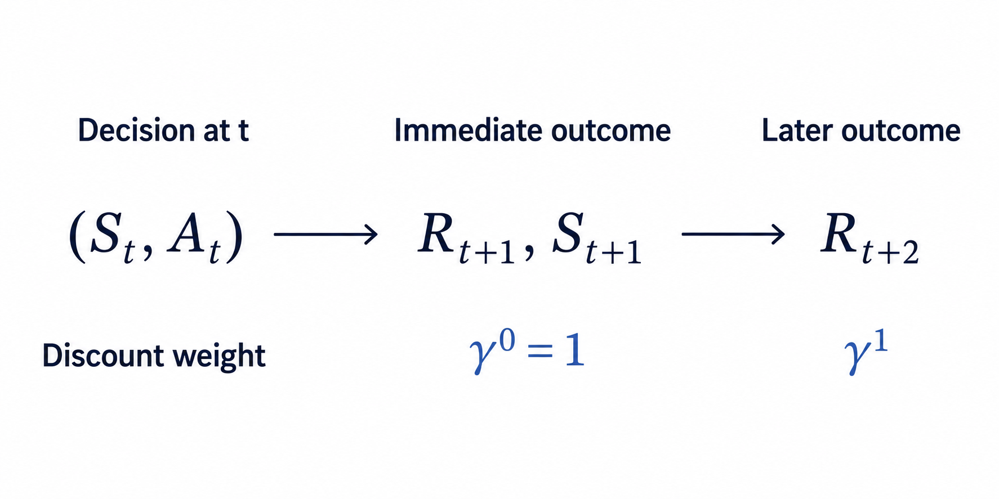

# Finite Markov Decision Processes {#sec-finite-markov-decision-processes}

## Prerequisites {.unnumbered}

This chapter extends the finite Markov-chain model from @sec-finite-markov-chains. That chapter defined the finite state set $\mathcal S=\{s_1,\ldots,s_n\}$, the random state $S_t$, the row state-distribution vector $\mathbf p_t$, and the row-stochastic transition matrix $\mathbf P$.

## Why add control to stochastic dynamics? {#sec-controlled-dynamics-purpose .unnumbered}

An uncontrolled Markov chain assigns one next-state distribution to each current state. A decision problem asks a different question: if an agent can choose an action, how does that choice change the distribution of the next state? The mathematical model must therefore distinguish uncertainty in the environment's response from choice by the agent.

The known inputs are the current state, the actions available in that state, and one next-state distribution for each feasible state--action pair. The required output is the probability of every possible next state after a particular action is applied. The dependency chain for this block is

$$
\begin{aligned}
\text{current state}
&\longrightarrow
\text{feasible action}\\
&\longrightarrow
\text{controlled next-state distribution}\\
&\longrightarrow
\text{action-conditioned transition matrix}.
\end{aligned}
$$

The action identifies which transition law applies. The probabilities within that law describe the environment's stochastic response after the choice has been made.

## Actions and feasible action sets {#sec-mdp-actions-feasible-sets}

Let the finite **action set** be

$$
\boxed{
\mathcal A
\mathrel{:=}
\{a_1,a_2,\ldots,a_m\},
}
$$

where $m\in\mathbb N$ is the number of distinct action labels and $a_\ell$ is the action with index $\ell\in\{1,\ldots,m\}$. An action is a control input that the agent can apply to influence the next-state distribution. The set $\mathcal A$ is the global vocabulary of action labels; it does not imply that every action can be applied in every state.

For each state $s\in\mathcal S$, define the nonempty **feasible action set**

$$
\boxed{
\mathcal A(s)
\subseteq
\mathcal A,
\qquad
\mathcal A(s)\neq\varnothing.
}
$$

The set $\mathcal A(s)$ contains exactly the actions admitted when the current state is $s$. The state-dependent set is needed because a physically or logically meaningful action in one state may be unavailable in another. For example, an action called open may be feasible for a closed container but unavailable for a container that is already open.

Assume that every global action label is feasible in at least one state, so $\mathcal A=\bigcup_{s\in\mathcal S}\mathcal A(s)$. This convention prevents the global set from containing an action that can never be used.

On the sample space $\Omega$ introduced in @sec-finite-stochastic-state-sequence, represent the action at time $t$ by the discrete random variable

$$
A_t:\Omega\rightarrow\mathcal A.
$$

For any $a\in\mathcal A$, the event $A_t=a$ says that action $a$ is realised at time $t$. The random-variable representation allows actions to differ across possible trajectories. The variable records the selected action, while the action-selection mechanism is a separate mathematical object. Once a particular trajectory is considered, the realised value $a$ is the control input supplied to the environment.

A state--action pair $(s,a)$ is **feasible** when $s\in\mathcal S$ and $a\in\mathcal A(s)$. An unavailable pair with $a\notin\mathcal A(s)$ is outside the controlled model's domain. Its transition probabilities are therefore undefined; they must not be invented as a row of zeros, because a zero row is not a probability distribution.

## The controlled Markov property {#sec-controlled-markov-property}

Before action $A_t$ is applied, define $H_0:=(S_0)$. For $t\in\mathbb N$, the observed interaction history through state $S_t$ is the tuple

$$
H_t
\mathrel{:=}
(S_0,A_0,S_1,A_1,\ldots,S_{t-1},A_{t-1},S_t).
$$

A possible realised value $h_t$ of $H_t$ ends in some current state $s\in\mathcal S$. The **controlled first-order Markov property** states that, after the current state and current action are known, earlier states and actions provide no additional information about the next-state distribution. For every next state $s'\in\mathcal S$, every feasible action $a\in\mathcal A(s)$, and every joint conditioning event with $\Pr(H_t=h_t,A_t=a)>0$,

$$
\boxed{
\Pr(S_{t+1}=s'\mid H_t=h_t,A_t=a)
=
\Pr(S_{t+1}=s'\mid S_t=s,A_t=a).
}
$$

The left-hand side conditions on the complete state--action history and the current action. The right-hand side retains only the current state and current action. Their equality means that $(S_t,A_t)$ contains the information needed for the one-step prediction. As with an uncontrolled Markov chain, this is a modelling claim about the chosen state representation. If two histories ending in the same state--action pair imply different next-state distributions, the state representation has discarded relevant information.

## Controlled transition probabilities {#sec-controlled-transition-probabilities}

Time homogeneity answers whether the same feasible state--action pair obeys the same one-step law at different times. At each time $t\in\mathbb N_0$, let $p_t(s'\mid s,a)$ denote the next-state probability that the controlled model assigns to $s'\in\mathcal S$ after feasible pair $(s,a)$. Whenever $\Pr(S_t=s,A_t=a)>0$, this model probability agrees with the elementary conditional probability

$$
p_t(s'\mid s,a)
=
\Pr(S_{t+1}=s'\mid S_t=s,A_t=a).
$$

The controlled dynamics are **time-homogeneous** when, for every $s\in\mathcal S$, $a\in\mathcal A(s)$, $s'\in\mathcal S$, and $t,u\in\mathbb N_0$,

$$
p_t(s'\mid s,a)=p_u(s'\mid s,a).
$$

The equality says that changing the time index while holding the state--action pair fixed does not change the next-state distribution. All times therefore share one law. Define its common value as the **controlled transition probability**

$$
\boxed{
p(s'\mid s,a)
\mathrel{:=}
p_t(s'\mid s,a).
}
$$

The notation $\Pr(\,\cdot\,)$ denotes the probability of an event, lowercase $p$ denotes the probability mass assigned to particular values, and bold $\mathbf P$ denotes a matrix representation. The arguments show the model directly: $s$ is the current state, $a$ is the applied action, and $s'$ is the possible next state. The vertical bar records that the next-state probability is conditional on the supplied current state and action. For a fixed feasible pair $(s,a)$, the function

$$
p(\,\cdot\mid s,a):\mathcal S\rightarrow[0,1],
\qquad
s'\longmapsto p(s'\mid s,a),
$$

is the probability mass function of the next state.

For a fixed feasible pair $(s,a)$, the events $S_{t+1}=s'$ over all $s'\in\mathcal S$ are mutually exclusive and exhaustive. Therefore

$$
\begin{aligned}
p(s'\mid s,a)&\geq0
&&\text{for every }s'\in\mathcal S,\\
\sum_{s'\in\mathcal S}p(s'\mid s,a)&=1.
\end{aligned}
$$

Indices enter only when these probabilities are stored in a matrix. If one action $a\in\mathcal A$ is feasible in every state, define its **action-conditioned transition matrix** by

$$
\boxed{
\left[\mathbf P^{(a)}\right]_{ij}
\mathrel{:=}
p(s_j\mid s_i,a),
\qquad
\mathbf P^{(a)}\in[0,1]^{n\times n}.
}
$$

The indices $i$ and $j$ now have a strictly representational role: they select a row and column after the semantic states $s_i$ and $s_j$ have been placed in the declared global state order. Each $\mathbf P^{(a)}$ is row-stochastic. If action $a$ is deliberately applied regardless of the current state, the row-vector convention from @sec-time-homogeneous-transition-matrix gives

$$
\mathbf p_{t+1}
=
\mathbf p_t\mathbf P^{(a)}.
$$

If $a$ is unavailable in any state, $\mathbf P^{(a)}$ is not a complete transition matrix because the corresponding infeasible row is outside the model's domain. The kernel $p(s'\mid s,a)$ on feasible triples $(s,a,s')$ remains the general representation.

## Uncontrolled and controlled dynamics are different objects {#sec-uncontrolled-versus-controlled-dynamics}

An uncontrolled Markov chain contains one transition matrix $\mathbf P$. Once the current state distribution is known, that matrix alone determines the next-state distribution. A controlled transition model instead contains one probability row for every feasible state--action pair. The current state alone does not determine which row will govern the next transition because the action must also be supplied.

The controlled model is not one uncontrolled Markov chain with a single transition matrix. Choosing one fixed action $a$ produces the special matrix $\mathbf P^{(a)}$ when that action is feasible in every state. A state-dependent action-selection rule instead combines the controlled rows according to the actions selected in each state. Keeping these objects distinct prevents the environment's stochastic response from being confused with the agent's method for choosing actions.

::: {.callout-note title="Example: One state with two possible transition laws" appearance="simple" icon=false}

This example demonstrates how the chosen action changes the next-state distribution. Reuse the three states from the Markov-chain example:

$$
\mathcal S
=
\{s_1,s_2,s_3\}
=
\{\text{searching},\text{clue held},\text{answered}\}.
$$

Let $a_1$ mean continue and $a_2$ mean reset, and suppose both actions are feasible in every state. Their action-conditioned transition matrices are

$$
\mathbf P^{(a_1)}
=
\begin{bmatrix}
0.5&0.5&0\\
0.1&0.4&0.5\\
0&0&1
\end{bmatrix},
\qquad
\mathbf P^{(a_2)}
=
\begin{bmatrix}
1&0&0\\
1&0&0\\
1&0&0
\end{bmatrix}.
$$

If the current state is clue held, then applying continue selects row $2$ of $\mathbf P^{(a_1)}$:

$$
\begin{bmatrix}
p(s_1\mid s_2,a_1)&
p(s_2\mid s_2,a_1)&
p(s_3\mid s_2,a_1)
\end{bmatrix} =
\begin{bmatrix}
0.1&0.4&0.5
\end{bmatrix}.
$$

Thus continuing reaches answered with probability $p(s_3\mid s_2,a_1)=0.5$. Applying reset instead selects row $2$ of $\mathbf P^{(a_2)}$, so the next state is searching with probability $p(s_1\mid s_2,a_2)=1$. The current state is identical in both cases; the different action selects a different stochastic law.

For an uncertain current-state distribution $\mathbf p_t=[0.2\;0.5\;0.3]$, applying continue in every state gives

$$
\mathbf p_{t+1}
=
\mathbf p_t\mathbf P^{(a_1)}
=
\begin{bmatrix}
0.15&0.30&0.55
\end{bmatrix}.
$$

The resulting distribution is a valid row distribution because $\mathbf P^{(a_1)}$ is row-stochastic.

:::

### Quick test: actions and controlled transitions {.unnumbered}

1. **Recall:** What is the difference between the global action set $\mathcal A$ and the feasible action set $\mathcal A(s)$?
2. **Explanation:** Why can $A_t$ be represented as a random variable even though an action is a control choice?
3. **Derivation:** Starting from the definition of $p(s'\mid s,a)$, show why $\sum_{s'\in\mathcal S}p(s'\mid s,a)=1$ for every feasible state--action pair.
4. **Representation:** Explain the relationship between the semantic probability $p(s_j\mid s_i,a)$ and matrix entry $[\mathbf P^{(a)}]_{ij}$. When is $\mathbf P^{(a)}$ a complete transition matrix?
5. **Application:** In the example, what is the probability of moving from clue held to searching under continue? What is the same probability under reset?
6. **Calculation:** Verify the answered-state entry $0.55$ in $\mathbf p_t\mathbf P^{(a_1)}$.
7. **Validity:** Why must an infeasible state--action pair not be represented by a zero transition row?
8. **Model distinction:** Why is a controlled transition kernel different from an uncontrolled Markov chain with one transition matrix?

#### Answers and hints {.unnumbered}

1. $\mathcal A$ contains every action label in the model. $\mathcal A(s)\subseteq\mathcal A$ contains only the actions admitted when the current state is $s$.
2. Across possible trajectories, different actions may be realised, so $A_t:\Omega\to\mathcal A$ records which action occurs. The realised value $a$ is still the control input, while a separate action-selection mechanism determines which value is chosen.
3. The possible next-state events partition the next-state sample outcomes. Hence $\sum_{s'\in\mathcal S}p(s'\mid s,a)=\Pr(S_{t+1}\in\mathcal S\mid S_t=s,A_t=a)=1$.
4. The kernel value $p(s_j\mid s_i,a)$ describes the transition from semantic state $s_i$ to semantic state $s_j$ under action $a$. Once the states are placed in their declared order, the same number is stored at row $i$, column $j$ of $\mathbf P^{(a)}$. The matrix is complete only when $a$ is feasible in every state.
5. Under continue, the probability is $p(s_1\mid s_2,a_1)=0.1$. Under reset, it is $p(s_1\mid s_2,a_2)=1$.
6. The answered-state entry is $0.2(0)+0.5(0.5)+0.3(1)=0.55$.
7. A zero row sums to zero, not one, so it is not a next-state distribution. More importantly, the transition law is undefined outside its feasible domain; inserting zeros would turn unavailability into false numerical data.
8. The kernel supplies several possible next-state distributions for each state, one per feasible action. The current state alone does not select a unique next-state distribution; the action or an action-selection rule is an additional input.

## Rewards and joint one-step dynamics {#sec-mdp-rewards-joint-dynamics}

The controlled transition kernel describes where the process may move after an action, but different transitions can have different consequences. A **reward** is a real-valued scalar produced by the environment to evaluate one step of interaction. The known inputs for the one-step reward model are a feasible current state--action pair and the possible joint outcomes consisting of a next state and a reward. The required outputs are the probability of each joint outcome, the next-state probabilities, and the expected one-step reward.

```
(feasible current state, feasible action)
                    |
                    v
   joint outcomes: (next state, reward)
                    |
                    v
     probability of each joint outcome
                    |
          +---------+---------+
          |                   |
          v                   v
  sum over rewards      probability-weighted
          |             average of rewards
          v                   v
 next-state probabilities   expected one-step reward
```

Let the finite **reward set** be

$$
\boxed{
\mathcal R
\mathrel{:=}
\{r_1,r_2,\ldots,r_q\}
\subset\mathbb R,
}
$$

where $q\in\mathbb N$ is the number of possible reward values and $r_k$ is the real-valued reward with index $k\in\{1,\ldots,q\}$. A reward may be negative, zero, or positive. Its sign and magnitude belong to the model and express how the modeller evaluates the corresponding one-step outcome.

Represent the reward produced after action $A_t$ by the discrete random variable

$$
R_{t+1}:\Omega\rightarrow\mathcal R.
$$

The index $t+1$ records the interaction order: the environment receives current state $S_t$ and action $A_t$, then produces reward $R_{t+1}$ together with next state $S_{t+1}$. Upper-case $R_{t+1}$ denotes the random reward, while lower-case $r\in\mathcal R$ denotes one possible realised value.

The Markov claim must cover the complete one-step outcome, not only the next state. Let $h_t$ be a realised history whose final state is $s\in\mathcal S$. For every feasible action $a\in\mathcal A(s)$, next state $s'\in\mathcal S$, reward $r\in\mathcal R$, and joint conditioning event satisfying $\Pr(H_t=h_t,A_t=a)>0$, require

$$
\boxed{
\begin{aligned}
&\Pr(S_{t+1}=s',R_{t+1}=r\mid H_t=h_t,A_t=a)\\
&\qquad=
\Pr(S_{t+1}=s',R_{t+1}=r\mid S_t=s,A_t=a).
\end{aligned}
}
$$

This equality states that the current state and action contain the information needed to predict the joint distribution of the next state and immediate reward. At each time $t\in\mathbb N_0$, let $p_t(s',r\mid s,a)$ denote the joint probability that the controlled model assigns to outcome $(s',r)$ after feasible pair $(s,a)$. Whenever $\Pr(S_t=s,A_t=a)>0$, this model probability agrees with the elementary conditional probability

$$
p_t(s',r\mid s,a)
=
\Pr(S_{t+1}=s',R_{t+1}=r\mid S_t=s,A_t=a).
$$

The complete environment response is **time-homogeneous** when, for every $s\in\mathcal S$, $a\in\mathcal A(s)$, $s'\in\mathcal S$, $r\in\mathcal R$, and $t,u\in\mathbb N_0$,

$$
p_t(s',r\mid s,a)=p_u(s',r\mid s,a).
$$

Define the common value of these time-independent probabilities as the **joint transition--reward probability**

$$
\boxed{
p(s',r\mid s,a)
\mathrel{:=}
p_t(s',r\mid s,a).
}
$$

The arguments now state the meaning directly: $(s,a)$ is the supplied feasible state--action pair and $(s',r)$ is the joint environment outcome. For fixed $s$, $a$, and $s'$, several reward values $r$ may have positive probability. The process then reaches the same next state with different immediate rewards. This can happen because:

- the same destination may be reached with different energy, time, or resource costs;
- the environment may provide a stochastic bonus or penalty;
- events occurring during the transition may affect the reward without changing the recorded next state.

For each feasible current state--action pair, the joint events cover every possible one-step outcome. Therefore

$$
\boxed{
p(s',r\mid s,a)\geq0,
\qquad
\sum_{s'\in\mathcal S}\sum_{r\in\mathcal R}
p(s',r\mid s,a)=1.
}
$$

The controlled transition probability $p(s'\mid s,a)$ ignores which reward accompanied next state $s'$. The reward events $R_{t+1}=r$ over all $r\in\mathcal R$ partition that next-state event, so the finite law of total probability gives

$$
\begin{aligned}
p(s'\mid s,a)
&=
\Pr(S_{t+1}=s'\mid S_t=s,A_t=a)\\
&=
\sum_{r\in\mathcal R}
\Pr(S_{t+1}=s',R_{t+1}=r\mid S_t=s,A_t=a)\\
&=
\boxed{
\sum_{r\in\mathcal R}p(s',r\mid s,a).
}
\end{aligned}
$$

Thus the transition kernel is the next-state marginal of the joint transition--reward kernel.

Before the next state or reward is observed, the **expected one-step reward** for feasible pair $(s,a)$ is defined by

$$
\boxed{
\bar r(s,a)
\mathrel{:=}
\mathbb E[R_{t+1}\mid S_t=s,A_t=a].
}
$$

For a finite reward set, expectation multiplies each possible reward by its conditional probability and sums the results. Marginalising the joint kernel over the next state gives

$$
\begin{aligned}
\bar r(s,a)
&=
\sum_{r\in\mathcal R}
r\Pr(R_{t+1}=r\mid S_t=s,A_t=a)\\
&=
\sum_{r\in\mathcal R}
r\sum_{s'\in\mathcal S}p(s',r\mid s,a)\\
&=
\boxed{
\sum_{s'\in\mathcal S}\sum_{r\in\mathcal R}
r\,p(s',r\mid s,a).
}
\end{aligned}
$$

The scalar $\bar r(s,a)$ averages over both the next-state uncertainty and the reward uncertainty associated with the current state--action pair.

Sometimes the next state is included in a transition record. For a next state satisfying $p(s'\mid s,a)>0$, define the **expected transition reward**

$$
\boxed{
\bar r(s,a,s')
\mathrel{:=}
\mathbb E[R_{t+1}\mid S_t=s,A_t=a,S_{t+1}=s'].
}
$$

The corresponding conditional reward probability follows from the ratio definition of conditional probability:

$$
\Pr(R_{t+1}=r\mid S_t=s,A_t=a,S_{t+1}=s')
=
\frac{p(s',r\mid s,a)}{p(s'\mid s,a)}.
$$

Substitution into the finite expectation gives

$$
\boxed{
\bar r(s,a,s')
=
\frac{\displaystyle\sum_{r\in\mathcal R}r\,p(s',r\mid s,a)}
{\displaystyle p(s'\mid s,a)},
\qquad
p(s'\mid s,a)>0.
}
$$

The positivity condition is essential because conditioning on a next state with zero transition probability is undefined. The joint kernel $p(s',r\mid s,a)$ specifies the complete finite one-step distribution. The expected rewards $\bar r(s,a)$ and $\bar r(s,a,s')$ are summaries of that distribution and generally do not determine its individual reward probabilities.

::: {.callout-note title="Example: Transition-dependent rewards" appearance="simple" icon=false}

This example demonstrates how one joint distribution determines transition probabilities and expected rewards. In the three-state process, consider current state $s_2=\text{clue held}$ and action $a_1=\text{continue}$. Let $\mathcal R=\{-1,0,2\}$ and define the possible joint outcomes by

| Next state | Reward | Joint probability |
|---|---:|---:|
| $s_1=\text{searching}$ | $-1$ | $0.1$ |
| $s_2=\text{clue held}$ | $0$ | $0.4$ |
| $s_3=\text{answered}$ | $2$ | $0.5$ |

The joint probabilities sum to $0.1+0.4+0.5=1$. Marginalising over reward reproduces the controlled transition row

$$
\begin{bmatrix}
p(s_1\mid s_2,a_1)&
p(s_2\mid s_2,a_1)&
p(s_3\mid s_2,a_1)
\end{bmatrix}
=
\begin{bmatrix}
0.1&0.4&0.5
\end{bmatrix}.
$$

The expected one-step reward is

$$
\begin{aligned}
\bar r(s_2,a_1)
&=
(-1)(0.1)+(0)(0.4)+(2)(0.5)\\
&=0.9.
\end{aligned}
$$

Each next state has exactly one possible reward in this example, so the expected transition rewards are $\bar r(s_2,a_1,s_1)=-1$, $\bar r(s_2,a_1,s_2)=0$, and $\bar r(s_2,a_1,s_3)=2$. The transition row alone does not contain these reward values.

:::

### Quick test: rewards and joint dynamics {.unnumbered}

1. **Recall:** Why is the reward following action $A_t$ indexed by $t+1$?
2. **Representation:** What does each argument in $p(s',r\mid s,a)$ identify, and why are $(s',r)$ written to the left of the conditioning bar?
3. **Derivation:** Derive $p(s'\mid s,a)=\sum_{r\in\mathcal R}p(s',r\mid s,a)$ from the joint transition--reward law.
4. **Derivation:** Derive $\bar r(s,a)=\sum_{s'\in\mathcal S}\sum_{r\in\mathcal R}r\,p(s',r\mid s,a)$.
5. **Validity:** Why is $\bar r(s,a,s')$ defined by the displayed ratio only when $p(s'\mid s,a)>0$?
6. **Model distinction:** Do $p(s'\mid s,a)$ and $\bar r(s,a)$ determine the complete joint transition--reward distribution? Explain.

#### Answers and hints {.unnumbered}

1. State $S_t$ and action $A_t$ are the inputs to one environment step; reward $R_{t+1}$ and state $S_{t+1}$ are the outputs of that step.
2. The variables $s$ and $a$ are the supplied current state and feasible action. The variables $s'$ and $r$ are the possible next-state and reward outcome. They appear to the left of the bar because their joint probability is being evaluated conditional on $(s,a)$.
3. For fixed $(s,a,s')$, the mutually exclusive reward events partition the event $S_{t+1}=s'$. Summing their joint probabilities therefore gives its marginal probability: $p(s'\mid s,a)=\sum_{r\in\mathcal R}p(s',r\mid s,a)$.
4. First sum $p(s',r\mid s,a)$ over $s'$ to obtain the probability of reward $r$ given $(s,a)$, multiply by $r$, and then sum over $r$. Rearranging the finite sums gives the stated formula for $\bar r(s,a)$.
5. The value $p(s'\mid s,a)$ is the probability of reaching $s'$ from $(s,a)$. If it is zero, that transition never occurs, so there are no such outcomes on which to condition the reward distribution. The elementary conditional-probability ratio would divide by zero and is undefined.
6. No. The transition probability removes the reward variable by marginalisation, and the expected reward retains only a weighted average. Different reward distributions can have the same transition probabilities and expected reward.

## Policies and policy-induced dynamics {#sec-mdp-policies-induced-dynamics}

The controlled environment assigns a next-outcome distribution to every feasible state--action pair. To obtain one distribution for what happens from a state, the agent must also specify the probability with which it selects each feasible action in that state.

A **stationary Markov stochastic policy** assigns a probability mass function to the feasible action set of every state. For each state $s\in\mathcal S$, this function is

$$
\boxed{
\pi(\,\cdot\mid s):
\mathcal A(s)\rightarrow[0,1],
\qquad
a\longmapsto\pi(a\mid s),
}
$$

where $\pi(a\mid s)$ is the probability of selecting feasible action $a$ when the current state is $s$. For every state, the policy probabilities satisfy

$$
\begin{aligned}
\pi(a\mid s)&\geq0
&&\text{for every }a\in\mathcal A(s),\\
\sum_{a\in\mathcal A(s)}\pi(a\mid s)&=1.
\end{aligned}
$$

Thus $\pi(\,\cdot\mid s)$ is defined only on feasible actions and distributes all probability among them. No probability needs to be invented for an infeasible state--action pair.

The three adjectives describe distinct properties. The policy is *Markov* because action selection depends on the complete interaction history only through the current state. It is *stationary* because the same state-to-action mapping $\pi$ is used at every time $t$. It is *stochastic* because several feasible actions may have positive probability in one state.

Indices enter when the policy is stored in a matrix using the global state order $(s_1,\ldots,s_n)$ and global action order $(a_1,\ldots,a_m)$. Define the **policy matrix** by zero-padding its infeasible action columns:

$$
\left[\boldsymbol\Pi\right]_{i\ell}
\mathrel{:=}
\begin{cases}
\pi(a_\ell\mid s_i),
&a_\ell\in\mathcal A(s_i),\\
0,
&a_\ell\notin\mathcal A(s_i),
\end{cases}
\qquad
\boldsymbol\Pi\in[0,1]^{n\times m}.
$$

Row $i$ of $\boldsymbol\Pi$ represents $\pi(\,\cdot\mid s_i)$, and column $\ell$ represents global action label $a_\ell$. The zero entries are a matrix-storage convention, not environment transition rows for infeasible actions. Every matrix row sums to one. The policy contains a distribution for every state in $\mathcal S$, so it is a complete state-to-action rule rather than a record of one realised trajectory.

The policy and environment kernels specify what happens conditionally after a state is given, but they do not specify the probability of the first state $S_0$. Define the **initial state distribution** by

$$
\begin{aligned}
p_0(s)&\mathrel{:=}\Pr(S_0=s),
\qquad s\in\mathcal S,\\
p_0(s)&\geq0,
\qquad
\sum_{s\in\mathcal S}p_0(s)=1.
\end{aligned}
$$

Using the declared state order, the corresponding row vector is

$$
\mathbf p_0
\mathrel{:=}
\begin{bmatrix}
p_0(s_1)&p_0(s_2)&\cdots&p_0(s_n)
\end{bmatrix}
\in[0,1]^{1\times n}.
$$

Fix $p_0$, policy $\pi$, and the controlled environment kernel $p(s',r\mid s,a)$. At each time step, the policy selects an action and the environment then produces a next-state--reward outcome:

$$
\begin{aligned}
S_t=s
&\xrightarrow[\text{policy}]{\pi(a\mid s)}
A_t=a\\
&\xrightarrow[\text{environment}]{p(s',r\mid s,a)}
(S_{t+1}=s',R_{t+1}=r).
\end{aligned}
$$

To define trajectory probabilities, choose an integer horizon $T\geq1$, state values $s_0,\ldots,s_T\in\mathcal S$, feasible actions $a_t\in\mathcal A(s_t)$ for $t\in\{0,\ldots,T-1\}$, and reward values $r_1,\ldots,r_T\in\mathcal R$. Define the corresponding **finite trajectory event**

$$
\begin{aligned}
E_T
\mathrel{:=}
&\{S_0=s_0\}\\
&{}\cap
\bigcap_{t=0}^{T-1}
\{
A_t=a_t,
S_{t+1}=s_{t+1},
R_{t+1}=r_{t+1}
\}.
\end{aligned}
$$

The **trajectory probability law under policy $\pi$**, denoted by $\Pr_\pi$, is defined on each such event by

$$
\Pr_\pi(E_T)
\mathrel{:=}
p_0(s_0)
\prod_{t=0}^{T-1}
\pi(a_t\mid s_t)
p(s_{t+1},r_{t+1}\mid s_t,a_t).
$$

The first factor selects the initial state. For every time $t$, factor $\pi(a_t\mid s_t)$ is the probability of selecting action $a_t$ in state $s_t$, and factor $p(s_{t+1},r_{t+1}\mid s_t,a_t)$ is the probability that the environment then produces state $s_{t+1}$ and reward $r_{t+1}$. Probabilities of events containing several possible trajectories are obtained by summing the probabilities of their mutually exclusive finite trajectory events. The notation $\Pr_\pi$ displays the policy dependence; the fixed initial distribution $p_0$ and environment kernel are also part of this probability law.

For $T=1$, the definition gives

$$
\begin{aligned}
&\Pr_\pi(
S_0=s,
A_0=a,
S_1=s',
R_1=r)\\
&\qquad=
p_0(s)\pi(a\mid s)p(s',r\mid s,a).
\end{aligned}
$$

The initial distribution affects trajectory and state-visitation probabilities, but it does not affect the conditional policy-induced transition kernel. Let $H_t$ denote the complete interaction history available immediately before action $A_t$ is selected, so $H_t$ ends with current state $S_t$. For every positive-probability history value $h_t$ ending in $s$ and every feasible action $a\in\mathcal A(s)$, the Markov and stationary conditions are expressed by

$$
\Pr_\pi(A_t=a\mid H_t=h_t)
=
\pi(a\mid s),
\qquad
\Pr_\pi(H_t=h_t)>0.
$$

The right-hand side contains neither earlier history values nor the time index $t$. If $\Pr_\pi(S_t=s)>0$, the policy value also has the elementary current-state conditional-probability interpretation

$$
\pi(a\mid s)
=
\Pr_\pi(A_t=a\mid S_t=s).
$$

If $\Pr_\pi(S_t=s)=0$, the elementary ratio for this conditional probability is undefined, but the policy distribution $\pi(\,\cdot\mid s)$ remains defined by the state-to-action mapping.

::: {.callout-note title="Example: A policy row with an infeasible action" appearance="simple" icon=false}

This example demonstrates the difference between the semantic policy and its matrix storage. Suppose $\mathcal A=\{a_1,a_2,a_3\}$ and $\mathcal A(s_2)=\{a_1,a_3\}$. Define

$$
\pi(a_1\mid s_2)=0.4,
\qquad
\pi(a_3\mid s_2)=0.6.
$$

These two feasible-action probabilities sum to one. Because the matrix uses the global action order $(a_1,a_2,a_3)$, its second row is

$$
\begin{bmatrix}
[\boldsymbol\Pi]_{21}&
[\boldsymbol\Pi]_{22}&
[\boldsymbol\Pi]_{23}
\end{bmatrix}
=
\begin{bmatrix}
0.4&0&0.6
\end{bmatrix}.
$$

The middle matrix entry is zero because $a_2$ is infeasible in $s_2$; $\pi(a_2\mid s_2)$ itself is outside the semantic policy's domain.

:::

A **deterministic policy** is a mapping

$$
\mu:\mathcal S\rightarrow\mathcal A,
\qquad
\mu(s)\in\mathcal A(s)
\quad\text{for every }s\in\mathcal S,
$$

that selects exactly one feasible action in each state. It is the special stochastic policy

$$
\pi_\mu(a\mid s)
=
\begin{cases}
1,&a=\mu(s),\\
0,&a\neq\mu(s),
\end{cases}
\qquad
a\in\mathcal A(s).
$$

Thus a stochastic policy can randomise among several feasible actions, whereas a deterministic policy assigns all probability to one feasible action.

### The policy-induced transition matrix {#sec-policy-induced-transition-matrix}

Fix current state $s\in\mathcal S$ and possible next state $s'\in\mathcal S$. Under policy $\pi$, each action $a\in\mathcal A(s)$ may be selected with probability $\pi(a\mid s)$, after which the environment reaches $s'$ with probability $p(s'\mid s,a)$. When $\Pr_\pi(S_t=s)>0$, the events $A_t=a$ over $a\in\mathcal A(s)$ partition the possible action outcomes conditional on $S_t=s$. The conditional law of total probability and the product rule therefore give

$$
\begin{aligned}
\Pr_\pi(S_{t+1}=s'\mid S_t=s)
&=
\sum_{a\in\mathcal A(s)}
\Pr_\pi(S_{t+1}=s',A_t=a\mid S_t=s)\\
&=
\sum_{a\in\mathcal A(s)}
\Pr_\pi(S_{t+1}=s'\mid S_t=s,A_t=a)
\Pr_\pi(A_t=a\mid S_t=s)\\
&=
\sum_{a\in\mathcal A(s)}
p(s'\mid s,a)\pi(a\mid s).
\end{aligned}
$$

The last equality uses the environment kernel $\Pr_\pi(S_{t+1}=s'\mid S_t=s,A_t=a)=p(s'\mid s,a)$ and the policy definition $\Pr_\pi(A_t=a\mid S_t=s)=\pi(a\mid s)$.

Define the **policy-induced transition probability**

$$
\boxed{
p_\pi(s'\mid s)
\mathrel{:=}
\sum_{a\in\mathcal A(s)}
\pi(a\mid s)p(s'\mid s,a).
}
$$

For fixed current state $s$, the policy forms a weighted average of the controlled next-state distributions available in that state. Every value is non-negative. Summing over all possible next states gives

$$
\begin{aligned}
\sum_{s'\in\mathcal S}p_\pi(s'\mid s)
&=
\sum_{s'\in\mathcal S}\sum_{a\in\mathcal A(s)}
\pi(a\mid s)p(s'\mid s,a)\\
&=
\sum_{a\in\mathcal A(s)}
\pi(a\mid s)
\left(\sum_{s'\in\mathcal S}p(s'\mid s,a)\right)\\
&=
\sum_{a\in\mathcal A(s)}
\pi(a\mid s)\\
&=1.
\end{aligned}
$$

In the third line, each controlled next-state distribution sums to one. Thus $p_\pi(\,\cdot\mid s)$ is a probability mass function. Indices enter when the induced kernel is stored as the row-stochastic **policy-induced transition matrix**

$$
\left[\mathbf P^\pi\right]_{ij}
\mathrel{:=}
p_\pi(s_j\mid s_i),
\qquad
\mathbf P^\pi\in[0,1]^{n\times n}.
$$

Define the **state distribution under policy $\pi$** by

$$
d_t^\pi(s)
\mathrel{:=}
\Pr_\pi(S_t=s),
\qquad
s\in\mathcal S.
$$

The letter $d$ labels the state distribution, the subscript $t$ identifies time, and the superscript $\pi$ identifies the policy that generates the probabilities. Its row-vector representation is

$$
\mathbf d_t^\pi
\mathrel{:=}
\begin{bmatrix}
d_t^\pi(s_1)&d_t^\pi(s_2)&\cdots&d_t^\pi(s_n)
\end{bmatrix}.
$$

The fixed initial distribution supplies the initial condition $d_0^\pi(s)=p_0(s)$ for every state, or equivalently

$$
\mathbf d^\pi_0=\mathbf p_0.
$$

For each next state $s'\in\mathcal S$, the finite law of total probability gives

$$
\begin{aligned}
d^\pi_{t+1}(s')
&=
\sum_{s\in\mathcal S}
\Pr_\pi(S_{t+1}=s'\mid S_t=s)
\Pr_\pi(S_t=s)\\
&=
\sum_{s\in\mathcal S}
d_t^\pi(s)p_\pi(s'\mid s).
\end{aligned}
$$

These component equations form the row-vector propagation rule

$$
\mathbf d^\pi_{t+1}
=
\mathbf d^\pi_t\mathbf P^\pi.
$$

The controlled Markov property removes dependence on the earlier history after the current state and action are known. A stationary Markov policy supplies the same action distribution $\pi(\,\cdot\mid s)$ at every time and depends only on the current state. Therefore, for every time $t$, every realised history $h_t$ ending in state $s$ with $\Pr_\pi(H_t=h_t)>0$, and every next state $s'\in\mathcal S$,

$$
\begin{aligned}
\Pr_\pi(S_{t+1}=s'\mid H_t=h_t)
&=
\sum_{a\in\mathcal A(s)}
\pi(a\mid s)p(s'\mid s,a)\\
&=p_\pi(s'\mid s).
\end{aligned}
$$

The right-hand side depends on the history only through its final state $s$, so the state sequence has the Markov property. The same kernel $p_\pi(s'\mid s)$ applies at every time $t$, so the state sequence is time-homogeneous. It is therefore a time-homogeneous Markov chain with transition matrix $\mathbf P^\pi$.

The controlled transition kernel and policy have different roles. The kernel $p(s'\mid s,a)$ describes how the environment responds after action $a$ is supplied in state $s$. The policy $\pi(a\mid s)$ describes how the agent selects that action. Their weighted combination $p_\pi(s'\mid s)$ describes the state sequence observed when that policy controls the environment.

For a deterministic policy $\mu$, only action $\mu(s)$ has non-zero policy probability in state $s$, so

$$
p_\mu(s'\mid s)
=
p(s'\mid s,\mu(s)).
$$

A deterministic policy therefore selects one controlled next-state distribution in each state instead of averaging several distributions. Its matrix representation satisfies $[\mathbf P^\mu]_{ij}=p_\mu(s_j\mid s_i)$.

### Policy-induced joint outcomes and rewards {#sec-policy-induced-joint-rewards}

The same action averaging applies to the joint next-state--reward law. Define the **policy-induced joint outcome probability**

$$
p_\pi(s',r\mid s)
\mathrel{:=}
\sum_{a\in\mathcal A(s)}
\pi(a\mid s)p(s',r\mid s,a).
$$

Every $p_\pi(s',r\mid s)$ is non-negative. For a fixed current state $s$, summing over every possible next state and reward gives

$$
\begin{aligned}
\sum_{s'\in\mathcal S}\sum_{r\in\mathcal R}
p_\pi(s',r\mid s)
&=
\sum_{a\in\mathcal A(s)}
\pi(a\mid s)
\left(
\sum_{s'\in\mathcal S}\sum_{r\in\mathcal R}
p(s',r\mid s,a)
\right)\\
&=
\sum_{a\in\mathcal A(s)}\pi(a\mid s)\\
&=1.
\end{aligned}
$$

Thus $p_\pi(\,\cdot,\cdot\mid s)$ is a valid joint probability mass function for each current state $s$. Marginalising this joint distribution over reward recovers the policy-induced transition probability:

$$
\sum_{r\in\mathcal R}p_\pi(s',r\mid s)
=
p_\pi(s'\mid s).
$$

When $\Pr_\pi(S_t=s)>0$, the defined value has the conditional-probability interpretation

$$
p_\pi(s',r\mid s)
=
\Pr_\pi(S_{t+1}=s',R_{t+1}=r\mid S_t=s).
$$

The **policy-induced expected reward** in state $s$ is defined from the policy-induced joint distribution:

$$
\bar r_\pi(s)
\mathrel{:=}
\sum_{s'\in\mathcal S}\sum_{r\in\mathcal R}
r\,p_\pi(s',r\mid s).
$$

Let $X:\Omega\rightarrow\mathbb R$ be a random variable with finite value set $\mathcal X:=X(\Omega)$, and let $B\subseteq\Omega$ be an event with $\Pr_\pi(B)>0$. Define expectation and conditional expectation under $\Pr_\pi$ by

$$
\begin{aligned}
\mathbb E_\pi[X]
&\mathrel{:=}
\sum_{x\in\mathcal X}x\,\Pr_\pi(X=x),\\
\mathbb E_\pi[X\mid B]
&\mathrel{:=}
\sum_{x\in\mathcal X}x\,\Pr_\pi(X=x\mid B).
\end{aligned}
$$

For $X=R_{t+1}$ and $B=\{S_t=s\}$, the notation $\mathbb E_\pi[R_{t+1}\mid S_t=s]$ abbreviates the second definition. Whenever $\Pr_\pi(S_t=s)>0$, marginalising the policy-induced joint outcome probability over the next state gives

$$
\begin{aligned}
\mathbb E_\pi[R_{t+1}\mid S_t=s]
&=
\sum_{r\in\mathcal R}
r\,\Pr_\pi(R_{t+1}=r\mid S_t=s)\\
&=
\sum_{r\in\mathcal R}r
\sum_{s'\in\mathcal S}p_\pi(s',r\mid s)\\
&=\bar r_\pi(s).
\end{aligned}
$$

Substituting the policy-induced joint probabilities into $\bar r_\pi(s)$ and rearranging the finite sums yields

$$
\begin{aligned}
\bar r_\pi(s)
&=
\sum_{s'\in\mathcal S}\sum_{r\in\mathcal R}
r\,p_\pi(s',r\mid s)\\
&=
\sum_{s'\in\mathcal S}\sum_{r\in\mathcal R}
r\sum_{a\in\mathcal A(s)}
\pi(a\mid s)p(s',r\mid s,a)\\
&=
\sum_{a\in\mathcal A(s)}
\pi(a\mid s)
\left(
\sum_{s'\in\mathcal S}\sum_{r\in\mathcal R}
r\,p(s',r\mid s,a)
\right)\\
&=
\boxed{
\sum_{a\in\mathcal A(s)}
\pi(a\mid s)\bar r(s,a).
}
\end{aligned}
$$

Using the global state order, define the reward vector

$$
\bar{\mathbf r}^{\,\pi}
\mathrel{:=}
\begin{bmatrix}
\bar r_\pi(s_1)&
\bar r_\pi(s_2)&
\cdots&
\bar r_\pi(s_n)
\end{bmatrix}
\in\mathbb R^{1\times n}.
$$

Then $\mathbf P^\pi$ and $\bar{\mathbf r}^{\,\pi}$ form the policy-induced Markov reward model. If rewards are ignored, $\mathbf P^\pi$ alone defines the policy-induced Markov chain.

::: {.callout-note title="Example: Mixing continue and reset" appearance="simple" icon=false}

This example demonstrates how a stochastic policy averages controlled transition rows and expected rewards. In every state, let the policy choose continue with probability $0.75$ and reset with probability $0.25$:

$$
\pi(a_1\mid s)=0.75,
\qquad
\pi(a_2\mid s)=0.25,
\qquad
s\in\mathcal S.
$$

Because the global action order is $(a_1,a_2)=(\text{continue},\text{reset})$, the corresponding policy matrix is

$$
\boldsymbol\Pi
=
\begin{bmatrix}
0.75&0.25\\
0.75&0.25\\
0.75&0.25
\end{bmatrix}.
$$

Using the action-conditioned matrices from the earlier example,

$$
\begin{aligned}
\mathbf P^\pi
&=
0.75\mathbf P^{(a_1)}
+0.25\mathbf P^{(a_2)}\\
&=
\begin{bmatrix}
0.625&0.375&0\\
0.325&0.300&0.375\\
0.250&0&0.750
\end{bmatrix}.
\end{aligned}
$$

For example, the probability of moving from clue held to answered is

$$
p_\pi(s_3\mid s_2)
=
(0.75)(0.5)+(0.25)(0)
=
0.375.
$$

Suppose the expected reward for continuing from clue held is $\bar r(s_2,a_1)=0.9$, as calculated above, and the expected reward for resetting from clue held is $\bar r(s_2,a_2)=-1$. The policy-induced expected reward in clue held is

$$
\bar r_\pi(s_2)
=
(0.75)(0.9)+(0.25)(-1)
=
0.425.
$$

The policy averages probabilities to obtain an induced transition row and averages expected rewards to obtain an induced state reward.

:::

### Quick test: policies and induced dynamics {.unnumbered}

1. **Representation and recall:** What does $\pi(a\mid s)$ mean? How is it related to matrix entry $[\boldsymbol\Pi]_{i\ell}$ for feasible and infeasible actions?
2. **Contrast:** What is the difference between a stochastic policy and a deterministic policy?
3. **Derivation:** Prove that $p_\pi(\,\cdot\mid s)$ is normalized and hence every row of $\mathbf P^\pi$ sums to one.
4. **Application:** Verify the clue-held row $[0.325\;0.300\;0.375]$ in the example.
5. **Model distinction:** Which object describes the environment's response, which object describes the agent's action selection, and which object describes the resulting state sequence?
6. **Joint model:** Prove that $p_\pi(s',r\mid s)$ is normalized over $(s',r)$ for each state $s$, and show how it recovers $p_\pi(s'\mid s)$.

#### Answers and hints {.unnumbered}

1. For $a\in\mathcal A(s)$, $\pi(a\mid s)$ is the probability of selecting action $a$ in state $s$. Matrix entry $[\boldsymbol\Pi]_{i\ell}$ equals $\pi(a_\ell\mid s_i)$ when $a_\ell$ is feasible and is the zero-padding value when $a_\ell$ is infeasible. Feasible-action probabilities are non-negative and sum to one.
2. A stochastic policy may assign positive probability to several feasible actions. A deterministic policy selects exactly one feasible action in each state and is represented by policy probabilities zero and one.
3. Sum the defining equation over $s'\in\mathcal S$, interchange the finite sums, use $\sum_{s'\in\mathcal S}p(s'\mid s,a)=1$ for every feasible action, and then use $\sum_{a\in\mathcal A(s)}\pi(a\mid s)=1$.
4. The row is $0.75[0.1\;0.4\;0.5]+0.25[1\;0\;0]=[0.325\;0.300\;0.375]$.
5. The controlled kernel $p(s'\mid s,a)$ describes the environment's response to a supplied action. The policy $\pi(a\mid s)$ describes action selection. The induced kernel $p_\pi(s'\mid s)$ describes the resulting state sequence, and $\mathbf P^\pi$ is its matrix representation.
6. Sum the definition of $p_\pi(s',r\mid s)$ over $s'$ and $r$, interchange the finite sums, use $\sum_{s'}\sum_rp(s',r\mid s,a)=1$ for every feasible action, and then use $\sum_{a\in\mathcal A(s)}\pi(a\mid s)=1$. Summing only over reward gives $\sum_rp_\pi(s',r\mid s)=\sum_{a\in\mathcal A(s)}\pi(a\mid s)p(s'\mid s,a)=p_\pi(s'\mid s)$.

## Episode endings: termination and truncation {#sec-mdp-termination-truncation}

A finite interaction record can end because the modelled task has ended or because an external collector has stopped recording. The distinction is useful because later return and value calculations must know whether future task rewards truly cease or merely become unobserved.

The known inputs are the task's state and transition definitions, the realised next state and reward, and any stopping rule imposed outside the task. The required outputs are two separate facts: whether the task terminated and whether collection was truncated. Their relationship is

$$
\begin{aligned}
\text{task-defined ending}
&\longrightarrow \text{termination},\\
\text{external collection ending}
&\longrightarrow \text{truncation}.
\end{aligned}
$$

### A terminal state ends the modelled task

Let $\mathcal S_{\mathrm{term}}\subseteq\mathcal S$ be the set of **terminal states**, possibly empty, and define the set of nonterminal **decision states** by

$$
\mathcal S_{\mathrm{dec}}
\mathrel{:=}
\mathcal S\setminus\mathcal S_{\mathrm{term}}.
$$

A state-based transition terminates the task when its realised next state satisfies $S_{t+1}\in\mathcal S_{\mathrm{term}}$. The reward $R_{t+1}$ belongs to that completed transition and is retained. No action $A_{t+1}$ is selected within the completed episode. A later reset starts a new episode by sampling a new initial state according to $p_0$; reset is not a continuation of the terminated trajectory.

For a state-based finite MDP, the next state must contain enough information to determine whether termination has occurred. If two physically different outcomes share one state label but only one ends the task, that state representation is not sufficient for the declared termination rule and must be enlarged.

### An absorbing extension represents the stopped episode

A terminal state and an absorbing state answer different questions. *Terminal* means that the task-defined interaction stops. *Absorbing* means that a transition model keeps returning to the same state. A terminal state therefore has no real post-terminal action, whereas an absorbing state is defined through a transition law.

It is often useful to represent a terminal state $s_\dagger\in\mathcal S_{\mathrm{term}}$ as an absorbing state so that ordinary state-sequence and matrix equations remain valid after the episode ends. This is a deliberate mathematical extension: introduce one bookkeeping action $a_\bot\in\mathcal A$, include $0$ in $\mathcal R$ if necessary, and define a zero-reward self-transition

$$
\mathcal A(s_\dagger)=\{a_\bot\},
\qquad
p(s_\dagger,0\mid s_\dagger,a_\bot)=1.
$$

All other next-state--reward outcomes from $(s_\dagger,a_\bot)$ then have probability zero. The extended sequence remains in $s_\dagger$ and receives only zero rewards, but an episode interface still stops before requesting $a_\bot$. The bookkeeping row is fixed by the absorbing convention; it is not an arbitrary transition row invented for an infeasible physical action.

### Truncation stops the record, not the task

A **truncation** occurs when a rule outside the MDP stops the current interaction record even though the modelled task may continue. Examples include a data-collection length cap, a wall-clock budget, or an exhausted external resource. In a pure truncation, the final recorded state is a nonterminal state in $\mathcal S_{\mathrm{dec}}$, and the MDP still defines feasible subsequent actions and their outcome probabilities.

Termination and truncation must therefore be recorded separately. A termination flag states a fact about the task model. A truncation flag states a fact about the collection procedure. Stopping the current episode record requires a reset after either flag, but resetting after truncation does not imply that the underlying task had reached a terminal state. The two flags describe different conditions and need not be treated as logical complements.

| Ending condition | Part of the MDP? | Could the modelled task continue from the final state? |
|---|---|---|
| Termination | Yes | No |
| Truncation | No | Yes, unless termination also occurred |

### A time limit can belong inside or outside the task

Let a task-defined finite horizon be $N\in\mathbb N$ decision steps, with actions selected at times $t\in\{0,\ldots,N-1\}$. The transition to $S_N$ completes the task because the horizon is part of its definition. This is termination, not truncation. If the transition and decision laws can depend on the number of decision steps remaining, a stationary Markov representation must include that information. Define the augmented state space and state by

$$
\widetilde{\mathcal S}
\mathrel{:=}
\mathcal S\times\{0,\ldots,N\},
\qquad
\widetilde S_t
\mathrel{:=}
(S_t,N-t).
$$

The second component records the number of decision steps remaining. The augmented terminal set is

$$
\widetilde{\mathcal S}_{\mathrm{term}}
\mathrel{:=}
\mathcal S\times\{0\}.
$$

Thus reaching time $N$ becomes state-based termination in the augmented model, and two otherwise identical physical states at different stages need not be forced to share one transition law or one stationary policy row. By contrast, if an indefinitely continuing task is recorded for at most $L$ transitions only because the collector cannot run forever, $L$ is external to the MDP and reaching it causes truncation.

::: {.callout-note title="Example: Equal record lengths with different endings" appearance="simple" icon=false}

This example demonstrates why record length alone cannot identify the kind of ending. Suppose $g\in\mathcal S_{\mathrm{term}}$ is a task-defined goal state and $x\in\mathcal S_{\mathrm{dec}}$ is an ordinary state. One record receives its seventh reward and enters $g$ on the seventh transition. That record terminates, and the seventh reward is part of the episode. A second record also contains seven transitions but ends in $x$ because the collector has a seven-transition storage limit. The second record is truncated: the MDP still specifies what could happen after $x$, even though that continuation was not recorded.

:::

### Quick test: termination and truncation {.unnumbered}

1. **Recall:** What mathematical condition makes a realised transition terminate the task?
2. **Contrast:** Why is a terminal state not identical by definition to an absorbing state?
3. **Application:** A trajectory reaches its task-defined goal while receiving reward $5$. Is the reward discarded when the episode terminates?
4. **Application:** A collector stops after $200$ transitions in an ordinary nonterminal state. Is this termination or truncation?
5. **Validity condition:** A task lasts exactly $N$ decision steps, but the optimal action can depend on the number of decision steps remaining. What must a stationary Markov state representation contain?

#### Answers and hints {.unnumbered}

1. A state-based transition terminates when its realised next state satisfies $S_{t+1}\in\mathcal S_{\mathrm{term}}$. A task-defined finite horizon is also termination and can be expressed by augmenting the state with the remaining decision-step count.
2. Terminal is a task-ending meaning, whereas absorbing is the transition condition that the next state equals the same state with probability one. A zero-reward absorbing self-loop can represent a terminal state after the task has stopped, but that representation is an added convention.
3. No. Reward $R_{t+1}=5$ belongs to the transition that enters the terminal state and remains part of the episode.
4. It is truncation because the external collector stopped the record while the MDP still admitted continuation from the final state.
5. The state must include the relevant stage information, such as the remaining decision-step count $N-t$. Otherwise identical physical-state labels can require different transition or decision laws at different stages.

## The finite MDP and its task settings {#sec-finite-mdp-task-settings}

The preceding sections provide all components needed to separate three questions: what outcomes the controlled environment permits, where an episode starts and ends, and how rewards at different decision steps are weighted. This separation is useful because changing a policy, initial distribution, horizon, discount, or collection limit does not necessarily change the environment dynamics.

### The finite MDP specifies controlled one-step outcomes

In this book, the **finite Markov decision process** is the controlled environment model

$$
\mathcal M
\mathrel{:=}
\left(
\mathcal S,
\mathcal A,
\{\mathcal A(s)\}_{s\in\mathcal S},
\mathcal R,
p
\right).
$$

The sets $\mathcal S$, $\mathcal A$, and $\mathcal R$ are finite. The family $\{\mathcal A(s)\}_{s\in\mathcal S}$ supplies the nonempty feasible action set for each state, and $p(s',r\mid s,a)$ supplies a normalized joint next-state--reward distribution for each feasible pair $(s,a)$. Together these components answer the one-step question: after action $a$ is applied in state $s$, what probabilities are assigned to the possible outcomes $(s',r)$?

The word *finite* describes the cardinalities of the state, action, and reward sets. It does not mean that every trajectory has a finite number of decision steps. A finite MDP may define a continuing task with no terminal state and no fixed horizon.

This tuple convention keeps the initial distribution $p_0$, policy $\pi$, and reward-weighting objective separate from the controlled environment. Some texts include $p_0$ or a discount factor in the object they call an MDP, so the declared tuple must be checked when comparing notation.

### Initial conditions, policies, and task endings add distinct information

The initial distribution $p_0$ states where trajectories begin. The policy $\pi$ states how actions are selected. Combining $p_0$, $\pi$, and $\mathcal M$ produces the trajectory law $\Pr_\pi$. Changing $p_0$ or $\pi$ generally changes trajectory probabilities without changing the controlled kernel $p(s',r\mid s,a)$.

The terminal set $\mathcal S_{\mathrm{term}}$ and a task-defined horizon specify when task rewards cease. Let

$$
N\in\mathbb N\cup\{\infty\},
$$

where finite $N$ denotes a fixed maximum of $N$ decision steps and $N=\infty$ denotes the absence of a fixed horizon. A trajectory may still terminate before a finite horizon by entering $\mathcal S_{\mathrm{term}}$, and it may terminate after a random number of decision steps when $N=\infty$. An external truncation rule is not part of $\mathcal M$ or the task horizon because it stops data collection rather than the modelled task.

### Cumulative reward gives discounting a purpose

The one-step reward $R_{t+1}$ evaluates only the transition from time $t$ to time $t+1$, but the chosen action can also affect later rewards. To compare such consequences, combine the reward sequence into one scalar. Choose a dimensionless **discount factor** $\gamma\in[0,1]$.

Define the **discounted return** from decision epoch $t$ by

$$
G_t
\mathrel{:=}
\begin{cases}
\displaystyle
\sum_{k=0}^{N-t-1}\gamma^kR_{t+k+1},
&N<\infty,\\[1em]
\displaystyle
\sum_{k=0}^{\infty}\gamma^kR_{t+k+1},
&N=\infty.
\end{cases}
$$

For finite $N$, the sum applies at $t\in\{0,\ldots,N-1\}$ and $G_N\mathrel{:=}0$.  The return $G_t$ is a random variable because its component rewards are random variables. For a finite horizon, the earlier zero-reward absorbing extension supplies zero terms if the episode terminates before time $N$. An external truncation stops observation of the reward sequence but does not redefine the task horizon or remove the unobserved terms from $G_t$.

The subscript in $G_t$ identifies the decision epoch from which consequences are evaluated: $R_{t+1}$ is the next reward and the immediate consequence of action $A_t$, even though the environment produces it after the transition from $t$ to $t+1$.

{#fig-discounted-return-timeline width=60%}

The exponent $k$ is the number of additional decision steps before reward $R_{t+k+1}$ is received. The immediate reward $R_{t+1}$ has weight $\gamma^0=1$. If $0<\gamma<1$, later weights decrease geometrically. If $\gamma=0$, only the immediate reward has nonzero weight. If $\gamma=1$, rewards are not discounted.

For a continuing task, discounting also provides a simple convergence guarantee. Because $\mathcal R$ is finite, define the finite reward bound $R_{\max}:=\max_{r\in\mathcal R}|r|$. If $N=\infty$ and $0\leq\gamma<1$, then

$$
\sum_{k=0}^{\infty}
\left|\gamma^kR_{t+k+1}\right|
\leq
R_{\max}\sum_{k=0}^{\infty}\gamma^k
=
\frac{R_{\max}}{1-\gamma}.
$$

Thus the infinite discounted return converges absolutely. When $N=\infty$ and $\gamma=1$, this bound is unavailable and the undiscounted sum may diverge. The discount factor is not a transition probability: it does not alter $p(s',r\mid s,a)$ or the trajectory law under a fixed policy. It changes the scalar assigned to a reward sequence and can therefore change which policy is preferred.

::: {.callout-note title="Example: One MDP with two discount factors" appearance="simple" icon=false}

This example demonstrates that changing $\gamma$ can change the preferred reward timing without changing the environment. Suppose one action produces reward $1$ immediately and then terminates, while another produces reward $0$ immediately and reward $2$ one decision step later before terminating. Their returns are

$$
1
\qquad\text{and}\qquad
0+2\gamma.
$$

For $\gamma=0.4$, the delayed alternative has return $0.8$, so the immediate reward is larger. For $\gamma=0.9$, the delayed alternative has return $1.8$, so the delayed reward is larger. The transition and reward kernel is identical in both comparisons; only the reward-timing objective changes.

:::

### Quick test: the finite MDP and task settings {.unnumbered}

1. **Recall:** What does *finite* mean in a finite MDP?
2. **Contrast:** What is the difference between a finite MDP and a finite-horizon task?
3. **Model identification:** Which object specifies the probability of outcome $(s',r)$ after feasible pair $(s,a)$?
4. **Reasoning:** If $p_0$ changes while $\mathcal M$ and $\pi$ remain fixed, which probability law changes and which kernel remains unchanged?
5. **Return and discounting:** Why is $G_t$ needed, and does changing $\gamma$ change the trajectory law under a fixed policy?
6. **Classification:** Is an external data-collection limit part of $N$ or an external truncation rule?

#### Answers and hints {.unnumbered}

1. The state, action, and reward sets are finite. The trajectory length need not be finite.
2. A finite MDP has finite state, action, and reward sets. A finite-horizon task permits only a fixed finite number $N$ of decision steps; either property can hold without the other.
3. The joint controlled kernel $p(s',r\mid s,a)$.
4. The trajectory law $\Pr_\pi$ changes because the initial-state probabilities change. The controlled kernel $p(s',r\mid s,a)$ remains unchanged.
5. The return $G_t$ combines the sequence of rewards affected by an action into one scalar. The fixed-policy trajectory law does not contain $\gamma$, so changing $\gamma$ does not change that law; it changes the relative weighting of rewards at different decision steps and can therefore change which policy is preferred.
6. It is an external truncation rule. Only a limit belonging to the task definition is represented by the task horizon $N$.

## Cumulative chapter test {.unnumbered}

Use the following finite MDP for Questions 1--8. Its state, action, terminal-state, and reward sets are

$$
\begin{aligned}
\mathcal S&=\{s_1,s_2,s_\dagger\},
&\mathcal S_{\mathrm{term}}&=\{s_\dagger\},\\
\mathcal A&=\{a_1,a_2,a_\bot\},\\
\mathcal R&=\{-1,0,1,2,4\}.
\end{aligned}
$$

The feasible action sets are

$$
\mathcal A(s_1)=\mathcal A(s_2)=\{a_1,a_2\},
\qquad
\mathcal A(s_\dagger)=\{a_\bot\}.
$$

The table lists every joint outcome with positive probability. Every outcome not listed has probability zero.

| Current state | Action   | Next state  | Reward | $p(s',r\mid s,a)$ |
| ------------- | -------- | ----------- | -----: | ----------------: |
| $s_1$         | $a_1$    | $s_1$       |    $0$ |             $0.5$ |
| $s_1$         | $a_1$    | $s_2$       |    $1$ |             $0.5$ |
| $s_1$         | $a_2$    | $s_\dagger$ |    $2$ |               $1$ |
| $s_2$         | $a_1$    | $s_\dagger$ |    $4$ |               $1$ |
| $s_2$         | $a_2$    | $s_1$       |   $-1$ |               $1$ |
| $s_\dagger$   | $a_\bot$ | $s_\dagger$ |    $0$ |               $1$ |
|               |          |             |        |                   |

In state order $(s_1,s_2,s_\dagger)$, let the initial distribution be

$$
\mathbf p_0
=
\begin{bmatrix}
1&0&0
\end{bmatrix}.
$$

Let policy $\pi$ be

$$
\begin{aligned}
\pi(a_1\mid s_1)&=0.6,
&\pi(a_2\mid s_1)&=0.4,\\
\pi(a_1\mid s_2)&=0.75,
&\pi(a_2\mid s_2)&=0.25,\\
\pi(a_\bot\mid s_\dagger)&=1.
\end{aligned}
$$

1. **Model validation:** Explain why each feasible state--action pair defines a valid joint probability mass function.
2. **Marginalisation and expectation:** Calculate $p(s'\mid s_1,a_1)$ for every $s'\in\mathcal S$ and calculate $\bar r(s_1,a_1)$.
3. **Policy-induced model:** Derive the policy-induced transition matrix $\mathbf P^\pi$ in state order $(s_1,s_2,s_\dagger)$ and the reward vector $\bar{\mathbf r}^{\,\pi}$.
4. **Trajectory probability:** Calculate the probability under $\Pr_\pi$ of the two-step event

    $$
    S_0=s_1,
    A_0=a_1,
    R_1=1,
    S_1=s_2,
    A_1=a_2,
    R_2=-1,
    S_2=s_1.
    $$

5. **Markov-chain identification:** Explain why the state sequence under $\pi$ is a time-homogeneous Markov chain and identify its transition matrix.
6. **Termination:** What happens to the episode and its final reward when a transition enters $s_\dagger$? What role does the $a_\bot$ row serve?
7. **Truncation:** Suppose a collector stops a record in state $s_2$ solely because it has stored its maximum number of transitions. Has the MDP terminated?
8. **Return:** Suppose the event in Question 4 belongs to a task with horizon $N=2$ and discount factor $\gamma=0.5$. Calculate $G_0$.
9. **Contrast:** Can a finite MDP have an infinite horizon? Can an MDP with infinitely many states have a finite horizon? Explain which use of *finite* each statement concerns.
10. **Validity conditions:** State one condition needed to use an elementary conditional probability and one condition that guarantees convergence of a continuing discounted return in this chapter.

### Answers and hints {.unnumbered}

1. For each feasible pair, every listed probability is non-negative and the probabilities over all $(s',r)$ sum to one. In particular, the two outcomes for $(s_1,a_1)$ sum to $0.5+0.5=1$, and every other feasible pair has one probability-one outcome.
2. Marginalising over reward gives $p(s_1\mid s_1,a_1)=0.5$, $p(s_2\mid s_1,a_1)=0.5$, and $p(s_\dagger\mid s_1,a_1)=0$. Therefore $\bar r(s_1,a_1)=(0)(0.5)+(1)(0.5)=0.5$.
3. Averaging each controlled row and expected reward with the policy gives

    $$
    \mathbf P^\pi
    =
    \begin{bmatrix}
    0.30&0.30&0.40\\
    0.25&0&0.75\\
    0&0&1
    \end{bmatrix},
    \qquad
    \bar{\mathbf r}^{\,\pi}
    =
    \begin{bmatrix}
    1.10&2.75&0
    \end{bmatrix}.
    $$

4. The trajectory law multiplies the initial-state, action-selection, and joint-outcome probabilities:

    $$
    (1)(0.6)(0.5)(0.25)(1)=0.075.
    $$

5. The controlled kernel is Markov and time-homogeneous, and the stationary Markov policy depends only on the current state. Their action-weighted kernel $p_\pi(s'\mid s)$ therefore has the same rows at every time and depends on no earlier state. Its matrix is $\mathbf P^\pi$ from Answer 3.
6. The transition reward is retained and the episode then stops before another real action is requested. The $a_\bot$ row is the zero-reward absorbing extension used to keep state-sequence and matrix calculations valid after termination.
7. No. This is truncation: $s_2\notin\mathcal S_{\mathrm{term}}$, and the MDP still defines feasible actions and outcome probabilities from $s_2$.
8. The two rewards are $R_1=1$ and $R_2=-1$, so

    $$
    G_0
    =
    R_1+\gamma R_2
    =
    1+(0.5)(-1)
    =0.5.
    $$

9. Yes to both. A finite MDP has finite state, action, and reward sets; its horizon may be infinite. A finite-horizon MDP has finitely many decision steps; its state space need not be finite.
10. The elementary conditional probability $\Pr(E\mid B)$ requires $\Pr(B)>0$. For the continuing return used here, the finite reward set supplies a bound $R_{\max}<\infty$, and $0\leq\gamma<1$ then guarantees absolute convergence.

## References {.unnumbered}

[@sutton2015draft, chap. 3] **Secs. 3.1–3.4, 3.6–3.7.**

[@bertsekas2026, chap. 1] **Secs. 1.3.1, 1.4, 1.6.2, 1.6.4.**

[@xiao2024, chaps. 1-2] **Secs. 2.1.1–2.1.4.**

[@gymnasium_time_limits]
